# VXI-11 通信プロトコルの概要と仕組み
タグ：C#

VXI-11（ぶいえっくすあいいれぶん）はオシロスコープ等の計測器の制御に使われるイーサネット通信プロトコルです。VXI-11プロトコルは、古くから電子計測器の通信インタフェースとして使われる GP-IB（じーぴーあいびー）からイーサネット環境に容易に移行することを目的としています。

VXI-11 を説明するには、GP-IB とインターネット通信プロトコルの RPC（あーるぴーしー） の知識を必要とします。そこでまず GP-IB を紹介し、次に VXI-11 と RPC の概要を説明します。最後にサンプルプログラムと関連規格を紹介します。
対象読者としてイーサネットの基本（IPアドレスとTCP ポート番号）とプログラムの基本（関数、変数、引数、戻り値）がわかる 18 歳の新人技術者を想定しています。

# GP-IB について

GP-IB は1960年代に HP 社が計測機器や制御機器などの間でデータ通信を行うために設計した通信規格です。
 
コネクタや電気信号のタイミングを定義した [IEEE488.1-1978](https://standards.ieee.org/ieee/488/6465/) (あい・とりぷるいー・よんはちはち・ぽいんとわん、通称ぽいんとわん)と、コマンド形式や共通コマンドを定義した [IEEE488.2-1987](https://standards.ieee.org/ieee/488.2/717/) (あい・とりぷるいー・よんはちはち・ぽいんとつー、通称ぽいんとつー)の２つの規格があります。日本語版は [JIS C 1901:1987 計測器用インタフェースシステム](https://kikakurui.com/c1/C1901-1987-01.html) です。

### 計測機器の接続例
「[JIS C 1901:1987 計測器用インタフェースシステム](https://kikakurui.com/c1/C1901-1987-01.html) 付属書A 計測システムの一例」より引用

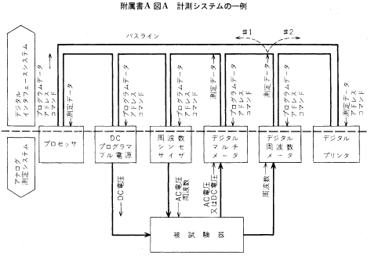

GP-IB は24ピンの頑丈なコネクタでねじ止めし制御信号はグランド線とツイストぺアで配線されているため、外部の電子ノイズに強く、三線式ハンドシェークによりトラブル発生時の原因の特定が容易なため、高い信頼性が必要な工場の生産ラインの通信方式として利用されます。

### コネクタの形状
「[JIS C 1901:1987 計測器用インタフェースシステム](https://kikakurui.com/c1/C1901-1987-01.html) 28. 装置用コネクタの取り付け方法」より引用
 
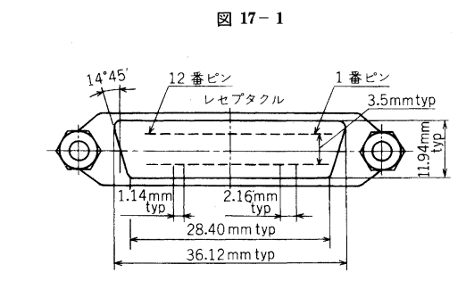

### コネクタピンの割付
|ピン番号|信号線名|ピン番号|信号線名|
|--|--|--|--|
|1|DIO 1|13|DIO 5|
|2|DIO 2|14|DIO 6|
|3|DIO 3|15|DIO 7|
|4|DIO 4|16|DIO 8|
|5|EOI(24)|17|*REN(24)*|
|6|DAV|18|Gnd,(6)|
|7|NRFD|19|Gnd,(7)|
|8|NDAC|20|Gnd,(8)|
|9|IFC|21|Gnd,(9)|
|10|*SRQ*|22|Gnd,(10)|
|11|ATN|23|Gnd,(11)|
|12|SHIELD|24|Gnd,LOGIC|

備考：Gnd,(n)は、括弧内の数字で示した信号のリターン用グランドであることを示しています。また、EOI とREN のリターン用グランドは 24 番ピンです。

### 三線式ハンドシェークのタイミングチャート
「[JIS C 1901:1987 計測器用インタフェースシステム](https://kikakurui.com/c1/C1901-1987-01.html) 付属書B ハンドシェークのタイミング」より引用

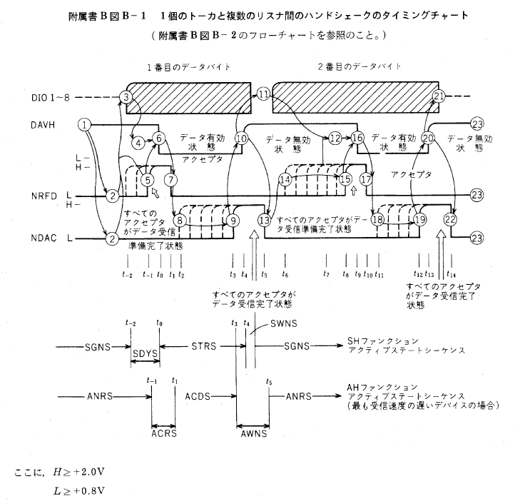

GP-IB の用語の内、VXI-11 に関係する用語を説明します。

### リモートローカルファンクション
計測機器を通信制御中に機器のパネルキーを操作すると設定内容に齟齬が生じます。そのような事態を避けるためにパネルキーの操作を無効にする仕組みがリモートローカルファンクションです。

### トリガファンクション
コントローラ から複数台の計測機器に一斉に測定開始や出力開始を指示する仕組みです。

 ### サービスリクエストファンクション
計測機器からコントローラに起動の完了やエラーの発生を非同期で通知する仕組みです。

 ### ステータスバイト
サービスリクエストの発生理由を示す 8 ビットの数値です。計測機器の応答データの準備完了やエラーの発生を示します。

「EIAJ TT-5004：計測器用インターフェースシステムのためのコード、フォーマット、プロトコル及び共通コマンド 4.4.1 要求されるステータス・レポーティング能力」より引用

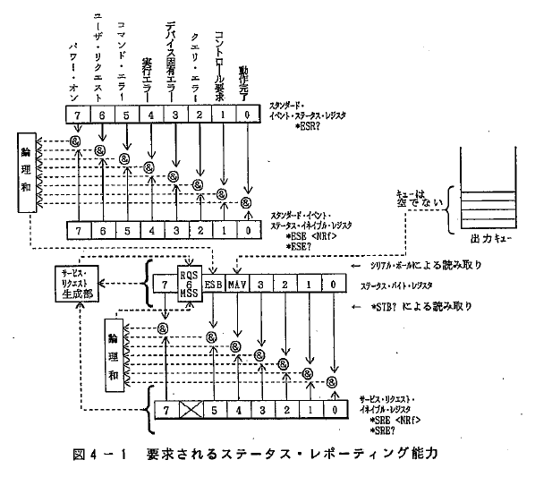

### デバイスクリアファンクション
計測機器の通信の入力バッファと出力キューをクリアし通信機能を初期状態に戻す機能です。

「EIAJ TT-5004：計測器用インターフェースシステムのためのコード、フォーマット、プロトコル及び共通コマンド 6.1.2 ステータス・レポーティング」より引用

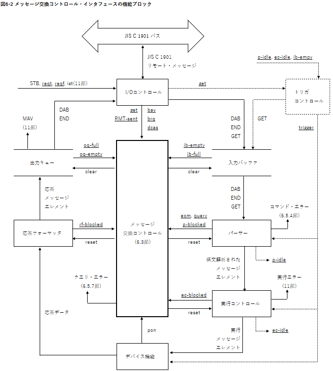

# VXI-11 について

1995年に測定器業界団体がイーサネット通信で GP-IB の機能を実現するために作った通信プロトコルです。仕様書は [VXI-11 REVISION 1.0](https://www.vxibus.org/specifications.html) で公開されています。トランスポート層に TCP、セッション層に RPC、プレゼンテーション層に XDR を利用し、VXI-11 はアプリケーション層に相当します。

|No.|OSI階層|プロトコル|規格番号|
|-|---------|----------|--------|
|7|アプリケーション層|Network Instrument|VXI-11|
|6|プレゼンテーション層|XDR|RFC 1014|
|5|セッション層|ONC RPC|RFC 1057|
|4|トランスポート層|TCP|RFC 793|
|3|ネットワーク層|IP|RFC 791|
|2|データリンク層|Ethernet|IEEE 802.3|
|1|物理層|10BASE-T|IEEE 802.3|

ここから少し寄り道をして RPC, XDR の概要を紹介します。

## RPC について

RPC は遠隔にあるシステムの関数を実行するための仕組みです。VXI-11 が採用する ONC RPC は 1988 年にインターネット標準 [RFC 1057: RPC: Remote Procedure Call Protocol specification Version 2](https://www.ietf.org/rfc/rfc1057.txt) として公開されました。

### RPC のコンセプト

一般的なプログラムでの関数呼び出しは

1. 親プログラムが関数名と引数を指定して、特定の関数を呼び出す
2. その関数の処理が実行される
3. 結果の戻り値が、親プログラムに渡される

という順序で行われます。

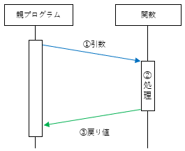

RPC は分散環境におけるクライアントとサーバ間の通信を、一般的な関数呼び出しのように見せることを目的にしています。関数呼び出しをクライアントとサーバ間の通信に変換する動作は以下の通りです。

1. クライアント側の親プログラムは、その処理を実行する巻子が自分のプログラム内に存在するかのように、特定の関数を呼び出します。
2. 呼び出した関数名、引数などは「スタブ (Stub)」と呼ばれるプログラムによって、RPC のプロトコルで定められた RPC メッセージ(callメッセージ)に組み立てられます
3. TCP や UDP といったトランスポートプロトコルによって、このメッセージがサーバ側に転送されます。
4. サーバ側のスタブ・プログラムは呼び出された関数、引数を取り出して、該当するプログラムを実際に呼び出します。
5. サーバ側でプログラムで要求された関数が実行されます。
6. 関数の実行結果が、サーバ側のスタブ・プログラムに戻され、結果を返すための RPC メッセージ(repy メッセージ)に組み立てられます
7. そのRPCメッセージがクライアント側に転送されます。
8. クライアント側のスタブ・プログラムが戻り値（結果）を取り出して、処理を依頼した親プログラムに戻します。

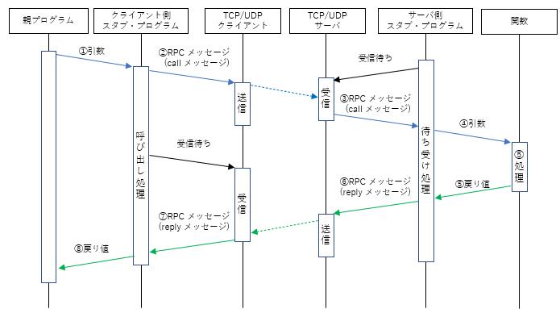

### RPC のデータ構成

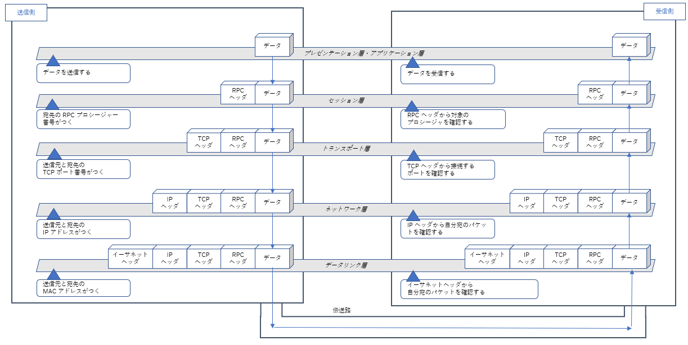

### ONC RPC のヘッダフォーマット

関数呼び出し時のヘッダフォーマット

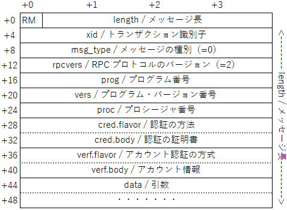

応答を返す時のヘッダフォーマット

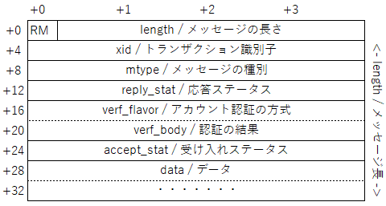

msg_type の番号と意味
|番号|定数名|意味|
|--|--|--|
|0|CALL|関数の呼び出し|
|1|REPLY|関数の応答|

reply_stat の番号と意味
|番号|定数名|意味|
|--|--|--|
|0|MSG_ACCEPTED|正常に実行された|
|1|MSG_DENIED|エラーが発生した|

accept_stat の番号と意味
|番号|定数名|意味|
|--|--|--|
|0|SUCCESS|RPCが正常に実行された|
|1|PROG_UNAVAIL|リモートがプログラムをエクスポートしていない|
|2|PROG_MISMATCH|リモートがバージョン#をサポートできない|
|3|PROC_UNAVAIL|プログラムがプロシージャをサポートできません|
|4|GARBAGE_ARGS|プロシージャはパラメータをデコードできません|

### ONC RPC の認証機構
ONC RPC では Sun Microsystems 社の UNIX を想定した認証の仕組みが定義されています。VXI-11 では認証を使わないため、AUTH_NONE / AUTH_NULL を設定します。

cred_flavor の番号と意味
|番号|定数名|意味|
|--|--|--|
|0|AUTH_NONE|認証の仕組みを使わない|
|1|AUTH_SYS|UNIX のシステム認証の仕組みを使う|
|2|AUTH_SHORT|独自 のシステム認証の仕組みを使う|

verf_flavor の番号と意味
|番号|定数名|意味|
|--|--|--|
|0|AUTH_NULL|認証の仕組みを使わない|
|1|AUTH_UNIX|UNIX のユーザ認証の仕組みを使う|
|2|AUTH_SHORT|独自 のユーザ認証の仕組みを使う|
|3|AUTH_DES|DES のユーザ認証の仕組みを使う|

### プログラム番号、プログラムバージョン、プロシージャ番号の例

対象プログラムのポート番号を問い合わせるポートマップというプログラムを例に紹介します

|関数名|プログラム番号|バージョン番号|プロシージャ番号|説明|
|--|--|--|--|--|
|PMAPPROC_SET|10000|2|1|ポートマッパープログラムにプログラムを登録する。|
|PMAPPROC_UNSET|10000|2|2|ポートマッパープログラムに登録されているプログラムを解除する。|
|PMAPPROC_GETPORT|10000|2|3|ポートマッパープログラムに登録されているプログラムのポート番号を返す。|
|PMAPPROC_DUMP|10000|2|4|ートマッパーのデータベースの全エントリを列挙する。|

## XDR について
XDR はネットワークを流れるデータの構造を明確にするたに、1987 年にインターネット標準 [RFC 1014 XDR: External Data Representation Standard](https://www.ietf.org/rfc/rfc1014txt) として公開されました。

### XDR のデータ形式

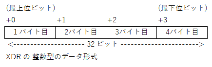

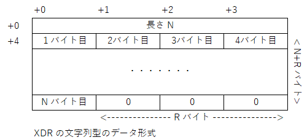

## VXI-11 の特徴
ここから VXI-11 の内容を説明します。

### コアチャネル、インタラプトチャネル、アボートチャネル

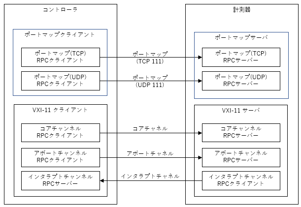

|役割|プログラム番号|バージョン番号|プロトコル|ポート番号|
|--------|--------------|--------------|----------|----------|
|ポートマップ|10000|2|TCP|111|
|ポートマップ|10000|2|UDP|111|
|コアチャネル|395183|1|TCP|任意|
|アボートチャネル|395184|1|TCP|任意|
|インタラプトチャネル|395185|1|TCP|任意|

### リンク番号とロック

複数のコントローラが別々のリンクを介して単一のデバイスにアクセスすることができます。このような状況では、VXI-11 サーバーはリンクへのアクセスをロックすることができます。これにより、そのリンクに関連付けられたデバイスへの排他的なアクセスが、そのリンクだけに保証されます。コントローラがデバイスへの排他的なアクセスを必要とする場合、ロックを取得する必要があります。ロックがない場合、複数のコントローラがデータを送信し、一般的にデバイスの状態を操作することができます。そのような状況下では、デバイスの振る舞いは予測できなくなります。ロックが取得されていないデバイスに対する最初のdevice_lock呼び出しは、ロックを取得します。同じデバイスに対する後続のdevice_lock呼び出しはエラーを返します。device_unlockは、このリンクがロックを持っている場合にデバイスのロックを解除します。そうでない場合、device_unlockはエラーを返します。

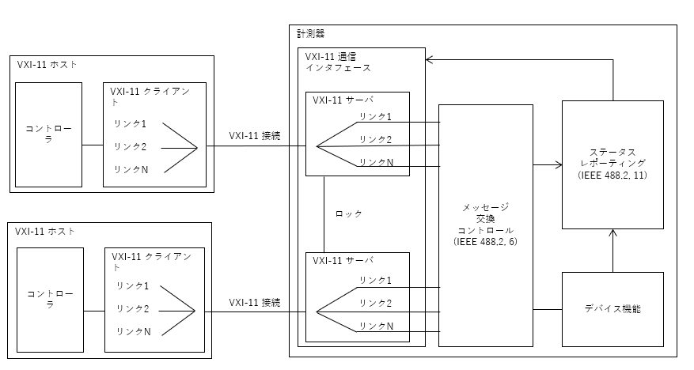

### VXI-11 のシーケンス
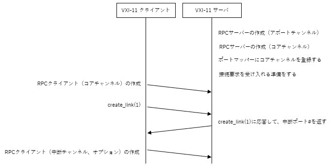

### VXI-11 の関数とプロシージャ番号

|関数名|説明|チャネル|プログラム番号|バージョン番号|プロシージャ番号|引数|戻り値|
|------|-------|---------------|---|------|----|--|--|
|create_link|デバイスへのリンクを開く|コア|395183|1|10|Create_LinkParms|Create_LinkResp|
|device_write|デバイスがメッセージを受信する|コア|395183|1|11|Device_WriteParms|Device_WriteResp|
|device_read|デバイスが応答を送信する|コア|395183|1|12|Device_ReadParms|Device_ReadResp|
|destroy_link|デバイスへのリンクのクローズ|コア|395183|1|23|Device_Link|Device_Error|
|device_readstb|デバイスがステータスバイトを送信する|コア|395183|1|13|Device_GenericParms|Device_ReadStbResp|
|device_trigger|デバイストリガを実行する|コア|395183|1|14|Device_GenericParms|Device_Error|
|device_clear|デバイスクリアを実行する|コア|395183|1|15|Device_GenericParms|Device_Error|
|device_remote|デバイスをリモート状態にする|コア|395183|1|16|Device_GenericParms|Device_Error|
|device_local|デバイスをローカル状態にする|コア|395183|1|17|Device_GenericParms|Device_Error|
|device_lock|デバイスをロックする|コア|395183|1|18|Device_LockParms|Device_Error|
|device_unlock|デバイスのロックを解除する|コア|395183|1|19|Device_Link|Device_Error|
|device_enable_srq|デバイスからのサービスリクエストの送信を有効／無効にする|コア|395183|1|20|Device_EnableSrqParms|Device_Error|
|device_docmd|デバイスがコマンドを実行する|コア|395183|1|22|Device_DocmdParms|Device_DocmdResp|
|create_intr_chan|デバイスがインタラプトチャンネルを作成|コア|395183|1|25|Device_RemoteFunc|Device_Error|
|destroy_intr_chan|デバイスがインタラプトチャネルを破棄した|コア|395183|1|26|なし|Device_Error|
|device_abort|デバイスが進行中の呼び出しを中止する|アボート|395184|1|1|Device_Link|Device_Error|
|device_intr_srq|デバイスがサービスリクエストの送信に使用|インタラプト|395185|1|30|Device_SrqParms|なし|

### VXI-11 のデータフォーマット

VXI-11 のデータ構成

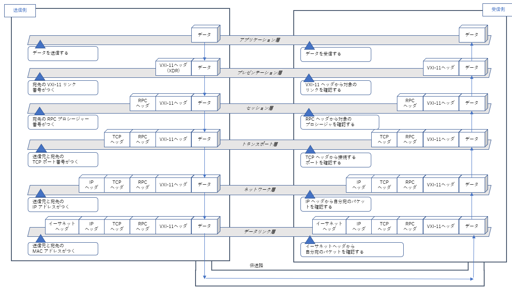

VXI-11の主な関数の引数や戻り値のデータ構成

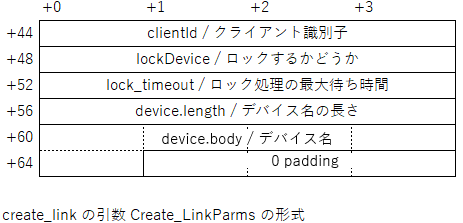

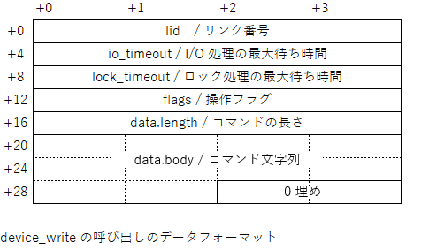

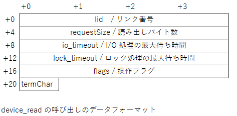
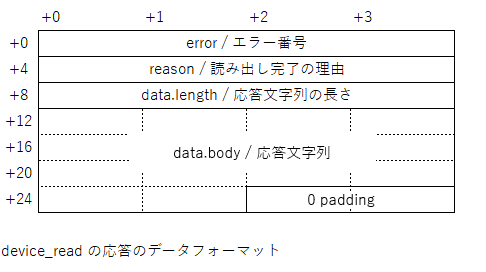

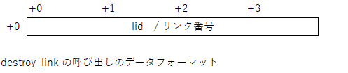
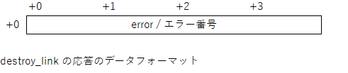

### VXI-11 のエラー番号

|エラー番号|意味|
|---------|----|
|0|エラーなし|
|1|文法エラー|
|3|デバイスにアクセスできない|
|4|不正な識別子リンク|
|5|引数エラー|
|6|チャネルが確立されていない|
|8|動作未対応|
|9|リソースがない|
|11|他のリンクによってロックされたデバイス|
|12|このリンクでロックされていない|
|15|入出力タイムアウト|
|17|入出力エラー|
|21|無効なアドレス|
|23|処理を中断した|
|29|チャネルが既に確立されている|

# VXI-11.Netについて

VXI-11.NET はクラスルームでの学習を目的とするVXI-11通信ソフトウェアです。サーバアプリケーションとクライアントアプリケーションがあります。２つのアプリケーション間の通信内容を パケットキャプチャソフトの Wireshark でモニタする事で通信のシーケンスを見ることができます。
- https://github.com/mitakalab1/VXI-11.Net

# VXI-11 の周辺規格について
VXI-11 に関連する主な規格を紹介します。

### ソケット通信
GP-IB のリモート機能やトリガ機能は不要で RS-232 のようにコマンドの送受信だけできればよい、という簡易用途でよく使われます。

### HiSLIPプロトコル
2020年に計測器業界団体が策定した、VXI-11 の後継のイーサネット通信プロトコルです。10Gイーサネット以上の高速通信を想定し インタラプト動作を省略したオーバーラップ動作があります。仕様書は [IVI-6.1: High-Speed LAN Instrument Protocol（HiSLIP)](https://www.ivifoundation.org/downloads/Protocol%20Specifications/IVI-6.1_HiSLIP-2.0-2020-04-23.pdf) です。

### VXI-1 から VXI-10
1995年に計測器業界団体が策定したパソコンベースのモジュール型計測器の仕様です。モジュール間通信規格として VME バスに信号線を追加した VXI バスを採用し、筐体の大きさや電気信号、ソフトウェア(DOS)を規定しています。今はVMEバス搭載パソコンが流通しておらず、後継の [PXI Specifications](https://www.pxisa.org/) に置き換わっています。 

### VISA ライブラリ
1995年に計測器業界団体が策定した、GP-IB, RS-232, USB, イーサネットといった異なる通信規格に対して同一関数で操作するための通信ライブラリです。VXI バスを想定したメモリ読み書き関数群と、GP-IB や VXI-11 を対象とするメッセージ送受信関数群があります。C言語、LabView, C++(COM), C# を対象としています。最新の仕様書は [VPP-4.3: The VISA Library](https://www.ivifoundation.org/specifications/) で公開されています。

### SCPI コマンド
1999年に計測器業界団体が策定した、オシロスコープ、デジタルマルチメータ、任意信号発生器などの製品カテゴリ毎の共通コマンドの書式や引数の仕様です。仕様書は [Standard Commands for Programmable Instruments-1999](https://www.ivifoundation.org/docs/scpi-99.pdf) です。

### IVI ドライバ
1998年に計測器業界団体が策定した、SCPI 準拠機器を制御するC言語, C++(COM), C# の関数ライブラリ仕様です。各社の測定器の振る舞いを抽象化し仮想測定器クラスによるPC上でのシミュレーション動作に対応しています。最新の仕様が [IVI Specifications](https://www.ivifoundation.org/specifications/) で公開されています。

### LXI 規格
2005 年に計測器業界団体が策定した、LAN 接続可能な計測機器が搭載すべき機能の仕様です。接続状態を表示するインジケータ、LAN 設定のリセットボタン、VXI-11 プロトコル, IVI ドライバ, Web サーバが必須とされています。オプションとして、トリガコネクタ、IEEEE1588 時刻同期などが規定されています。最新の仕様書は [LXI Device Specification 2022](https://www.lxistandard.org/Specifications/Specifications.aspx) です。

# 参考文献

もっと詳しく知りたい人のために日本語の解説記事を挙げます。
- [JIS C 1901:1987 計測器用インタフェースシステム](https://webdesk.jsa.or.jp/books/W11M0090/index/?bunsyo_id=JIS+C+1901%3A1987) 日本規格協会 税込4840円
- [GPIB通信の基礎知識と用語集](https://www.contec.com/jp/support/basic-knowledge/daq-control/gpib-communication/) コンテック社