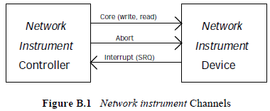
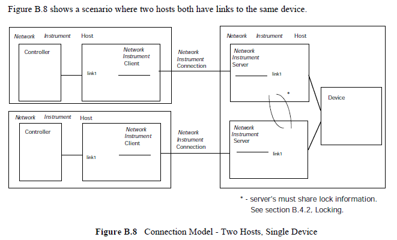

# VXI-11 通信プロトコルの概要
タグ：C#

VXI-11（ぶいえっくすあいいれぶん）はオシロスコープ等の計測器の制御に使われるイーサネット通信プロトコルです。VXI-11 を説明するには、電子計測器の通信インタフェースとして使われる GP-IB（じーぴーあいびー）と、インターネット通信プロトコルの RPC（あーるぴーしー） の知識を必要とします。そこでまず GP-IB を紹介し、次に VXI-11 と RPC の概要を説明します。対象読者としてイーサネットの基本（IPアドレスとTCP ポート番号）とプログラムの基本（関数、変数、引数、戻り値）がわかる 18 歳の新人技術者を想定しています。

# GP-IB について

GP-IB は1960年代に HP 社が計測機器や制御機器などの間でデータ通信を行うために設計した通信規格です。

 ### 計測機器の接続例
 JIS C 1901:1987 より引用

コネクタや電気信号のタイミングを定義した [IEEE488.1-1978](https://standards.ieee.org/ieee/488/6465/) (あいとりぷるいーよんはちはちぽいんとわん、通称ぽいんとわん)と、コマンド形式や共通コマンドを定義した [IEEE488.2-1987](https://standards.ieee.org/ieee/488.2/717/) (あいとりぷるいーよんはちはちぽいんとつー、通称ぽいんとつー)の２つの規格があります。
GP-IB の用語の内、VXI-11 に関係する用語を説明します。

### リモートローカルファンクション
計測機器を通信制御中に機器のパネルキーを操作すると設定内容に齟齬が生じます。そのような事態を避けるためにパネルキーの操作を無効にする仕組みがリモートローカルファンクションです。

JIS C 1901:1987 より引用
 

### トリガファンクション
PCから複数台の計測機器に一斉に測定開始や制御開始を指示する仕組みです。

 JIS C 1901:1987 より引用

### サービスリクエストファンクション
計測機器からPCに動作の完了やエラーの発生を非同期で通知する仕組みです。

 JIS C 1901:1987 より引用

### ステータスバイトファンクション
サービスリクエストの発生理由を示す 8 ビットの数値です。計測機器の応答データの準備完了やエラーの発生を示します。

### デバイスクリアファンクション
計測機器のと通信機能を初期状態に戻し、通信の入力バッファと出力バッファをクリアする機能です。

# VXI-11 について

1995年に測定器業界団体がイーサネット通信でGP-IB の機能を実現するために作った通信プロトコルです。仕様書は [VXI-11 REVISION 1.0](https://www.vxibus.org/specifications.html) で公開されています。トランスポート層に TCP、セッション層に RPC、プレゼンテーション層に XDR を利用し、VXI-11 はアプリケーション層に相当します。

|OSI階層|プロトコル|規格番号|
|---------|----------|--------|
|アプリケーション層|Network Instrument|VXI-11|
|プレゼンテーション層|XDR|RFC 1014|
|セッション層|ONC RPC|RFC 1057|
|トランスポート層|TCP|RFC 793|
|ネットワーク層|IP|RFC 791|
|データリンク層|Ethernet|IEEE 802.3|
|物理層|10BASE-T|IEEE 802.3|

## ONC RPC について

RPC は遠隔にあるシステムの関数を実行するための仕組みです。ONC RPC は 1988 年にSun Microsystems 社が設計しました。トランスポート層として TCP と UDP を利用しています。ONC RPC は [RFC 1057: RPC: Remote Procedure Call Protocol specification Version 2](https://datatracker.ietf.org/doc/html/rfc1057) のインターネット標準として公開されています。

### RPC のシーケンス
(TODO)

### ONC RPC のヘッダフォーマット

mtype の番号と意味
|番号|定数名|意味|
|--|--|--|
|0|CALL|関数の呼び出し|
|1|REPLY|関数の応答|

reply_stat の番号と意味
|番号|定数名|意味|
|--|--|--|
|0|MSG_ACCEPTED|正常に実行された|
|1|MSG_DENIED|エラーが発生した|

accept_stat の番号と意味
|番号|定数名|意味|
|--|--|--|
|0|SUCCESS|RPCが正常に実行された|
|1|PROG_UNAVAIL|リモートがプログラムをエクスポートしていない|
|2|PROG_MISMATCH|リモートがバージョン#をサポートできない|
|3|MRPC_UNAVAIL|プログラムがプロシージャをサポートできません|
|4|GARBAGE_ARGS|プロシージャはパラメータをデコードできません|

### ONC RPC の認証機構
ONC RPC では認証をクライアントとサーバの処理に任せるという方針をとっています。VXI-11 では認証を使いません。

verf_flavor の番号と意味
|番号|定数名|意味|
|--|--|--|
|0|AUTH_NONE|認証の仕組みを使わない|
|1|AUTH_SYS|UNIX のシステム認証の仕組みを使う|
|2|AUTH_SHORT|独自 のシステム認証の仕組みを使う|

verf_flavor の番号と意味
|番号|定数名|意味|
|--|--|--|
|0|AUTH_NULL|認証の仕組みを使わない|
|1|AUTH_UNIX|UNIX のユーザ認証の仕組みを使う|
|2|AUTH_SHORT|独自 のユーザ認証の仕組みを使う|
|3|AUTH_DES|DES のユーザ認証の仕組みを使う|

### プログラム番号、プログラムバージョン、プロシージャ番号の例

|プログラム名|プログラム番号|バージョン番号|プロトコル|
|--|--|--|--|
|Port Mapper Protocol|10000|2|TCP/UDP|

|関数名|プロシージャ番号|引数|戻り値|説明|
|--|--|--|--|--|
|PMAPPROC_NULL|0|なし|なし|この手続きは何の役にも立ちません。|
|PMAPPROC_SET|1|mapping|bool|ポートマッパープログラムにプログラムを登録する。|
|PMAPPROC_UNSET|2|mapping|bool|ポートマッパープログラムに登録されているプログラムを解除する。|
|PMAPPROC_GETPORT|3|mapping|unsigned int|ポートマッパープログラムに登録されているプログラムのポート番号を返す。|
|PMAPPROC_DUMP|4|なし|pmaplist|ポートマッパーのデータベースの全エントリを列挙する。|
|PMAPPROC_CALLIT|5|call_args|call_result|別のリモートプロシージャを呼び出す|

## XDR について
XDR はネットワークを流れるデータの構造を明確にするために、1987 年にSun Microsystems 社が作った仕様です。XDR は [RFC 1014 XDR: External Data Representation Standard](https://datatracker.ietf.org/doc/html/rfc1014) として公開されています。

### XDR のデータ形式

## VXI-11 の特徴
ここから VXI-11 の内容を説明します。

### コアチャネル、インタラプトチャネル、アボートチャネル

### サーバ、クライアント

### ロック

### VXI-11 のシーケンス
(TODO)

### VXI-11 のプログラム番号

|チャネル名|プログラム番号|バージョン番号|プロトコル|
|---------|------------|-------------|--------|
|コア|395183|1|TCP|
|アボート|395184|1|TCP|
|インタラプト|395185|1|TCP|

### VXI-11 の関数とプロシージャ番号

|関数名|チャネル|プロシージャ番号|引数|戻り値|説明|
|------|-------|---------------|---|------|----|
|create_link|コア|10|Create_LinkParms|Create_LinkResp|デバイスへのリンクを開く|
|device_write|コア|11|Device_WriteParms|Device_WriteResp|デバイスがメッセージを受信する|
|device_read|コア|12|Device_ReadParms|Device_ReadResp|デバイスが応答を送信する|
|device_readstb|コア|13|Device_GenericParms|Device_ReadStbResp|デバイスがステータスバイトを送信する|
|device_trigger|コア|14|Device_GenericParms|Device_Error|デバイストリガを実行する|
|device_clear|コア|15|Device_GenericParms|Device_Error|デバイスクリアを実行する|
|device_remote|コア|16|Device_GenericParms|Device_Error|デバイスをリモート状態にする|
|device_local|コア|17|Device_GenericParms|Device_Error|デバイスをローカル状態にする|
|device_lock|コア|18|Device_LockParms|Device_Error|デバイスをロックする|
|device_unlock|コア|19|Device_Link|Device_Error|デバイスのロックを解除する|
|device_enable_srq|コア|20|Device_EnableSrqParms|Device_Error|デバイスがサービス要求の送信を有効／無効にする|
|device_docmd|コア|22|Device_DocmdParms|Device_DocmdResp|デバイスがコマンドを実行する|
|destroy_link|コア|23|Device_Link|Device_Error|デバイスへのリンクのクローズ|
|create_intr_chan|コア|25|Device_RemoteFunc|Device_Error|デバイスが割り込みチャンネルを作成|
|destroy_intr_chan|コア|26|なし|Device_Error|デバイスが割り込みチャネルを破棄した|
|device_abort|アボート|1|Device_Link|Device_Error|デバイスが進行中の呼び出しを中止する|
|device_intr_srq|インタラプト|30|Device_SrqParms|なし|デバイスがサービス要求の送信に使用|

### VXI-11 のヘッダフォーマット

### VXI-11 のエラーコード

|エラー番号|意味|
|---------|----|
|0|エラーなし|
|1|文法エラー|
|3|デバイスにアクセスできない|
|4|不正な識別子リンク|
|5|引数エラー|
|6|チャネルが確立されていない|
|8|動作未対応|
|9|リソースがない|
|11|他のリンクによってロックされたデバイス|
|12|このリンクでロックされていない|
|15|入出力タイムアウト|
|17|入出力エラー|
|21|無効なアドレス|
|23|処理を中断した|
|29|チャネルが既に確立されている|

# VXI-11.Netについて

VXI-11.NET はクラスルームでの学習を目的とするVXI-11通信ソフトウェアです。サーバアプリケーションとクライアントアプリケーションがあります。２つのアプリケーション間の通信内容を パケットキャプチャソフトの Wireshark でモニタする事で通信のシーケンスを見ることができます。
- https://github.com/mitakalab1/VXI-11.Net

# VXI-11 の周辺規格について
VXI-11 に関連する主な規格を紹介します。

### ソケット通信
GP-IB のリモート機能やトリガ機能は不要で RS-232 のようにコマンドの送受信だけできればよい、という簡易用途でよく使われます。

### HiSLIPプロトコル
2020年に計測器業界団体が策定した、VXI-11 の後継のイーサネット通信プロトコルです。10Gイーサネット以上の高速通信を想定し インタラプト動作を省略したオーバーラップ動作があります。仕様書は [IVI-6.1: High-Speed LAN Instrument Protocol（HiSLIP)](https://www.ivifoundation.org/downloads/Protocol%20Specifications/IVI-6.1_HiSLIP-2.0-2020-04-23.pdf) です。

### VXI-1 から VXI-10
1995年に計測器業界団体が策定したパソコンベースのモジュール型計測器の仕様です。モジュール間通信規格として VME バスに信号線を追加した VXI バスを採用し、筐体の大きさや電気信号、ソフトウェア(DOS)を規定しています。今はVMEバス搭載パソコンが流通しておらず、後継の [PXI Specifications](https://www.pxisa.org/) に置き換わっています。 

### VISA ライブラリ
1995年に計測器業界団体が策定した、GP-IB, RS-232, USB, イーサネットといった異なる通信規格に対して同一関数で操作するための通信ライブラリです。VXI バスを想定したメモリ読み書き関数群と、GP-IB や VXI-11 を対象とするメッセージ送受信関数群があります。C言語、LabView, C++(COM), C# を対象としています。最新の仕様書は [VPP-4.3: The VISA Library](https://www.ivifoundation.org/specifications/) で公開されています。

### SCPI コマンド
1999年に計測器業界団体が策定した、オシロスコープ、デジタルマルチメータ、任意信号発生器などの製品カテゴリ毎の共通コマンドの書式や引数の仕様です。仕様書は [Standard Commands for Programmable Instruments-1999](https://www.ivifoundation.org/docs/scpi-99.pdf) です。

### IVI ドライバ
1998年に計測器業界団体が策定した、SCPI 準拠機器を制御するC言語, C++(COM), C# の関数ライブラリ仕様です。各社の測定器の振る舞いを抽象化し仮想測定器クラスによるPC上でのシミュレーション動作に対応しています。最新の仕様が [IVI Specifications](https://www.ivifoundation.org/specifications/) で公開されています。

### LXI 規格
2005 年に計測器業界団体が策定した、LAN 接続可能な計測機器が搭載すべき機能の仕様です。接続状態を表示するインジケータ、LAN 設定のリセットボタン、VXI-11 プロトコル, IVI ドライバ, Web サーバが必須とされています。オプションとして、トリガコネクタ、IEEEE1588 時刻同期などが規定されています。最新の仕様書は [LXI Device Specification 2022](https://www.lxistandard.org/Specifications/Specifications.aspx) です。

# 参考文献

もっと詳しく知りたい人のために日本語の解説記事を挙げます。
- [JIS C 1901:1987 計測器用インタフェースシステム](https://webdesk.jsa.or.jp/books/W11M0090/index/?bunsyo_id=JIS+C+1901%3A1987) 日本規格協会 税込4840円
- [GPIB通信の基礎知識と用語集](https://www.contec.com/jp/support/basic-knowledge/daq-control/gpib-communication/) コンテック社