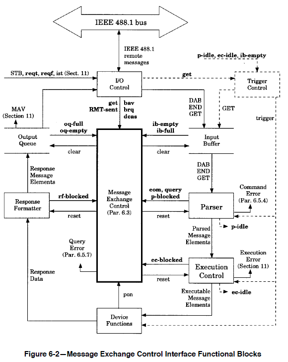

# VXI-11 通信プロトコルの概要
タグ：C#

VXI-11（ぶいえっくすあいいれぶん）はオシロスコープ等の計測器の制御に使われるイーサネット通信プロトコルです。VXI-11 を説明するには、電子計測器の通信インタフェースとして使われる GP-IB（じーぴーあいびー）と、インターネット通信プロトコルの RPC（あーるぴーしー） の知識を必要とします。そこでまず GP-IB を紹介し、次に VXI-11 と RPC の概要を説明します。対象読者としてイーサネットの基本（IPアドレスとTCP ポート番号）とプログラムの基本（関数、引数、戻り値）がわかり、英語がちょっと読める 18 歳の新人技術者を想定しています。

# GP-IB について

GP-IB は1960年代に HP 社が計測機器や制御機器などの間でデータ通信を行うために設計した通信規格です。

 JIS C 1901:1987 より引用

コネクタや電気信号のタイミングを定義した [IEEE488.1-1978](https://standards.ieee.org/ieee/488/6465/) (あいとりぷるいーよんはちはちぽいんとわん、通称ぽいんとわん)と、コマンド形式や共通コマンドを定義した [IEEE488.2-1987](https://standards.ieee.org/ieee/488.2/717/) (あいとりぷるいーよんはちはちぽいんとつー、通称ぽいんとつー)の２つの規格があります。日本語版は [JIS C 1901:1987 計測器用インタフェースシステム](https://kikakurui.com/c1/C1901-1987-01.html) と EIAJ TT-5004：計測器用インターフェースシステムのためのコード、フォーマット、プロトコル及び共通コマンド(日本電子機械工業会発行, 販売終了) です。最新版は [IEEE/IEC 60488-1-2004](https://standards.ieee.org/ieee/60488-1/3686/) と [IEEE/IEC 60488-2-2004](https://standards.ieee.org/ieee/60488-2/3632/) です。

GP-IB は24ピンの頑丈なコネクタでねじ止めするため、断線トラブルや引き抜きトラブルがほぼありません。また制御信号はグランド線とツイストぺアで配線されており電子ノイズに強く、三線式ハンドシェークによりトラブル発生時の原因の特定が容易なため、高い信頼性が必要な工場の生産ラインの通信方式として利用されます。

JIS C 1901:1987 より引用
 

GP-IB の用語の内、VXI-11 に関係する用語を説明します。

### リモート
計測機器を通信制御中に手動で機器のパネルキーを操作すると設定内容に齟齬が生じます。そのような事態を避けるために遠隔からパネルキーの操作を無効にする仕組みがリモート・ローカルです。

JIS C 1901:1987 より引用
 

### トリガ
PCから複数台の計測機器に一斉に測定開始や制御開始を指示する仕組みです。

 JIS C 1901:1987 より引用

### サービスリクエスト
計測機器からPCに動作の完了やエラーの発生を非同期で通知する仕組みです。

 JIS C 1901:1987 より引用

### ステータスバイト
サービスリクエストの発生理由を示す 8 ビットの数値です。計測機器の応答データの準備完了やエラーの発生を示します。

### *IDN?コマンド
計測機器の「メーカ名、型名、ファームウェアバージョン、シリアル番号」を問い合わせるコマンドです

### インタラプト動作
計測機器が送信中のデータを完了する前に次のコマンドを受信した場合に、計測機器で行うエラー動作です。

### デバイスクリア
計測機器が送信中のデータをクリアする機能です。上記インタラプト動作を解消する際によく使用されます。

# VXI-11 について

1995年に測定器業界団体が、イーサネット通信でGP-IB の機能を実現するために作った通信プロトコルです。仕様書は [VXI-11 REVISION 1.0](https://www.vxibus.org/specifications.html) で公開されています。トランスポート層に TCP、セッション層に RPC、プレゼンテーション層に XDR を利用し、VXI-11 はアプリケーション層に相当します。

## RPCについて

RPC はイーサネット経由で遠隔地にあるコンピュータの関数を実行するための仕組みとして 1988 年に実用化された通信プロトコルです。トランスポート層に TCP と UDP を採用し、セッション層に RPC があります。広く使われている事例としてUnix のネットワークファイル共有システム(NFS) があります。RPC は [RFC 1057: RPC: Remote Procedure Call Protocol specification Version 2](https://www.rfc-editor.org/rfc/rfc1057) のインターネット規格として定義されています。RPC の考え方はマイクロソフト社の MS-RPC や Google社 の gRPC に引き継がれています。

RPC の用語を説明します
### CALL、REPLY
(TODO)

### プログラム番号、プログラムバージョン

## VXI-11の特徴
VXI-11の仕様書には基本関数の仕様を定義している VXI-11 と IEEE488.2 の範囲を規定している VXI-11.3 の２つの仕様書があります。ここでは VXI-11 の内容を説明します。

### コアチャネル、インタラプトチャネル、アボートチャネル

### サーバ、クライアント

### ロック

### 関数一覧表

### エラーコード

# VXI-11.Netについて

VXI-11.NET はクラスルームでの学習を目的とするVXI-11通信ソフトウェアです。サーバアプリケーションとクライアントアプリケーションがあります。２つのアプリケーション間の通信内容を パケットキャプチャソフトの Wireshark でモニタする事で通信のシーケンスを見ることができます。
- https://github.com/mitakalab1/VXI-11.Net

# VXI-11 の周辺規格について
VXI-11 に関連する主な規格を紹介します。

### HiSLIPプロトコル
2020年に計測器業界団体が策定した、VXI-11 の後継のイーサネット通信プロトコルです。10Gイーサネット以上の高速通信を想定し RPC を使わず TCP 上に HiSLIP プロトコルを定義しています。より高速に転送するためインタラプト動作を省略したオーバーラップ動作を使うことができます。仕様書は [IVI-6.1: High-Speed LAN Instrument Protocol（HiSLIP)](https://www.ivifoundation.org/specifications/) です。

### VISA ライブラリ
1995年に計測器業界団体が策定した、GP-IB, RS-232, USB, イーサネットといった異なる通信規格に対して同一関数で操作するための通信ライブラリです。VMEバスや PCI バスを想定したメモリ読み書き関数群と、GP-IB や VXI-11 を対象とするメッセージ送受信関数群があります。仕様書は [VPP-4.3: The VISA Library](https://www.ivifoundation.org/specifications/) です。

### VXI-1 から VXI-10
1995年に Natinal Instruments が中心になって策定した、パソコンベースのモジュール型計測器の仕様です。モジュール間通信規格としてVMEバスを採用し、筐体の大きさや搭載ソフト(DOS)を規定しています。今はVMEバス搭載パソコンが流通しておらず、後継の [PXI Specifications](https://www.pxisa.org/) に置き換わっています。 

### SCPI コマンド
1999年に計測器業界団体が策定した、オシロスコープ、デジタルマルチメータ、任意信号発生器などの製品カテゴリ毎の共通コマンドの書式や引数の仕様です。仕様書は [Standard Commands for Programmable Instruments-1999](https://www.ivifoundation.org/specifications/) です。

### IVI ドライバ
1998年に計測器業界団体が策定した、SCPI 準拠機器を制御するC言語/C++(COM)の関数ライブラリ仕様です。各社の測定器の振る舞いを抽象化し仮想測定器クラスによるPC上でのシミュレーション動作に対応しています。製品カテゴリ毎の仕様が [IVI Specifications](https://www.ivifoundation.org/specifications/) で公開されています。

# 参考文献

もっと詳しく知りたい人のために日本語の解説記事を挙げます。
- [JIS C 1901:1987 計測器用インタフェースシステム](https://webdesk.jsa.or.jp/books/W11M0090/index/?bunsyo_id=JIS+C+1901%3A1987) 日本規格協会 税込4840円
- [GPIB通信の基礎知識と用語集](https://www.contec.com/jp/support/basic-knowledge/daq-control/gpib-communication/) コンテック社