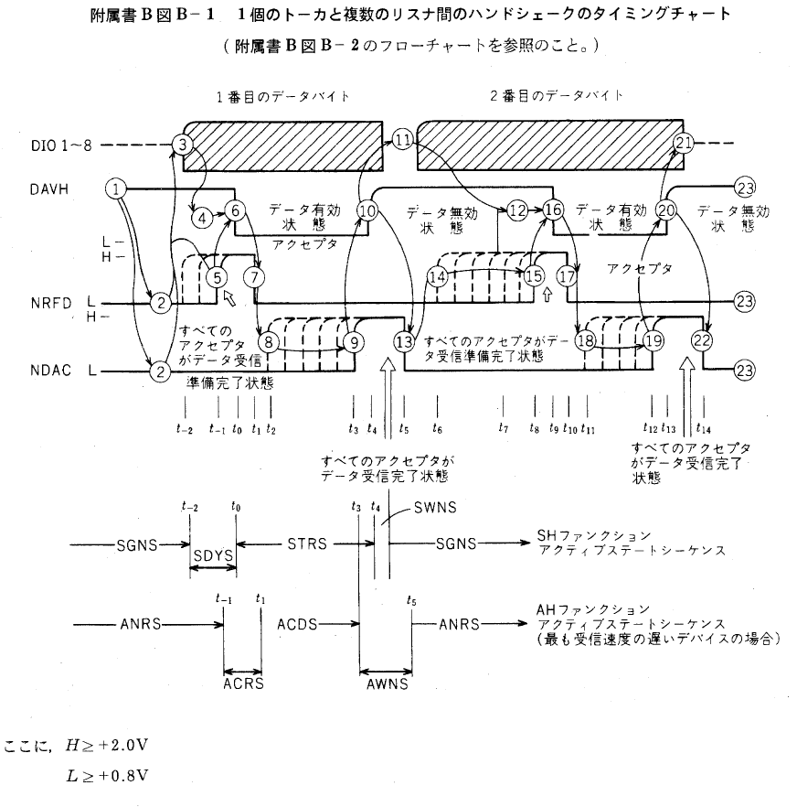
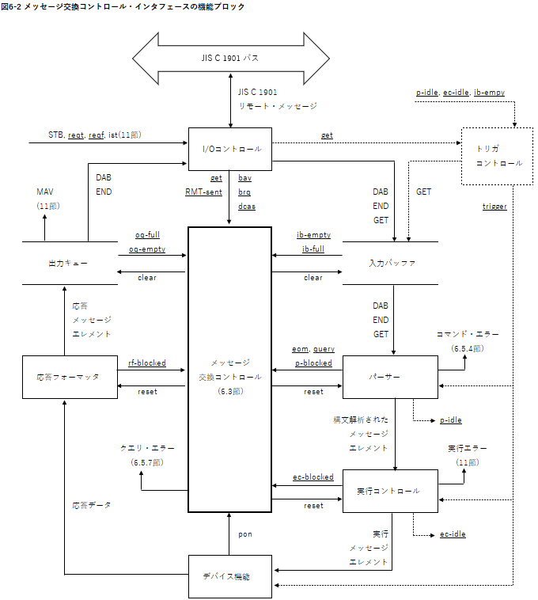
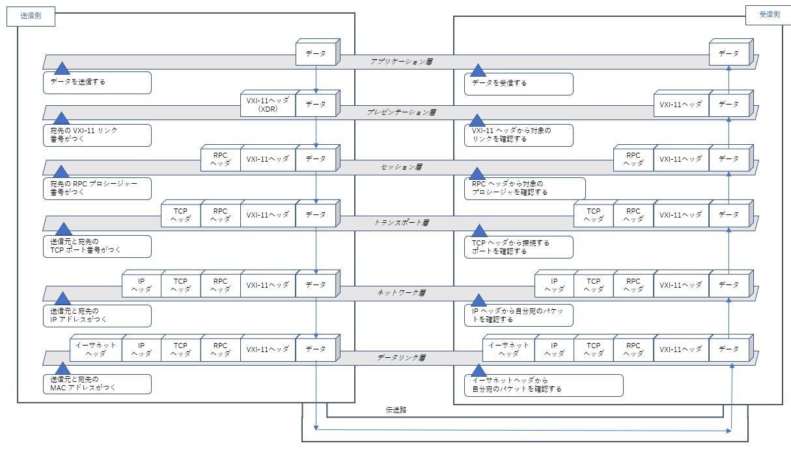
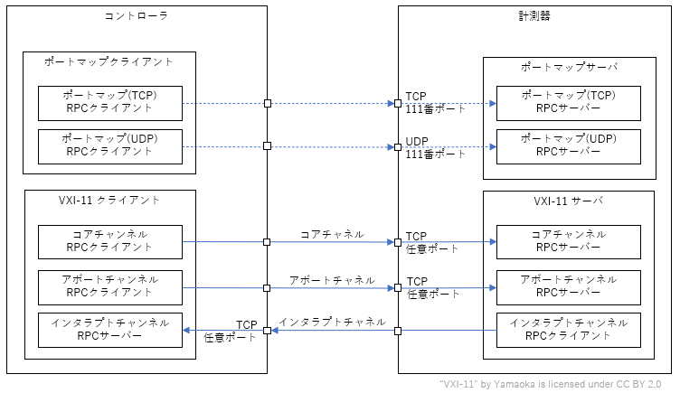
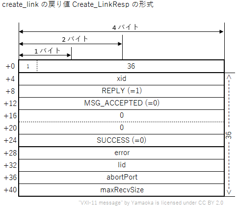
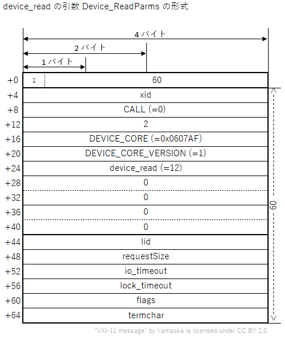

# VXI-11 通信プロトコルの概要と仕組み
タグ：C#

VXI-11（読み方：ぶいえっくすあいいれぶん）はオシロスコープのような計測器の制御に使われるイーサネット通信プロトコルです。VXI-11プロトコルは、古くから電子計測器の通信インタフェースとして使われる GP-IB（読み方：じーぴーあいびー）からイーサネット環境に容易に移行することを目的としています。

VXI-11 を説明するには、GP-IB とインターネット通信プロトコルの RPC（読み方：あーるぴーしー） の知識を必要とします。ここではまず GP-IB を紹介し、次に VXI-11 と RPC の概要を説明します。最後にサンプルプログラムと関連規格を紹介します。
対象読者としてイーサネットの基本（IPアドレスとTCP ポート番号）とプログラムの基本（関数、変数、引数、戻り値）がわかる 18 歳の新人技術者を想定しています。

# GP-IB について

GP-IB は1960年代に HP 社が計測機器や制御機器などの間でデータ通信を行うために設計した通信規格です。
 
コネクタや電気信号のタイミングを定義した [IEEE488.1-1978](https://standards.ieee.org/ieee/488/6465/) (読み方：あい・とりぷるいー・よんはちはち・ぽいんとわん、通称：ぽいんとわん)と、コマンド形式や共通コマンドを定義した [IEEE488.2-1987](https://standards.ieee.org/ieee/488.2/717/) (読み方：あい・とりぷるいー・よんはちはち・ぽいんとつー、通称：ぽいんとつー)の２つの規格があります。日本語版は [JIS C 1901:1987 計測器用インタフェースシステム](https://kikakurui.com/c1/C1901-1987-01.html) です。

### 計測機器の接続例
「[JIS C 1901:1987 計測器用インタフェースシステム](https://kikakurui.com/c1/C1901-1987-01.html) 付属書A 計測システムの一例」より引用

GP-IB は24ピンの頑丈なコネクタでねじ止めし制御信号はグランド線とツイストぺアで配線されているため、外部の電子ノイズに強く、三線式ハンドシェークによりトラブル発生時の原因の特定が容易なため、高い信頼性が必要な工場の生産ラインの通信方式として利用されます。

### コネクタの形状
「[JIS C 1901:1987 計測器用インタフェースシステム](https://kikakurui.com/c1/C1901-1987-01.html) 28. 装置用コネクタの取り付け方法」より引用
 

### コネクタピンの割付
|ピン番号|信号線名|ピン番号|信号線名|
|--|--|--|--|
|1|DIO 1|13|DIO 5|
|2|DIO 2|14|DIO 6|
|3|DIO 3|15|DIO 7|
|4|DIO 4|16|DIO 8|
|5|EOI(24)|17|REN(24)|
|6|DAV|18|Gnd,(6)|
|7|NRFD|19|Gnd,(7)|
|8|NDAC|20|Gnd,(8)|
|9|IFC|21|Gnd,(9)|
|10|SRQ|22|Gnd,(10)|
|11|ATN|23|Gnd,(11)|
|12|SHIELD|24|Gnd,LOGIC|

備考：Gnd,(n)は、括弧内の数字で示した信号のリターン用グランドであることを示しています。また、EOI とREN のリターン用グランドは 24 番ピンです。

### 三線式ハンドシェークのタイミングチャート
「[JIS C 1901:1987 計測器用インタフェースシステム](https://kikakurui.com/c1/C1901-1987-01.html) 付属書B ハンドシェークのタイミング」より引用

次に、VXI-11 に関係する GP-IB の用語を説明します。

### リモートローカルファンクション
計測機器を通信制御中に機器のパネルキーを操作すると設定内容に齟齬が生じます。そのような事態を避けるための仕組みがリモートローカルファンクションです。計測機器をリモート状態にするとパネルキー操作が無効になります。

### トリガファンクション
コントローラから複数台の計測機器に同時に測定開始や出力開始を指示する仕組みです。

 ### サービスリクエストファンクション
計測機器からコントローラに起動の完了やエラーの発生を非同期で通知する仕組みです。

 ### ステータスバイト
サービスリクエストの発生理由を示す 8 ビットの数値です。計測機器の応答データの準備完了やエラーの発生を示します。

「EIAJ TT-5004：計測器用インターフェースシステムのためのコード、フォーマット、プロトコル及び共通コマンド 4.4.1 要求されるステータス・レポーティング能力」より引用

### デバイスクリアファンクション
計測機器の通信の入力バッファと出力キューをクリアし通信機能を初期状態に戻す機能です。

「EIAJ TT-5004：計測器用インターフェースシステムのためのコード、フォーマット、プロトコル及び共通コマンド 6.1.2 ステータス・レポーティング」より引用

# VXI-11 について

VXI-11 とは 1995 年にイーサネット通信で GP-IB の機能を実現するために作られた通信プロトコルです。仕様書は [VXI-11 REVISION 1.0](https://www.vxibus.org/specifications.html) で公開されています。トランスポート層として TCP、セッション層として RPC、プレゼンテーション層として XDR を採用し、VXI-11 はアプリケーション層に相当します。

|No.|OSI階層|プロトコル|規格番号|
|-|---------|----------|--------|
|7|アプリケーション層|Network Instrument|VXI-11|
|6|プレゼンテーション層|XDR|RFC 1014|
|5|セッション層|ONC RPC|RFC 1057|
|4|トランスポート層|TCP|RFC 793|
|3|ネットワーク層|IPv4|RFC 791|
|2|データリンク層|Ethernet|IEEE 802.3|
|1|物理層|10BASE-T|IEEE 802.3|

# VXI-11 の仕組み
ここから VXI-11 の内容を説明します。

## コアチャネル、インタラプトチャネル、アボートチャネル

|役割|プログラム番号|バージョン番号|プロトコル|ポート番号|
|--------|--------------|--------------|----------|----------|
|ポートマップ|10000|2|TCP|111|
|ポートマップ|10000|2|UDP|111|
|コアチャネル|395183|1|TCP|動的に決定|
|アボートチャネル|395184|1|TCP|動的に決定|
|インタラプトチャネル|395185|1|TCP|動的に決定|

## リンク番号とロック

複数のコントローラが別々のリンクを介して単一のデバイスにアクセスすることができます。このような状況では、VXI-11 サーバーはリンクへのアクセスをロックすることができます。これにより、そのリンクに関連付けられたデバイスへの排他的なアクセスが、そのリンクだけに保証されます。コントローラがデバイスへの排他的なアクセスを必要とする場合、ロックを取得する必要があります。ロックがない場合、複数のコントローラがデータを送信し、一般的にデバイスの状態を操作することができます。そのような状況下では、デバイスの振る舞いは予測できなくなります。ロックが取得されていないデバイスに対する最初のdevice_lock呼び出しは、ロックを取得します。同じデバイスに対する後続のdevice_lock呼び出しはエラーを返します。device_unlockは、このリンクがロックを持っている場合にデバイスのロックを解除します。そうでない場合、device_unlockはエラーを返します。

## VXI-11 の関数とプロシージャ番号

|関数名|説明|チャネル|プログラム番号|バージョン番号|プロシージャ番号|引数|戻り値|
|------|-------|---------------|---|------|----|--|--|
|create_link|デバイスへのリンクを開く|コア|395183|1|10|Create_LinkParms|Create_LinkResp|
|device_write|デバイスがメッセージを受信する|コア|395183|1|11|Device_WriteParms|Device_WriteResp|
|device_read|デバイスが応答を送信する|コア|395183|1|12|Device_ReadParms|Device_ReadResp|
|destroy_link|デバイスへのリンクのクローズ|コア|395183|1|23|Device_Link|Device_Error|
|device_readstb|デバイスがステータスバイトを送信する|コア|395183|1|13|Device_GenericParms|Device_ReadStbResp|
|device_trigger|デバイストリガを実行する|コア|395183|1|14|Device_GenericParms|Device_Error|
|device_clear|デバイスクリアを実行する|コア|395183|1|15|Device_GenericParms|Device_Error|
|device_remote|デバイスをリモート状態にする|コア|395183|1|16|Device_GenericParms|Device_Error|
|device_local|デバイスをローカル状態にする|コア|395183|1|17|Device_GenericParms|Device_Error|
|device_lock|デバイスをロックする|コア|395183|1|18|Device_LockParms|Device_Error|
|device_unlock|デバイスのロックを解除する|コア|395183|1|19|Device_Link|Device_Error|
|device_enable_srq|デバイスからのサービスリクエストの送信を有効／無効にする|コア|395183|1|20|Device_EnableSrqParms|Device_Error|
|device_docmd|デバイスがコマンドを実行する|コア|395183|1|22|Device_DocmdParms|Device_DocmdResp|
|create_intr_chan|デバイスがインタラプトチャンネルを作成|コア|395183|1|25|Device_RemoteFunc|Device_Error|
|destroy_intr_chan|デバイスがインタラプトチャネルを破棄した|コア|395183|1|26|なし|Device_Error|
|device_abort|デバイスが進行中の呼び出しを中止する|アボート|395184|1|1|Device_Link|Device_Error|
|device_intr_srq|デバイスがサービスリクエストの送信に使用|インタラプト|395185|1|30|Device_SrqParms|なし|

## VXI-11 のデータフォーマット（TODO）

VXI-11の主な関数の引数や戻り値のデータ構成

+ クライアント識別子
+ ロックするかどうか
+ ロック処理の最大待ち時間
+ デバイス名

+ エラー番号
+ リンク番号
+ アボートチャネルのTCPポート番号
+ １度に受け付けられる最大バイト数

+ リンク番号
+ I/O処理の最大待ち時間
+ ロック処理の最大待ち時間
+ 操作フラグ
+ コマンド文字列

+ エラー番号
+ 書き込んだバイト数

+ リンク番号
+ 読み出しバイト数
+ 操作フラグ
+ 終端文字

+ エラー番号
+ 読み出し完了の理由
+ 応答文字列

+ リンク番号

+ エラー番号

## VXI-11 のエラー番号

|エラー番号|意味|対処方法|
|---------|----|--|
|0|エラーなし||
|1|文法エラー||
|3|デバイスにアクセスできない||
|4|不正な識別子リンク||
|5|引数エラー||
|6|チャネルが確立されていない||
|8|動作未対応||
|9|リソースがない||
|11|他のリンクによってロックされたデバイス||
|12|このリンクでロックされていない||
|15|入出力タイムアウト||
|17|入出力エラー||
|21|無効なアドレス||
|23|処理を中断した||
|29|チャネルが既に確立されている||

## VXI-11 のシーケンス

# VXI-11.Netについて

VXI-11.NET はクラスルームでの学習を目的とするVXI-11通信ソフトウェアです。サーバアプリケーションとクライアントアプリケーションがあります。２つのアプリケーション間の通信内容を パケットキャプチャソフトの Wireshark でモニタする事で通信のシーケンスを見ることができます。
- https://github.com/mitakalab1/VXI-11.Net

# VXI-11 の関連規格について
VXI-11 に関連する主な規格を紹介します。

## ソケット通信
GP-IB のリモート機能やトリガ機能は不要で RS-232 のようにコマンドの送受信だけできればよい、という簡易用途でよく使われます。

## HiSLIPプロトコル
2020年に計測器業界団体が策定した、VXI-11 の後継のイーサネット通信プロトコルです。10Gイーサネット以上の高速通信を想定し インタラプト動作を省略したオーバーラップ動作があります。仕様書は [IVI-6.1: High-Speed LAN Instrument Protocol（HiSLIP)](https://www.ivifoundation.org/downloads/Protocol%20Specifications/IVI-6.1_HiSLIP-2.0-2020-04-23.pdf) です。

## VXI-1 から VXI-10
1995年に計測器業界団体が策定したパソコンベースのモジュール型計測器の仕様です。モジュール間通信規格として VME バスに信号線を追加した VXI バスを採用し、筐体の大きさや電気信号、ソフトウェア(DOS)を規定しています。今はVMEバス搭載パソコンが流通しておらず、後継の [PXI Specifications](https://www.pxisa.org/) に置き換わっています。 

### VISA ライブラリ
1995 年に計測器業界団体が策定した、GP-IB, RS-232, USB, イーサネットといった異なる通信規格に対して同一関数でメッセージをやりとりするための通信ライブラリです。C言語、LabView, C++(COM), C# を対象としています。GP-IB や VXI-11 を対象とするメッセージ送受信関数群と、VXI バスや PXI バスを想定したメモリ読み書き関数群があります。最新の仕様書が [VPP-4.3: The VISA Library](https://www.ivifoundation.org/specifications/) で公開されています。

### SCPI コマンド
1999 年に計測器業界団体が策定した、オシロスコープ、デジタルマルチメータ、任意信号発生器などの製品カテゴリ毎の共通コマンド文字列の仕様です。最新の仕様書が [Standard Commands for Programmable Instruments-1999](https://www.ivifoundation.org/docs/scpi-99.pdf) です。

### IVI ドライバ
1998 年に計測器業界団体が策定した、SCPI 準拠機器を同一の関数で操作するためのライブラリ仕様です。C言語, C++(COM), C# に対応しています。各社の測定器ドライバの関数や引数を統一し、仮想測定器クラスによるPC上でのシミュレーション動作に対応しています。最新の仕様が [IVI Specifications](https://www.ivifoundation.org/specifications/) で公開されています。

## LXI 規格
2005 年に計測器業界団体が策定した、人手による操作を介さずかつ特別なコンフィギュレーションサーバを使わずに自動的に計測器ネットワークを作成するための一連のルールです。接続状態を表示するインジケータ、LAN 設定のリセットボタン、VXI-11 プロトコル, IVI ドライバ, Web サーバが必須とされています。オプションとして、トリガコネクタ、IEEEE1588 時刻同期などが規定されています。最新の仕様書は [LXI Device Specification 2022](https://www.lxistandard.org/Specifications/Specifications.aspx) です。

# 参考文献
本ページで引用した参考文献を挙げます。
- [JIS C 1901:1987 計測器用インタフェースシステム](https://webdesk.jsa.or.jp/books/W11M0090/index/?bunsyo_id=JIS+C+1901%3A1987) 日本規格協会 税込4840円
- EIAJ TT-5004：計測器用インターフェースシステムのためのコード、フォーマット、プロトコル及び共通コマンド 日本電子機械工業会 絶版