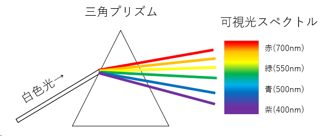
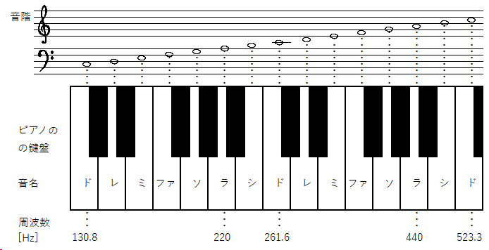
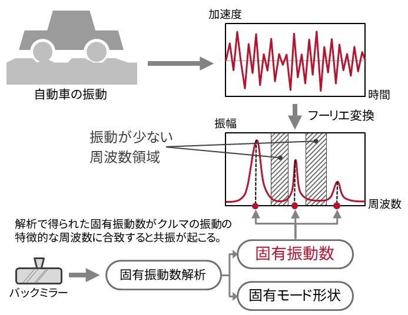
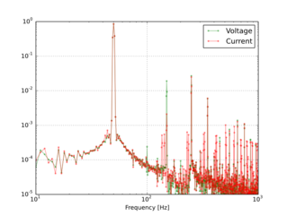
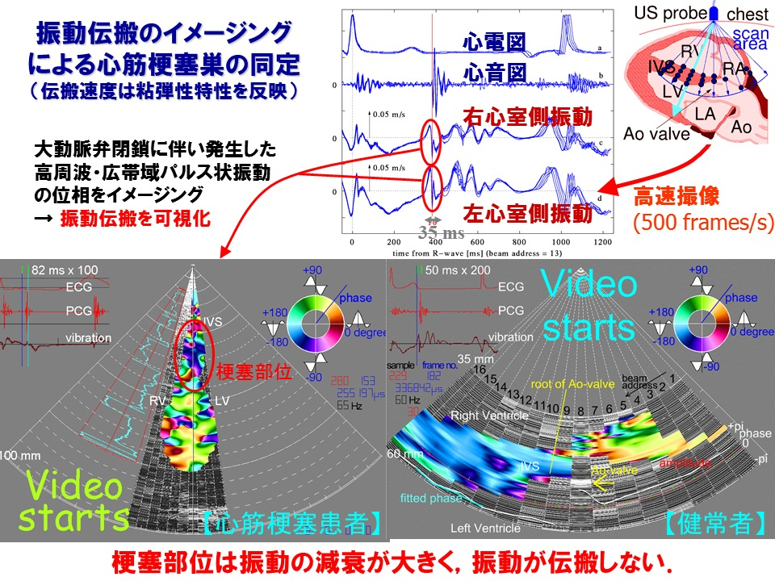

# フーリエ変換の初歩
タグ：信号処理, 工学

フーリエ変換とは、音や光などの波を分析するために使われる数学のツールです。
たとえば日光がいくつかの色に分けられるように、フーリエ変換は波をいくつかの異なる大きさや速さの成分に分けることができます。これにより、私たちが音や光の性質を理解し、さまざまな応用技術で利用することができます。

光の色と周波数の関係

CC by mitakalab

音階と周波数の関係

CC by mitakalab

# フーリエ変換の考え方

フーリエ変換は波をパズルのようにいろいろな小さな波の組み合わせに分解して解析する方法です。それぞれの小さな波は、違う大きさや速さを持っています。フーリエ変換を使うと、複雑な波を簡単に理解できるようになります。例えば、音楽の演奏をイメージしてみてください。楽器が一緒に演奏すると、それぞれの楽器から出る音が重なり合って、1つの複雑な音になります。フーリエ変換は、その複雑な音を、それぞれの楽器の音（小さな波）に分解することができます。このように、フーリエ変換は波の形や特徴を分析して理解するための手法です。

CC by mitakalab

# フーリエ変換の利用例

### 音楽・音響機器
1. 音楽制作: 音楽や音声の波形を解析して、音の高さや強さを調整できます。
2. ノイズ除去: 録音された音からノイズを取り除くために、フーリエ変換が使われます。
3. 音声認識: 音声をテキストに変換する際に、フーリエ変換が音声データを分析します。
4. 音楽情報検索: 音楽データベースから類似の曲を検索する際に、フーリエ変換が役立ちます。

### 自動車・二輪車・建築機械・鉄道車両・工作機械・航空宇宙
1. 音響測定: 騒音や振動の計測で、フーリエ変換が使われて解析が行われます。
2. 振動解析: モーターやギヤの振動を解析し、安全性や性能を評価できます。

https://monoist.itmedia.co.jp/mn/articles/2007/21/news004.html

### 建設・石油ガス・鉄道
1. 音響測定: 騒音や振動の計測で、フーリエ変換が使われて解析が行われます。
2. 振動解析: 建物や橋の振動を解析し、安全性や性能を評価できます。

https://www.dewejapan.com/applications/trans01.html

### 電力
1. 音響測定: 騒音や振動の計測で、フーリエ変換が使われて解析が行われます。
2. 振動解析: 建物や橋の振動を解析し、安全性や性能を評価できます。

エンジニア徒然草
http://mitaka1954.cocolog-nifty.com/blog/2014/08/4-2d18.html

### 通信
1. 通信技術: 携帯電話やインターネットのデータ送受信に、フーリエ変換が使われています。

https://www.plc-j.org/about_plcsys3.html

### 医療機器
1. 超音波検査: 超音波をフーリエ変換で解析することで、構造や組織を画像として映し出します。
2. CT検査: X線透過像でフーリエ変換が使われて構造や組織を調べます。

http://www.ecei.tohoku.ac.jp/~hkanai/frame-right_j.html

### 軍事
1. レーダー技術: 雷雨や航空機の位置を特定するために、フーリエ変換が使われます。
2. ソナー技術: 海中の物体や生物を探知するために、フーリエ変換が使われます。

https://www.marubun.co.jp/technicalsquare/9164/

### 地学・天文学
1. 地震学: 地震波の解析で、フーリエ変換が使われて地震の強さや震源地を特定します。
2. 天文学: 電波望遠鏡のデータ解析で、フーリエ変換が役立ちます。

https://www.data.jma.go.jp/eqev/data/kyoshin/kaisetsu/outou.html

フーリエ変換は、さまざまな分野で波形や信号を解析するために使われており、私たちの生活を豊かにしています。

# フーリエ変換の種類

フーリエ変換には、連続時間信号に適用される (1) フーリエ級数展開 と (2) 狭義のフーリエ変換、離散時間信号に適用される (3) 離散時間フーリエ変換と (4) 離散フーリエ変換(DFT）の4つの種類があります。工学・産業分野では離散フーリエ変換を高速化した (5) 高速フーリエ変換(FFT)が使われます。

* 連続時間信号に適用
  * (1) フーリエ級数展開
  * (2) 狭義のフーリエ変換
* 離散時間信号に適用
  * (3) 離散時間フーリエ変換
  * (4) 離散フーリエ変換(DFT)
    * (5) 高速フーリエ変換(FFT)

# 高速フーリエ変換(FFT)の数学的な仕組み

数学的な説明は他の方が詳しく解説しているのでそちらを御覧ください。簡単に説明するとFFTを計算すると実部、虚部、位相、振幅という数値が得られます。

* 実部と虚部は、複素数の構成要素です。FFTによって得られた周波数成分は、実部と虚部の組み合わせで表現されます。
* 位相は、周波数成分の波形の開始位置を表したもので、波の始点からどれだけ進んでいるかを表します。
* 振幅は、周波数成分の強さを表したもので、FFTによって得られた周波数成分の実部と虚部から計算されます。

FFT（高速フーリエ変換）を完全に理解する話 - Qiita

[https://qiita.com/ageprocpp/items/0d63d4ed80de4a35fe79](https://qiita.com/ageprocpp/items/0d63d4ed80de4a35fe79)

# FFTの種類と適用事例

FFT ではリニアスペクトラム、パワースペクトラム、パワースペクトラム密度、クロススペクトラム、伝達関数といった演算ができます。

* リニアスペクトラム：FFTによって得られた周波数成分をそのまま強さで表したものです。
* パワースペクトラム：リニアスペクトラムを2乗したもので、信号の強さをより明確に表現します。
* パワースペクトラム密度：パワースペクトラムを周波数帯域幅で割ったもので、正確な強さを表現します。
* クロススペクトラム：2つの信号の周波数解析を行い、それぞれの周波数成分の関係性を解析することができます。
* 伝達関数：入力信号と出力信号の周波数応答を表し、システムの特性を解析することができます。伝達関数をボード線図にすることで、システムの特性を直感的に理解することができます。

## リニアスペクトラムの適用事例
(振動解析)
(音響解析)
(電力品質の測定)

## パワースペクトラム、パワースペクトラム密度の適用事例
(騒音解析)
, JIS Z 0232の附属
) 包装貨物－振動試験方法, JIS Z 0232：2004

## クロススペクトラムの適用事例
(電力解析)

## 伝達関数の適用事例
(ボード線図)

# FFTの窓関数

FFT の窓関数とは、波の一部分を見るための「小さな窓」の役割を果たします。波を解析するとき、通常は無限に続く波を扱うことが難しいため、波の一部分だけを切り取って解析します。しかし、切り取る際に波が急に切れてしまうと、解析結果に誤差が生じることがあります。窓関数は、その誤差を減らすために使われます。窓関数を使うと、切り取る波の端を滑らかにすることができます。これにより、解析結果がより正確になります。さまざまな形の窓関数があり、それぞれ特性が異なります。例えば、矩形窓、ハン窓、ハミング窓などがあります。これらの窓関数は、それぞれ異なる特性を持っていて、解析の目的に応じて選ばれます。まとめると、窓関数は波の一部分を滑らかに切り取るための「小さな窓」であり、FFT で波を解析する際に誤差を減らす役割を果たします。

離散フーリエ変換（DFT）

「EDN Japan > FFTアナライザーの構造や窓関数の使い方」より引用

# FFT と窓関数の性能評価

FFT と窓関数の性能評価で考慮すべきパラメータは以下の通りです。

+ 計算精度（Computational Accuracy）:計算精度は、FFT が波動の特徴をどれだけ正確に計算できるかを示します。数値誤差の影響を最小限に抑えることで、より正確な波動解析が可能になります。
+ 計算速度（Computational Speed）:計算速度は、FFT がどれだけ迅速に波動の特徴を計算できるかを示します。リアルタイム信号処理や大量のデータを扱う場合、高い計算速度が求められます。
+ 周波数解像度（Frequency Resolution）:周波数解像度は、FFT が周波数成分をどれだけ細かく分解できるかを示します。高い周波数解像度を持つFFT は、複雑な波動の成分をより正確に識別できます。
+ スペクトル漏れ（Spectral leakage）:スペクトル漏れは、FFT が窓関数を適用した際に発生する誤差を示します。窓関数を適切に選択することで、スペクトル漏れを最小限に抑えることができます。
+ ダイナミックレンジ（Dynamic Range）:ダイナミックレンジは、FFT が扱える信号の最大振幅と最小振幅の比率を示します。高い動的範囲を持つFFT は、さまざまな振幅の信号を正確に扱うことができます。

これらのパラメータは、FFT の性能を総合的に評価する際に重要です。高い性能を持つFFT は、信号処理や波動解析において、より正確で迅速な結果を得ることができるため、幅広い応用分野で利用されます。

|窓関数|周波数解像度|ダイナミックレンジ|スペクトル漏れ|
|--|--|--|--|
|矩形窓（レクタンギュラ窓）|最良|悪い|悪い|
|ハン窓（ハニング窓）|良い|普通|良い|
|ハミング窓|良い|普通|普通|
|フラット・トップ窓|悪い|最良|良い|
|プラックマンーハリス窓|悪い|良い|良い|
|カイザー窓|普通|良い|良い|

# 次回予定
トラッキング解析、オクターブ解析、短時間フーリエ変換、といった実際の使用例を紹介します。

https://www.mobitec.co.jp/blog/%E8%87%AA%E5%8B%95%E8%BB%8A%E3%81%AE%E5%AE%9F%E5%83%8D%E8%A9%95%E4%BE%A1%E4%BA%8B%E4%BE%8B/

# 参考資料
音楽アプリのための音声解析入門

https://qiita.com/icoxfog417/items/d376200407e97ce29ee5

ミリ波レーダの基礎1

https://www.marubun.co.jp/technicalsquare/9164/

https://www.econet.bi/?alloisomer/2363608
