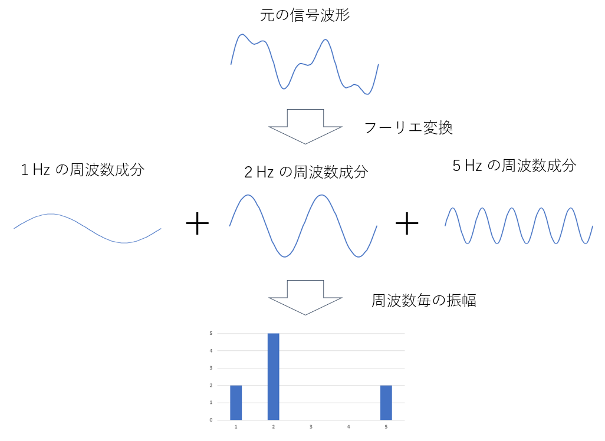

# フーリエ変換の初歩

フーリエ変換とは、音や光などの波を分析するために使われる数学のツールです。
たとえば日光がいくつかの色に分けられるように、フーリエ変換は波をいくつかの異なる大きさや速さの成分に分けることができます。これにより、私たちが音や光の性質を理解し、さまざまな応用技術で利用することができます。

光の色と周波数の関係

音階と周波数の関係

# フーリエ変換の考え方

フーリエ変換は波をパズルのようにいろいろな小さな波の組み合わせに分解して解析する方法です。それぞれの小さな波は、違う大きさや速さを持っています。フーリエ変換を使うと、複雑な波を簡単に理解できるようになります。例えば、音楽の演奏をイメージしてみてください。楽器が一緒に演奏すると、それぞれの楽器から出る音が重なり合って、1つの複雑な音になります。フーリエ変換は、その複雑な音を、それぞれの楽器の音（小さな波）に分解することができます。このように、フーリエ変換は波の形や特徴を分析して理解するための手法です。

# フーリエ変換の利用例

### 音楽・音響機器
1. 音楽制作: 音楽や音声の波形を解析して、音の高さや強さを調整できます。
2. ノイズ除去: 録音された音からノイズを取り除くために、フーリエ変換が使われます。
3. 音声認識: 音声をテキストに変換する際に、フーリエ変換が音声データを分析します。
4. 音楽情報検索: 音楽データベースから類似の曲を検索する際に、フーリエ変換が役立ちます。

### 自動車・二輪車・建築機械・鉄道車両・工作機械・航空宇宙
1. 音響測定: 騒音や振動の計測で、フーリエ変換が使われて解析が行われます。
2. 振動解析: モーターやギヤの振動を解析し、安全性や性能を評価できます。

### 建設・電力・石油ガス・鉄道
1. 音響測定: 騒音や振動の計測で、フーリエ変換が使われて解析が行われます。
2. 振動解析: 建物や橋の振動を解析し、安全性や性能を評価できます。

### 通信
1. 通信技術: 携帯電話やインターネットのデータ送受信に、フーリエ変換が使われています。

### 医療機器
1. 超音波検査: 超音波をフーリエ変換で解析することで、構造や組織を画像として映し出します。
2. CT検査: X線透過像でフーリエ変換が使われて構造や組織を調べます。

### 軍事
1. レーダー技術: 雷雨や航空機の位置を特定するために、フーリエ変換が使われます。
2. ソナー技術: 海中の物体や生物を探知するために、フーリエ変換が使われます。

### 地学・天文学
1. 地震学: 地震波の解析で、フーリエ変換が使われて地震の強さや震源地を特定します。
2. 天文学: 電波望遠鏡のデータ解析で、フーリエ変換が役立ちます。

フーリエ変換は、さまざまな分野で波形や信号を解析するために使われており、私たちの生活を豊かにしています。

# フーリエ変換の種類

フーリエ変換には、連続時間信号に適用される(1)フーリエ級数展開 と(2)狭義のフーリエ変換、離散時間信号に適用される(3)離散時間フーリエ変換と(4)離散フーリエ変換(DFT）の4つの種類があります。工学・産業分野では離散フーリエ変換をその規則性を利用して高速化した(5)高速フーリエ変換(FFT)が使われます。

* 連続時間信号に適用
  * フーリエ級数展開
  * 狭義のフーリエ変換
* 離散時間信号に適用
  * 離散時間フーリエ変換
  * 離散フーリエ変換(DFT)
    * 高速フーリエ変換(FFT)

# FFTの数学的な仕組み

他の方が解説されているのでそちらを御覧ください

A. 離散フーリエ変換(DFT)の仕組みを完全に理解する - Qiita

[https://qiita.com/TumoiYorozu/items/5855d75a47ef2c7e62c8](https://qiita.com/TumoiYorozu/items/5855d75a47ef2c7e62c8)

B. FFT（高速フーリエ変換）を完全に理解する話 - Qiita

[https://qiita.com/ageprocpp/items/0d63d4ed80de4a35fe79](https://qiita.com/ageprocpp/items/0d63d4ed80de4a35fe79)

# FFTの種類

FFTの中にも工学的な用途に応じていくつかあります。

* リニアスペクトラム
* パワースペクトラム
* パワースペクトラム密度 (Power Spectral Density)
* ESD (Energy Spectral Density)
* クロススペクトラム
* 伝達関数：ボード線図

# リニアスペクトラム
(記入予定)

# パワースペクトラム
(記入予定)

# パワースペクトラム密度
(記入予定)

# クロススペクトラム
(記入予定)

# 伝達関数
(記入予定)

# FFTの窓関数

FFT の窓関数とは、波の一部分を見るための「小さな窓」の役割を果たします。波を解析するとき、通常は無限に続く波を扱うことが難しいため、波の一部分だけを切り取って解析します。しかし、切り取る際に波が急に切れてしまうと、解析結果に誤差が生じることがあります。窓関数は、その誤差を減らすために使われます。窓関数を使うと、切り取る波の端を滑らかにすることができます。これにより、解析結果がより正確になります。さまざまな形の窓関数があり、それぞれ特性が異なります。例えば、矩形窓、ハン窓、ハミング窓などがあります。これらの窓関数は、それぞれ異なる特性を持っていて、解析の目的に応じて選ばれます。まとめると、窓関数は波の一部分を滑らかに切り取るための「小さな窓」であり、FFT で波を解析する際に誤差を減らす役割を果たします。

「EDN Japan > FFTアナライザーの構造や窓関数の使い方」より引用

# FFT の性能評価

FFT の性能評価で詳しく考慮すべきパラメータは以下の通りです。

+ 計算精度（Computational Accuracy）:計算精度は、FFT が波動の特徴をどれだけ正確に計算できるかを示します。数値誤差の影響を最小限に抑えることで、より正確な波動解析が可能になります。
+ 計算速度（Computational Speed）:計算速度は、FFT がどれだけ迅速に波動の特徴を計算できるかを示します。リアルタイム信号処理や大量のデータを扱う場合、高い計算速度が求められます。
+ 周波数解像度（Frequency Resolution）:周波数解像度は、FFT が周波数成分をどれだけ細かく分解できるかを示します。高い周波数解像度を持つFFT は、複雑な波動の成分をより正確に識別できます。
+ スペクトル漏れ（Spectral leakage）:スペクトル漏れは、FFT が窓関数を適用した際に発生する誤差を示します。窓関数を適切に選択することで、スペクトル漏れを最小限に抑えることができます。
+ ダイナミックレンジ（Dynamic Range）:ダイナミックレンジは、FFT が扱える信号の最大振幅と最小振幅の比率を示します。高い動的範囲を持つFFT は、さまざまな振幅の信号を正確に扱うことができます。

これらのパラメータは、FFT の性能を総合的に評価する際に重要です。高い性能を持つFFT は、信号処理や波動解析において、より正確で迅速な結果を得ることができるため、幅広い応用分野で利用されます。

|窓関数|周波数解像度|ダイナミックレンジ|スペクトル漏れ|
|--|--|--|--|
|矩形窓（レクタンギュラ窓）|最良|悪い|悪い|
|ハン窓（ハニング窓）|良い|普通|良い|
|ハミング窓|良い|普通|普通|
|フラット・トップ窓|悪い|最良|良い|
|プラックマンーハリス窓|悪い|良い|良い|
|カイザー窓|普通|良い|良い|
