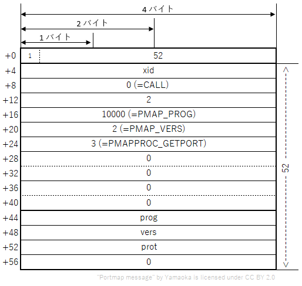
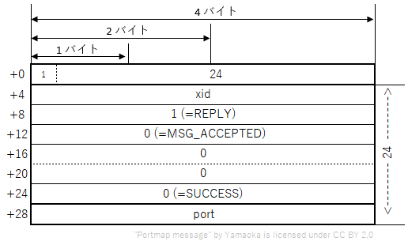

# RPCとは
タグ：C# RPC IDL UNIX Portmap 

RPC(Remote Procedure Call) とは遠隔にあるコンピュータの関数を実行するためのソフトウェアの技術です。ここでは 1990 年代に広く普及した ONC RPC（いわゆる SunRPC）の通信技術を解説します。対象読者としてイーサネットの基本（IPアドレスとTCP通信）とプログラムの基本（関数、変数、引数、戻り値）がわかる 18 歳の新人技術者を想定しています。

# RPC の背景と目的

RPC(Remote Procedure Call) は分散コンピューティング分野のソフトウェア技術です。次の目的を達成するために開発されました。
- 遠隔地にあるコンピュータや方式の異なるマシン間で透過的なデータのやり取りを可能にする
- 様々なサービスに対応できる一貫性のある環境を提供する
- 高いレベルの機能を実現しプログラマの負担を減らす


RPC の技術的な特徴は以下の通りです。
- クライアント・サーバモデル
- 関数・引数・戻り値があり、通常の関数呼び出しと同様に実行できる
- インタフェース記述言語（IDL）を使ってソースコードの自動生成ができる

1980年代以降、多くの会社が RPC を実現するためのプロトコルを策定しました。ONC RPC は 1988 年にサンマイクロシステムズが [RFC 1057: RPC: Remote Procedure Call Protocol Specification Version 2](https://www.ietf.org/rfc/rfc1057.txt) として策定しました。当時のソースコードは [4.3BSD-Reno/lib/librpc/](https://github.com/dank101/4.3BSD-Reno/tree/master/lib/librpc) で閲覧できます。
RPC プロトコルの歴史を以下に示します。

|年|企業|プロトコル名|概要|
|----|----|----|----|
|1976 年|スタンフォード研究所|RFC 707 High-Level Framework for Network-Based Resource Sharing|RPCのコンセプトの提案|
|1981 年|ゼロックス|Courier|初期の RPC プロトコルの１つ|
|1988 年|サン・マイクロシステムズ|RFC 1057 Remote Procedure Call Protocol Specification Version 2|オープンソースの Unix 向け RPC プロトコル|
|1991 年|オブジェクト・マネージメント・グループ|CORBA|オブジェクト指向言語向け RPC の仕様|
|1995 年|サン・マイクロシステムズ|RPC 1831 Remote Procedure Call Protocol Specification Version 2|RFC 1057 の仕様を洗練し、ONC RPC として再発行|
|1995 年|マイクロソフト|MS-RPC|Windows 向け RPC プロトコル|
|2003 年|サン・マイクロシステムズ|Java RMI|Java 言語向け RPC プロトコル|
|2006 年|マイクロソフト|Windows Communication Foundation|.Net 言語向け RPC プロトコル|
|2015 年|グーグル|gRPC|HTTP/2 を使った RPC プロトコル|

# 基本的な RPC のプロトコル

一般的なプログラムでの関数呼び出しは

1. 親プログラムが関数名と引数を指定して、特定の関数を呼び出す
2. その関数の処理が実行される
3. 結果の戻り値が、親プログラムに渡される

という順序で行われます。


RPC はネットワーク環境のクライアントとサーバ間の通信を、一般的な関数呼び出しのように見せることを目的としています。関数呼び出しをクライアントとサーバ間の通信に変換する手順は以下の通りです。

1. クライアント側の親プログラムは、その処理を実行する関数が自分のプログラム内に存在するかのように、特定の関数を呼び出します。
2. 呼び出した関数名、引数などは「スタブ (Stub)」と呼ばれるプログラムによって、RPC のプロトコルで定められた RPC メッセージ(callメッセージ)に組み立てられます
3. TCP や UDP といったトランスポートプロトコルによって、このメッセージがサーバ側に転送されます。
4. サーバ側のスタブ・プログラムは呼び出された関数、引数を取り出して、該当するプログラムを実際に呼び出します。
5. サーバ側でプログラムで要求された関数が実行されます。
6. 関数の実行結果が、サーバ側のスタブ・プログラムに戻され、結果を返すための RPC メッセージ(repy メッセージ)に組み立てられます
7. そのRPCメッセージがクライアント側に転送されます。
8. クライアント側のスタブ・プログラムが戻り値（結果）を取り出して、処理を依頼した親プログラムに戻します。


# ONC RPC のデータ表現

ONC RPC は異なるコンピュータ間で相互通信できるようデータの構造を XDR として規定しています。XDR の詳細仕様は [RFC 1832 XDR: External Data Representation Standard](https://www.ietf.org/rfc/rfc1832.txt) で閲覧できます。


XDR が対応しているデータ型は以下の通りです。主に C 言語のデータ型を対象としています。

|データ型|サイズ|
|----|----|
|符号付き整数型|4 バイト。|
|符号なし整数型|4 バイト。|
|列挙型|符号付き整数と同じ。|
|ブール型|列挙型と同じ。|
|ハイパー整数|8 バイト。|
|符号なしハイパー整数型|8 バイト。|
|浮動小数点型|4 バイト。|
|倍精度浮動小数点型|8 バイト。|
|固定長の任意データ型|全体のバイト数が 4 の倍数でない場合、末尾に追加の 0 が付きます。|
|可変長の任意データ型|長さを表現する4バイトのシーケンスが先頭に付きます。全体のバイト数が 4 の倍数でない場合、末尾に追加の 0 が付きます。|
|文字列|長さを表現する4バイトのシーケンスが先頭に付きます。全体のバイト数が 4 の倍数でない場合、末尾に追加の 0 が付きます。|
|固定長の配列型|各要素が 1 番目から n 番目まで並びます。|
|可変長の配列型|長さを表現する4バイトのシーケンスが先頭に付きます。各要素が 1 番目から n 番目まで並びます。|
|構造体型|構造体で宣言される順番でコード化されます。|
|区別された共用体型|共用体の区別値と実際の値の順番でコード化されます。|
|ボイド型|0 バイト|

整数型は以下のようなメモリ配置になります。


文字列型は下のようなメモリ配置になります。


# ONC RPC のデータ構造

RPC でリモートの関数を呼び出す時のフォーマットは以下の通りです。


+ LAST_FLAG：トランスポートプロトコルが TCP の場合のみ付きます。呼び出しデータが複数のメッセージに分割されているかを示します。
+ flag_header：トランスポートプロトコルが  TCP の場合のみ付きます。flag_header を除いたメッセージ全体の長さを示します。
+ xid：xid は１つの関数の呼び出しと応答で同一の値をとります。トランザクション識別子とも呼ばれます。
+ msg_type：msg_type は呼び出しメッセージか応答メッセージの区別を示します。

|値|定数名|意味|
|--|--|--|
|0|CALL|関数の呼び出し|
|1|REPLY|関数の応答|

+ rpcvers：rpcvers は RPC プロトコルのバージョンを示します。通常は 2 になります。
+ prog, vers, proc：prog（プログラム番号）, vers（バージョン番号）, proc（プロシージャ番号） の組は実行する関数を示します
+ cred.flavor, cred.body, verf.flavor, verf.body：これらはクライアント認証に関するパラメータです。認証を使わない場合、すべて 0 になります。
+ データ：関数の引数を示します。

応答を返す時のフォーマット


+ LAST_FLAG：トランスポートプロトコルが TCP の場合のみつきます。応答データが複数のメッセージに分割されているかを示します。
+ flag_header：トランスポートプロトコルが TCP の場合のみつきます。flag_header を除いたメッセージ全体の長さを示します。
+ xid：xid は応答に対応する呼び出しメッセージのトランザクション識別子を示します。
+ msg_type：msg_type は呼び出しメッセージか応答メッセージの区別を示します。

|値|定数名|意味|
|--|--|--|
|0|CALL|関数の呼び出し|
|1|REPLY|関数の応答|

+ reply_stat：RPCメッセーを受け付けたかどうかを示します。RPCバージョンが2以外の場合や認証に失敗した場合にエラーが返ります。

|値|定数名|意味|
|--|--|--|
|0|MSG_ACCEPTED|正常に実行された|
|1|MSG_DENIED|エラーが発生した|

+ accept_stat：RPC の関数を実行したかどうかを示します。以下の値をとります。

|値|定数名|意味|
|--|--|--|
|0|SUCCESS|RPCが正常に実行された|
|1|PROG_UNAVAIL|リモートがプログラムをエクスポートしていない|
|2|PROG_MISMATCH|リモートがバージョン番号をサポートしていない|
|3|PROC_UNAVAIL|プログラムがプロシージャをサポートしていない|
|4|GARBAGE_ARGS|プロシージャはパラメータをデコードできません|

+ verf.flavor, verf.body：クライアント認証の結果に関するパラメータです。認証を使わない場合、すべて 0 になります。
+ データ：関数の戻り値を示します。

# インタフェース記述言語（IDL）

RPC のプログラム開発について rpcgen という自動生成ツールが用意されています。例えばインタフェース記述言語（IDL）を使って以下のような記述をします。

```ping.x
program PING_PROG {
	/* Latest version */
	version PING_VERS_PINGBACK {
		void
		PINGPROC_NULL(void) = 0;
		/*
		 * Ping the client, return the round-trip time
		 * (in microseconds). Returns -1 if the operation
		 * timed out.
		 */
		int
		PINGPROC_PINGBACK(void) = 1;
	} = 2;
	/* Original version */
	version PING_VERS_ORIG {
		void
		PINGPROC_NULL(void) = 0;
	} = 1;
} = 1;

const PING_VERS = 2;      /* latest version */
```

rpcgen コマンドを使うと、4 つの C 言語のソースファイルが生成されます。

- ping.h：そのプログラムで使う定数、データ構造、スタブ手続きのインタフェー ス。
- ping_clnt.c：クライアント側のスタブ処理。
- ping_xdr.c：ping.x で定義したデータ構造について、整列化（マーシャリング）と非整列化（アンマーシャリング）を行なう手続き。
- ping_svc.c：サーバ側の main 関数とディスパッチ手続き。

このファイルを使う事でクライアント側とサーバ側のスタブを短時間で実装できます。


# RPC の事例：ポートマッパ

ポートマッパは RPC プログラム番号に対応する TCP または UDP のポート番号を返すサービスです。[RFC 1833: Binding Protocols for ONC RPC Version 2](https://www.ietf.org/rfc/rfc1833.txt) で規定されてます。ポートマッパ自身は TCP または UDP の 111 番ポートを使います。


## ポートマッパの関数

ポートマッパはプログラム番号 10000 の RPC として定義されています。ポートマッパは次のような機能をもちます

|関数名|プログラム番号|バージョン番号|プロシージャ番号|引数|戻り値|説明|
|----|----|----|----|----|----|----|
|PMAPPROC_NULL|10000|2|0|void|void|この関数はテスト用です。何も実行しません。|
|PMAPPROC_SET|10000|2|1|mapping 構造体|bool|ポートマッパにポート番号を登録します。|
|PMAPPROC_UNSET|10000|2|2|mapping 構造体|bool|ポートマッパに登録されているポート番号を削除します。|
|PMAPPROC_GETPORT|10000|2|3|mapping 構造体|unsigned int|対象プログラムのポート番号を返します。|
|PMAPPROC_DUMP|10000|2|4|void|pmaplist 構造体の配列|ポートマッパの登録プログラム一覧を返します。|
|PMAPPROC_CALLIT|10000|2|5|call_args 構造体|call_result 構造体|別の関数を呼び出します。|

## PMAPPROC_GETPORT のデータ構造

ポートマッパの PMAPPROC_GETPORT 関数の呼び出しメッセージを以下に示します。



各項目の説明は以下の通りです。

+ xid：一意の識別子を指定します。
+ prog, vers：ポート番号を取得したいプログラム番号とバージョン番号を指定します。
+ prot：プロトコル種別を指定します。

|値|定数名|意味|
|----|----|----|
|6|IPPROTO_TCP|TCP プロトコル|
|17|IPPROTO_UDP|UDP プロトコル|

ポートマッパの PMAPPROC_GETPORT 関数の応答メッセージを以下に示します。



各項目の説明は以下の通りです。

- xid：関数呼び出し時の識別子を示します。
- port：プログラム番号に対応する TCP または UDP のポート番号を示します。

## ソースコードの例

IDLを使わずに C# で書いた以下のファイルをご覧ください。
- [クライアント側処理](https://github.com/MitakaMakers/Ivi.Visa/blob/main/src/ClientPortmap.cs)
- [サーバ側処理](https://github.com/MitakaMakers/Ivi.Visa/blob/main/src/ServerPortmap.cs)

## ポートマッパの通信フロー

最後に ポートマッパのパケットキャプチャの例を示します。


# 参考文献
本ページの作成にあたり参照した資料を挙げます。
- [RFC 1831 RPC: Remote Procedure Call Protocol specification ersion 2](https://www.ietf.org/rfc/rfc1831.txt)
- [4.3BSD-Reno/lib/librpc/](https://github.com/dank101/4.3BSD-Reno/tree/master/lib/librpc)
- [RFC 1832 XDR: External Data Representation Standard](https://www.ietf.org/rfc/rfc1832.txt)
- [RFC 1833: Binding Protocols for ONC RPC Version 2](https://www.ietf.org/rfc/rfc1833.txt) 
- [SunRPCとNFS](https://www.coins.tsukuba.ac.jp/~yas/coins/dsys-2006/2007-01-30/)
