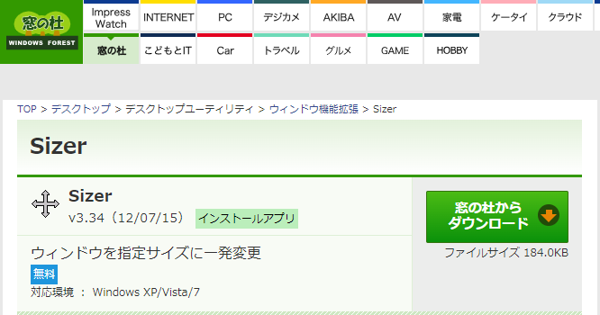
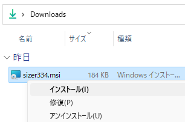
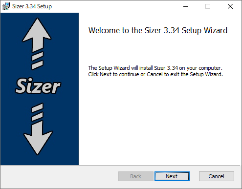
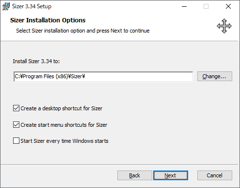
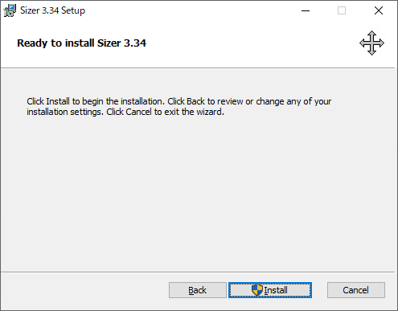
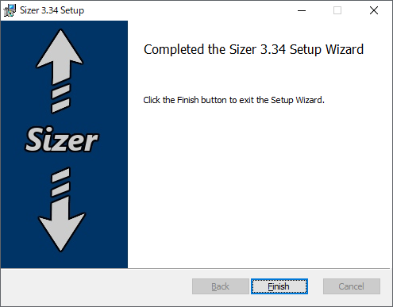
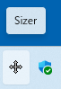
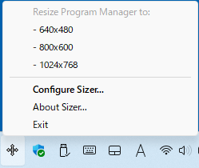
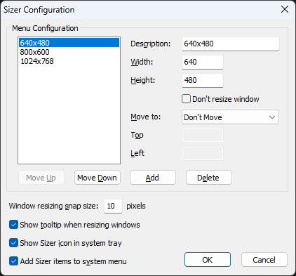

「Sizer」は Windows 向けのフリーソフトウェアです。Sizer を使うとウィンドウのサイズや位置を簡単に変えることができます。ここでは 18 歳の新人技術者向けに Sizer を紹介します。

## Sizer の目的

Sizer は以下のような目的で利用できます。

### スクリーンショットの撮影

マニュアル作成者が特定のサイズや解像度でスクリーンショットを撮影する場合、Sizerを使ってウィンドウを正確にそのサイズにリサイズすることができます。

### ウェブデザインやアプリのテスト

ウェブページやアプリが異なる画面サイズでどのように表示されるかをデザイナーが確認する際、Sizerを使ってウィンドウのサイズを変更してテストすることができます。

### マルチタスク作業

複数のアプリケーションやドキュメントを同時に開いて作業する場合、Sizerを使うと、各々のウィンドウを簡単に特定のサイズや位置に調整することができ、作業効率を向上させることができます。

## Sizer のシステム要件

Sizer は以下の環境で動作します

オペレーティングシステム：Windows XP, Vista, 7

Windows 10, 11 でも動作します。
ごくたまにサイズ変更できない（作りがよくない）アプリケーションがあるため、公式には 10, 11 を非対応としています。ここでは Windows 11 を例にして、インストール方法と使い方を紹介します。

## Sizer のインストール方法

窓の杜の Sizer の紹介ページにアクセスし、「窓の杜からダウンロード」をクリックします。

[窓の杜 > デスクトップ > デスクトップユーティリティ > ウィンドウ機能拡張 > Sizer](https://forest.watch.impress.co.jp/library/software/sizer/)

## Sizer のインストール方法

窓の杜の Sizer の紹介ページにアクセスし、「窓の杜からダウンロード」をクリックします。

[窓の杜 > デスクトップ > デスクトップユーティリティ > ウィンドウ機能拡張 > Sizer](https://forest.watch.impress.co.jp/library/software/sizer/)

インストーラをダウンロードしたら、ファイルを実行します

インストーラのセットアップ画面が表示されたら「Next」をクリックします。

インストーラのオプション画面が表示されたら「Next」をクリックします。

インストールの準備ができたら「Install」をクリックします。  

インストールが完了したら「Finish」をクリックします。  

## Sizer の使い方

次に Sizer の使い方を説明します。

Sizerを起動すると、システムトレイにアイコンが表示されます。

適当なウィンドウンのタイトル領域を右クリックすると、Sizerのツールチップが表示されます。ツールチップからサイズを選択すると、ウィンドウの大きさがそのサイズに変わります。

システムトレイにある Sizer のアイコンを右クリックし、「Configure Sizer」を選択すると、設定ダイアログが表示されます。

設定ダイアログでは、新しいエントリを追加したり、既存のエントリを編集することができます。

|項目名|説明|
|---|---|
|Description|設定名|
|Width|ウィンドウの幅|
|Height|ウィンドウの高さ|
|Don't resize window|ウィンドウのサイズを変更しない|
|Move to|ウィンドウの移動|
|Move Up|エントリを上に移動する|
|Move Down|エントリを下に移動する|
|Add|エントリを追加する|
|Delete|エントリを削除する|
|Window resizing snap size|ウィンドウのサイズ変更スナップサイズ|
|Show tooltip when resizing windows|ウィンドウのサイズ変更時にツールチップを表示する|
|Show Sizer icon in system tray|システム トレイにサイザ アイコンを表示する|
|Add Sizer items to system menu|システムメニューにサイザーの項目を追加する|

## まとめ

Sizer のようなツールは、特定のタスクを効率的に行うための補助的な役割を果たします。ウィンドウのサイズや位置の調整が頻繁に必要な作業を行う場合、このようなツールが非常に便利です。
