# 無料パソコン録画ソフト ScreenToGif の使い方

「ScreenToGif」は Windows 向けのフリーソフトウェアです。画面の一部分を切り取ってGIFアニメーションとして保存することができます。ここでは 18 歳の新社会人向けに ScreenToGif を紹介します。

## ScreenToGif の目的

ScreenToGif は以下のような用途で使われます。

### ソフトウェアのデモや簡単なチュートリアルの作成

トレーニングの資料を作成する際、ソフトウェアの操作の手順やプロセスを視覚的に示すために使うことができます。

### ソフトウェアの不具合の報告

ソフトウェアの不具合を連絡する際に、画面の動きを言葉で説明する代わりに使うことができます。

### ブログ記事のコンテンツの作成

ウェブサイトのコンテンツに動的な要素を追加するために、短いGIFアニメーションを作成することができます。

## ScreenToGif のインストール方法

ScreenToGif の公式ページにアクセスし「インストーラー」をクリックします。

[https://www.screentogif.com/](https://www.screentogif.com/)

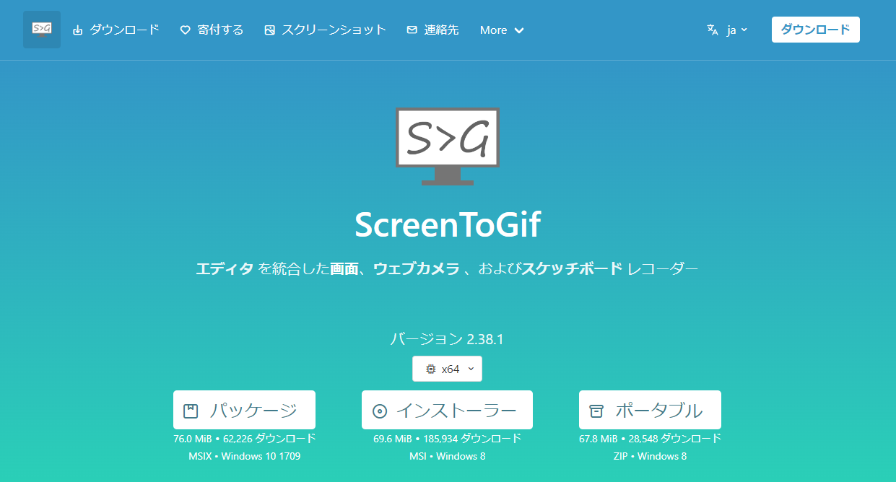

インストーラをダウンロードしたら、ファイルを実行します

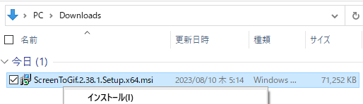

インストーラのセットアップ画面が表示されたら「次へ」をクリックします。

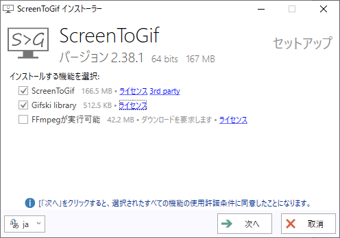

インストーラのオプション画面が表示されたら「インストール」をクリックします。

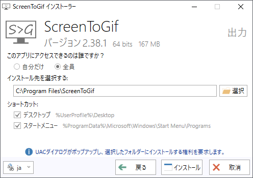

UAC ダイアログが表示されたら、OKをクリックします

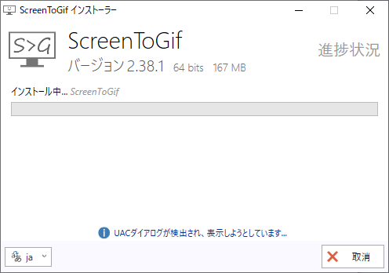

インストールが完了したら「完了」をクリックします。  

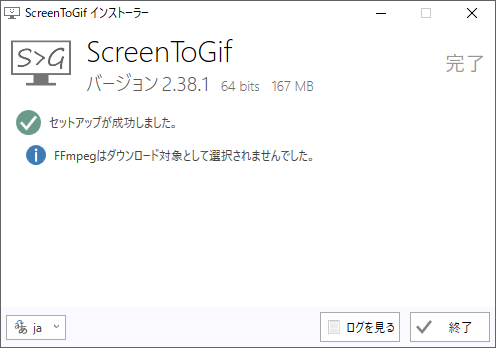

## ScreenToGif の使い方

ScreenToGif の使い方を説明します。

ScreenToGifを起動して、「レコーダー」ボタンをクリックします。

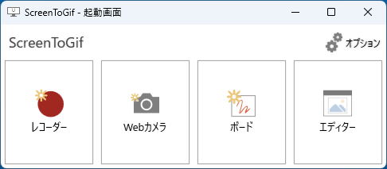

穴の開いたウィンドウが表示されます。記録したいものに合わせます。

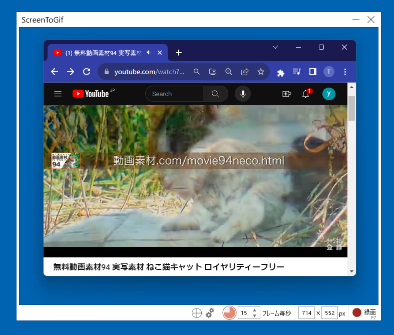

フレームレート（フレーム毎秒）を調整し、「記録」ボタンをクリックします。フレームレートは少なければ少ないほどファイルサイズが小さくなります。その分カクカクするので

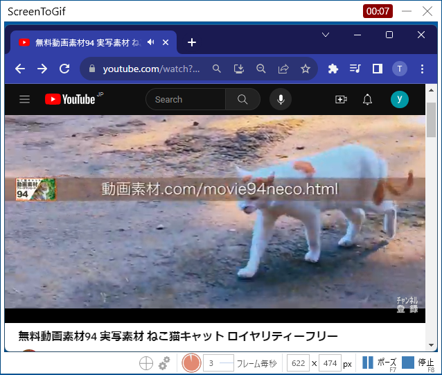

録画が終わったら、「停止」ボタンをクリックします。終了ボタンをクリックして停止します。

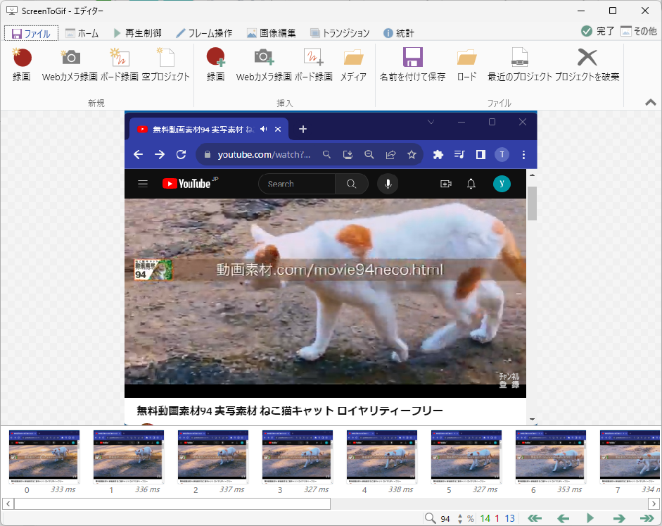

エディターで必要に応じて編集を行い、GIFファイルとして保存します。

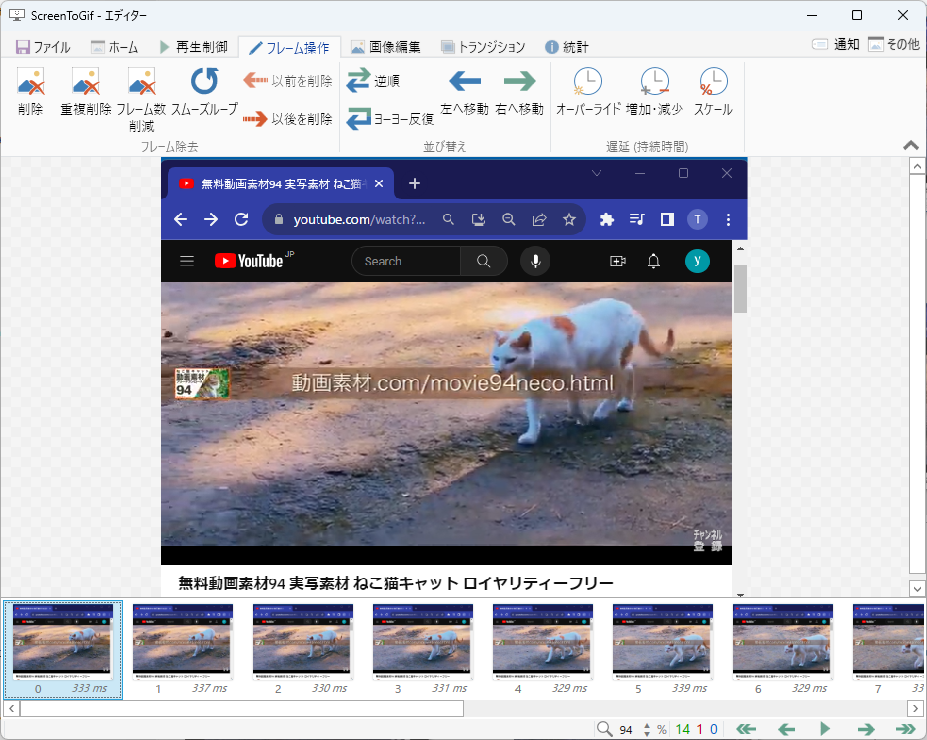

保存した GIF ファイルは画像ビューワやブラウザで再生できます。

## さいごに

ScreenToGif は多機能でありながら直感的でユーザーフレンドリーなツールです。ScreenToGif を使うと特定のタスクや操作を他の人と簡単に共有できます。
