# 3 分でわかるパソコン録画ソフト ScreenToGif の使い方
tag: screentogif フリーソフト　録画

「ScreenToGif」は Windows 向けのフリーソフトウェアです。画面の一部分を切り取ってGIFアニメーションとして保存することができます。ここでは「情報I」を履修した高校生向けに ScreenToGif を紹介します。

## ScreenToGif の目的

ScreenToGif は以下のような用途で使われます。

### ソフトウェアのデモや簡単なチュートリアルの作成
ソフトウェアのトレーニングの資料を作成する際、操作の手順や表示内容を視覚的に示すために使うことができます。

### ソフトウェアの不具合の報告
ソフトウェアの不具合を伝える際に、画面の動きを説明するために使うことができます。

### ブログ記事のコンテンツの作成
ウェブサイトのコンテンツに動的な要素を追加するために、短いGIFアニメーションを作成することができます。

## ScreenToGif のシステム要件
ScreenToGif Version 2.38.1 は以下の環境で動作します

- オペレーティングシステム: Windows 7, 8, 8.1, 10, 11
- .NET Framework: .NET Framework 4.6.1 またはそれ以降。

ここでは Windows 11 と ScreenToGif Version 2.38.1 を例にして、インストール方法と使い方を紹介します。

## ScreenToGif のインストール方法

ScreenToGif の公式ページにアクセスします。ダウンロードページが表示されたら、「インストーラー」をクリックします。

[https://www.screentogif.com/](https://www.screentogif.com/)

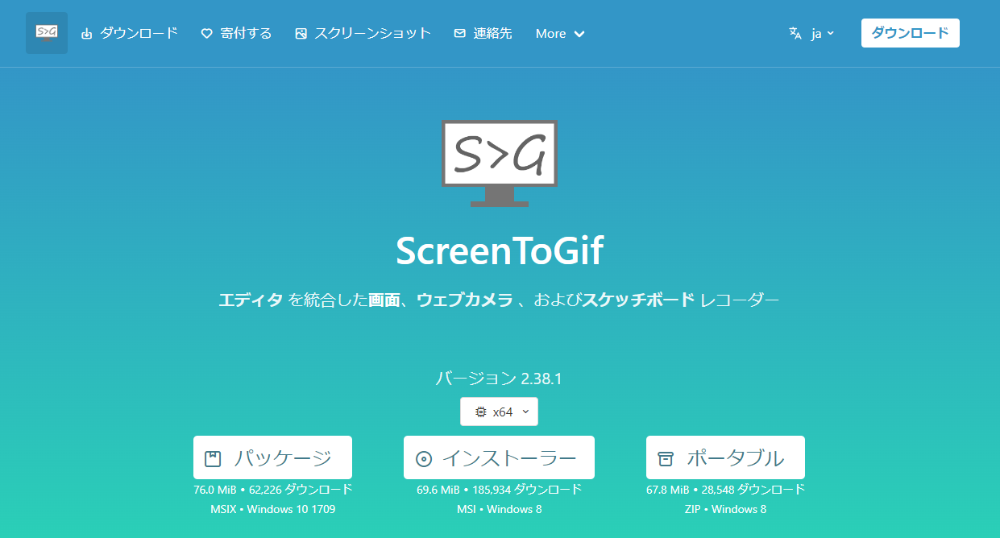

インストーラをダウンロードしたら、ファイルを実行します

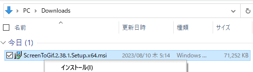

インストーラのセットアップ画面が表示されたら、「次へ」をクリックします。

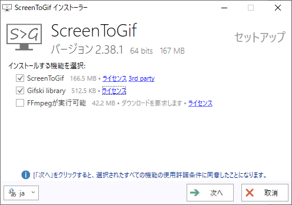

インストーラのオプション画面が表示されたら、「インストール」をクリックします。

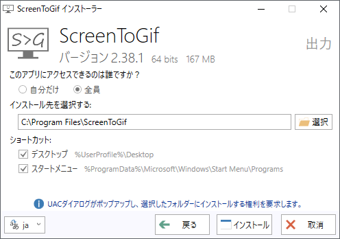

UAC ダイアログが表示されたら、OKをクリックします

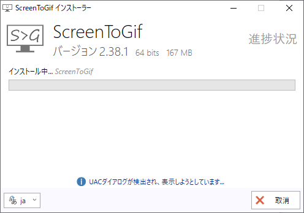

インストールが完了したら、「完了」をクリックします。  

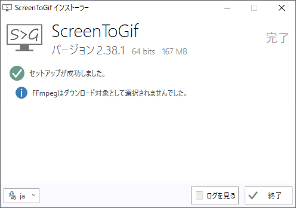

# ScreenToGif の使い方

ScreenToGif の使い方を説明します。

ScreenToGifを起動して、「レコーダー」ボタンをクリックします。

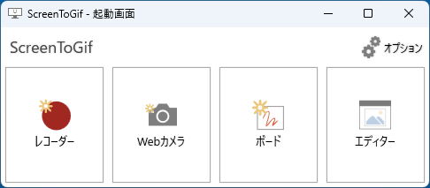

穴の開いた録画ウィンドウが表示されます。記録したいものに位置を合わせます。録画ウィンドウの下部にある丸十字のアイコンを任意のウィンドウにドラッグすると、そのアプリケーションの位置に録画ウィンドウが移動します。

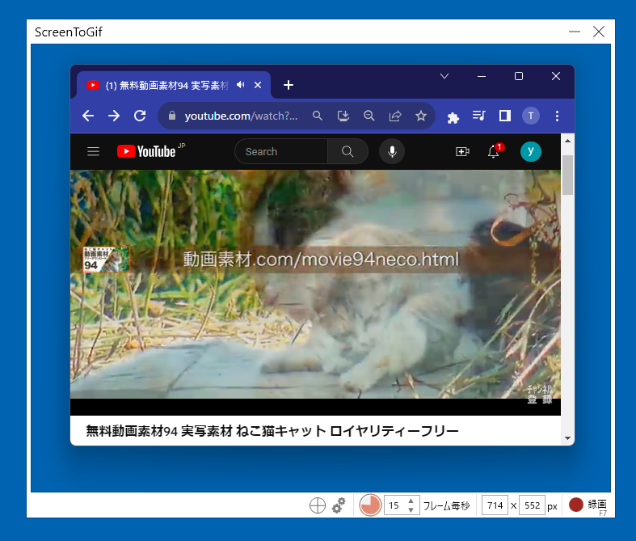

フレームレート（フレーム毎秒）を調整し、「記録」ボタンをクリックします。フレームレートは少なければ少ないほどファイルサイズが小さくなります。その分再生時に粗くなるので、対象に適した数値を指定してください。

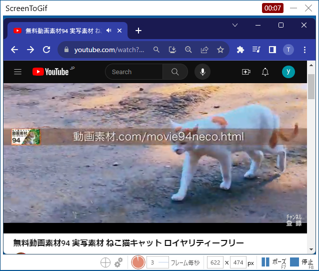

記録が終わったら、「停止」ボタンをクリックします。

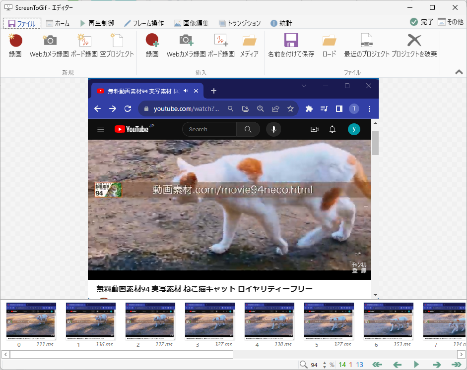

必要に応じて動画を編集します。メニューの「フレーム操作」から録画したフレームを切り貼りしたり、メニューの「画像編集」から画像に効果を付けることができます。

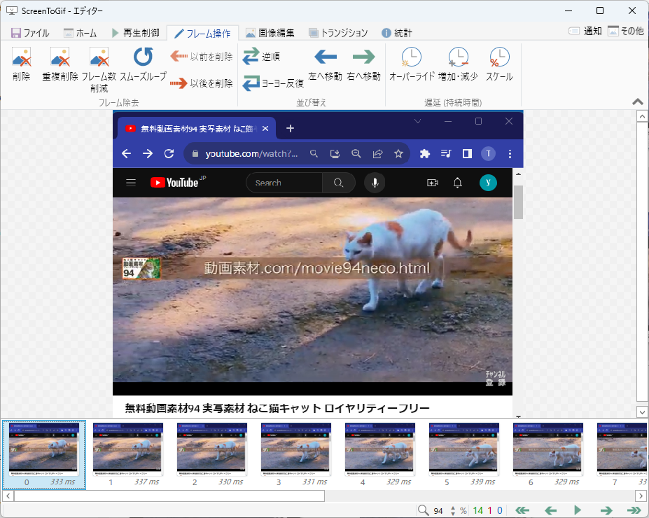

主な編集機能を以下に示します。

|項目|説明|
|---|---|
|削除|指定されたフレームを削除します|
|以前を削除|指定されたフレームより前のフレームを全て削除します|
|以後を削除|指定されたフレームより後のフレームを全て削除します|
|オーバーライド|フレームの再生間隔を変更します|

編集が終わったら、「ファイル」メニューから、ファイルに保存します。

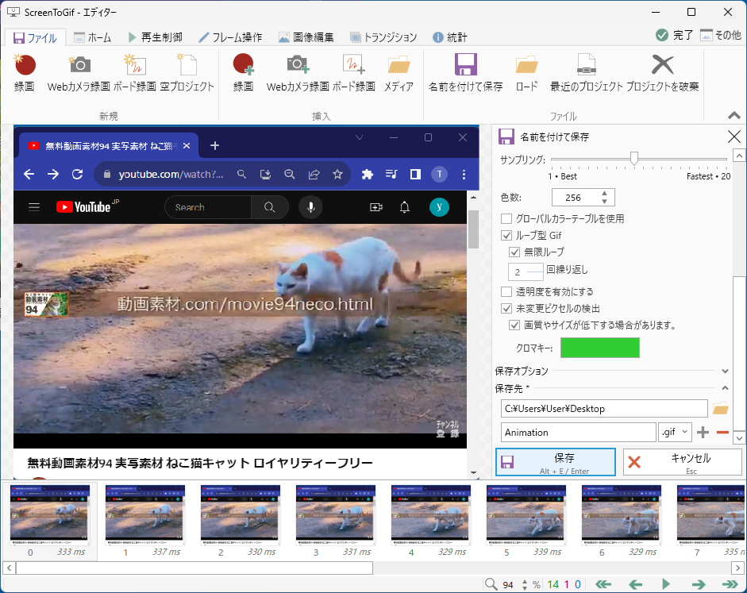

Gif ファイル保存時の主な設定項目は以下の通りです。初期値のままで問題ありません。

|項目|説明|初期値|
|---|---|---|
|サンプリング|データ圧縮の強さ|10|
|色数|使う色数（最大256色）|256|
|グローバルカラーテーブルを使用||  |
|ループ型 Gif|ループ再生するか|有効|
|無限ループ|無限ループするか|有効|
|繰り返し回数|ループする回数|2|
|透明度を有効にする|透過色を有効にするか||
|未変更ピクセルの検出|データ圧縮のオプション|有効|
|画質やサイズが低下する場合があります|データ圧縮のオプション|有効|
|クロマキー|100% 透明にする色|赤50緑205青50α255|
|保存先フォルダ|出力先フォルダ|デスクトップ|
|保存先ファイル名|出力ファイル名|Animation|

保存した GIF ファイルは画像ビューワやブラウザで再生できます。

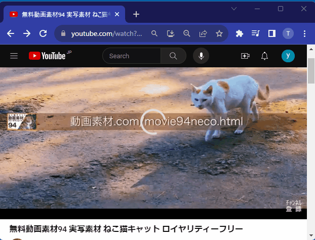

## さいごに

ScreenToGif は多機能でありながら直感的でユーザーフレンドリーなツールです。ScreenToGif を使うと特定のタスクや操作を他の人と簡単に共有できます。