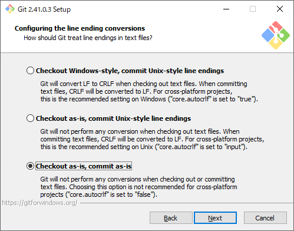

# 5 分でわかるGit for Windows のインストール手順
tag: git for windows tortoisegit 新人エンジニア向け 新人教育

Git はファイルの変更を効率的に管理するための「バージョン管理システム(VCS)」の一種です。プログラム開発する際のソースファイルの変更履歴を管理するために Git は役立ちます。

この記事では、18 歳の新人エンジニア向けに「Git for Windows」と「TortoiseGit」をインストールする手順を説明します。

##  Git for Windows と TortoiseGit をインストールする目的

Windows に Git for Windows と TortoiseGit をインストールすると以下の機能が使えるようになります。

### Windows 環境で Git が使えるようになる
Git は 元々 Linux システムのために開発されました。Git for Windows をインストールすると、Windows ユーザーもコマンドラインから Git の全機能を利用することができます。

### グラフィカルなインターフェースを使えるようになる
コマンドラインベースの操作は一部のユーザーには難しく感じられます。TortoiseGit をインストールすると Git for Windows の機能をグラフィカルなインターフェースで直感的に利用できるようになります。

### 統合されたシェル拡張を使えるようになる
TortoiseGit は Windows Explorer に統合されたシェル拡張を提供します。これにより、ファイルやディレクトリを右クリックするだけで Git に関する操作を行うことができます。

##  Git for Windows と TortoiseGit のシステム要件

Git for windows v2.41.0.3 は以下の環境で動作します。

- オペレーティングシステム: Windows 7 SP1, 8, 8.1, 10, 11
- アーキテクチャ: 32ビットと64ビットの Windows に対応しています。
- 必要なディスクスペース: インストールには通常　100MB　程度の空き容量が必要です

TortoiseGit 2.14.0 は以下の環境で動作します。

- オペレーティングシステム: Windows 7 SP1, 8, 8.1, 10, 11
- アーキテクチャ: 32ビット(通常は「x86」と表示される)と64ビット(通常は「x64」と表示される)と ARM64 ビット(通常は「ARM64」と表示される)のWindowsに対応しています。
- Git for Windows: TortoiseGitはGit for Windowsに依存しているため、これを先にインストールする必要があります。

ここでは Windows 11 と Git for windows v2.41.0.3、TortoiseGit 2.14.0 を例にして、それぞれのインストール手順を紹介します。

## Git for Windows のインストール手順

 Git for Windows の公式ページにアクセスします。ダウンロードボタンが表示されたら、「Download」をクリックします。

インストーラをダウンロードしたら、ファイルを実行します。

ライセンスの承諾画面が表示されたら、「Next」をクリックします。

インストール先フォルダの確認画面が表示されたら、「Next」をクリックします。

インストールする機能の選択画面が表示されたら、「Next」をクリックします。ちなみに初期値は以下の通りです。

|初期値|項目|説明|
|---|---|---|
|  |Additional icons|アイコンを追加する|
|  | On the Desktop|デスクトップにアイコンを追加する|
|有効|Windows Explorer integration|Windows エクスプローラーと統合する|
|有効| Open Git Bash here|コンテキストメニューに「Git Bash here」を追加する|
|有効| Open Git GUI here|コンテキストメニューに「Git GUI here」を追加する|
|有効|Git LFS (Large File Support)|Git LFS（ラージファイルサポート）|
|有効|Associate .gi* configuration files with the default text editor|.git 設定ファイルをデフォルトのテキストエディタに関連付ける|
|有効|Associate .sh files to be run with Bash|Bash で実行する .sh ファイルを関連付ける|
|  |Check daily for Git for Windows updates|Windows for Git の更新を自動的にチェックする|
|  |Add a Git Bash Profile to Windows Terminal|Windows ターミナルに Git Bash プロファイルを追加する|
|  |Scalar (Git add-on to manage large-scale repositories)|Scalar を有効にする|

スタートメニューのフォルダ名の確認画面が表示されたら、「Next」をクリックします。

Git コマンドで使うテキストエディタの選択画面が表示されたら、「Next」をクリックします。ちなみに選択できる項目は以下の通りです。

初期ブランチ名の選択画面が表示されたら、「Next」をクリックします。

PATH 環境変数の選択画面が表示されたら、「Next」をクリックします。

SSH クライアントの選択画面が表示されたら、「Next」をクリックします。

HTTPS 転送に使うライブラリの選択画面が表示されたら、「Next」をクリックします。

改行コードの取り扱いの選択画面が表示されたら「Checkout as-is, commit as-is」を選択し、「Next」をクリックします。

|初期値|項目|説明|
|---|---|---|
|有効|Checkout Windows-style, commit Unix-style line endings|Windows スタイルのチェックアウト、Unix スタイルの改行コードのコミット|
|↓|Checkout as-is, commit Unix-style line endings|そのままチェックアウト、Unix スタイルの改行をコミット|
|これを選択|Checkout as-is, commit as-is|そのままチェックアウト、そのままコミット|

Git Bash で使う端末ソフトの選択画面が表示されたら、「Next」をクリックします。

git pull コマンドの動作の選択画面が表示されたら、「Next」をクリックします。

ログイン認証に使うソフトの選択画面が表示されたら、「Next」をクリックします。

拡張機能の選択画面が表示されたら、「Next」をクリックします。

実験的な機能の選択画面が表示されたら、「Next」をクリックします。

インストールが完了画面が表示されたら、「Finish」をクリックします。

## Git for Windows のインストール確認

インストールが完了したら Windows のコマンドプロンプトを開き、「git --version」 と入力し、Gitのバージョンが表示されることを確認します。

## TortoiseGit のインストール:

TortoiseGit の公式ページにアクセスします。TortoiseGit 本体と Language Pack をダウンロードをダウンロードします。あなたの Windows が 32 ビットか 64 ビットかによって、適切なバージョンを選択する必要があります。

２つのファイルをダウンロードしたら、まず TortoiseGit 本体のインストーラを実行します。

インストーラのセットアップ画面が表示されたら、「Next」をクリックします。

ライセンスの承諾画面が表示されたら、「Next」をクリックします。

インストールする機能の選択画面が表示されたら、「Next」をクリックします。

インストールの確認画面が表示されたら、「Install」をクリックします。

インストールの完了画面が表示されたら、「Finish」をクリックします。

TortoiseGit の言語選択画面が表示されたら、このまま Language Pack のインストール作業を行います。

ダウンロードした Language Pack のインストーラを実行します。

インストーラのセットアップ画面が表示されたら、「次へ」をクリックします。

インストールの完了画面が表示されたら、「完了」をクリックします。

TortoiseGit の言語選択画面に戻り、「Refresh」ボタンをクリックします。Language リストで「日本語」を選択し、「次へ」をクリックします。

「TortoiseGit へようこそ」画面が表示されたら、「次へ」をクリックします。

「Git.exe を設定」画面が表示されたら、「次へ」をクリックします。

「ユーザー情報を設定」画面が表示されたら、名前とメールアドレスを入力し、「次へ」をクリックします。ここで設定した名前とメールアドレスは Git のコミットログに記録されます。

「認証/資格情報ストア」画面が表示されたら、「完了」をクリックします。

以上で TortoiseGit のインストールと初期設定の完了です。

## TortoiseGit のインストール確認

任意のフォルダを右クリックして、コンテキストメニューに TortoiseGit のメニューが追加されていることを確認します。

これで、Windows 環境に Git for Windows と TortoiseGit がインストールされ、Git を利用できるようになります。
