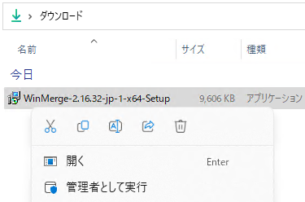

# 2 分でわかるファイル比較ソフト WinMerge の使い方
tag: 初心者向け 新人プログラマ応援 新人教育 WinMerge 
「WinMerge」は、ファイルやディレクトリの比較・マージを行うためのフリーソフトウェアです。プログラミングやドキュメント作成の分野で、複数のバージョンのファイルを比較したり、変更点をマージする際に役立ちます。ここでは 18 歳の新入社員向けに WinMerge を紹介します。

## WinMerge の目的

WinMerge は以下のような用途で使われます。

### ファイルの差分比較
2つのテキストファイルの違いや変更点を視覚的に比較し、確認できます。変更点は色分けされてハイライトされ、一目でどこが違うのかがわかります。

### ディレクトリの比較
2つのディレクトリ（フォルダ）の内容を比較し、その中のファイルやサブディレクトリの違いを特定できます。また、必要に応じてディレクトリ間でのファイルの同期やマージも行えます。

### 変更内容のマージ
差分を検出した後、必要な変更を片方のファイルからもう片方のファイルへと手動でマージすることができます。

これらの特徴により、プログラマー、システム管理者、文書作成者など、多岐にわたるユーザーが、ファイルやディレクトリ間の変更点を迅速に確認するためにWinMergeを使っています。

## WinMerge の使い方

WinMerge は以下の環境で動作します。
- オペレーティングシステム: Windows XP, Vista, 7, 8, 10, 11
- ハードディスクの空き容量: 10MB以上の空き容量（実際のインストールサイズはバージョンや構成により異なる）

ここでは Windows 11 を例にして、インストール方法と使い方を紹介します。

## WinMerge のインストール方法

窓の杜の Sizer の紹介ページにアクセスし、OS のバージョンに合ったインストーラをダウンロードします。

[窓の杜 > 学習・プログラミング > プログラミング > 開発支援 > WinMerge](https://forest.watch.impress.co.jp/library/software/winmerge/)

インストーラをダウンロードしたら、ファイルを実行します

インストーラのセットアップ画面が表示されたら、「次へ」をクリックします。

インストール先の指定画面が表示されたら、「次へ」をクリックします。

インストールする機能の選択画面が表示されたら、「次へ」をクリックします。

プログラムグループの選択画面が表示されたら、「次へ」をクリックします。

追加する機能の選択画面が表示されたら、「次へ」をクリックします。

3方向マージの選択画面が表示されたら、「次へ」をクリックします。

確認画面が表示されたら、「インストール」をクリックします。

情報画面が表示されたら、「次へ」をクリックします。

情報画面が表示されたら、「完了」をクリックします。

WinMerge が起動したら、インストール完了です。

