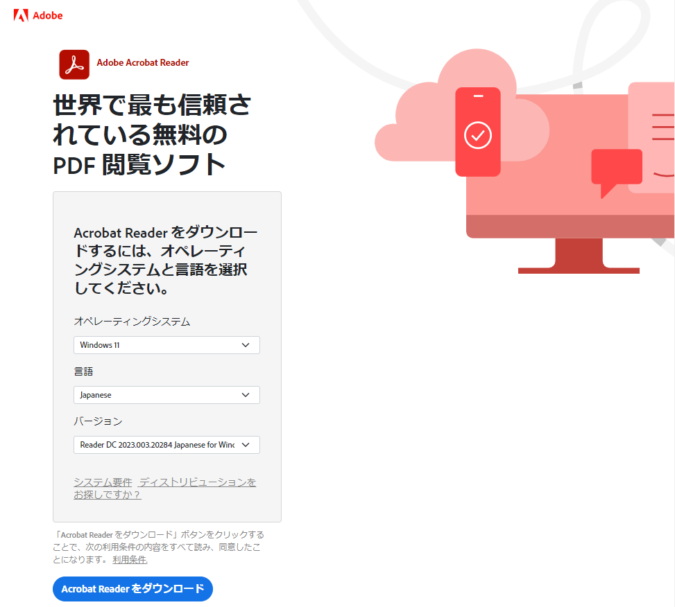
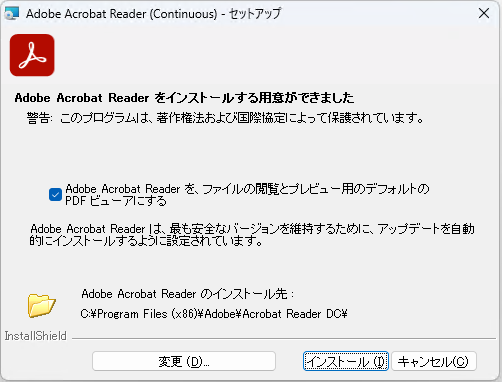
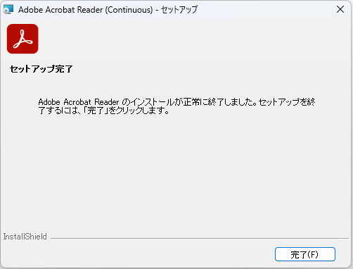
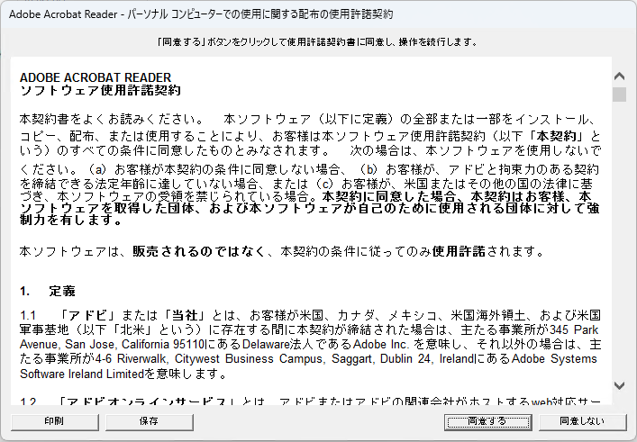

# 1 分でわかるオフライン環境での Adobe Acrobat Reader のインストール
tag: Acrobat Reader 初心者向け 新人教育

「Adobe Acrobat Reader」は無料の PDF ファイルの表示ソフトウェアです。この記事では 16 歳の高校生向けに Adobe Acrobat Reader DC のオフラインインストール手順と使い方を紹介します。

## Adobe Acrobat Reader の目的
Adobe Acrobat Reader は以下のような用途で使われます。

### PDFファイルの閲覧
Adobe Acrobat Reader は、PDF 形式で作成された文書や書類を正確に表示するための主要なツールとして広く認識されています。ユーザーは、電子ブック、研究論文、報告書、取扱説明書など、さまざまな PDF 文書を読むためにこれを使用します。

### 注釈とマークアップ
Adobe Acrobat Reader を使って、PDF に直接ノートを追加したり、テキストをハイライト、下線付け、取り消し線を引いたりすることができます。

### PDFフォームの入力と署名
Adobe Acrobat Reader を使用すると、PDF に組み込まれたインタラクティブなフォームフィールドに情報を入力したり、文書に電子署名を追加したりすることができます。

これらの目的のために、Adobe Acrobat Reader は個人、学生、ビジネスプロフェッショナル、教育機関など、さまざまなユーザー層に利用されています。

## Adobe Acrobat Reader DC のシステム要件

2023年8月時点の Adobe Acrobat Reader DC のシステム要件は以下の通りです。

- オペレーティングシステム: Windows 11（64 ビット)、Windows 10（32 ビットおよび 64 ビット）バージョン 1809 以降、Windows 8、8.1（32 ビットおよび 64 ビット）†、Windows 7 SP1（32 ビットおよび 64 ビット）、または Windows Server 2008 R2（64 ビット）、2012（64 ビット）、2012 R2（64 ビット）†、2016（64 ビット）、または 2019（64 ビット）
- プロセッサ: 1.5GHz またはより速いプロセッサ
- RAM: 2GBのRAM
- ハードドライブの空き容量: 450MB
- 画面解像度: 1024x768
- Internet Explorer 11

ここでは Windows 11 とオフラインインストーラを使って、Adobe Acrobat Reader DC をインストールする手順を説明します。

## Adobe Acrobat Reader DC のインストール方法

Adobe Acrobat Reader DC の公式ページにアクセスします。ページが表示されたら、OS、言語、バージョンを選択し、「Acrobat Reader をダウンロード」をクリックします。

[https://get.adobe.com/jp/reader/enterprise/](https://get.adobe.com/jp/reader/enterprise/)

ダウンロードが完了したら、インストーラを実行します。

インストーラのセットアップ画面が表示されたら、「インストール」をクリックします。

インストールが完了したら、「完了」をクリックします。  

Adobe Acrobat Reader DC を初めて起動すると使用許諾契約の同意画面が表示されます。「同意する」をクリックします。

## 便利な使い方

Web ブラウザーで PDF ファイルを開くと、デフォルトで PDF ファイルの最初のページが表示されます。 以下の 2 つの方法のいずれかを使用することで、特定のページでPDF ファイルが開かれます。

リンクの URL の末尾に「#page=[ページ番号]」を追加する。

http://www.example.com/myfile.pdf#page=4

リンクの URL の末尾に #[移動先名] を追加する。

http://www.example.com/myfile.pdf#glossary