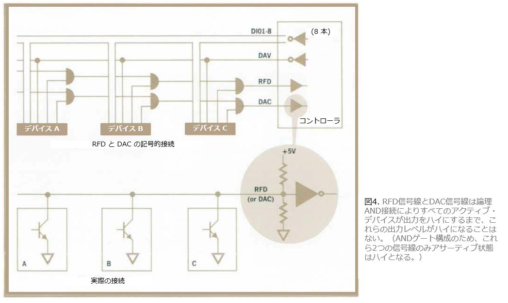

# GP-IB の最初の論文を読む

GP-IB は Hewlett-Packard 社によって HP-IB として開発され、後に IEEE によって IEEE 488 GP-IB 規格として採用された、電子計測器のための通信インタフェースです。HP-IB は 1972 年に革新的な技術標準として登場し、以後半世紀にわたり数多くの機器とシステムをつなぐ基盤となってきました。このページでは、[1972 年に HP 社の技術広報誌](https://www.hpl.hp.com/hpjournal/pdfs/IssuePDFs/1972-10.pdf)で発表された HP-IB の最初の論文の日本語訳を掲載します。この論文を読むと GP-IB の基本原理、目的、歴史的背景を知ることができます。技術者、学生、研究者、そして歴史愛好家にとって参考になれば幸いです。

# １. 電子計測器のための実用的なインタフェースシステム
[ジェラルド・E・ネルソン、デビッド・W・リッチ 著, HP ジャーナル 1972年10月号](https://www.hpl.hp.com/hpjournal/pdfs/IssuePDFs/1972-10.pdf#page=2)

## アジェンダ
デジタル制御のシステムに電子計測器を接続するにはケーブルをつなぐだけでよい。この記事ではこれを可能にするインタフェース システムについて説明します。

## はじめに
　現代の技術によってますます複雑な電子機器が生み出されるようになり、エンジニアはこれらの機器を経済的にテストするためには、自動化システムに頼らざるを得ないことがわかってきた。そして、試験手順を自動化することで、エンジニアはますます機器の相互接続に関わるようになる。計測器とデジタル機器の相互接続で経験する多くの問題を克服するために、新しいインタフェースシステムが定義された。このシステムはシステムの相互接続に新たな容易さと柔軟性を与えます。研究室のベンチや大規模システムで使用する機器の相互接続が経済的な観点からも実用的になりました。このインタフェースシステムは、デジタル処理回路を低価格の機器に設計するという時代の流れの一環として発展した。現在では、計算機、電卓、カプラ等で使用される I/O 回路カードが担っていた機能は、測定器自体が担っている。パッシブ・ケーブリングはコンピュータやカプラのバックプレーン・バスがI/Oカードを結びつけるのと同じように、並列に並んだシステム・コンポーネントを共通の通信構造に結びつける。ケーブル配線はシステムの唯一の外部部分である。理由は後述するが、このシステムは非公式にASCII互換インタフェースバスシステムと呼ばれている。この新しいシステムで、さまざまな機器、レコーダ、表示装置、計算機やコンピューターを相互接続するのは単にケーブルを差し込むだけでよい。ケーブルコネクターは、並列に積み重ねることもできるし（[図1）、物理的な配置に最適な方法でケーブルをデイジーチェーン接続することもできる。システムの "オーバーヘッド "は大幅に削減される。システム構成の変更はデバイスの追加や交換、ケーブルの再接続程度で済む；既存の機器ハードウェアの改造は必要ない。このシステムの大きな特徴は、情報の流れに柔軟性があることだ。すべての機器が並列に接続されているため、どの機器も他の機器と直接会話することができる（図2）。 コンピュータは情報の流れを管理するために必要なものではない。 ある装置で別の装置を制御したり、安価なカードリーダで一群の装置を制御したりすることができるため、費用が問題となっていたベンチ用や生産用の装置を自動化することが経済的に可能になる。より複雑な操作のために電卓やコンピュータをシステムに組み込むことも、以前よりはるかに簡単になっている。

## 信号線の本数は？
インタフェースシステムは、バスに15本の信号線を使用している。すべてのデータと制御情報をシリアル形式で伝送するのであれば、1本で済んだかもしれないが、それでは実装が複雑すぎる。一方、すべてをパラレル形式で伝送するのに十分な信号線は、テレプリンターのようなキャラクタ・シリアル・デバイスとの互換性がないばかりか、あまりに煩雑であっただろう。例えば、HPの3330B型自動シンセサイザは完全な並列制御のために約100本の信号線が必要だった。新しいインタフェースシステムは、8ビットのバイト情報を並列に伝送し、バイトをシリアルに伝送するバイト・シリアル方式を採用している。バイト・シリアル方式に必要な回路要件は控えめである一方、ケーブル配線が煩雑になるほどの回線数はない。 バイト・シリアル方式には他にも利点がある。例えば、グランド・ループを回避するための直流絶縁は15本だけであり、高価な作業ではない。さらに、多くのデバイス、特にヒューマン・インタフェースに関わる機器は、キャラクタ・シリアル・ベースでデータを処理するため、変換ハードウェアとソフトウェアの費用は最小限に抑えられる。

## 信号線の割り当て
信号線は表1にまとめられている。15本のうち8本はデータ入出力用（DIO1～DIO8）として割り当てられており、8ビット・バイトでのデータ転送が可能である。8本のラインは、標準的なテレタイプの11単位コードの8データビットを収容し、広く使われている7ビットのASCIIコードを収容し、ノイズの多い経路を通ってデータを伝送する必要がある場合にパリティビットとして使用できる1ビットを残す。また、ほとんどのコンピュータは8の倍数のワード長を使用しており、バス・バイトとコンピュータ・ワードを整数比で関連付けることにはソフトウェア上の利点がある。データ・ラインは、この後の動作における各デバイスの役割を確立するためにも使用される。各デバイスは、(1)トーカ、(2)リスナ、(3)コントローラの3つのアクティブな役割のいずれかを果たすことができる。例えば、デジタル電圧計は、レコーダにデータを送信するときはトーカであるが、コントローラとして機能するカードリーダがレンジの変更を指示するときはリスナである。デバイスに役割が割り当てられない限り、そのデバイスは非アクティブのままである。したがって、その役割を確立するために、デバイスに「電話をかける」何らかの手段が必要である。おそらく、データ・ラインのコード・ワードの一部をロール・アドレスとして割り当てることも可能であるが、8本の信号線では256種類しかない。デバイスによっては、アドレス・ワードとして確保された同じワードを伝送データに含む可能性があるため、バスが伝送するコードに制限を設けないことが望ましい。そのため、新しいインタフェースシステムには、マルチプル・レスポンス・イネーブル（MRE）と呼ばれる制御線がある。この信号線は、現在コントローラとして指定されているデバイスによってのみ駆動される。コントローラがMRE信号線をローレベルにすると、他のすべてのデバイスはデータラインをリッスンしなければならず、コントローラだけがコードを送信できる。MREが再びハイレベルになると、MREがローレベルの間にアドレス指定されたデバイスだけがデータラインを使用できる。それ以外のデバイスは非アクティブのままである。

## 呼び出しへの応答
MREラインは、データ・ラインのアドレス・モード／データ・モード・セレクタである。MREがローの時、データラインのコードはバスに接続された全てのデバイスに対して同じ意味を持つ。MREがハイの場合、使用されるコードに制限はない。MREがローの時に使用されるコードには、アドレスだけでなく特定のコマンドも含まれ、4つのクラスに分類される：

|コード形式|意味|
|---|---|
|X 0 0 A5 A4 A3 A2 A1|ユニバーサル・コマンド|
|X 0 1 A5 A4 A3 A2 A1 (ただし、X0111111 を除く)|リッスンアドレス|
|X 1 0 A5 A4 A3 A2 A1 (ただし、X1011111 を除く)|トークアドレス|
|X 0 1 1 1 1 1 1|「アンリッスン」コマンド|
|X 1 0 1 1 1 1 1|「アントーク」コマンド|

第6桁と第7桁は、第1～5桁の情報の意味を表す。8 桁目(X)は MRE がローの時は使用されないので、ASCII 7 ビットコードを使用するデバイスはバスを制御することができる。一度に複数のデバイスがリスナとして機能できるようにするため、どのデバイスも、そのリッスンアドレスがバス上に置かれると（MREがローの間）リスナになり、「unlisten」コマンドが送信されるまでリスナのままである。一方、トーカは、（MRE がローの状態で）別のトーク・アドレスがデータ線に置かれると、トーカとしての機能を停止する。これにより、一度に複数のデバイスがトークすることを防ぐことができる。(トークは "untalk "コマンドによっても終了する）。

## データ転送
アドレス、コマンド、測定結果、その他のデータなどの情報は、3線式ハンドシェイクとして知られる手法の制御の下、データライン上で転送される。この技法はインタフェースシステムに柔軟性を与え、様々な計測器やデジタル機器の相互接続を大幅に簡素化する。この柔軟性は、3つの重要な特徴に起因する。第一に、データ転送は非同期、つまり固有のタイミング制限がない。データは、バス上で動作するデバイスに適した任意の速度で転送できる（回路の応答やケーブルの遅延などによって課される1秒あたり1メガバイトという実用的な限界まで）。第二に、ハンドシェイクにより、バスは異なる入出力速度のデバイスを相互接続することができます。データ転送は、高速デバイスの動作を妨げることなく、最も低速のアクティブ・デバイスに自動的に調整される。第三に、複数のデバイスが同時にデータを受け入れることができる。したがって、複数のデバイスが同時にリッスンできる。この機能により、MREが低いときにすべてのデバイスがアドレスとコマンドを受け入れることができる。ハンドシェイクのシーケンスを図3に示す。リスナは、Ready for Data（RFD）ラインをハイにすることで、データを受け入れる準備ができていることを示します。しかし、リスナは論理AND構成でRFDラインに接続されているため、アクティブなリスナがすべてデータの準備が整うまで、RFDラインはハイにならない（図4）。  
RFDがハイになると、トーカはすべてのリスナがデータの準備ができたことを知らせます。トーカはデータ有効（DAV）ラインをローにすることで、データラインにデータバイトを配置したことを示しますが、RFDがハイにならない限り、それを行うことはできません。DAVがローになると、リスナはデータ線上の情報を受け入れることができるようになります。リスナがデータを受け入れる（レジスタに格納する）と、データ・アクセプテッド（DAC）線をハイにします。ここでも、全てのアクティブなリスナは論理AND構成で接続されているので、全てのリスナが情報を受け入れるまでDACはハイになりません。DACは、トーカがDAVを再びハイにするまでハイのままである。DACがローになった後、このシーケンスを繰り返すことができる。このシーケンスでは、前のステップが完了するまで、どのステップも開始できない。従って、情報は、デバイスが応答できるのと同じ速さで進めることができるが、現 在アクティブとしてアドレス指定されている最も遅いデバイスより速く進めることはできない。

## コマンドを指示する
インタフェースにより、システムは複数のコントローラを持つことができますが、一度に1つのコントローラのみがシステムを管理することができます。例えば、2つの計測器が一緒に動作して特定の計測を行うが、より洗練された結果を得るために電卓に接続することができる。電卓は、リスナとしてアドレス指定された計器の1つに、あるサブルーチンの実行を指示することができる。そして、電卓は適切なコマンドワードを使用して、その計器に制御を渡す。サブルーチンが完了すると、制御している計器は別のコマンドワードで制御を電卓に戻す。このようにすることで、電卓に必要なプログラミングステップ数を減らすことができる。コントローラの1つは、それ自身がアドレス指定されることなくバスの絶対制御を得ることができなければならない。システム構成時にシステムコントローラとして指定されるこのコントローラは、エンド出力（EOP）と呼ばれる別のラインを制御しており、システム内でこのラインを制御できる唯一のデバイスである。システム・コントローラがEOPをLowにすると、すべてのバス・アクティビティが即座に停止し、すべてのデバイスがアドレスを解除します。EOP はシステムのスタートアップに役立つだけでなく、オペレータが自動シーケンスを中止したい場合にも使用できます。

## アテンションを求める
例えば、電圧計がオーバーレンジ、アラーム、またはエラー状態を示したい場合、ステータスラインであるサービスリクエスト（SRQ）がこの機能を提供します。どのデバイスでも、SRQラインをLowにすることで、コントローラに注意を促すことができます。その後、コントローラは任意で応答します。ほとんどの場合、サービスリクエ ストに応答する前に、現在のイベントサイクルを完了させます。デバイスはSRQラインに論理OR構成で接続され、同時にいくつでもプルダウンできる。コントローラがSRQに応答すると、サービスリクエスト識別サイクルに入ります。まず、MREをローレベルに設定し、サービスリクエスト識別コマンドを送信します。すべてのデバイスがこのコマンドを受け入れ、MREが再びハイになると（ハンドシェイクサイクルの後）、サービス要求があるデバイスはデータラインの1つをプルダウンします。同時に、デバイスはRFDラインをハイにします。RFDがハイになると、コントローラはデータラインを読み取り、どのデバイスがサービスを要求したかを判断します。

## リモート/ローカル 
バスにはもう一つ制御線がある：リモート・イネーブル（REN）です。このラインがLowになると、各機器の機能の制御がフロントパネルのコントロールからインタフェースバスに移されます。このラインはシステムコントローラによってのみローレベルにすることができ、 オペレータは中央からすべての機器をリモートコントロールに切り替えることが できます。  システム・コントローラは、ユニバーサル・コマンドの1つであるスイッチ・ツー・リモート・コードを送信することで、計器をバス制御に切り替えることもできます。この配置では、フロントパネルの押しボタンが装備されていれば、その機器にローカル制御を回復させることができ、オペレータはいつでも制御を引き継ぐことができます。コントローラは、スイッチ・ロ・ローカル・コードですべての装置をローカル制御に戻すことができます。

## 望ましいコードとフォーマット
MREがHighの時、データ線には8ビット以下のどのコードでも使用できるが、10進数を入出力するデバイスは電卓やコンピュータと互換性のある方法で入出力することが非常に望ましい。また、共通のコードを使用することで、コード変換の必要性を最小限に抑えることができる。非標準的なコードやフォーマットで発生する問題の一例として、新しいインタフェースシステムで使用するために設計された初期の計器がある。内部ロジックを単純化するために、この計器は基点に通常のピリオド(.)の代わりにASCIIのコロン(:)を使っていた。その後、電卓が<12:62>のような文字列を出力するには、数値を整数部と2桁に分割して出力しなければならず、プログラミング時間が長くなることがわかった。現在では、基数点としてピリオドを受け入れるように修正されている。コンピュータや電卓の標準ソフトウェアで簡単に生成・理解できるコードセットは「印刷ASCII」であり、7ビットで使用可能な128ワードのうち64文字がテレタイプで使用されるもので新インタフェースシステム用に設計されたヒューレット・パッカード社の機器は、このコードを使用している。

## ハードウェア
バスに接続されたドライバ回路とレシーバ回路は、一般的なTTL電圧レベル（ハイ・ステートは2.4V以上、ロー・ステートは0.4V未満）で動作する。ドライバ回路は通常、48mA以上のシンクが可能なオープンコレクタNPNトランジスタである。トライステート・ドライバは、高速データ・レートが必要なデータ入出力ラインに使用できる。レシーバー回路は標準的なTTLゲートである。  データ入出力ラインは単一導体、制御ラインはツイストペア、全ラインを単一シールドで囲む。

## インタフェースシステム概要

|項目|内容|
|---|---|
|デバイス数|システムあたり最大15台|
|信号ライン|15本（データ8本、コントロール7本）|
|データ・レート|最大1メガバイト/秒|
|データ転送|バイト・シリアル。インタロック・ハンドシェイク方式による双方向性|
|伝送経路|累積ケーブル長最大50フィート|
|アドレスコード|31 リッスンアドレス 31 トークアドレス|
|コントロール|委譲可能。最大1台のトーカと14台のリスナ|

# 2. プログラマブル機器のための共通デジタルインタフェース：システムの進化
[ドナルド・C・ラフリー著, HP ジャーナル 1972年10月号](https://www.hpl.hp.com/hpjournal/pdfs/IssuePDFs/1972-10.pdf#page=8)

## アジェンダ
計器、コンピュータ、周辺機器など、それぞれの要素が互いに効果的に通信できなければ、計測システムはうまく機能しません。計器（例えばデジタル電圧計）に何をすべきか（10 Vdcレンジにする）、そしていつそれをすべきかを指示する方法がなければなりません。また、計測器が何を達成したかを伝える方法も必要です（DVMの読みは...L9.765 Vdc）。このような主にデジタルのメッセージを明確かつ便利に伝達することは、設計エンジニア、計測器メーカ、そしてシステム・ユーザーにとって共通の課題です。このことを認識したヒューレット・パッカード社の各部門の代表者は、約8年前にほとんどのHP製プログラマブル計器に適用可能なデジタル・インタフェースシステムにどのような技術がふさわしいかについて議論を始めた。現在、そのような汎用システムが開発された。その詳細については2ページからの記事で説明している。この記事ではこのシステムの進化に影響を与えたここ数年の出来事を要約する。

## これまでの歩み
初期のプログラマブル計器は、接点クロージャによってプログラムされていました。これは、各プログラム入力ラインが特定のタスク（すなわち、各レンジまたはファンクションに1つのプログラムライン）専用である、ラインごとのファンクションベースで達成されることがよくありました。プログラム入力行は通常、ストレージを持たなかった。入力は通常、シンプルで経済的な機械式スイッチ、または後に登場したソリッドステートスイッチによって生成された。いずれの場合も、論理規約またはアサーション状態は "接地真 "であった。プログラム入力とは異なり、測定結果は通常コード化された形で出力された（例えば、2の補数2進数や2進コード化された10進数）。エンジニアの数学的観点と解釈のしやすさから、測定データのアサーション状態は通常「ポジティブトゥルー」であった。そのため、入力と出力の論理規約はしばしば異なっていた。このことは、入力と出力が別々のラインを使用する場合には特に問題とならないが、入力と出力が直接接続され、それぞれが異なる論理規約を使用する場合には、インタフェース回路が高価になる。各測定器の入出力ラインが一方向に分離されていること、プログラム保存機能がないこと、コードとフォーマットが一貫していないこと、各測定器に固有の制御技術があること、コード化されていない機能ごとのプログラム制御信号が多用されていることなどは、現在私たちが立ち上がりつつある測定器インタフェース環境を特徴づけるパラメータの一部である。

## 進化の軌跡
具体的なハードウェアを振り返ってみると、問題が認識され、経験を積むにつれて実装されたインタフェース技術の変遷を見ることができる。ヒューレット・パッカード社における今日のデジタル・インタフェース手法の歴史は、計測システムの「アダムとイブ」、すなわちデジタル・レコーダ入力に結合された周波数カウンタ出力から始まる。デジタル情報はパラレル形式で表示され、つまり、完全な周波数測定の全データ・ビットが同時に表示された。情報の流れは一方向だった。最初の周波数カウンタはプログラム可能な入力を持たず、デジタル・レコーダからデータを出力する必要はなかった。1950年代半ばに、この2つの製品が組み合わされ、大成功を収めた。この出来事は多くの活動を呼び起こし、HPでデジタル結合計測システムが誕生した。5年も経たないうちに、デジタル・インタフェースは一般的なものとなった。デジタル電圧計、スキャナ、電源装置、リモート・ディスプレイ、その他の製品が、成長するファミリーに加わった。この頃には、特にデジタル電圧計のように、デジタル入力とデジタル出力の両方を必要とする製品もあった。電圧計は測定データを生成するだけでなく、プログラムも可能だった。これは、インタフェースの世界におけるもう一つの重要な出来事だった。この新しい機能とともに、1つのシステム内で多くの製品をプログラムする必要性が生じた。その解決策は、紙テープやパンチカードメモリでバックアップされた特殊用途のコントローラを作ることだった。インタフェース・ネットワークは、図1に示すような放射状または星型の構造を形成した。これらのシステムのほとんどは、標準的な機器と特殊な製品を組み合わせてカスタム設計されたものであった。システム・エレメントの数は急速に拡大したが、各デジタル・インタフェースは、他とはほとんど類似性のないユニークなものであった。

次のインタフェースのマイルストーンとして、小型でスタンドアロン、比較的低価格の標準機器システムが登場した。これらのシステムは、インタフェースの特性により共通性を持たせることを余儀なくさせた。プログラマブル入力は、共通の信号レベルと論理規約を持つ必要があった。注目されたのは、共通のコード構造とデータ・フォーマットであった。図2は、当時流行していた典型的な標準データ収集システムを示している。情報の流れはまだ基本的に一方向であり、各信号線は1種類の情報のみを伝送する専用線であった。
フォーマットやコード変換の問題を解決するために、さまざまな記録媒体に対応するカプラ・ユニットが開発された。磁気テープ、パンチカード、パンチ紙テープ、ハードコピー、ディスプレイなど）。

1960年代後半、コンピュータと計測システムの融合が現実のものとなり、画期的なことが起こった。システム全体の能力は急上昇し、データ・レートは著しく上昇し、メッセージ・トラフィック量はシステム・インタフェース上で劇的に増加した。これらのシステムでは、制御は中央処理装置のメインフレームという一箇所に集中していた。インタフェース・ハードウェア、特に入出力回路、CPU設計の経済的要求と固体マイクロ回路の幅広い入手可能性の結果として、均一性に近づいた。システム・ソフトウェアの要求は、計測プログラム・コードとデータ・フォーマットの多様性の減少につながった。バス技術は、CPUメインフレームの内部セクションを相互接続するために頻繁に使用され、これらの同じ機能の一部は、ワードシリアル（16ビットパラレル）データ転送や、より双方向のインタフェースという形で、計測器インタフェースに拡張された。しかし、全体的なインタフェース・ネットワークは、各機器が独自のケーブルとプラグインI/Oカードでメインフレームプロセッサに接続されたスター型であった。

プロセッサ・メインフレームで使用されていたプラグインI/Oカードとバックプレーン構造は、1970年頃に誕生した新しいカプラの思想を生み出した。図3は、データ収集システムのデータ交換ハブとしてのカプラを示している。カプラのバックプレーンは、相互に密接に関連したI/Oカードの集合のためのバス構造であり、各機器やデバイスに1枚ずつ接続されている。このシステム・コンセプトは、計測器バス構造の始まりでした。インタフェースのバックプレーンを見ると、データ・レートは高く、情報の流れは双方向で、制御はシステムのさまざまな要素に委譲でき、コードとフォーマットは標準化されていた。I/Oカードのバックプレーン側では、インタフェース回路は同一だった。しかし、個々の機器は依然として独自のインタフェース特性を保持していた。多くの点で、この収集されたバス・システムは、前の記事で説明したものの直接的な前身であった。つまり、同様の機能と能力が1つのバックプレーンに集中することなく存在する分散型バス・インタフェースシステムである。

## 私たちはどこへ向かうのか
過去から現在、そして未来へと目を向けると、いくつかの傾向が見て取れる。ひとつは、テレプリンター、ラインプリンター、磁気テープ装置などのデータ処理分野で、シリアル・インタフェース技術が一般的に使われていることだ。これらの製品は、電卓やコンピューターと同様に、現在では計測器システムで頻繁に使用されている。そのため、プログラマブル計器は、何らかの形式のバイト、キャラクタ、またはワード・シリアル・インタフェースを使用する多くの機器とのインタフェースを必要とする。紙テープやマークセンスカードリーダのような単純なプログラム入力装置でさえ、本来はキャラクタ・シリアルである。遠隔データ収集ステーション、時間共有システムとの相互作用、共通キャリア通信設備の頻繁な使用も増加している。これらのトレンドはすべて、シリアル・インタフェースを指しているように見える。もう一つのトレンドは、数バイトの入力データで一連のイベント全体のリミットを定義するインテリジェント機器である。もはや、個々の動作をプログラムする必要はない。このような傾向は、共通のインタフェースシステムに適した環境を作り出すのに役立っている。そのシステムの性格を左右する傾向は他にもある。そのひとつは、自動測定システムにおけるより大きなデータレートの必要性に測定器の能力が対応するにつれて、測定器の応答時間が短縮される方向に向かっていることである。計器のデータレートが大きくなると、インタフェースで伝送しなければならないメッセージトラフィックの量が増える傾向がある。スマート計器の傾向によりプログラミングデータの必要性は減少していますが、プログラミング可能なパラメータの数は増加しています。すべてのフロントパネル・コントロールがデジタル・リモート・プログラミングに対応していることも珍しくありません。これは、どのようなインタフェースシステムでも、メッセージのレパートリーの増加に対応しなければならないことを意味します。

## 今がその時
このようなトレンドが、より効果的な製品間コミュニケーションを要求し、また、それを助長している今、共通のインタフェースシステムが実現可能であると考える理由はあるのだろうか？ 答えはイエスである。多くの理由がある。重要な事実のひとつは、安価なデジタル集積回路が入手可能であり、能力も多様であることだ。インタフェース回路の費用は、ストレージ（1ビットあたり20セント）、シリアル・パラレル・データ間の変換（1ビットあたり10セント）、インタフェース制御ロジック、あらゆるインタフェースシステムに必要なドライバー／レシーバー回路の追加をもはや阻害しない。インテリジェント計器の出現は、インタフェース・メッセージ要件を減少させ、それによってシリアル・インタフェースシステムの実現可能性を高めている。共通のメッセージ規約（バイナリ・データの極性または論理割り当て）が一般に受け入れられ、HP社内で仮想現実となったことは、インタフェースの実現可能性を大いに助けた。それほど明白ではないのは、ここ数年で得られた経験である。特にこの5年間は、私たちに多くの厳しい教訓を与え、効果的なインタフェースシステムを開発する能力を高めてくれました。  今日、効果的なインタフェースシステムを実現可能にしている最も重要な要因は、単一のインタフェースシステムですべての問題を解決できるわけでも、解決する必要があるわけでもないという事実を受け入れることだろう。この中間領域のインタフェースシステムを定義することが可能になった。極端に長い伝送路や電気的ノイズの多い環境など、特殊な環境用のインタフェースは確かに必要だが、その頻度はそれほど高くない。このような特殊なニーズをすべて満たすために個々の機器を必要としなければ、全体的な費用は削減され、システムの柔軟性も向上する。

## インタフェースシステムの目的
効果的なインタフェースシステムを開発するための第一歩として、最も重要な目的と設計基準を特定することは有用である。多くの目的の中で、4つの目的が際立っている。

+ 1.インタフェースシステムは個々の機器の性能や費用を制限することなく、シンプルなパッシブケーブルアセンブリによって、小型で低費用の機器システムを相互接続できること。
+ 2.実際の問題解決に必要な幅広い製品（測定、刺激、ディスプレイ、プロセッサ、ストレージ）を相互接続できること。
+ 3.インタフェース上のメッセージ・フローの制御と管理が、1つの機器に限定されることなく、複数の機器間で整然と委譲できるような運用が可能であること。
+ 4.他のより専門的なインタフェース環境と容易にインタフェースできること。

さらに考慮すべき基準としては、少なくとも以下のものがある：

+ 非同期条件下での動作
+ 2つ以上のデバイスと同時に通信できること
+ 信号線の総数が1つのコンピュータ・ワードに収容できる数以下に制限されていること
+ 情報交換に最も広く使われているコードとの互換性
+ システムの柔軟性を実現するためにコードとデータ・レートを変更できること
+ システム性能を最適化するために通信ネットワークを変更できること。

この記事で説明したバイト・シリアル・バス指向のインタフェースシステムは、これらの基準を満たすものである。このインタフェースシステムは、HPの多くの新製品に採用されている。

## 論文イメージ図

