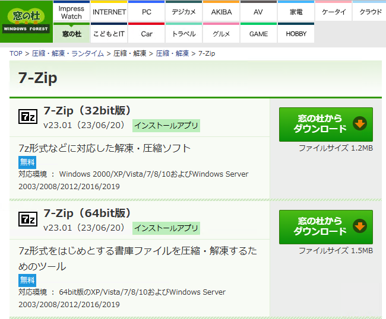
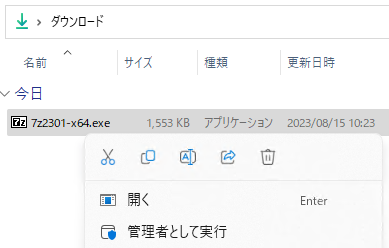
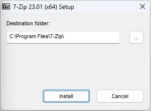
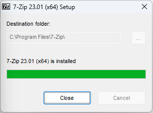

# ファイル圧縮・解凍ソフト 7-Zip のインストール
tag: 7-Zip 新人エンジニア　新人応援　効率化

「7-Zip」は Windows 向けのフリーソフトウェアです。オープンソースのファイル圧縮・解凍ソフトウェアで、多くのフォーマットに対応しています。ここでは 7zip のインストールと使い方を紹介します。18歳の新入社員を想定しています。

## 7-Zip の目的
7-Zip は以下のような用途で使われます。

### ファイルの圧縮・解凍
 7-Zip を使うると、大きなファイルや複数のファイルを一つのアーカイブファイルにまとめて圧縮することができます。これにより、ファイルのサイズを小さくして、ストレージスペースの節約や、メール添付などの転送を容易にすることができます。

### 高い圧縮率の達成
7-Zip は独自の7zフォーマットで非常に高い圧縮率を持っています。一般的な ZIP フォーマットよりも効果的にファイルサイズを小さくすることができます。

### ファイルの安全な送受信
7-Zip は AES-256 暗号化をサポートしているため、アーカイブにパスワードを設定して内容を暗号化することができます。これにより、機密性の高いデータを安全に共有する際や、外部のストレージに保存する際に、第三者による不正アクセスやデータの漏洩リスクを低減することができます。

これらの目的のもと、7-Zip は個人の日常的な作業から、ビジネスの現場や技術者の作業まで、幅広い場面で利用されています。

## 7-Zip のシステム要件
7-Zip は以下の環境で動作します。

- オペレーティングシステム: Windows 2000, XP, Vista, 7, 8, 8.1, 10, 11
- .NET Framework: .NET Framework 4.6.1 またはそれ以降。

ここでは 7-Zip Version 23.01 を例にして、Windows 11 へのインストール方法を紹介します。

## 7-Zip のインストール方法

窓の杜の 7-Zip の紹介ページにアクセスし、「窓の杜からダウンロード」をクリックします。

[https://forest.watch.impress.co.jp/library/software/7zip/](https://forest.watch.impress.co.jp/library/software/7zip/)

インストーラをダウンロードしたら、ファイルを実行します

インストーラのセットアップ画面が表示されたら、「Install」をクリックします。

インストールが完了したら、「Close」をクリックします。  

<!--
# 7-Zip の使い方

## ファイル圧縮のやり方

Windowsエクスプローラーで圧縮したいファイルやフォルダを選択します。

選択したファイルやフォルダを右クリックして、コンテキストメニューを開きます。

コンテキストメニューから「7-Zip」を選びます。

「7-Zip」メニューからいくつかの圧縮オプションが表示されます。一般的なオプションは以下の通りです：

- 「圧縮」: 新しいアーカイブを作成し、選択したアイテムをそのアーカイブに追加します。
- 「***.zipに追加」: 新しいZIPアーカイブを作成し、選択したアイテムをそのアーカイブに追加します。

「圧縮」オプションを選んだ場合、圧縮設定ウィンドウが表示されます。ここで以下の設定を行えます：

- アーカイブ: 新しいアーカイブファイルの名前を指定します。
- 圧縮レベル: 通常、最大、無圧縮など、異なる圧縮レベルを選択できます。
- 圧縮方法: 通常、LZMA, LZMA2, PPMdなどの異なる圧縮方法を選ぶことができます。
- 分割: アーカイブをいくつかの部分に分割することも可能です。
- 設定が完了したら、「OK」をクリックします。

設定を完了した後、圧縮プロセスが始まります。圧縮が完了すると、新しいアーカイブファイルが指定した場所に作成されます。

## ファイル展開のやり方

解凍したいアーカイブファイル（.zip, .rar, .7z 等）をを右クリックして、コンテキストメニューを開きます。

コンテキストメニューから「7-Zip」を選びます。

「7-Zip」メニューから適切な解凍オプションを選択します。いくつかのオプションがあります：

- 「ここに解凍」: 現在のフォルダにファイルを解凍します。
- 「***に解凍」: 新しいフォルダを作成し、そのフォルダにファイルを解凍します（***はアーカイブファイルの名前です）。
- 「解凍...」: 解凍先のフォルダを指定してファイルを解凍します。

選択したオプションに基づいて、ファイルの解凍が開始されます。解凍が完了したら、指定したディレクトリで解凍されたファイルを見つけることができます。

以上で、7-Zipを使用してファイルを解凍するプロセスは完了です。

7-Zip は多くの高度な機能を提供しており、さまざまなアーカイブ形式で作業するための非常に便利なツールです。
-->