# 画像ビューワ IrfanView のインストール
初心者向け 新人教育 VLC

「IrfanView」は、非常に軽量で高速な画像ビューアおよびエディタで、多くのフォーマットをサポートしています。無料で個人使用することができる点が魅力で、商業利用の場合にはライセンスの購入が必要です。ここでは 個人ユーザ向けに IrfanView のインストール方法を紹介します。

## IrfanView の目的
IrfanView は以下のような用途で使われます。

### 高速な画像の閲覧
IrfanView は非常に高速に動作する画像ビューアとして知られており、大量の画像ファイルを迅速に閲覧するのに適しています。

### 基本的な画像編集
IrfanView は画像のリサイズ、回転、色調整、明るさ・コントラストの調整など、基本的な編集機能を持っています。これにより、専用の画像編集ソフトウェアを開くほどでもない軽微な編集を迅速に行うことができます。

### バッチ処理と変換
複数の画像ファイルに対して、一括で名前の変更、フォーマットの変換、リサイズなどの処理を行うことができます。これは、同じ操作を多数の画像に対して実行したい場合に時間を大幅に節約することができます。

IrfanViewはその軽量性と高速な動作、そして多機能性から、多くのユーザーにとって欠かせないツールとして位置づけられています。

## IrfanView のシステム要件

IrfanView は以下の環境で動作します。

- オペレーティングシステム: Windows XP, Vista, 7, 8, 10, 11

ここでは IrfanView（32bit版）version 4.62 を例にして、Windows 11 へのインストール方法を紹介します。

## IrfanView のインストール方法

窓の杜の IrfanView の紹介ページにアクセスし、「IrfanView（32bit版）」、「IrfanView PlugIns（32bit版）」、「IrfanView日本語化モジュール」の 3 つのインストーラをダウンロードします。

[https://forest.watch.impress.co.jp/library/software/irfanview/](https://forest.watch.impress.co.jp/library/software/irfanview/)

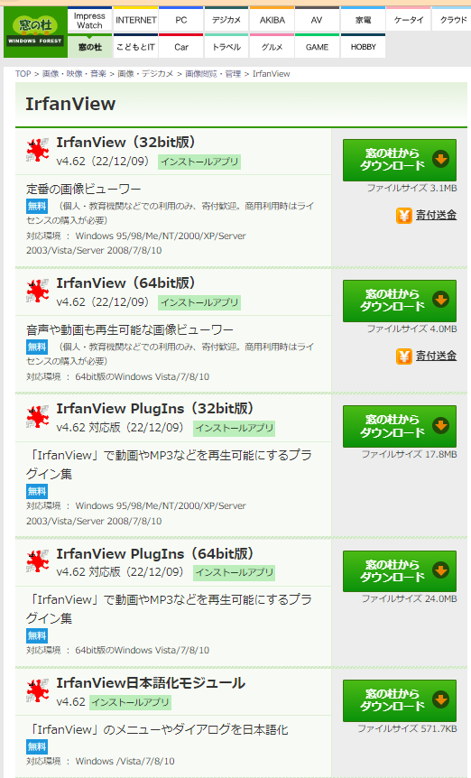

IrfanView 本体のインストーラ iview462_setup.exe を、「管理者として実行」します。

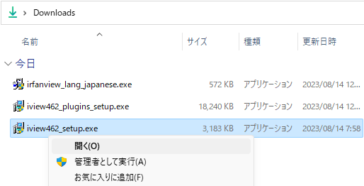

セットアップウイザードが表示されたら 、「次へ」をクリックします。

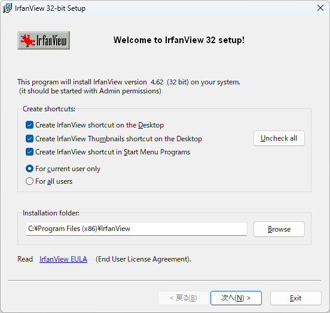

リリースノートが表示されたら 、「次へ」をクリックします。

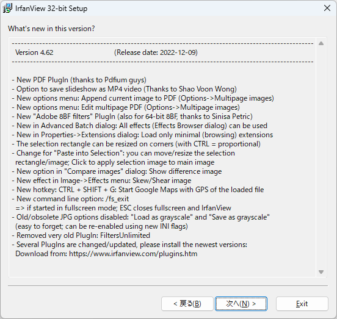

ファイルの関連付けの設定画面が表示されたら 、「次へ」をクリックします。

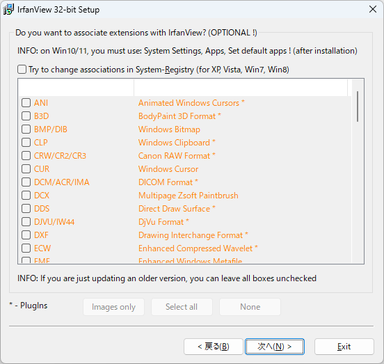

インストールの準備が完了したら 、「次へ」をクリックします。

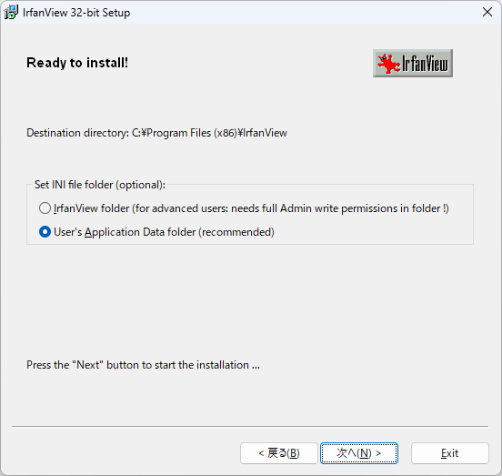

IrfanView 本体のインストールが完了したら、「Done」をクリックします。

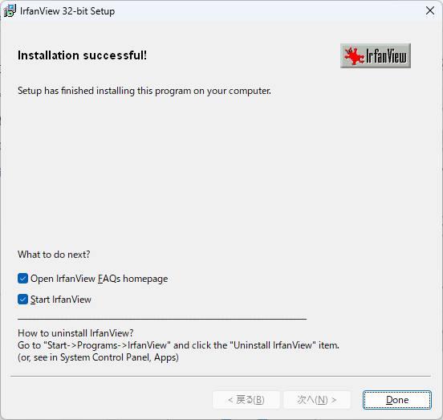

プラグインのインストーラ iview462_plugins_setup.exe を、「管理者として実行」します。

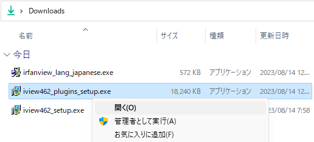

セットアップウイザードが表示されたら 、「次へ」をクリックします。

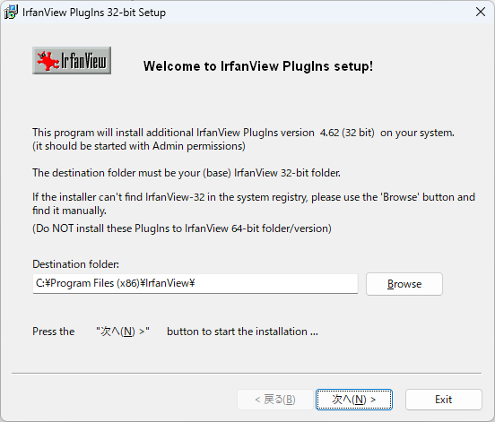

プラグインのインストールが完了したら、「OK」をクリックします。

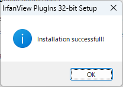

日本語化モジュールのインストーラ irfanview_lang_japanese.exe を、「管理者として実行」します。

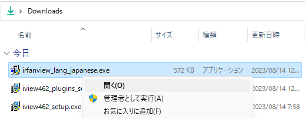

セットアップウイザードが表示されたら 、「Install」をクリックします。

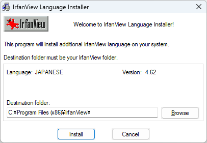

日本語化モジュールのインストールが完了したら、「OK」をクリックします。

