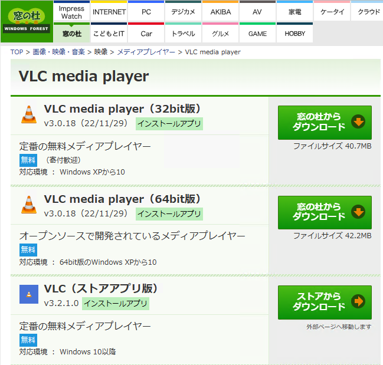
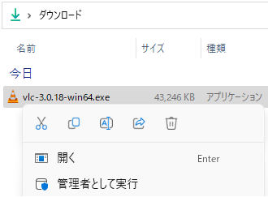
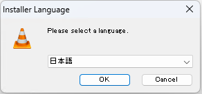
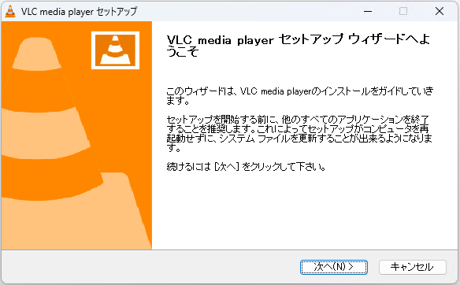
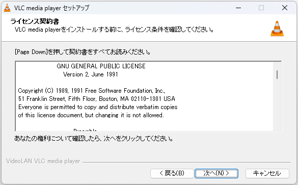
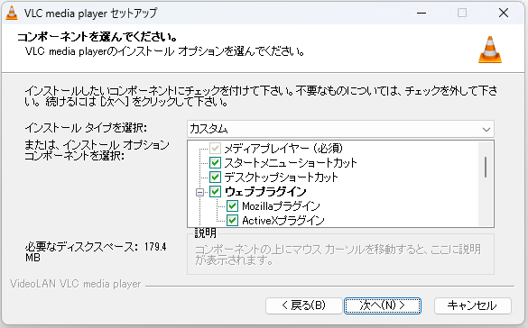
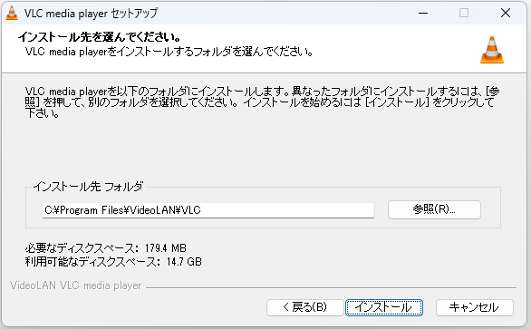
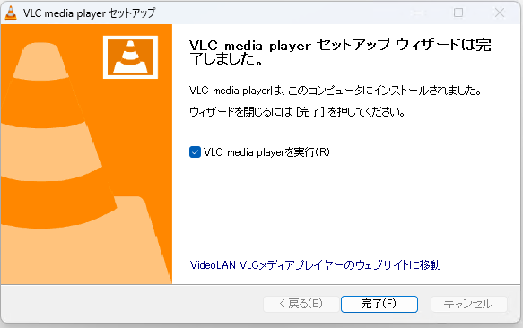
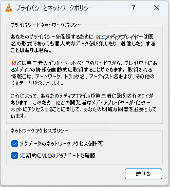
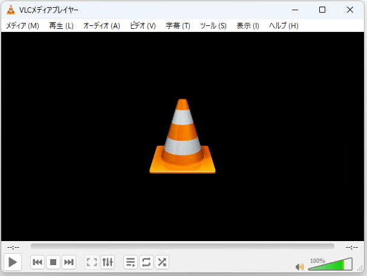

# メディアプレーヤ VLC media player のインストール
初心者向け 新人教育 VLC

「VLC media player」（通常「VLC」として知られています）はオープンソースでマルチプラットフォームのメディアプレーヤーソフトウェアです。様々なメディアファイルやネットワークストリームを簡単に再生できるため、初心者から上級者まで幅広く利用されています。ここでは 18 歳の新入社員向けに VLC のインストール方法を紹介します。

## VLC の目的
VLC は以下のような用途で使われます。

### 多様なファイル形式のサポート
VLC は、多くのビデオとオーディオ形式をサポートしています。これには一般的なフォーマットのみならず珍しいフォーマットも含まれます。

### ネットワークストリーム再生
VLC は、HTTP、RTSP、MMS などのプロトコルを通じてのネットワークストリーミング再生をサポートしています。

### ディスク再生
DVD、Audio CD、VCD、Blu-Ray など、さまざまなディスクメディアからの再生もサポートしています。

## VLC のシステム要件
VLC は以下の環境で動作します

- オペレーティングシステム: Windows XP SP3, Vista, 7, 8, 8.1, 10, 11

ここでは VLC 3.0.18 を例にして Windows 11 へのインストール方法を紹介します。

## VLC のインストール方法

窓の杜の VLC の紹介ページにアクセスし、「窓の杜からダウンロード」をクリックします。

インストーラをダウンロードしたら、ファイルを実行します

「インストーラ言語の選択」が表示されたら、「OK」をクリックします。

インストーラのセットアップ画面が表示されたら、「次へ」をクリックします。

ライセンス契約の内容を確認して、「次へ」をクリックします。

「インストールタイプの選択」が表示されたら、「次へ」をクリックします。

「インストール先フォルダの選択」が表示されたら、「次へ」をクリックします。

ファイルのインストールが完了したら、「完了」をクリックします。

VLC の初回起動時にネットワークアクセスポリシーが表示されます。内容を確認し、「続ける」をクリックします。

VLC のメイン画面が表示されたら、インストール作業の完了です。

