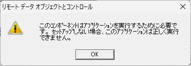
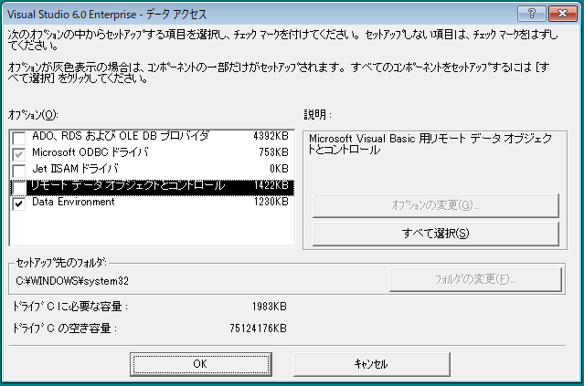

# Windows 11 への Visual Studio 6.0 のインストール手順
Visual Studio VC6 VB6 

Visual Studio 6.0 はマイクロソフトが 1998 年にリリースした統合開発環境です。Visual C++ 6.0 や Visual Basic 6.0 といった複数のプログラム言語の開発環境が含まれます。Visual Studio 6.0 は非常に古いため、そのまま Windows 11 にインストールしようとすると途中で処理が固まって失敗します。この記事では 26 歳の少し仕事がわかってきたエンジニア向けに Visual Studio 6.0 のインストール手順を紹介します。

## Visual Studio 6.0 の目的

Visual Studio 6.0 は昔の統合開発環境です。すでに Microsoftのサポートが終了し、更新パッチの配布も終了しています。一般的な開発プロジェクトでは、新しいバージョンの Visual Studio に移行することを強く推奨します。それでも Visual Studio 6.0 を必要とする状況を 2 つ挙げます。

### レガシーアプリケーションのサポート
一部の企業では20年以上前に作られた古い Windows アプリケーションを保守する必要がある場合があります。これらのアプリケーションは、Visual C++ 6.0 や Visual Basic 6.0 で開発されたものかもしれません。Visual Studio 6.0 は、こういった古いプログラムをサポートするために必要な開発ツールを提供します。

### VBAマクロのアプリケーション化
Excel VBA で書かれた社内向けツールを単体アプリケーション(EXE)として作り直す場合、Visual Basic 6.0 は安価なソリューションです。

## Visual Studio 6.0 のシステム要件

Visual Studio 6.0 は以下の環境で動作します。

- プロセッサ: Pentium 90MHz 以上
- メモリ(RAM): 16MB 以上 (32MB 以上が推奨)
- ハードディスクの空き容量: 120MB 以上
- オペレーティングシステム: Windows NT 4.0 (Service Pack 3 以上) または Windows 95/98
- グラフィックス: Super VGA 解像度 (800x600) 以上のディスプレイ
- CD-ROM ドライブ: インストールメディアを読み込むために必要

この記事では MSDN 版 Visual Studio 6.0 Enterprise Edition を例にして Windows 11 Pro にインストールする手順を説明します。

## 1. Visual Studio 6.0 のインストール
Visual Studio 6.0, Enterprise Edition, Disk 1 の CD をパソコンに挿入します。

CD-ROM 内の SETUP.EXE を右クリックし、「管理者として実行」で起動します。

「プログラム互換アシスタント」が表示されたら、「閉じる」をクリックします。

「セットアップウィザード」が表示されたら、「次へ」をクリックします。

使用許諾契約の内容を確認して「同意します」を選択し、「次へ」をクリックします。

「名前」や「会社名」を入力し、「次へ」をクリックします。

「Microsoft Virtual Machine for Java」が表示されたら、「次へ」をクリックします。

プログラム互換アシスタントのメッセージが表示されたら、「閉じる」をクリックします。

Windows の機能の追加ウィザードが表示されたら、「この機能をインストールする」をクリックします。

「Direct Play」のインストールに成功したら、「閉じる」をクリックします。

「システムを再起動します」ダイアログが表示されたら、「OK」をクリックして Windows を再起動します。

Windowsの再起動後、セットアップウィザードが表示されたら、「カスタム」を選択し、「次へ」をクリックします。

「セットアップフォルダ」が表示されたら、「次へ」をクリックします。

「セットアッププログラムにようこそ」が表示されたら、「継続」をクリックします。

プロダクトIDを確認し、「OK」をクリックします。

「カスタムオプション」の画面が表示されたら「データアクセス」を選択し、「オプションの変更」をクリックします。

詳細オプションが表示されたら、「ADO、RDSおよびOLE DBプロバイダ」と「リモートデータオブジェクトとコントロール」のチェックを外します。

ダイアログが表示されたら、「OK」をクリックします。

「ADO、RDSおよびOLE DBプロバイダ」と「リモートデータオブジェクトとコントロール」のチェックが外れたことを確認し、「OK」をクリックします。

「カスタムオプション」の画面に戻ったら、「継続」をクリックします。

「環境変数の登録」の画面が表示されたら、「環境変数の登録」のチェックを外し、「OK」をクリックします。

「新しいデータベース形式」のダイアログが表示されたら、「はい」をクリックします。

「Windows セキュリティの警告」ダイアログが表示されたら、「プライベートネットワーク」と「パブリックネットワーク」をチェックし、「アクセスを許可する」をクリックします。

「デバッグシンボル」ダイアログが表示されたら、「OK」をクリックします。

「JIT」ダイアログが表示されたら、「いいえ」をクリックします。

セットアップが完了したら、「Windowsの再起動」をクリックします。

Windowsの再起動後、追加機能のセットアップウィザードが表示されたら、「MSDNのセットアップ」のチェックを外し、「次へ」をクリックします。

「プログラムの互換性アシスタント」ダイアログが表示されたら、「このプログラムは正しくインストールされました」をクリックします。

「確認」ダイアログが表示されたら、「はい」をクリックします。

「その他のクライアントツール」の画面が表示されたら、何も選択せずに「次へ」をクリックします。

「サーバー セットアップ」の画面が表示されたら、何も選択せずに「次へ」をクリックします。

「今すぐ登録」のチェックをはずして、「完了」をクリックします。

## 2. Visual Studio 6.0 Service Pack 6 のインストール

Visual Studio 6.0 Service Pack 6 の CD をパソコンに挿入します。

CD-ROM 内の SETUPSP6.EXE を「管理者として実行」で起動します。

セットアップウイザードが表示されたら 、「継続」をクリックします。

使用許諾契約の内容を確認して、「同意します」をクリックします。

MFC 日本語版の置き換えの確認が表示されたら、「いいえ」を選択します。

現在のファイルを残すかの確認が表示されたら、「はい」を選択します。

ファイルのコピーがはじまるので完了まで待機します。

インストール完了メッセージが表示されたら、「OK」をクリックしセットアップを終了します。

## 4. Visual Basic 6.0 Service Pack 6 累積的な更新プログラムのインストール

マイクロソフトの「Visual Basic 6.0 Service Pack 6 累積的な更新プログラム」サイトにアクセスします。 
https://www.microsoft.com/ja-jp/download/details.aspx?id=7030

「ダウンロード」をクリックします。

ダウンロードした VB60SP6-KB2708437-x86-JPN.msi を実行します。

使用許諾契約の内容を確認して「同意する」を選択し、「次へ」をクリックします。

完了メッセージが表示されたら、「完了」をクリックし、セットアップを終了します。

## 6. Visual Basic 6.0 の起動

Windows のスタートメニューから「全てのアプリ」→「Microsoft Visual Studio 6.0」を選択し、「Microsoft Visual Basic」を右クリックし、「管理者として実行」で起動します。

## 7. Visual Basic のバージョンを確認

Visual Basic のメニューから「ヘルプ」→「バージョン情報」をクリックします。  「Microsoft Visual Basic 6.0(SP6)」と表示されればOKです。

