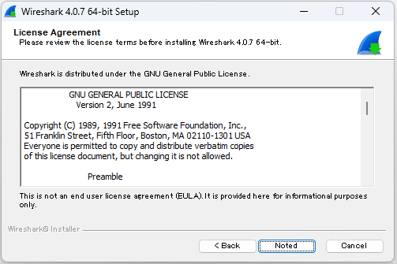

# ネットワークプロトコルアナライザ Wireshark  のインストール

「Wireshark」は、ネットワークを流れるパケットをキャプチャし、プロトコルの分析を行うためのフリーソフトウェアです。ネットワークの状況をリアルタイム調査したり、保存したログファイルを後から解析したりするのに非常に役立ちます。ここでは 18 歳の新入社員向けに Wireshark のインストール方法を紹介します。

## WireShark の目的
Wireshark は以下のような用途で使われます。

### ネットワークトラブルシューティング
Wireshark は多くのネットワークプロトコルをサポートし、パケットの詳細を深く分析できます。 Wireshark を使うことでネットワーク上の異常なトラフィックや遅延の原因などを特定することができます。

### セキュリティ分析と監査
Wireshark を使ってネットワーク内の通信を監視することで、不正アクセスやマルウェアの通信、データの流出などのセキュリティ上の脅威を検出することができます。

### 教育・研究
Wireshark はキャプチャしたパケットを視覚的に表示しユーザーがデータを理解しやすくします。詳細な通信の流れを学ぶために使用されます。

## Wireshark のシステム要件
Wireshark は以下の環境で動作します

- オペレーティングシステム: Windows 8.1, 10, 11
- メモリ(RAM): 500 MB 以上。大量のトラフィックをキャプチャする際は、より多くのRAMが有利です。
- ハードディスク: 500MB 以上の空き容量。キャプチャしたデータを保存するには追加のディスクスペースが必要です。
- グラフィックス: 1280 x 1024 以上のディスプレイ

この記事では Wireshark Version 4.0.7 を例にして、Windows 11 へのインストールを説明します。

## Wireshark のインストール

窓の杜の Wireshark の紹介ページにアクセスし、OS のバージョンに合ったインストーラを「窓の杜からダウンロード」します。

https://forest.watch.impress.co.jp/library/software/vlcmedia_ply/

インストーラをダウンロードしたら、ファイルを管理者として実行します

Wireshark のインストール画面が表示されたら、「Next」をクリックします。

使用許諾契約の内容を確認して、「Noted」をクリックします。

寄付のお願い画面が表示されたら、「Next」をクリックします。

コンポーネントの選択画面が表示されたら、「Next」をクリックします。

追加する機能の選択画面が表示されたら、「Next」をクリックします。

インストール先フォルダの選択画面が表示されたら、「Next」をクリックします。

キャプチャライブラリの選択画面が表示されたら、「Next」をクリックします。

USB キャプチャライブラリの選択画面が表示されたら、「Next」をクリックします。

ファイルのコピーが始まります。

Npcap の使用許諾契約の画面が表示されたら、内容を確認して、「I Agree」をクリックします。

Npcap のインストールオプションの選択画面が表示されたら、「Install」をクリックします。

Npcap のコピー完了画面が表示されたら、「Next」をクリックします。

Npcap のインストール完了画面が表示されたら、「Finish」をクリックします。

Wireshark のファイルのコピーの続きが始まります。

Wireshark のファイルのコピー完了画面が表示されたら、「Next」をクリックします。

Wireshark のインストール完了画面が表示されたら、「Finish」をクリックします。

Wireshark のメイン画面が表示されたら、インストール作業の完了です。

