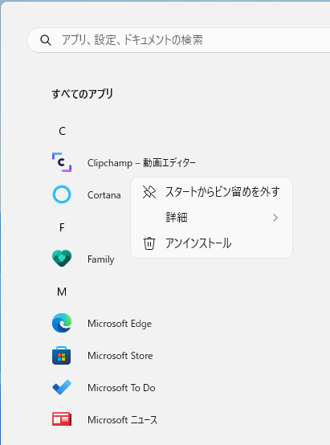
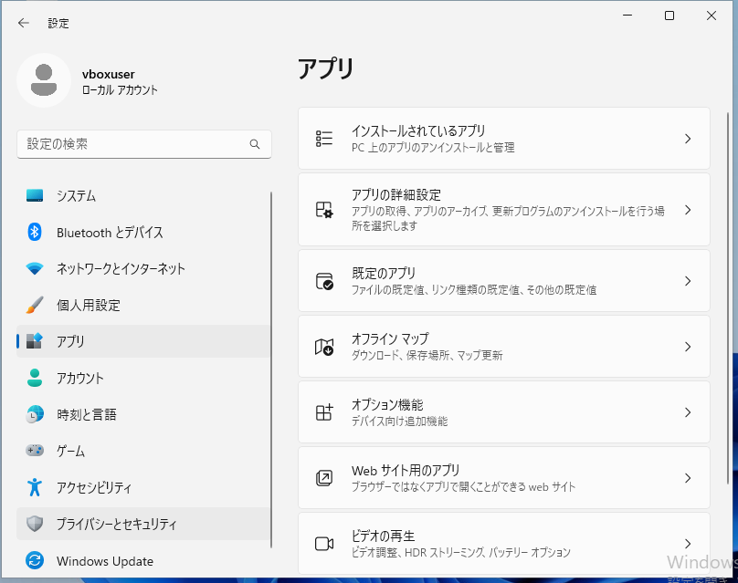
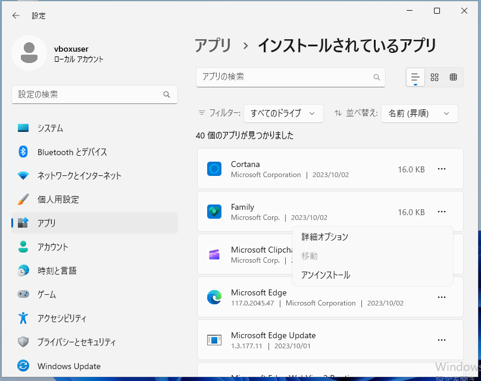
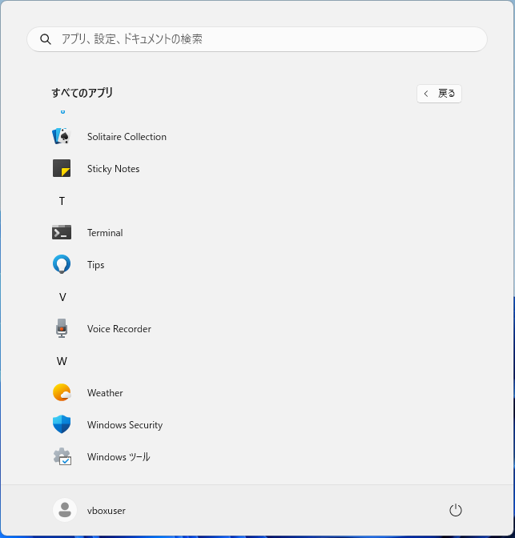
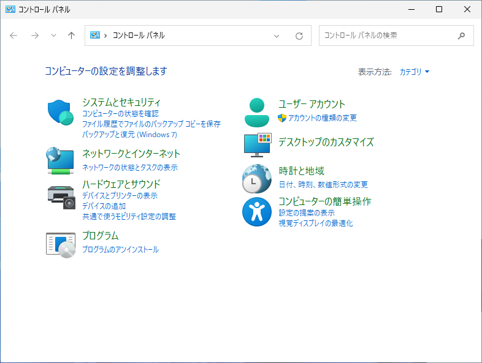
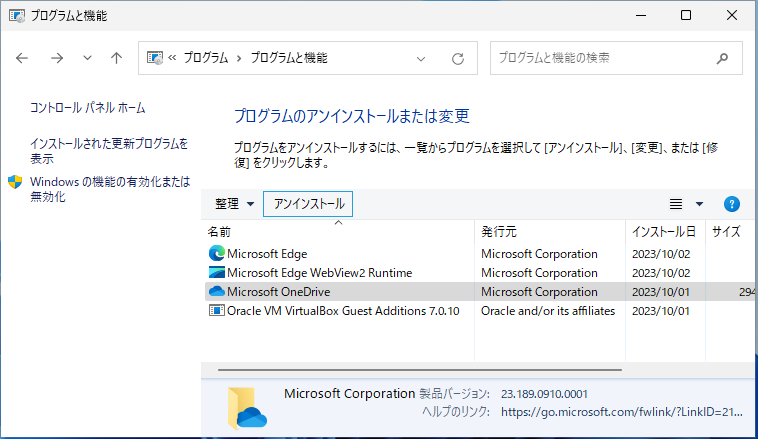

 Windows 11 でアプリをアンインストールする３つの方法
 
Windows 11 は不要なアプリをアンインストールする際のやり方がいくつかあります。この記事では Windows 11 22H2 を例に、アプリをアンインストールする方法を３つ紹介します。
   
1. Store アプリ限定の方法  -> 1. スタートメニューからアンインストールする
2. 10 以降の一般的な方法  -> 2. 設定画面からアンインストールする
3. XP, 7 と同じ方法  -> 3. コントロールパネルからアンインストールする

## 1. スタートメニューからアンインストールする

タスクバー中央にあるスタートボタンをクリックします。

スタートメニューが表示されたら、右上にある「すべてのアプリ」をクリックします。

アプリ一覧が表示されたら対象のアプリを右クリックし、「アンインストール」をクリックします。

## 2. 設定画面からアンインストールする

タスクバー中央にあるスタートボタンをクリックします。

スタートメニューが表示されたら、ピン留め済みの「設定」をクリックします。

設定画面が表示されたら、左側の「アプリ」をクリックし、右側の「インストールされているアプリ」をクリックします。

アンインストールするアプリの右側にある三点アイコンをクリックし、［アンインストール］をクリックします。

## 3. コントロールパネルからアンインストールする

タスクバー中央にあるスタートボタンをクリックします。

スタートメニューが表示されたら、右上にある「すべてのアプリ」をクリックします。

アプリ一覧が表示されたら下にスクロールし、「Windows ツール」をクリックします。

Windows ツールが表示されたら、「コントロールパネル」をクリックします。

コントロールパネルが表示されたら、「プログラムのアンインストール」をクリックします

アンインストールするアプリを選択し、［アンインストール］をクリックします。

<!-- 参考；3通りあるWindows 11のアプリアンインストール方法
    https://pc.watch.impress.co.jp/docs/column/win11tec/1403026.html -->