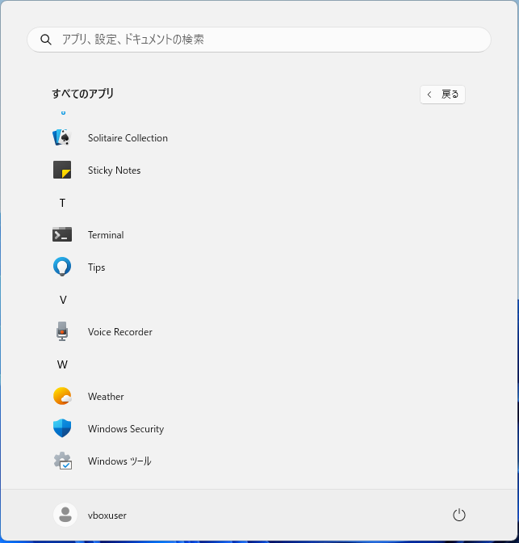
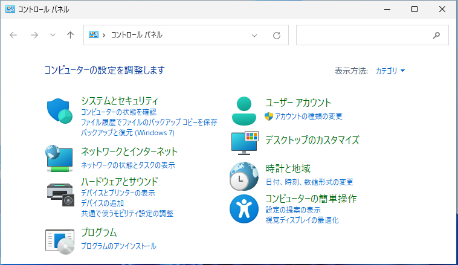
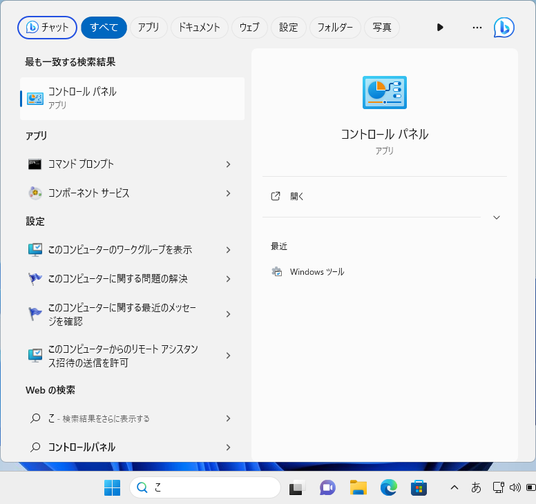
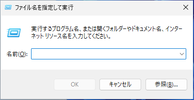
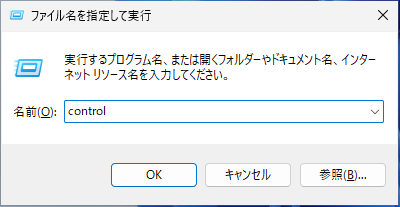

 Windows 11 でコントロールパネルを開く方法
 
Windows 11 はコントロールパネルが少し隠れた場所にあります。この記事では Windows 11 22H2 を例に、Windows 11 でコントロールパネルを開く方法を３つ紹介します。
   
1. マウスクリックだけで行う方法 -> スタートメニューから表示する
2. 汎用的な方法 -> 検索して表示する
3. キーボードだけで行う方法 -> 「ファイル名を指定して実行」から表示する

## 1. スタートメニューから表示する

タスクバー中央にあるスタートボタンをクリックします。

スタートメニューが表示されたら、右上にある「すべてのアプリ」をクリックします。

アプリ一覧が表示されたら下にスクロールし、「Windows ツール」をクリックします。

Windows ツールのウィンドウが表示されたら、「コントロールパネル」をクリックします。

コントロールパネルが表示されます。

## 2. 検索して表示する

タスクバーの検索ボックスに「control」または「コントロール」などのキーワードを入力します。

検索結果に「コントロールパネル」が表示されたら、クリックします。

コントロールパネルが表示されます。

## 「ファイル名を指定して実行」から表示する

「Windows」 + 「R」 キーを押して、「ファイル名を指定して実行」ダイアログを表示します。

「名前(O):」欄に「control」と入力し、「OK」ボタンをクリックします。

コントロールパネルが表示されます。

