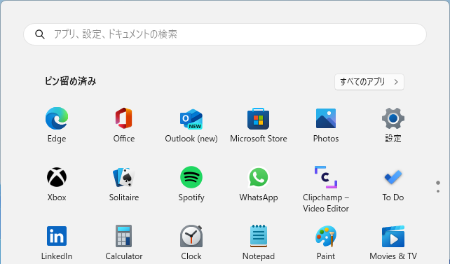
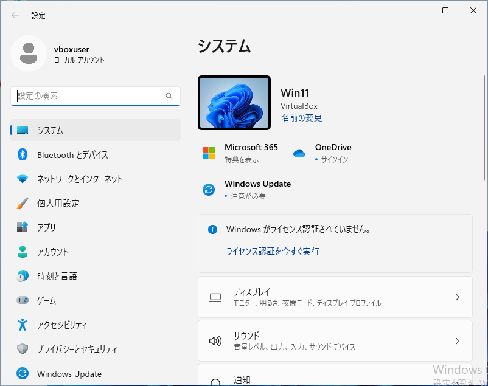
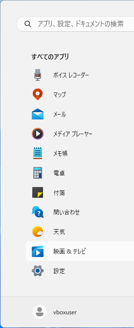
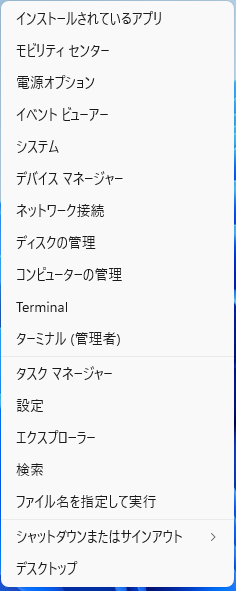

Windows 11 の設定画面を開く３つの方法
新人研修
初心者向け
パソコン未経験
Windows11

Windows 11 は「設定」という画面から各種設定を変更する仕様となっています。この記事では Windows 11 22H2 を例に、設定画面を開く方法を３つ紹介します。
   
1. マウスの左クリックだけで行う方法 -> 1.「ピン留め済み」から表示する、　2.「すべてのアプリ」から表示する、
2. マウスの右クリックも使う方法 -> 3. 右クリックメニューから表示する

## 1. 「ピン留め済み」から表示する

タスクバー中央にあるスタートボタンをクリックします。

スタートメニューが表示されたら、ピン留め済みにある「設定」をクリックします。

設定画面が表示されます。

## 2. 「すべてのアプリ」から表示する

タスクバー中央にあるスタートボタンをクリックします。

スタートメニューが表示されたら、右上にある「すべてのアプリ」をクリックします。

アプリ一覧が表示されたら下にスクロールし、「設定」をクリックします。

設定画面が表示されます。

## 3. 右クリックメニューから表示する

タスクバー中央にあるスタートボタンを右クリックします。

右クリックメニューが表示されたら、「設定」をクリックします。

設定画面が表示されます。

