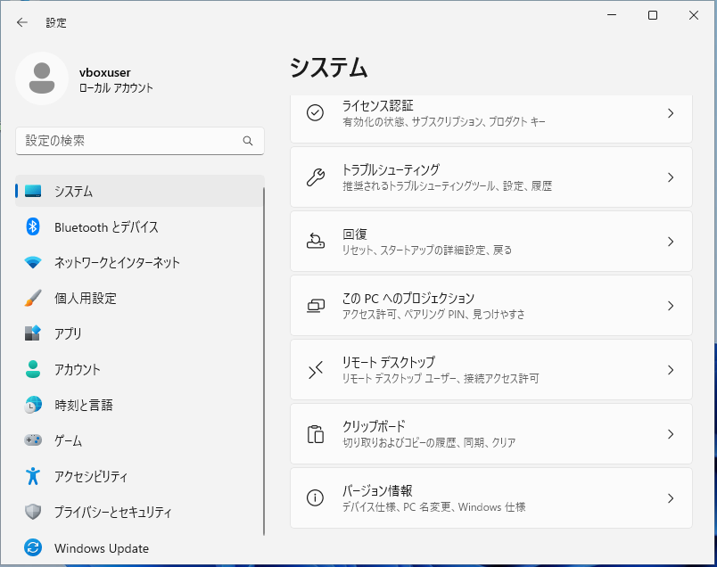
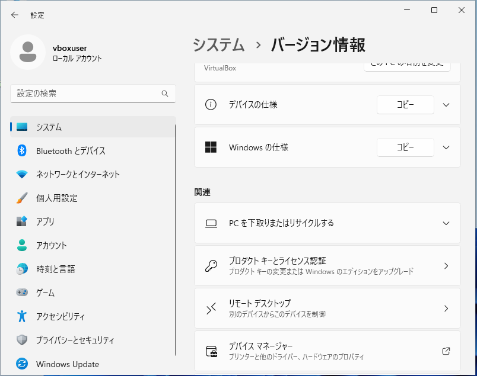
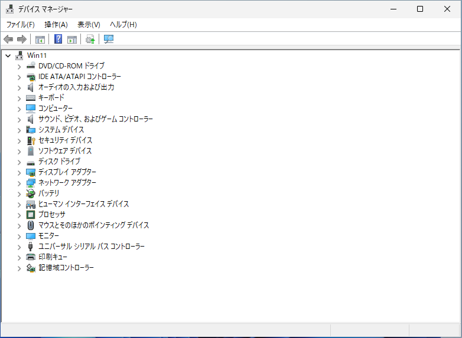
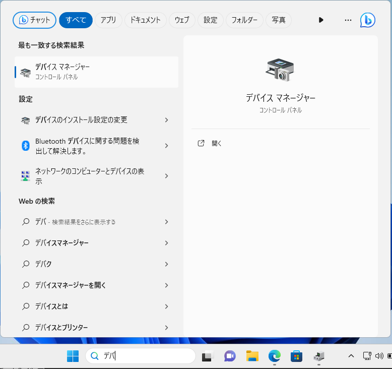

Windows 11 のデバイスマネージャーを開く3つの方法

新人研修
初心者向け
パソコン未経験
Windows11

デバイスマネージャーは、パソコンに接続されている機器の表示、ドライバーの追加や削除、機器の設定確認などに使用されます。この記事では Windows 11 22H2 を例に、デバイスマネージャーを開く方法を3つ紹介します。

||方法|マウス 操作|キー 操作|操作手数|Win10 互換|
|---|---|---|---|---|---|
|1|設定から起動|Yes|-|7|-|
|2|スタートボタンの右クリックから起動|Yes|-|2|Yes|
|3|検索して実行|Yes|Yes|4|Yes|

## 1. 設定から起動する

タスクバー中央にあるスタートボタンをクリックします。

スタートメニューが表示されたら、「設定」をクリックします。

設定画面が表示されたら、左側の「システム」をクリックし、右側を下にスクロールし、「バージョン情報」をクリックします。

バージョン情報画面が表示されたら、右側を下にスクロールし、「デバイスマネージャー」をクリックします。

デバイスマネージャーが表示されます。

## 2. スタートボタンの右クリックから起動する

タスクバー中央にあるスタートボタンを右クリックします。

右クリックメニューが表示されたら、「デバイスマネージャー」をクリックします。

デバイスマネージャーが表示されます。

## 3. 検索して実行する

タスクバーの検索ボックスに「devmgmt」または「デバイスマネージャー」などのキーワードを入力します。

検索結果に「デバイスマネージャー」が表示されたら、クリックします。

デバイスマネージャーが表示されます。

