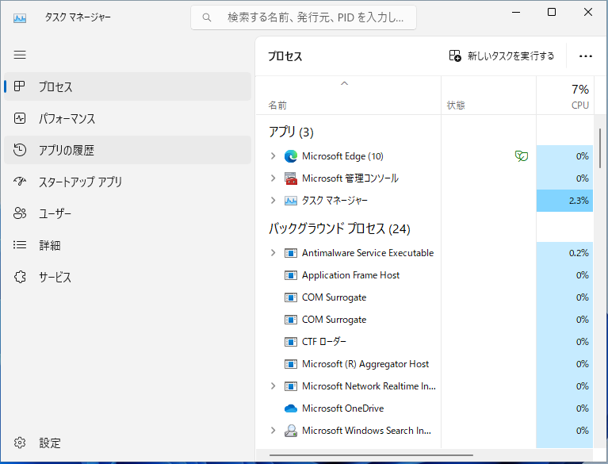

Windows 11 のタスクマネージャを開く6つの方法

新人研修
初心者向け
パソコン未経験
Windows11

Windowsタスク マネージャーは、実行中のプロセスの表示、タスクの終了、PCパフォーマンスの確認などに使用されます。この記事では Windows 11 22H2 を例に、タスクマネージャを開く方法を6つ紹介します。

||方法|マウス 操作|キー 操作|操作手数|Win10 互換|
|---|---|---|---|---|---|
|1|スタートメニューから起動|Yes|-|6|-|
|2|スタートバーの右クリックから起動|Yes|-|2|Yes|
|3|スタートボタンの右クリックから起動|Yes|-|2|Yes|
|4|［Ctrl］＋［Alt］＋［Del］から起動|Yes|Yes|2|Yes|
|5|検索して実行|Yes|Yes|5|Yes|
|6|［Ctrl］＋［Shift］＋［ESC］から起動|-|Yes|1|Yes|

## 1. スタートメニューから起動する

タスクバー中央にあるスタートボタンをクリックします。

スタートメニューが表示されたら、右上にある「すべてのアプリ」をクリックします。

アプリ一覧が表示されたら、下にスクロールし、「Windows ツール」をクリックします。

Windows ツールが表示されたら、下にスクロールし、「タスクマネージャー」をクリックします。

タスクマネージャーが表示されます。

## 2. タスクバーの右クリックから起動する

タスクバーを右クリックし、右クリックメニューが表示されたら、「タスクマネージャー」をクリックします。

タスクマネージャーが表示されます。

## 3. スタートボタンの右クリックから起動する

タスクバー中央にあるスタートボタンを右クリックします。

右クリックメニューが表示されたら、「タスクマネージャー」をクリックします。

タスクマネージャーが表示されます。

## 4. ［Ctrl］＋［Alt］＋［Del］から起動する

キーボードの［Ctrl］＋［Alt］＋［Del］を押し、表示されるメニューから「タスクマネージャ」をクリックします。

タスクマネージャーが表示されます。

## 5. 検索して実行する

タスクバーの検索ボックスに「taskm」または「タスクマネージャー」などのキーワードを入力します。

検索結果に「タスクマネージャー」が表示されたら、クリックします。

タスクマネージャーが表示されます。

## 6. ショートカットキーから起動する

キーボードの［Ctrl］＋［Shift］＋［ESC］キーを押します。 タスクマネージャーが表示されます。

