Windows 11 でネットワーク接続を固定IPに設定する4つの方法

新人研修
初心者向け
Windows11

Windows 11を使用していると、ネットワーク接続を手動でIPアドレスを設定したい場合があります。この記事では Windows 11でネットワーク接続を固定IPに設定する4つの方法を説明します。

||方法|クリック操作|右クリック操作|操作手数|備考|
|---|---|---|---|---|---|
|**1**|**「コントロールパネル」から「アダプター設定の変更」**|必要|-|11|**互換**|
|**2**|**「設定」から「IP割り当ての編集」**|必要|-|8|**容易**|
|3|スタートボタンの右クリックから「ネットワーク接続」|必要|必要|7|迅速|
|4|ネットワークアイコンの右クリックから「ネットワーク設定」|必要|必要|10|互換|

## 1. 「コントロールパネル」から「アダプター設定の変更」

タスクバーにある**スタートボタン**をクリックします。

スタートメニューが表示されたら、右上にある「**すべてのアプリ**」をクリックします。

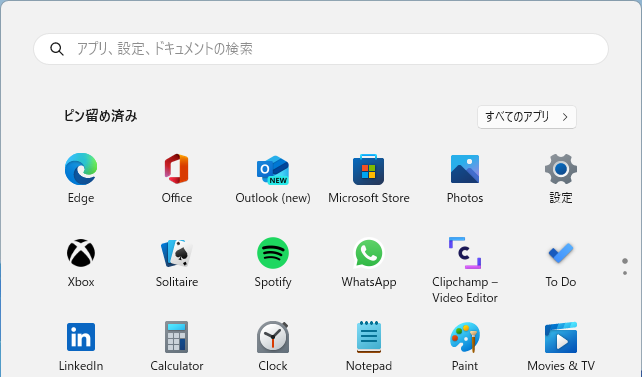

アプリ一覧が表示されたら、下にスクロールし、「**Windows ツール**」をクリックします。

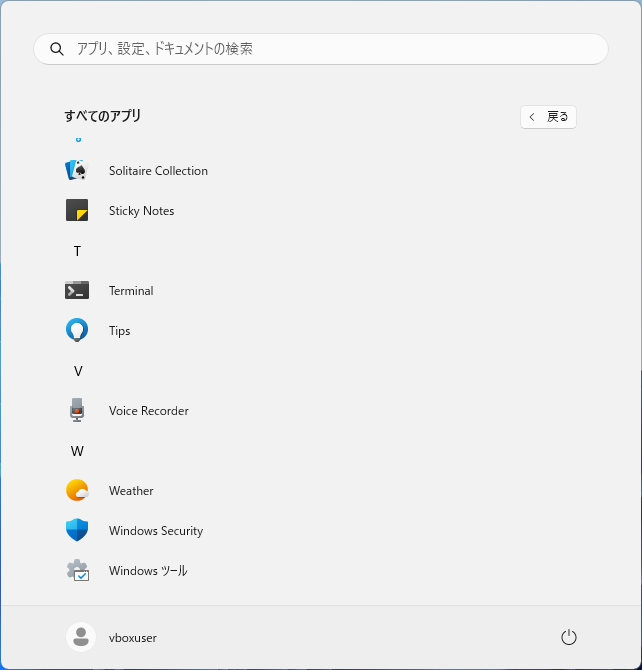

Windows ツールの一覧が表示されたら、「**コントロールパネル**」をクリックします。

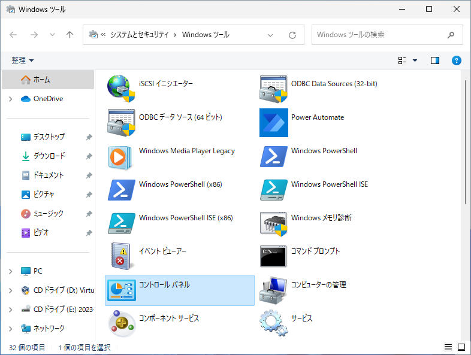

コントロールパネルが表示されたら、「**ネットワークの状態とタスクの表示**」をクリックします。

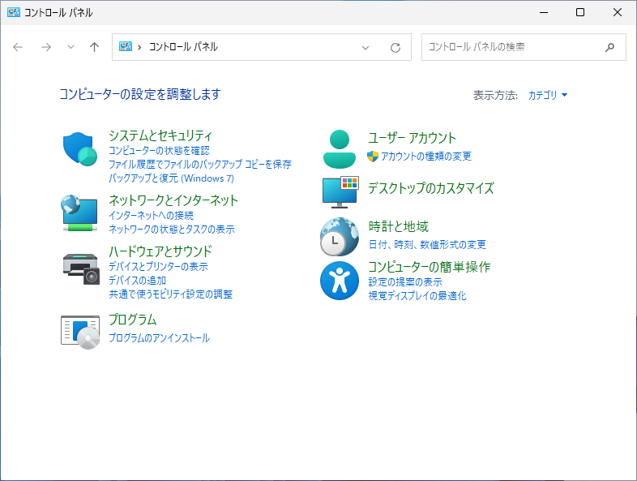

ネットワークと共有センターが表示されたら、左側の「**アダプター設定の変更**」をクリックします。 

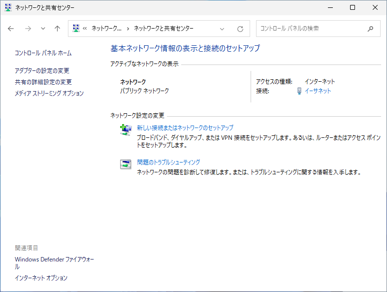

### 1.1 アダプタのプロパティ変更

アダプタの一覧が表示されたら、IPアドレスを設定したいアダプタを右クリックし、「**プロパティ**」をクリックします。

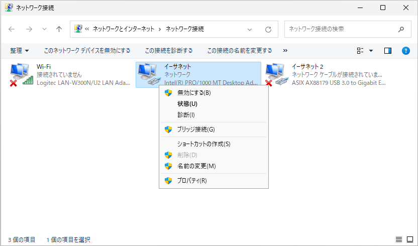

プロパティが表示されたら、「**Internet Protocol Version 4 (TCP/IPv4)**」を選択し、「**プロパティ**」ボタンをクリックします。

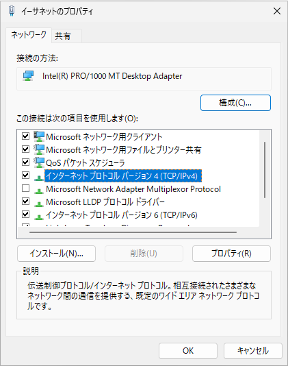

「Internet Protocol Version 4 (TCP/IPv4) プロパティ」ウィンドウが開いたら、「**次のIPアドレスを使う**」を選択します。そして、**IPアドレス**、**サブネットマスク**、**デフォルトゲートウェイ**、**DNSサーバー**の情報を入力します。

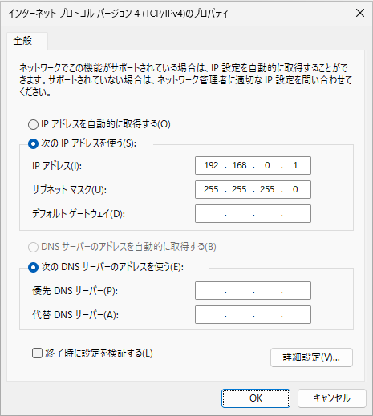

設定が完了したら、各ウィンドウで「**OK**」や「**閉じる**」ボタンをクリックして変更を保存します。

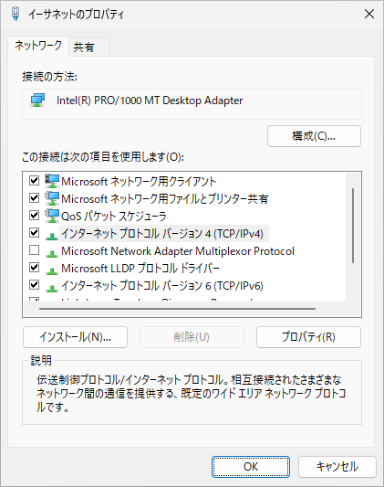

設定が適用されたことを確認します。アダプタの一覧画面で、先ほど変更したアダプタを右クリックし、「**状態**」をクリックします。

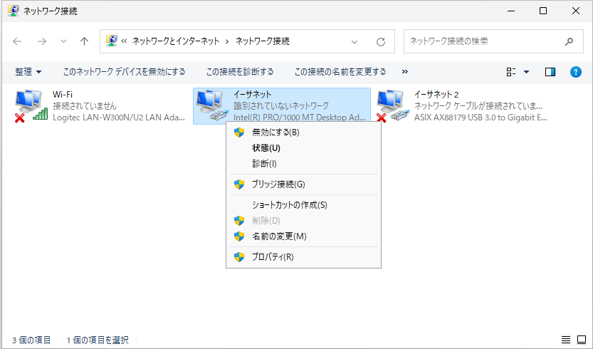

状態が表示されたら、「**詳細**」をクリックします。

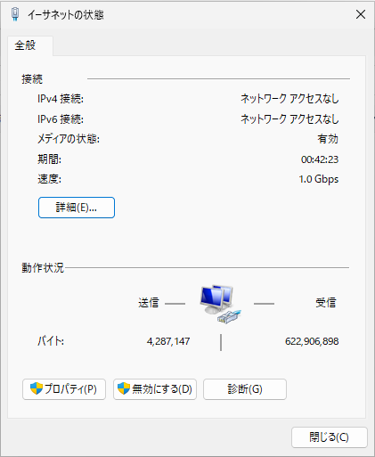

設定が反映されていることを確認します。

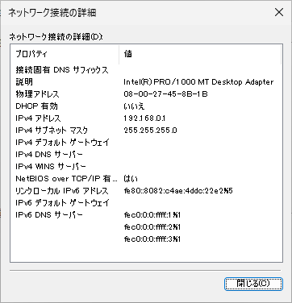

## 2. 「設定」から「IP割り当ての編集」

タスクバーにある**スタートボタン**をクリックします。

スタートメニューが表示されたら、「**設定**」をクリックします。

設定画面が表示されたら、左側の「**ネットワークとインターネット**」をクリックします。

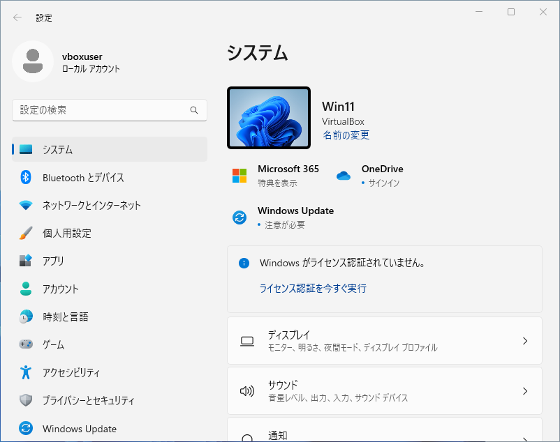

### 2.1 ネットワークの詳細

ネットワークとインターネットが表示されたら、右側を下にスクロールし、「**ネットワークの詳細設定**」をクリックします。

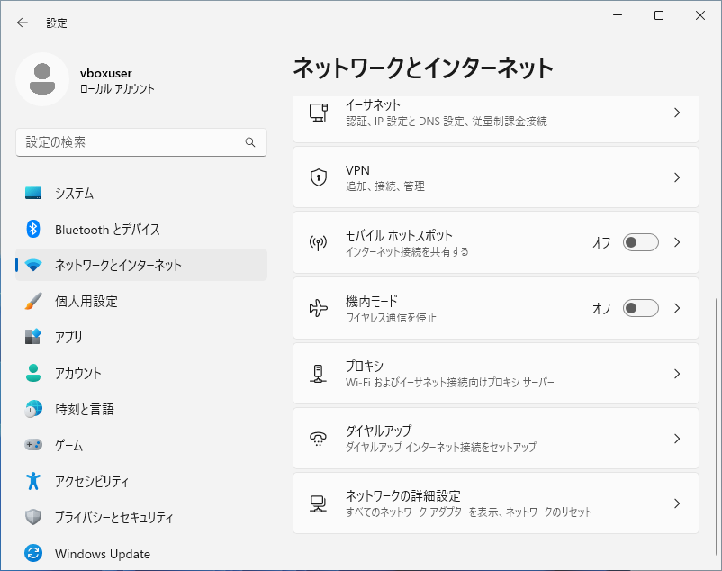

IPアドレスを設定したいネットワークアダプタの「**∨**」をクリックします。

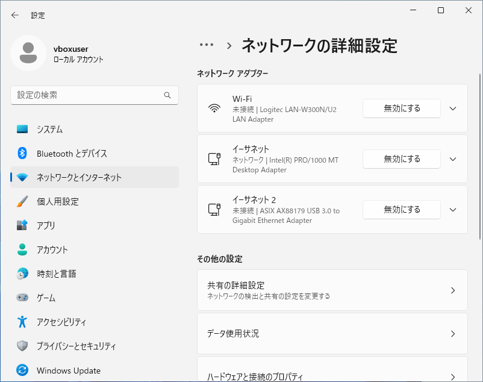

詳細が表示されたら、「**追加のプロパティを表示**」をクリックします。

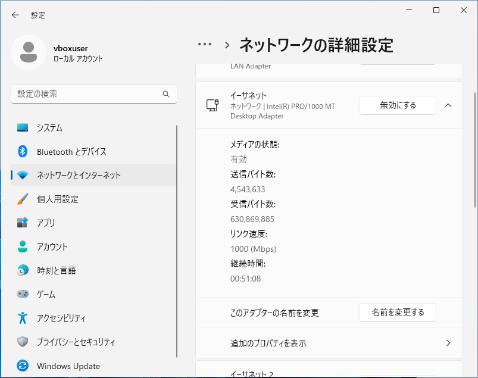

設定画面が表示されたら、IP割り当ての「編集」ボタンをクリックします。

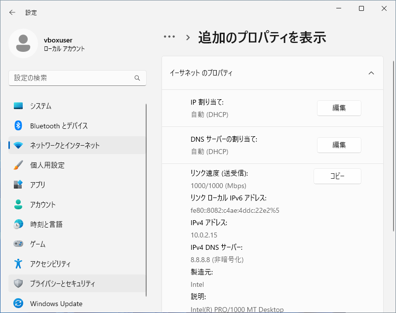

「IP設定の編集」が表示されたら、「自動(DHCP)」をクリックし、「手動」に変更します。

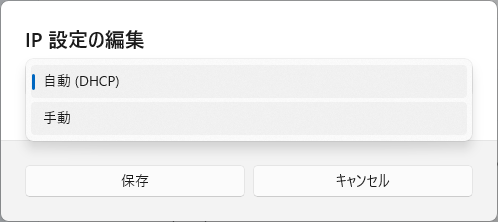

手動の項目が表示されたら、「IPv4」をオンにします。

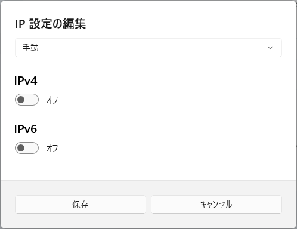

**IPアドレス**、**サブネットマスク**、**デフォルトゲートウェイ**、**DNSサーバー**の情報を入力し、「**保存**」ボタンをクリックします。

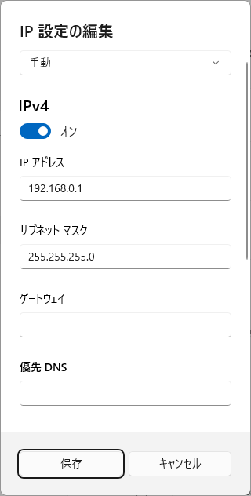

設定が反映されていることを確認します。

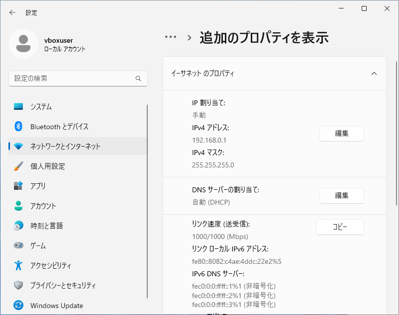

## 3. スタートボタンの右クリックから「ネットワーク接続」

タスクバーにある**スタートボタン**を右クリックします。

右クリックメニューが表示されたら、「**ネットワーク接続**」をクリックします。

ネットワークとインターネットが表示されたら、「2.1 ネットワークアダプタのプロパティ」と同じ手順で設定を変更します。

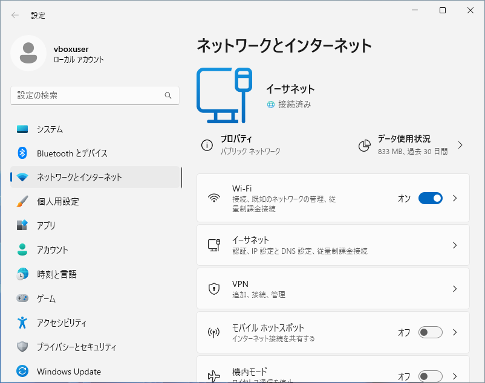

## 4. ネットワークアイコンの右クリックから「ネットワーク設定」

「ネットワーク」アイコンを右クリックして、メニューを表示し、「ネットワーク設定とインターネット設定」をクリックします。

ネットワークとインターネットが表示されたら、右側を下にスクロールし、「**ネットワークの詳細設定**」をクリックします。

詳細設定が表示されたら、「**ネットワークアダプターオプションの詳細**」をクリックします

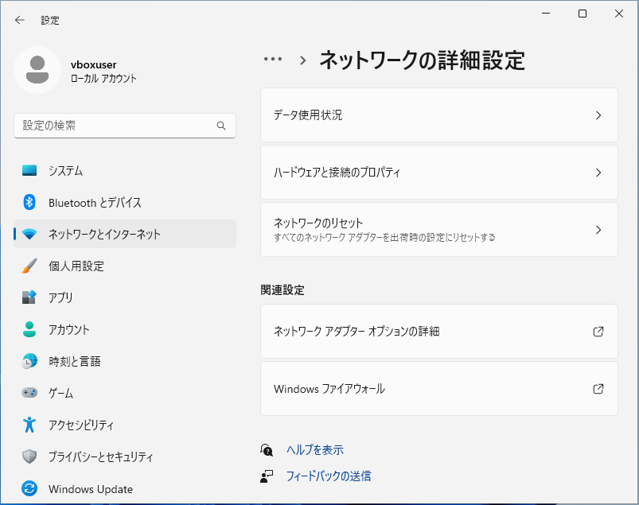

アダプタの一覧が表示されたら、「1.1 アダプタのプロパティ変更」と同じ手順で設定を変更します。

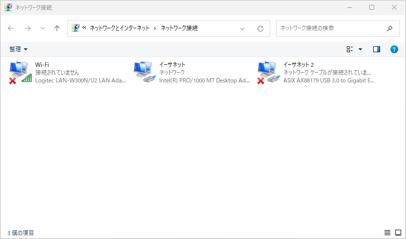
