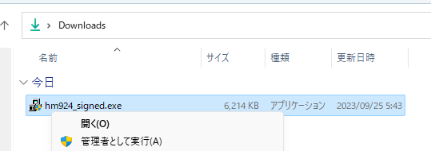
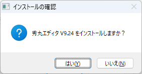
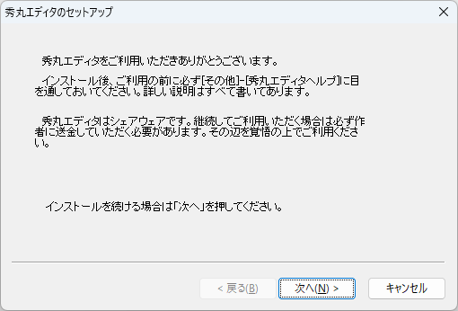
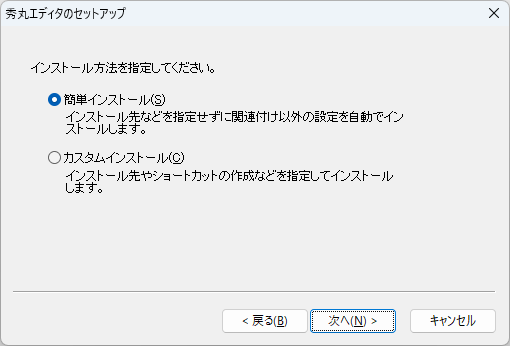
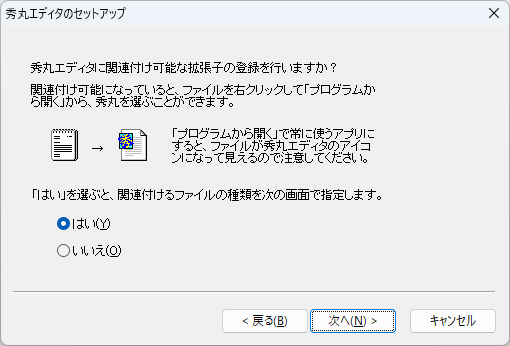
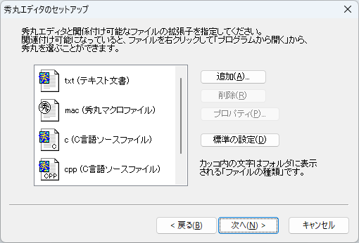
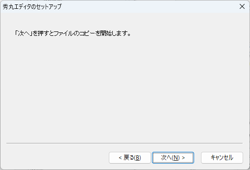
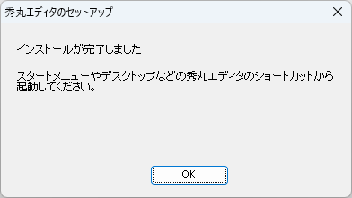

# テキストエディタ 秀丸エディタ のインストール
tag: 秀丸エディタ 初心者向け 新人教育 新人応援 Windows11

「秀丸エディタ」は、Windows 向けの有料のテキストエディタです。秀丸エディタは、基本的なテキスト編集機能から高度な編集機能まで幅広くカバーしているため、日本のプログラマーやエンジニアに人気があります。ここでは 18 歳の新入社員向けに秀丸エディタのインストール方法を紹介します。

## 秀丸エディタを使う目的
秀丸エディタの特徴を以下に挙げます。

### 日本語対応
秀丸エディタは日本語のテキスト編集に特に適しており、Shift_JIS、UTF-8、EUC-JPなどの日本語エンコーディングをサポートしています。また、日本語のIME（Input Method Editor）とも連携して使いやすさを提供します。

### プログラムやスクリプトのコーディング
シンタックスハイライト機能を活用して、ソースコードの読みやすさを向上させることができます。また、正規表現を使用した強力な検索・置換機能や、マクロ機能を使用して繁雑な作業を効率化するため、プログラミング作業においても秀丸エディタは有用です。

### 大容量テキストの閲覧・編集
秀丸エディタは大きなサイズのテキストファイルもスムーズに開き、編集することができます。ログファイルや大量のデータを含むテキストを扱う場合、高速で安定した動作が求められるため、このような用途で秀丸エディタが選ばれることが多いです。

## 秀丸エディタのシステム要件
秀丸エディタは、WindowsXP/Vista/7/8/8.1/10/11 上で動作するテキストエディタです。

ここでは 秀丸エディタ（32bit版）version 9.24 を例にして、Windows 11 へのインストール方法を紹介します。

## 秀丸エディタ のインストール方法

窓の杜の秀丸エディタの紹介ページにアクセスし、「窓の杜からダウンロード」をクリックします。 
[窓の杜 > ビジネス > 文書作成 > テキストエディター > 秀丸エディタ](https://forest.watch.impress.co.jp/library/software/hidemaru/)

インストーラをダウンロードしたら、ファイルを実行します。

インストールの確認画面が表示されたら、「はい」をクリックします。

セットアップ画面が表示されたら、「次へ」をクリックします。

インストール方法の選択画面が表示されたら、「次へ」をクリックします。

関連付けの登録画面が表示されたら、「次へ」をクリックします。

拡張子の指定画面が表示されたら、「次へ」をクリックします。

コピーの開始画面が表示されたら、「次へ」をクリックします。

インストールの完了画面が表示されたら、「OK」をクリックします。

<!--
## 秀丸エディタの使い方

秀丸エディタの起動:

インストールが完了したら、秀丸エディタを起動します。デスクトップやスタートメニューからアプリケーションを見つけて起動できます。
新しいファイルの作成:

メニューから「ファイル」>「新規作成」を選択するか、Ctrl + N キーを押して新しいファイルを作成します。
テキストの入力と編集:

テキストを入力し、必要に応じて編集します。秀丸エディタは、日本語の文字コードに対応しています。
ファイルの保存:

メニューから「ファイル」>「保存」を選択するか、Ctrl + S キーを押してファイルを保存します。ファイルの名前と保存場所を指定します。
ファイルの開き直し:

メニューから「ファイル」>「開き直し」を選択するか、Ctrl + O キーを押して既存のファイルを開きます。
検索と置換:

メニューから「編集」>「検索/置換」を選択するか、Ctrl + F キーを押してテキスト内の検索や置換を行います。
カーソル移動:

キーボードの矢印キーを使用してカーソルを移動します。また、Ctrl + 矢印キーを使用して単語単位でカーソルを移動できます。
コードの折りたたみ:

秀丸エディタはコードの折りたたみ機能をサポートしており、長いコードブロックを簡単に管理できます。
設定のカスタマイズ:

秀丸エディタの設定は、ツールバーから「オプション」>「設定」を選択してカスタマイズできます。エディタの外観や動作を調整できます。
マクロの記録と実行:

マクロを記録して、同じ操作を繰り返す際に再利用できます。マクロはメニューから「マクロ」>「マクロ記録/再生」で操作できます。
->