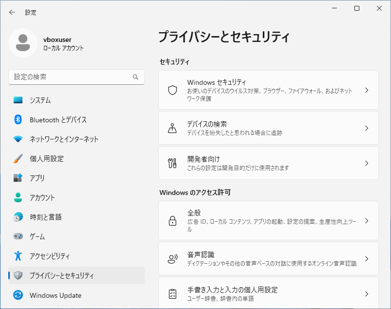
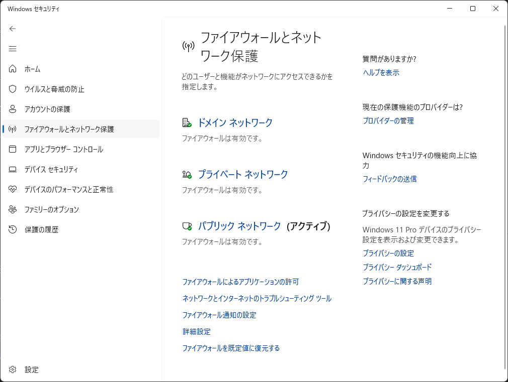
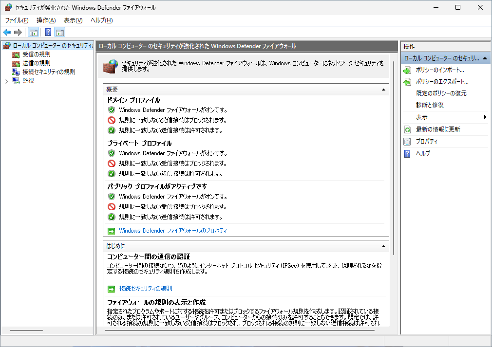
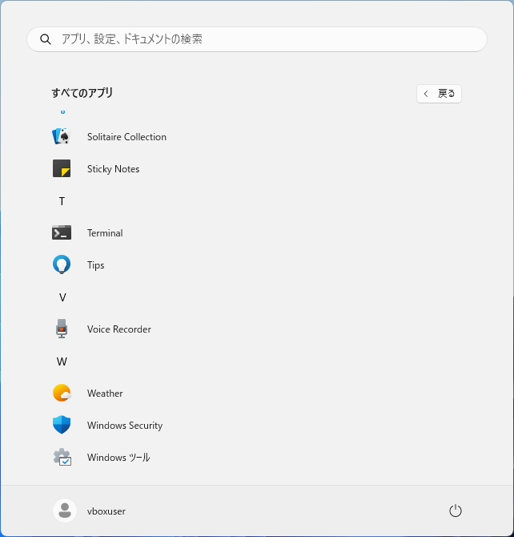
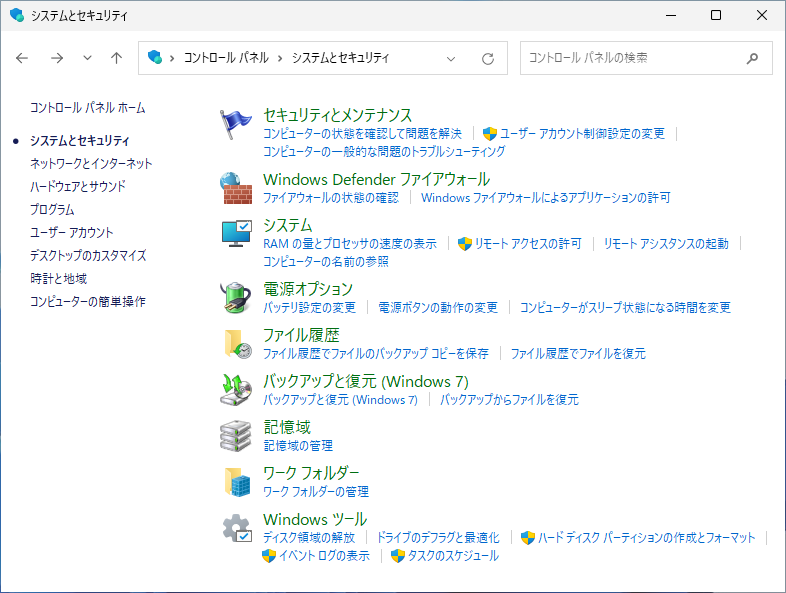
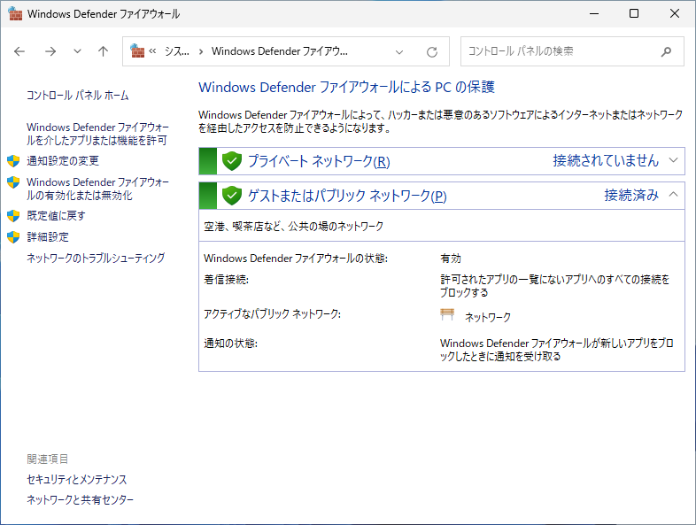
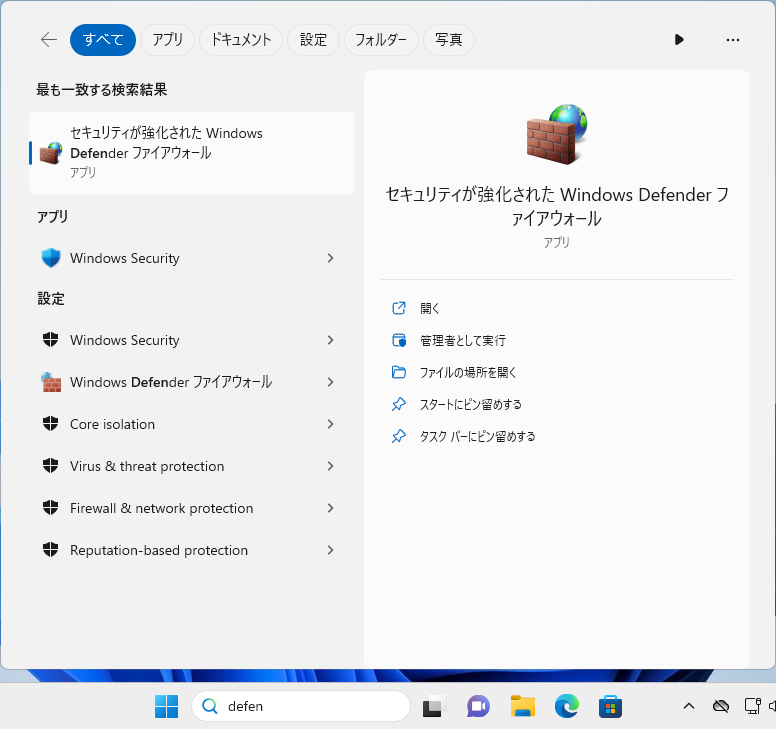

Windows 11 でファイアウォールを表示する3つの方法

新人研修
初心者向け
パソコン未経験
Windows11

「Windows Defender ファイアウォール」は不正アクセスや攻撃からコンピュータを保護するための重要なセキュリティツールです。許可されていない通信を遮断することで悪意のある侵入を防ぎます。一方、一部のアプリケーションやサービスは正常に動作するためにネットワーク通信が必要です。この記事では Windows 11 22H2 を例に、Windows Defender ファイアウォールを表示する方法を3つ紹介します。

||方法|クリック操作|キーボード操作|操作手数|備考|
|---|---|---|---|---|---|
|1|「設定」から「セキュリティセンター」|必要|-|6|容易|
|2|「コントロールパネル」から「ファイアウォール」|必要|-|7|互換|
|3|検索して実行|必要|必要|5|迅速|

## 1. 「設定」画面から表示する

タスクバーにある**スタートボタン**をクリックします。

スタートメニューが表示されたら、「**設定**」をクリックします。

設定画面が表示されたら、左側の「**セキュリティ**」をクリックし、右側の「**Windows セキュリティ**」または「**Windows セキュリティとウイルス対策**」をクリックします。

Windows セキュリティセンターが開いたら、左側の「**ファイアウォールとネットワークの保護**」をクリックします。

Windows Defender ファイアウォールが表示されます。

## 2. コントロールパネルから設定する

### 2.1. コントロールパネルを開く方法

タスクバーにある**スタートボタン**をクリックします。

スタートメニューが表示されたら、右上にある「**すべてのアプリ**」をクリックします。

アプリ一覧が表示されたら下にスクロールし、「**Windows ツール**」をクリックします。

Windows ツールのウィンドウが表示されたら、「**コントロールパネル**」をクリックします。

### 2.2. Windows Defender ファイアウォールを開く

コントロールパネルが表示されたら、「**システムとセキュリティ**」をクリックします。

システムとセキュリティが表示されたら、右側の一覧にある「**Windows Defender ファイアウォール**」をクリックします。

左側のメニューにある「**詳細設定**」をクリックします。

Windows Defender ファイアウォールが表示されます。

## 3. 検索して表示する

タスクバーの検索ボックスをクリックし、キーボードから「**fire**」または「**ファイアウォール**」などのキーワードを入力します。

検索結果に「**セキュリティが強化された Windows Defender ファイアウォール**」が表示されたら、クリックします。

Windows Defender ファイアウォールが表示されます。

