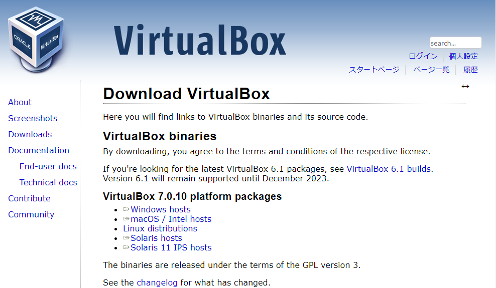

# VirtualBox のインストール
tag: VirtualBox  初心者向け 新人教育

「VirtualBox」は無償の仮想マシン実行環境です。VirtualBox を使うとさまざまなオペレーティングシステムでのテストを容易に行えます。ここでは 18 歳の新入社員向けに VirtualBox のインストール方法を紹介します。

## VirtualBox を使う目的
VirtualBox の主な特徴は以下の通りです。

### 多くのゲストオペレーティングシステム
VirtualBoxは Windows XP、Windows 7、Linux など、さまざまなゲストOSを仮想マシンとして実行できます。

### クローンとスナップショット
仮想マシンをクローンすることで、同じ設定の複数の仮想マシンを簡単に作成できます。また、スナップショットを取得することで、仮想マシンの特定の状態を保存し、後で簡単に戻すことができます。

### USBデバイスのサポート
VirtualBox は USB デバイスの仮想マシンへの接続をサポートし、USB ストレージ、プリンタ、カメラなどのデバイスを仮想マシン内で利用できます。

## VirtualBox のシステム要件
VirtualBox を実行するためのシステム要件を以下に示します。

- オペレーティングシステム: Windows 8.1, 10, 11 の 64bit 版。 
- プロセッサ（CPU）: 仮想化テクノロジをサポートしたモダンなCPU。
- メモリ（RAM）: 一般的に、4 GB以上のRAMが推奨されます。
- ハードディスクの空き容量: VirtualBox のインストールに必要なハードディスク容量は約 30 MB です。 大規模な仮想マシンを実行する場合、十分なディスクスペースが必要です。

<!-- ※参考ページ：[VirtualBox.org > Documentation > End-user docs](https://www.virtualbox.org/wiki/End-user_documentation) -->

ここでは Virtual Box バージョン 7.0.10 を Windows 11 にインストールする手順を説明します。

### VirtualBox のインストール

VirtualBox のダウンロードページにアクセスします。 
[VirtualBox - Downloads](https://www.virtualbox.org/wiki/Downloads)

Windows host のパッケージをダウンロードします。

インストーラをダウンロードしたら、ファイルを実行します

セットアップ画面が表示されたら、「Next」をクリックします。

インストールする機能の選択画面が表示されたら、「Next」をクリックします。

ネットワークが一時的にリセットされる警告画面が表示されたら、「Yes」をクリックします。

Python に関する画面が表示されたら、「Yes」をクリックします。

インストールの確認画面が表示されたら、「Install」をクリックします。

インストールの完了画面が表示されたら、「Finish」をクリックします。

VirtualBox のメイン画面が表示されたら、インストール作業の完了です。

