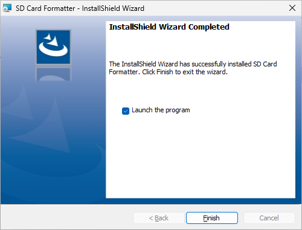

# SDメモリカードフォーマッターのインストール
tag: SDカード 初心者向け 新人教育 新人応援 Windows11

SD メモリカードフォーマッターは、SDカードや microSD カードを初期化するための無料のツールです。この記事では 16 歳の高校生向けに SDメモリカードフォーマッターのインストール手順を紹介します。

## SDメモリカードフォーマッターを使う目的
SD メモリカードフォーマッターは以下のような用途で使われます。

### ファイルシステムの修復
SD カードがファイルシステムのエラーや破損によって正しく動作しない場合、SD カードフォーマッタを使用してフォーマットし、ファイルシステムを修復し再構築することができます。

### カードの互換性確認
特定のデバイスやアプリケーションでSDカードを使用する前に、SDカードフォーマッタを使用して適切なファイルシステム（例：FAT32、exFAT）およびクラス（例：SDHC、SDXC）にフォーマットし、互換性を確認することがあります。

### カードの再利用
古いSDカードを再利用する場合、SDカードフォーマッタを使用してカードをクリーンスレートに戻し、新しいデータを保存できるようにします。

## SD メモリカードフォーマッターのシステム要件
SD メモリカードフォーマッターのシステム要件は以下の通りです。

- オペレーティングシステム: Windows（7,8,8.1,10,11）、Mac、Linux
- SDインタフェースデバイス：PCのSDカードスロットまたはUSB SDカードリーダーを使用することができます。

ここでは  Windows 11 へのインストール方法を紹介します。

## SD メモリカードフォーマッターのインストール方法
SDアソシエーションの SD メモリカードフォーマッターのページにアクセスします。

[SDメモリカードフォーマッター Windows用](https://www.sdcard.org/ja/downloads-2/formatter-2/sd-memory-card-formatter-for-windows-download/)

使用許諾契約の内容を確認して、「同意します」をクリックし、ZIPファイルをダウンロードします。

ダウンロードした ZIP ファイルを適当なフォルダに展開します。

展開したフォルダの中にあるインストーラをダブルクリックします。

インストーラが起動したら、「Next」をクリックします。

使用許諾契約の内容を確認して、「I accept the terms in the license agreement」を選択し、「Next」をクリックします。

インストール先の指定が表示されたら、「Next」をクリックします

インストール準備完了が表示されたら、「Install」をクリックします。

ユーザーアカウント制御が表示されたら、「はい」をクリックします。

インストールが完了したら、「Finish」をクリックします。

ユーザーアカウント制御が表示されたら、「はい」をクリックします。

SDメモリカードフォーマッターが起動したら、インストール作業の完了です。

<!--
## SD メモリカードフォーマッターの使い方
### SDカードの挿入
SDカードまたはマイクロSDカードをコンピューターに挿入します。カードが認識され、フォーマット対象として表示されるはずです。

### SDメモリーカードフォーマッターの起動
コンピューターにインストールされたSDメモリーカードフォーマッターを起動します。一般的に、スタートメニューからアプリケーションを探すか、デスクトップアイコンをダブルクリックします。

### SDカードの選択
フォーマット対象となるSDカードを選択します。フォーマッターのメインウィンドウには、接続されたカードの一覧が表示されます。フォーマットしたいカードを選択してください。

### フォーマットオプションの設定
SDメモリーカードフォーマッターには、フォーマットオプションを設定するための設定が提供されます。一般的なオプションにはファイルシステム（FAT32、exFAT、NTFSなど）やクラスターサイズの選択が含まれます。デフォルトの設定を使用することもできます。

### フォーマットの実行
フォーマットオプションが設定されたら、「フォーマット」または「実行」ボタンをクリックしてフォーマットを開始します。このプロセスは数分から数十分かかる場合があります。

### 完了と確認
フォーマットが完了すると、成功したメッセージが表示されるはずです。SDカードはファクトリー設定に戻り、再度使用することができます。

### SDカードの取り外し
フォーマットが完了したら、SDカードをコンピューターから安全に取り外します。
-->