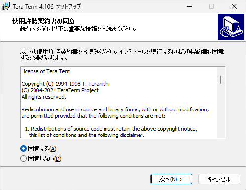

# ターミナルエミュレータ Tera Term のインストール
tag:TeraTerm 初心者向け　新人教育 新人応援　Windows11

Tera Term　は　Windows　用の無料のターミナルエミュレータソフトウェアです。遠隔にあるサーバへのTelnet、SSHなどを介したリモート接続、周辺機器やセンサとのシリアル通信に使用されます。

## Tera Term を使う目的
Tera Term は以下のような用途で使われます。以下はの主な特徴です：

### リモートサーバーへのアクセス
サーバーやネットワークデバイスにTelnetを介してリモートアクセスするためにTera Termを使用します。システム管理者やネットワークエンジニアは、遠隔地からサーバーにアクセスして設定、監視、トラブルシューティングを行います。

### シリアル通信
Tera Termはシリアルポートを介してデバイスとの通信を可能にし、組み込みシステムのデバッグやプログラムのアップロード/ダウンロードなどに使用されます。

## セキュアなアクセス
Tera TermはSSHプロトコルをサポートしており、セキュアなリモートアクセスを提供します。パスワードや認証情報の安全性が重要な場面で利用されます。

## Tera Term のシステム要件

Tera Term は Windows 2000 以降の OS で動作します。
ここでは Tera Term v 4.106 を例にして Windows 11 へのインストール方法を紹介します。

## Tera Term のインストール方法

窓の杜の Tera Term の紹介ページにアクセスし、インストーラを「窓の杜からダウンロード」します。
[https://forest.watch.impress.co.jp/library/software/utf8teraterm/](https://forest.watch.impress.co.jp/library/software/utf8teraterm/)

インストーラをダウンロードしたら、ファイルをダブルクリックし、インストーラを起動します。

ユーザーアカウント制御が表示されたら、「はい」をクリックします。

言語の選択が表示されたら、「OK」をクリックします。

使用許諾契約の内容を確認して、「同意する」を選択し、「次へ」をクリックします。

インストール先の指定が表示されたら、「次へ」をクリックします

コンポーネントの選択が表示されたら、「次へ」をクリックします。

言語の選択が表示されたら、「次へ」をクリックします。

プログラムグループの指定が表示されたら、「次へ」をクリックします。

追加タスクの選択が表示されたら、「次へ」をクリックします。

インストール準備完了が表示されたら、「インストール」をクリックします。

Tera Term のインストール完了画面が表示されたら、「完了」をクリックします。

これでインストール作業の完了です。