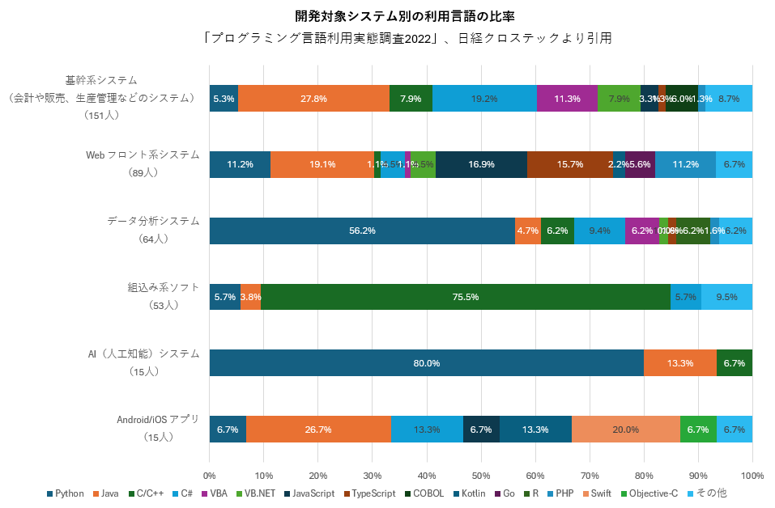

# 「実際に仕事で使われているプログラミング言語」の統計データの紹介

近年、[高校生のなりたい職業TOP3に「システムエンジニア・プログラマー」が入る](https://webtan.impress.co.jp/n/2023/01/10/44057)など、システムエンジニア・プログラマーが注目されています。

人気上昇に伴い、最近は様々な会社が「高収入が見込めるプログラム言語のランキング」や「人気のあるプログラミング言語のランキング」等を発表しています。これらの情報は学生や未経験にとってプログラミング言語を選択する際に大いに参考になります。

一方で「実際に仕事で使われているプログラミング言語」の情報はほとんどありません。今回、３つの公開情報を見つけたのでここで紹介します。データは見る視点により様々な感想がでてくるので個人的な解釈を控えます。

# paiza のプログラミング言語に関する調査（2022年版）

ITエンジニア向けの転職・就職・学習プラットフォーム「paiza（パイザ）」を運営するpaiza株式会社が実施した57万人の登録者数の分析結果です。

プログラミング言語の基礎知識保有者の割合

## 実務経験もしくは学習経験のある言語

# IEEE の The Top Programming Languages

IEEE は米国の電子工学および情報工学分野の学会です。年に1度プログラミング言語に関する読者アンケートを行い、結果を「The Top Programming Languages」として公開しています。その中の「Job（求人）分野の言語ランキング」を紹介します。

# IPA のソフトウェア開発分析データ集

１例目は独立行政法人　情報処理推進機構 (IPA) が公開している 「[ソフトウェア開発 分析データ集 2022](https://www.ipa.go.jp/digital/chousa/metrics/hjuojm000000c6it-att/000102171.pdf)」です。その中の「ソフトウェア開発プロダクトで使われているプログラミング言語の累積件数」を紹介します。

## 「ソフトウェア開発プロダクトで使われているプログラミング言語の累積件数」

### データ提供企業

データを提供したのは以下の35社です。

|企業名1|企業名2|
|(株)インテック|(株) DTS|
|SCSK (株)|東芝情報システム(株)|
|(株) SBC|(株)東邦システムサイエンス|
|NEC ソリューションイノベータ(株)|ニッセイ情報テクノロジー(株)|
|NTT ソフトウェア(株)|日本電気(株)|
|(株) NTT データ|日本電子計算(株)|
|(株) NTT データビジネスシステムズ|日本ユニシス(株)|
|(株) OKI ソフトウェア|(株)野村総合研究所|
|沖電気工業(株)|パナソニック(株)|
|キヤノン IT ソリューションズ(株)|日立 INS ソフトウェア(株)|
|クボタシステム開発(株)|(株)日立製作所|
|(株)構造計画研究所|(株)日立ソリューションズ|
|(株)ジャステック|富士通(株)|
|新日鉄住金ソリューションズ(株)|(株)プリマジェスト|
|住友電工情報システム(株)|三菱電機インフォメーションシステムズ(株)|
|(株)ソルクシーズ|リコーIT ソリューションズ(株)|
|大同生命保険(株)|(株)両備システムズ|
|TIS (株)||

### 数値データ

|1|Java|626|
|2|COBOL|240|
|3|Visual Basic.NET|137|
|4|C#|112|
|5|C|83|
|6|VB|58|
|7|C++|50|
|8|PL/SQL|30|
|9|JavaScript|28|
|10|PHP|11|
|11|Shell スクリプト|8|
|12|Pro*C|7|
|13|Perl|5|
|14|HTML|5|
|15|Delphi|5|
|16|PL/I|4|
|17|ABAP|3|
|18|XML|2|
|19|Python|2|
|20|アセンブラ|1|
|21|Ruby|1|
|23|その他|58|

### グラフ

# 日経クロステックの読者アンケート

２例目はビジネス雑誌の日経クロステックが公開している「[プログラミング言語利用実態調査2022](https://xtech.nikkei.com/atcl/nxt/column/18/02246/110200002/)」です。読者457人のアンケートの結果になります。

## 「普段使っているプログラミング言語」

「1.あなたが現在使っているプログラミング言語は何ですか（最大３個）」と「2.あなたが最も使っているプログラミング言語は何ですか」という設問の回答です。

1から2を引く事で「２番目３番目に使っているプログラム言語」を計算しました。

### 数値データ

[プログラミング言語利用実態調査2022](https://xtech.nikkei.com/atcl/nxt/column/18/02246/110200002/)、日経クロステックより引用

||プログラミング言語|最も使っている言語|２番目３番目に使っている言語|
|1|Java|83|49|
|2|Python|81|88|
|3|C/C++|66|43|
|4|C#|50|52|
|5|VBA|31|57|
|6|JavaScript|24|110|
|7|VB.NET|18|18|
|8|TypeScript|17|31|
|9|PHP|14|28|
|10|COBOL|9|11|
|11|Go|8|9|
|12|Ruby|8|26|
|13|Rust|7|19|
|14|Kotlin|5|11|
|15|HTML/CSS||71|
|16|R||13|
|17|Classic Visual Basic||13|
|18|Perl||12|

### グラフ

最も利用しているプログラミング言語と利用しているプログラミング言語
「プログラミング言語利用実態調査2022」、日経クロステックより引用

## 「開発対象システム別の利用言語の比率」

### 数値データ

[プログラミング言語利用実態調査2022](https://xtech.nikkei.com/atcl/nxt/column/18/02246/110200002/)、日経クロステックより引用

||Python|Java|C/C++|C#|VBA|VB.NET|JavaScript|TypeScript|COBOL|Kotlin|Go|R|PHP|Swift|Objective-C|その他|
|基幹系システム（会計や販売、生産管理などのシステム）（151人）|5.3%|27.8%|7.9%|19.2%|11.3%|7.9%|3.3%|1.3%|6.0%||||1.3%|||8.7%|
|Web フロント系システム（89人）|11.2%|19.1%|1.1%|4.5%|1.1%|4.5%|16.9%|15.7%||2.2%|5.6%||11.2%|||6.7%|
|データ分析システム（64人）|56.2%|4.7%|6.2%|9.4%|6.2%|1.6%|0.0%|1.6%||||6.2%|1.6%|||6.2%|
|組込み系ソフト（53人）|5.7%|3.8%|75.5%|5.7%||||||||||||9.5%|
|AI（人工知能）システム（15人）|80.0%|13.3%|6.7%||||||||||||||
|Android/iOS アプリ（15人）|6.7%|26.7%||13.3%|||6.7%|||13.3%||||20.0%|6.7%|6.7%|

### グラフ

## 「利用言語別の対象システムの内訳」

### 数値データ

開発対象システム別の利用言語
「プログラミング言語利用実態調査2022」、日経クロステックより引用

|順位|プログラミング言語|合計人数|基幹系|Web フロント系|データ分析|組込み系|AI（人工知能）|Android/iOS|
|1|Python|69|8|9|36|3|12|1|
|2|Java|68|42|15|3|2|2|4|
|3|C/C++|58|12|1|4|40|1|0|
|4|C#|44|29|4|6|3|0|2|
|5|VBA|22|17|1|4|0|0|0|
|6|JavaScript|20|5|14|0|0|0|1|
|7|VB.NET|17|12|4|1|0|0|0|
|8|TypeScript|16|2|13|1|0|0|0|
|9|PHP|12|2|9|1|0|0|0|
|10|COBOL|9|9|0|0|0|0|0|
|11|Go|4|0|4|0|0|0|0|
|11|R|4|0|0|4|0|0|0|
|11|Kotlin|4|0|2|0|0|0|2|
|14|Swift|3|0|0|0|0|0|3|
|15|Objective-C|1|0|0|0|0|0|1|
|16|その他|28|13|5|4|5|0|1|

### グラフ

## 「転職者の基礎知識保有者の比率」

|順位|プログラミング言語|基礎知識保有者の比率|
|---|---|---|
|1|Java|32.4%|
|2|Python3|25.5%|
|3|JavaScript|22.4%|
|4|PHP|18.0%|
|5|C|17.8%|
|6|C#|15.7%|
|7|C++|11.2%|
|7|Ruby|11.2%|
|9|Visual Basic (VB.NET)|5.8%|
|10|Perl|3.1%|
|11|Swift|2.9%|
|12|TypeScript|2.6%|
|13|Go|2.4%|
|14|Sass|2.3%|
|15|Objective-C|1.8%|
|16|Kotlin|1.2%|
|17|Scala|1.0%|

