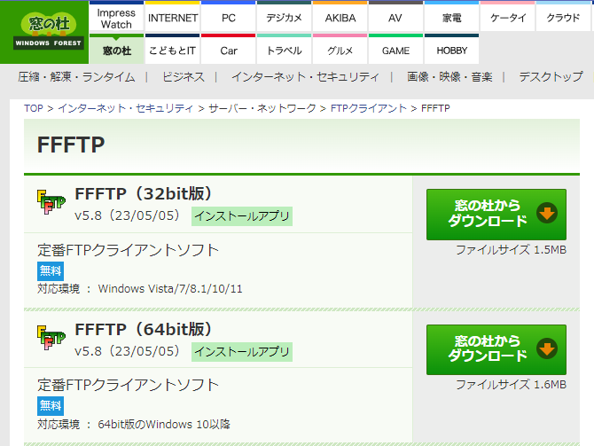
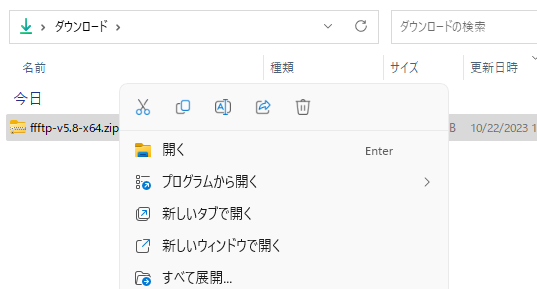
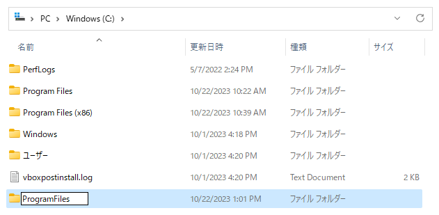

# FTP クライアントソフト FFFTP のインストール
初心者向け
新人教育
KeePass
Windows11

FFFTP は、Windows 向けの無料のFTPクライアントソフトウェアです。日本語UIを持ち、漢字のファイル名を正しく扱う事ができます。ここでは 18 歳の新入社員向けに FFFTP のインストール方法を紹介します。

## FFFTP を使う目的
FFFTP は以下のような目的で使われます。

### ウェブサイトの管理
ウェブデザイナーやウェブ開発者は、ウェブサーバーへのファイルのアップロードやダウンロード、ファイルの管理のためにFFFTPを使う事ができます。

### リモートデバイスへのファイル転送
FTP に対応している機器へのファイル転送が必要な場合、FFFTPは非常に便利です。例えば、画像記録装置からのファイルのダウンロードができます。

### セキュアなファイル転送
FFFTPはSSL/TLSをサポートしており、セキュアなファイル転送が可能です。

## FFFTP のシステム要件
FFFTP は以下の環境で動作します。

- FFFTP（32bit版）
  - 対応環境 ： Windows Vista/7/8.1/10/11

- FFFTP（64bit版）
  - 対応環境 ： 64bit版のWindows 10以降

ここでは FFFTP（64bit版） v5.8 を例にして、Windows 11 へのインストール方法を紹介します。

### FFFTP のインストール

窓の杜の FFFTP の紹介ページにアクセスし、「窓の杜からダウンロード」をクリックします。

[https://forest.watch.impress.co.jp/library/software/ffftp/](https://forest.watch.impress.co.jp/library/software/ffftp/)

ZIPファイルをダウンロードしたら、ファイルを展開します。

展開したファイルを適当なフォルダにコピーします。ここでは例として C:\ProgramFiles というフォルダを作り、そこにコピーします。

これでセットアップ作業は完了です。FFFTP を使う時は C:\ProgramFiles\ffftp-v5.8-x64\ffftp.exe を起動します。 

<!--
### FFFTP の使い方

FFFTPを起動:
インストールが完了したら、FFFTPを起動します。デスクトップのショートカットをダブルクリックするか、スタートメニューからアプリケーションを見つけて起動します。

FTPサーバーへの接続:
FFFTPを起動したら、FTPサーバーに接続するための情報（ホスト名、ユーザー名、パスワードなど）を入力します。接続設定を保存して、必要に応じて設定をカスタマイズできます。

これで、FFFTPが正常にインストールされ、FTPサーバーに接続してファイルを転送できるようになります。必要に応じて、FTP操作のための詳細な設定やカスタマイズを行うことができます。
-->