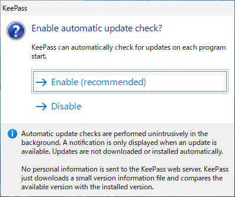

# パスワード管理ソフト KeePass のインストール
初心者向け
新人教育
KeePass
Windows11

「KeePass」はパスワードの管理と保護を目的とするフリーソフトウェアです。Windows、macOS、Linux などのさまざまなプラットフォームで利用できます。ここでは 18 歳の新入社員向けに KeePass のインストール方法を紹介します。

## KeePass を使う目的
KeePass は以下のような目的で使われます。

### パスワードの一元管理
一般的に多くの人は多数のオンラインサービスやアプリケーションを利用しています。それぞれのログイン情報を覚えておくのは困難です。KeePassを使用すると、すべてのパスワードを一つの暗号化されたデータベースに保存して管理することができます。

### ポータビリティと柔軟性
KeePass のポータブルバージョンを利用すると、USBドライブやクラウドストレージに保存して、どのデバイスからでも自分のパスワードにアクセスすることができます。

### カスタム可能なエントリ
各エントリにはユーザー名、パスワードの他に URL や任意のメモを保存することができます。

## KeePass のシステム要件
KeePass にはモダンな環境をサポートする 2.x と昔の環境をサポートする 1.x があります。
ここでは KeePass バージョン 2.55 を例に Windows 11 にインストールする手順を説明します。

2.x のシステム要件は以下の通りです。

- オペレーティングシステム: Windows 7 以降    
- .NET Framework: バージョン 2.0 またはそれ以上が必要。

## KeePass のインストール手順

KeePass の公式ページにアクセスし、KeePass 2.55 -> Installer for Windows (2.55) のダウンロードボタンをクリックします。

[https://keepass.info/download.html](https://keepass.info/download.html)

KeePass の言語ファイルのダウンロードページにアクセスします。

[https://keepass.info/translations.html](https://keepass.info/translations.html)

ページを下にスクロールし、Japanese -> 2.55+ のダウンロードリンクをクリックします。

ファイルのダウンロードが完了したら、KeePass 本体のインストーラをダブルクリックします。

ユーザーアカウント制御が表示されたら、「はい」をクリックします。

「インストーラ言語の選択」が表示されたら、「OK」をクリックします。

使用許諾契約の内容を確認し、「同意する」を選択して、「次へ」をクリックします。

インストール先フォルダの選択が表示されたら、「次へ」をクリックします。

コンポーネントの選択が表示されたら、「次へ」をクリックします。

追加タスクの選択が表示されたら、「次へ」をクリックします。

インストールの準備が完了したら 、「インストール」をクリックします。

インストールが完了したら、「完了」をクリックします。

更新チェックのダイアログが表示されたら、「Enable」をクリックします。

KeePass のメイン画面が表示されたら、本体のインストール作業の完了です。

## KeePass の日本語化手順

KeePass のメニューから、「View」->「Change Language」をクリックします。

Select Language 画面が表示されたら、「Open Folder」ボタンをクリックします

KeePass の言語フォルダが表示されたら、冒頭でダウンロードした言語ファイルの zip ファイルに入っている Japanese.lngx をコピーします。

「対象のフォルダーへの・・・」画面が表示されたら、続行をクリックします。

ファイルをコピーしたら、再び KeePass のメニューから「View」->「Change Language」をクリックします。

Select Language 画面が表示されたら、「Japanese」をクリックします。

KeePass の再起動を促す画面が表示されたら、「はい」をクリックします。

KeePass の再起動後に日本語メニューが表示されたら、作業完了です。

<!--
## KeePass の使い方

データベースの作成:
KeePass2を起動したら、新しいデータベースを作成します。メニューから「ファイル」→「新規」を選択し、マスターパスワードを設定します。このマスターパスワードは非常に重要です。忘れないように注意してください。

エントリーの追加:
データベースに新しいエントリー（パスワードや個人情報）を追加するには、データベースウィンドウで「エントリー」→「新しいエントリー」を選択します。必要な情報を入力し、保存します。

カテゴリの管理:
パスワードを整理するために、カテゴリを作成し、エントリーを適切なカテゴリに配置できます。カテゴリはデータベースウィンドウのツリービューで管理します。

パスワードの生成:
新しいパスワードを生成するには、データベースウィンドウで「ツール」→「パスワード生成」を選択します。強力なランダムパスワードを生成できます。

自動入力:
KeePass2は、ウェブサイトのパスワードを自動的に入力する機能をサポートしています。ブラウザの拡張機能をインストールし、KeePass2と統合することができます。

データベースのバックアップ:
データベースを定期的にバックアップし、安全な場所に保存してください。バックアップはデータの喪失を防ぎます。

セキュリティとログオフ:
KeePass2はデータベースを暗号化して保護します。データベースを使用しないときは必ずログオフしてください。

クラウド同期:
データベースを複数のデバイスで同期するには、クラウドストレージサービスを使用できますが、セキュリティに注意してください。

プラグイン:
KeePass2はプラグインをサポートしており、機能を拡張できます。必要に応じてプラグインを追加してください。

KeePass2は非常にセキュアな方法でパスワードと個人情報を管理するためのツールです。マスターパスワードの管理に特に注意を払い、定期的にバックアップを作成してデータの喪失を防ぎましょう。
-->