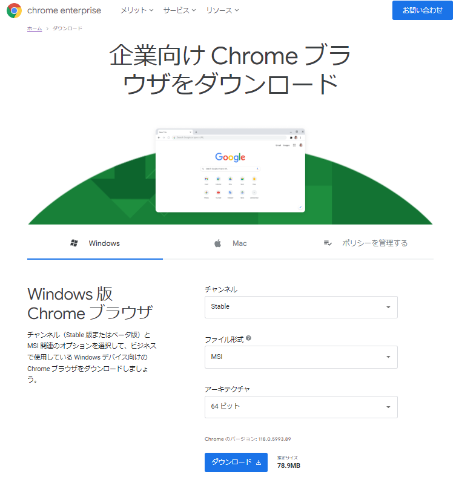
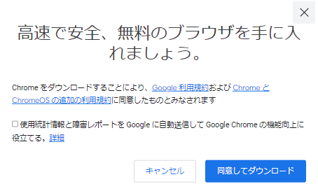
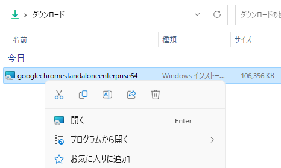
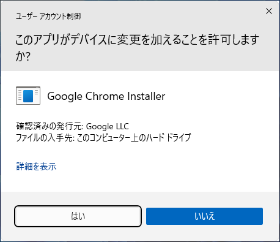
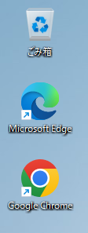
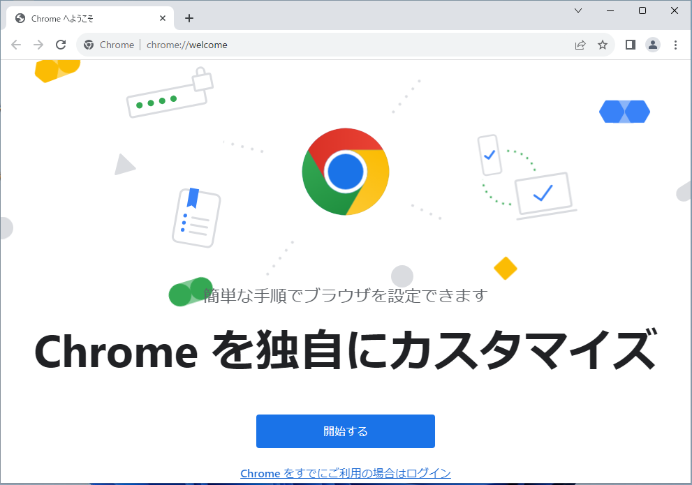

# オフライン環境での Google Chrome のインストール
tag: Chrome 初心者向け 新人教育 Windows11

「Google Chrome」は無料のウェブブラウザです。この記事では 18 歳の新入社員向けに Chrome のオフラインインストール手順を紹介します。

## Chrome を使う目的
Chrome ブラウザは以下のような目的で使われます。

### 高速なブラウジング体験
[Chrome はページの読み込み速度や JavaScript の実行速度が非常に高速です](https://www.gizmodo.jp/2022/05/the-fastest-browsers-on-windows-and-the-downsides.html)。スムーズなウェブブラウジング体験を求めるユーザーにとって魅力的です。

### 拡張機能とカスタマイズ
[Chrome には数千の拡張機能やテーマが提供されています](https://www.lifehacker.jp/article/2212-the-10-best-chrome-extensions-of-2022/)。ユーザーはこれらを利用してブラウザの機能を独自にカスタマイズすることができます。

### クロスプラットフォームの同期
[Googleアカウントとの連携により、ブックマーク、履歴、タブ、パスワードなどのブラウザデータを複数のデバイス間で簡単に同期することができます。](https://atmarkit.itmedia.co.jp/ait/articles/1712/25/news033_2.html)

## Chrome のシステム要件
2023年10月時点の Chrome のシステム要件は以下の通りです。

- Windows
  - オペレーティング システム: Windows 10 以降または Windows Server 2016 以降
  - プロセッサ: Intel Pentium 4 以降のプロセッサ（SSE3 対応）
- Mac
  - オペレーティング システム: macOS Catalina 10.15 以降
- Linux
  - オペレーティング システム: 64 ビット Ubuntu 18.04 以降、Debian 10 以降、openSUSE 15.2 以降、Fedora Linux 32 以降のいずれか
  - プロセッサ: Intel Pentium 4 以降のプロセッサ（SSE3 対応）
- Android
  - オペレーティング システム: Android 7.0（Nougat）

ここでは 企業向け Chrome を例に、Windows 11 にインストールする手順を説明します。

## Chrome のインストール方法
企業向け Chrome のページにアクセスします。ページが表示されたら、チャンネルの項目に「Stable」、ファイル形式の項目に「MSI」、アーキテクチャの項目に「64 ビット」を選択し、「ダウンロード」をクリックします。

[https://chromeenterprise.google/intl/ja_jp/browser/download/#windows-tab](https://chromeenterprise.google/intl/ja_jp/browser/download/#windows-tab)

確認ダイアログが表示されたら、「使用統計情報と障害レポートを Google に自動送信して Google Chrome の機能向上に役立てる」のチェックを外し、「同意してダウンロード」をクリックします。

ダウンロードが完了したら、インストーラをダブルクリックして起動します。

ユーザーアカウント制御画面が表示されたら、「はい」をクリックします

インストールが完了したら、デスクトップアイコンをダブルクリックしてChromeを起動します。

Chrome が起動したら、インストール完了です。

