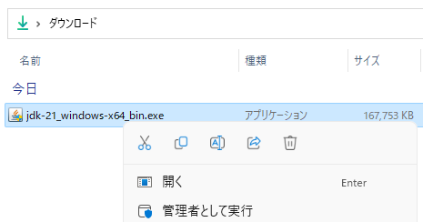

# Windows 11 への Java 17 のインストール
tag: Java 初心者向け 新人教育 新人応援 Windows11

「Java」は無料で使えるプログラミング言語です。Javaは企業アプリケーション、ウェブアプリケーション、モバイルアプリケーション、組み込みシステム、大規模なデータ処理など、さまざまな分野で利用されています。ここでは 18 歳の新入社員向けに Java のインストール方法を紹介します。

## Java を使う目的
VLC は以下のような用途で使われます。

### デスクトップアプリケーション開発
Java は Windows、macOS、Linuxなどさまざまなプラットフォームで利用できます。それぞれの環境でデスクトップアプリケーションを開発するためのツールとして使用できます。

### モバイルアプリケーション開発
Android アプリケーションの開発に Java が広く使用されています。

### ウェブアプリケーション開発
Java はサーバーサイドプログラミング言語として広く使用され、大規模なウェブアプリケーションやサービスを構築するために利用されます。

## Java の種類
Javaはオラクル社を中心に開発と保守が行われていますが、他の会社も異なるバージョンの Java を提供しています。以下は主要なJavaについての情報です。

### Oracle JDK
オラクル社は Oracle JDK（Java Development Kit）と呼ばれる公式な Java の実装を提供しています。Oracle JDKは商用ライセンスとサポートが提供されており、企業向けのアプリケーション開発に使用されます。

### OpenJDK
オープンソースのJava実装で、Java Community Process（JCP）の一部として開発されています。

### AdoptOpenJDK
 Eclipse Adoptium は OpenJDK のコンパイル済みファイルを提供しています。Google Cloud で採用されています。

### Amazon Corretto
Amazon 社は Amazon Corretto というオープンソースのOpenJDKディストリビューションを提供しています。AWSクラウドでのJavaアプリケーション開発に適しています。

### IBM SDK for Java
IBM 社は独自のJava実装であるIBM SDK for Javaを提供しています。これはIBMのハードウェアおよびソフトウェア製品と統合されたJava実装で、企業向けのJavaアプリケーションに適しています。

## Oracle JDK のシステム要件

Oracle JDK は以下の[Windows 環境](https://www.oracle.com/java/technologies/javase/products-doc-jdk17certconfig.html)で[動作](https://docs.oracle.com/javase/jp/8/docs/technotes/guides/install/windows_system_requirements.html)します。

- プロセッサ: Pentium 2 266MHz 以上
- メモリ(RAM): 128MB 以上
- ハードディスクの空き容量: 420MB 以上
- オペレーティングシステム: 64 ビット版の Windows 8, 10, 11 

この記事では Oracle JDK 21 を例にして Windows 11 にインストールする手順を説明します。

## Oracle Java  のインストール方法
Oracle JDK 21 のウェブサイトにアクセスし、「x64 Installer」をクリックします。
[https://www.oracle.com/java/technologies/downloads/#jdk21-windows](https://www.oracle.com/java/technologies/downloads/#jdk21-windows)

インストーラをダウンロードしたら、ファイルをダブルクリックし、インストーラを起動します。

ユーザーアカウント制御が表示されたら、「はい」をクリックします。

ようこそ画面が表示されたら、「次へ」をクリックします

インストール先の指定が表示されたら、「次へ」をクリックします

インストール完了画面が表示されたら、「完了」をクリックします。

