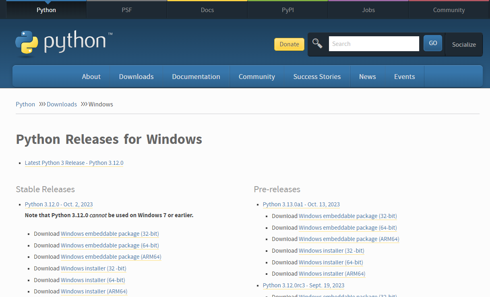
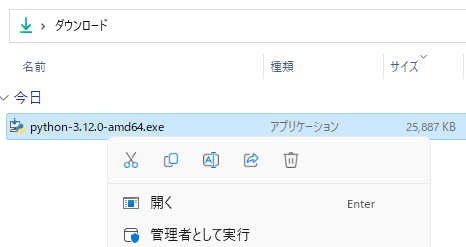
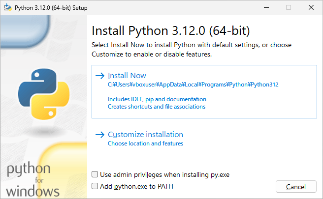
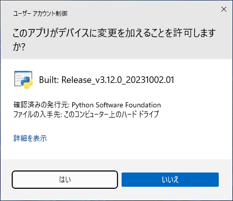
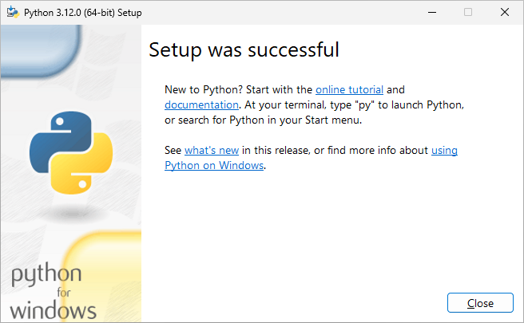

# Windows 11 への Python  のインストール
tag: Python 初心者向け 新人教育 Windows11

Python は無料で使えるプログラミング言語です。さまざまな目的に使用できます。ここでは 18 歳の新入社員向けに Python のインストール手順を紹介します。

## Python を使う目的
Python は以下のような用途で使われます。

### データ解析と科学計算
Pythonはデータサイエンス、機械学習、統計分析などの分野で広く使用されています。ライブラリ（NumPy、Pandas、Matplotlib、SciPy、scikit-learnなど）が豊富に存在し、データの処理、可視化、機械学習モデルの構築が容易です。

### ウェブ開発
Python は Web アプリケーションの開発に広く使用されています。有名なところでは Instagram や Facebook で Django フレームワークが使われています。

### プログラミング学習
Pythonは初学者にとって学習しやすく、プログラミング教育のために幅広く使用されています。これはPythonの哲学の一部であり、"読みやすさが重要"（The Zen of Python）という原則に反映されています。

## Python のシステム要件
Pythonの基本的なシステム要件は以下の通りです。

- オペレーティングシステム: Windows 8、10、 11
- ディスクスペース: Pythonのライブラリや開発ツールを使用する場合、数GB　のディスクスペースが必要になります。
- メモリ: 機械学習などの大規模なデータ解析を行う場合、16GB 以上のが必要です。

ここでは Python　version 3.12.0（64bit版） を例にして、Windows 11 へインストールする手順を紹介します。

## Python のインストール手順

Pythonソフトウェア財団の Windows 版ダウンロードにアクセスし、「Python 3.12.0 の Windows Installer(64-bit)」のリンクをクリックします。

[https://www.python.org/downloads/windows/](https://www.python.org/downloads/windows/)

インストーラをダウンロードしたら、ファイルをダブルクリックし、インストーラを起動します。

インストール画面が表示されたら、「Install Now」をクリックします。

ユーザーアカウント制御が表示されたら、「はい」をクリックします。

インストール完了画面が表示されたら、「Close」をクリックします。

以上でインストール作業は終了です。