# Raspberry Pi Imager のインストールと使い方

Raspberry Pi Imager は、Raspberry Pi 財団が提供している Raspberry Pi の SD カード作成ツールです。このツールを使うと、ユーザーは最新の OS イメージを別途ダウンロードしたり、展開する手間が省け、簡単かつ迅速に Raspberry Pi の起動ディスクを作成できます。

## Raspberry Pi Imager の特徴
Raspberry Pi Imager の主な特徴を以下に挙げます。

### 簡単な操作
Raspberry Pi Imager はわかりやすいインターフェースを提供し、ユーザーが簡単に操作できるよう設計されています。

### 多様なOSイメージの選択と書き込み
Raspberry Pi Imager は、公式 OS だけでなく、他の人気のある Raspberry Pi 向け OS イメージも書き込みが可能です。例えば、Media Player OS や Ubuntu 等のイメージも簡単にSDカードに書き込めます。

### クロスプラットフォーム
Raspberry Pi Imager は、Windows, macOS, Ubuntu などの様々な OS で利用できます。

## Raspberry Pi Imager のシステム要件
Windows 向けの Raspberry Pi Imager のシステム要件を以下に挙げます。

- オペレーティングシステム: 指定なし
- メモリ（RAM）: 指定なし
- インターネット接続：安定したインターネット接続が必要です。
- SDカード：書き込むOSイメージに合わせた容量のカードが必要です。

この記事では Raspberry Pi Imager v1.8.1 を Windows 11 にインストールする手順を説明します。

## Raspberry Pi Imager のインストール手順

Raspberry Pi Imager の公式ウェブサイトにアクセスし、「Download for Windows」をクリックします。

[https://www.raspberrypi.com/software/](https://www.raspberrypi.com/software/
)
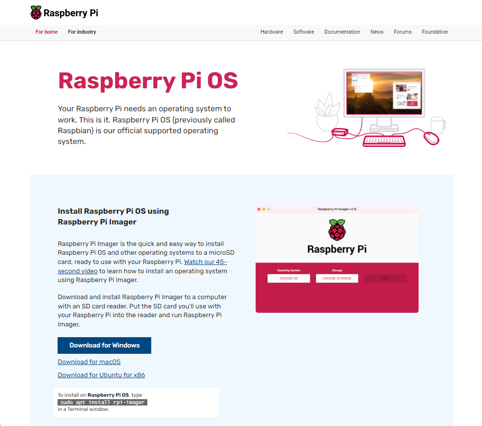

インストーラをダウンロードしたら、ファイルをダブルクリックし、インストーラを起動します。

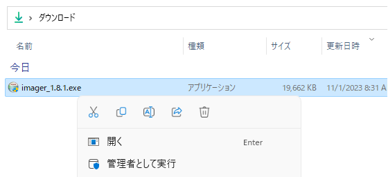

ユーザーアカウント制御が表示されたら、「はい」をクリックします。

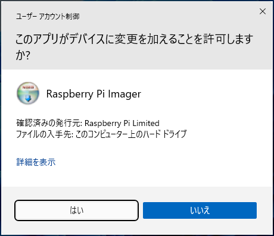

インストーラの画面が表示されたら、「Install」をクリックします。

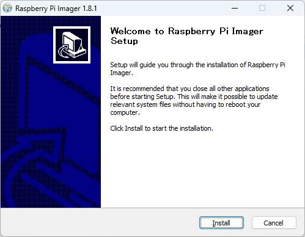

インストール完了画面が表示されたら、「Close」をクリックします。

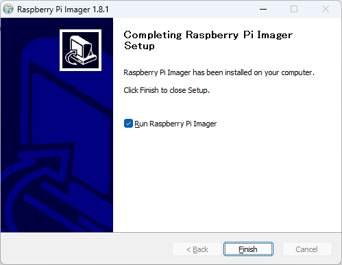

## Raspberry Pi Imager の使い方

### Raspberry Pi Imagerの起動
Raspberry Pi Imager を起動します。インストールが正しく行われていれば、デスクトップにショートカットが作成されているか、スタートメニューから見つけることができます。

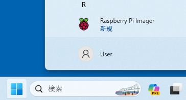

### OSイメージの選択
Raspberry Pi Imager　が起動したら、以下の画面が表示されます。

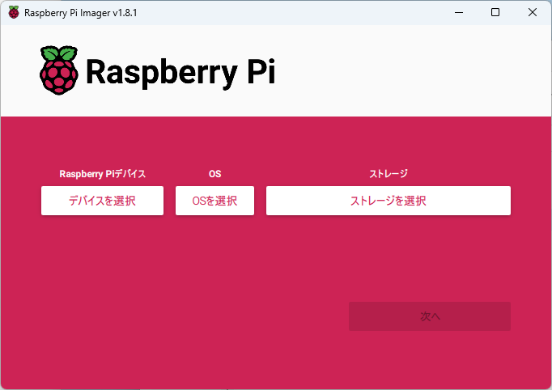

デバイスを選択: ここで Raspberry Pi のモデルを選択します。

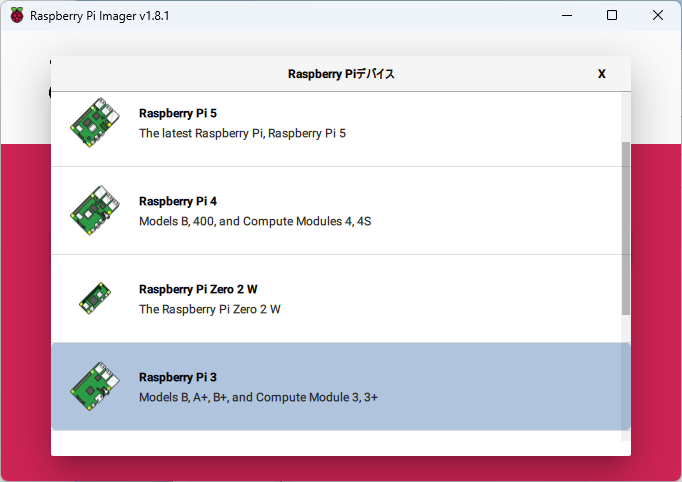

OS を選択: ここでRaspberry Pi の OS を選択します。

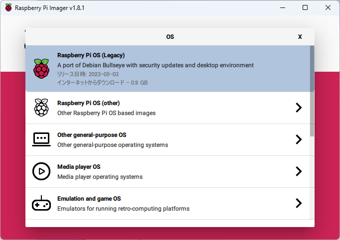

ストレージを選択: 書き込み対象の SD カードを選択します。

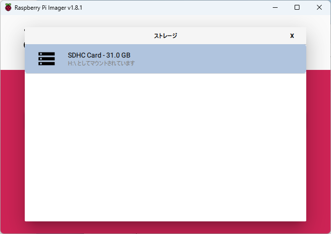

### OSイメージの書き込み
OSイメージとターゲットSDカードを選択したら、「次へ」ボタンをクリックします。

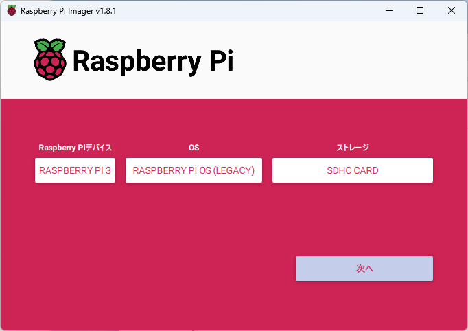

実際に書き込む前に、動作設定を変更できます。変更する場合は「設定を編集する」ボタンをクリックします。

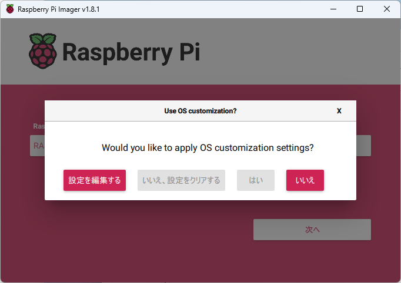

一般タブでは OS の基本設定を変更できます。

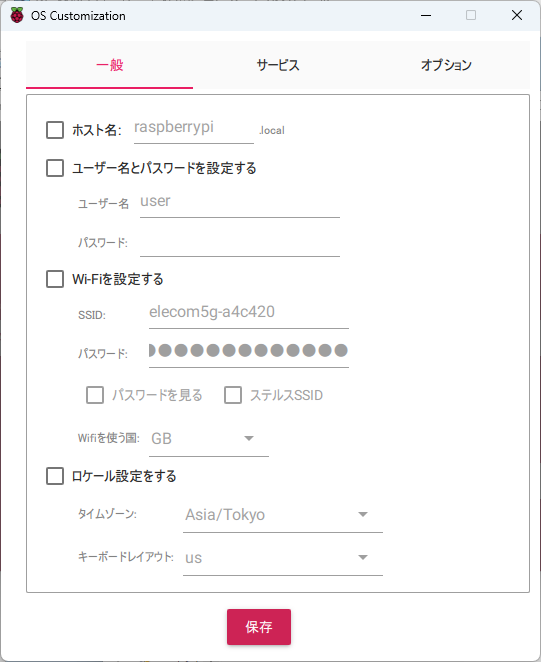

サービスタブではネットワークサービスの設定を変更できます。

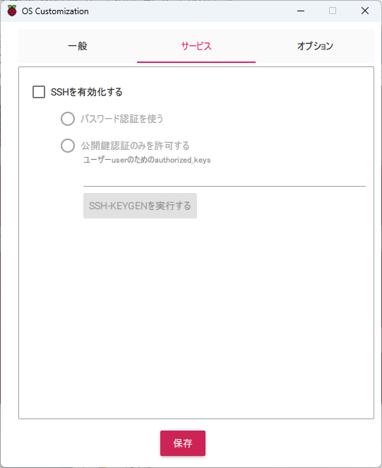

オプションタブでは書き込み動作の設定を変更できます。変更が終わったら「保存」ボタンをクリックします。

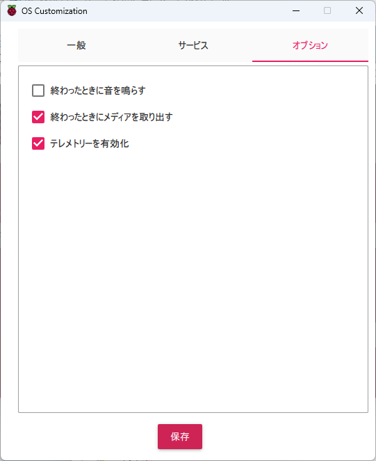

設定の確認画面が表示されます。変更した内容を反映する場合、「はい」ボタンをクリックします。

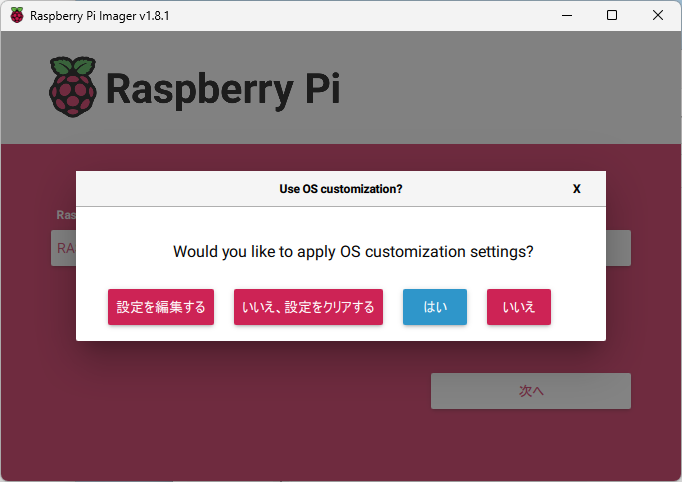

書き込みの確認画面が表示されます。「はい」ボタンをクリックします。

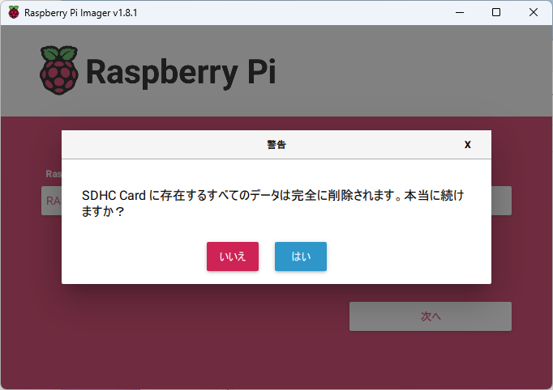

書き込みには数分程度の時間がかかります。

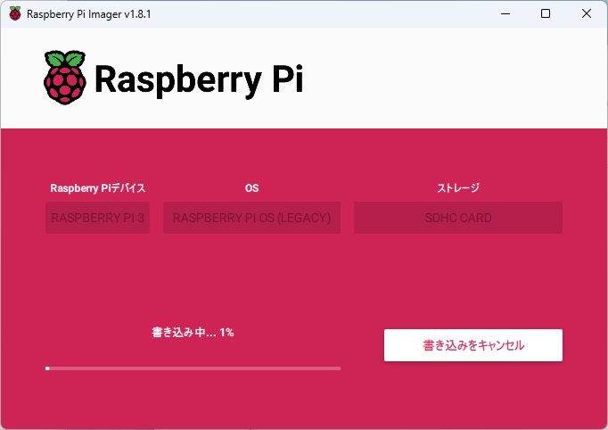

### 書き込み完了
書き込みが完了すると、成功メッセージが表示されます。ここで SD カードを安全に取り外すことができます。

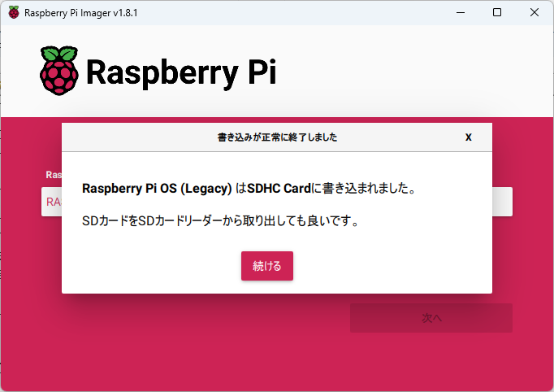

### セットアップと起動
SDカードにOSイメージが書き込まれたら、Raspberry PiにSDカードを挿入して起動します。Raspberry Piの初回起動時に、必要なセットアップ手順を実行して、Raspberry Piを設定できます。
