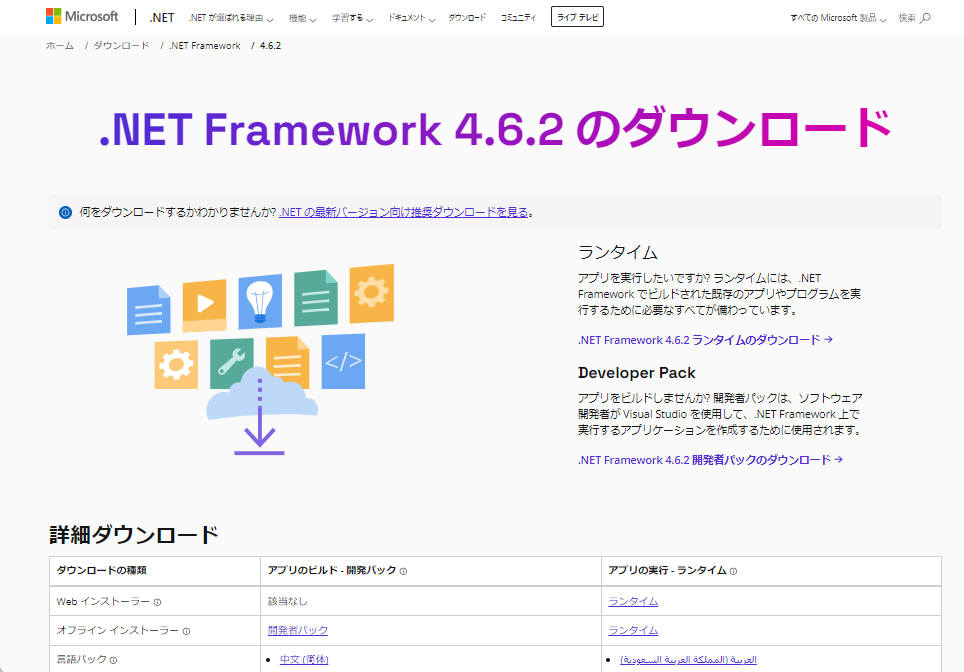
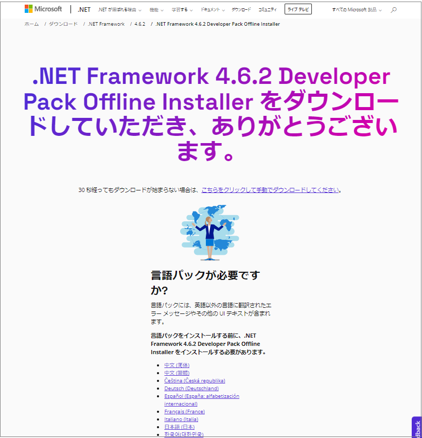
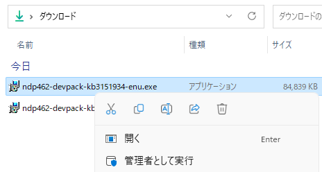
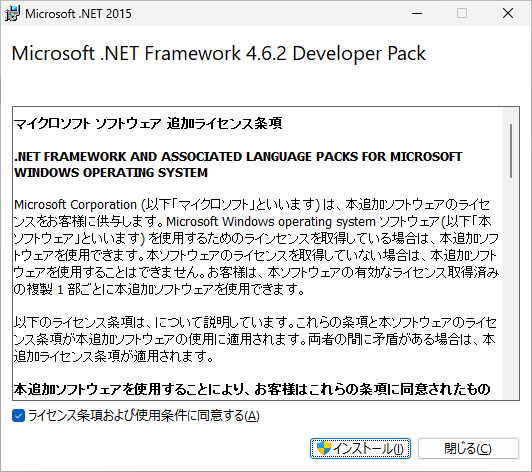
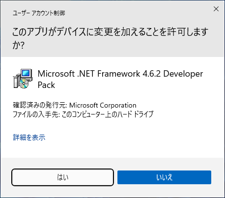
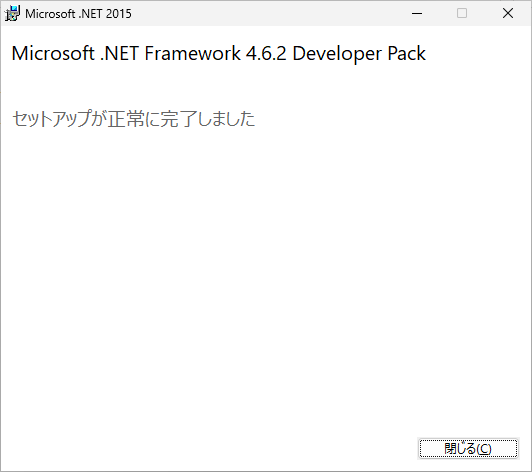
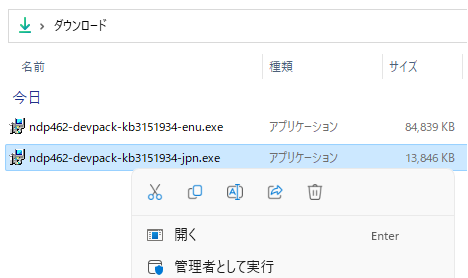
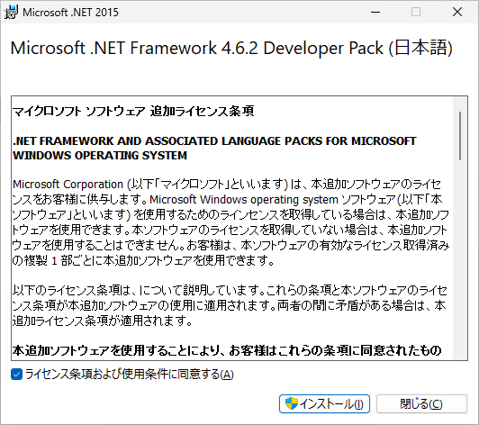
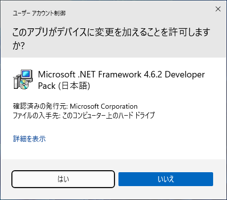
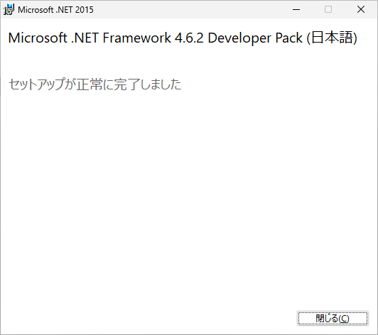

# プログラム開発ツール .NET Framework 4.6.2 のインストール
tag: .NET 初心者向け 新人教育 新人応援 Windows11

.NET Framework は無料で使えるプログラム開発ツールです。多くの企業で Windows のアプリケーション開発で使われています。この記事では 18 歳の新入社員向けに .NET Framework 4.6.2  のインストール手順を説明します。

## .NET Framework の目的
.NET Framework は以下のような用途で使われます。

### デスクトップアプリケーションの開発
.NET Framework は C#、VB.NET、F# などのプログラミング言語を使用して、様々なタイプのアプリケーションを開発できます。

### ウェブアプリケーションの開発
ASP.NETを使用して、Web アプリケーションを開発することができます。

### 互換性の維持
.NET Frameworkは　Windows　にプリインストールされており、多くのアプリケーションがこれを利用して動作します。ただし、特定のアプリケーションが古いバージョンの.NET Frameworkを必要とする場合、以前のバージョンの.NET Framework を手動でインストールする必要があります。

## .NET Framework 4.6.2 のシステム要件
NET Framework 4.6.2 は[次のオペレーティング システム](https://support.microsoft.com/en-us/topic/the-net-framework-4-6-2-offline-installer-for-windows-9dce3874-a9e5-9b11-289d-5594824aafe0)で動作します。
- Windows 7 SP1, 8.1, 10 (x86 および x64)

.NET Framework の[ハードウェア要件](https://learn.microsoft.com/ja-jp/dotnet/framework/get-started/system-requirements)を以下に示します。

- プロセッサ: 1 GHz
- RAM: 512 MB
- 最小空きディスク領域 : 4.5 GB

ここでは .NET Framework 4.6.2 を Windows 11 にインストールする手順を説明します。

## .NET Framework 4.6.2 のインストール手順

.NET Framework 4.6.2 の公式ページにアクセスします。

[https://dotnet.microsoft.com/ja-jp/download/dotnet-framework/net462](https://dotnet.microsoft.com/ja-jp/download/dotnet-framework/net462)

ページが表示されたら、「オフラインインストーラ」の「開発者パック」のリンクをクリックします。

言語パックのページが表示されたら、「日本語（日本）」のリンクをクリックします。

ダウンロードした開発者パックのファイルをダブルクリックし、インストーラを起動します。

使用許諾契約の内容を確認して、「ライセンス条項および使用条件に同意する」を選択し、「インストール」をクリックします。

ユーザーアカウント制御が表示されたら、「はい」をクリックします。

インストール完了画面が表示されたら、「閉じる」をクリックします。

次に日本語の言語パックのファイルをダブルクリックし、インストーラを起動します。

使用許諾契約の内容を確認して、「ライセンス条項および使用条件に同意する」を選択し、「インストール」をクリックします。

ユーザーアカウント制御が表示されたら、「はい」をクリックします。

インストール完了画面が表示されたら、「閉じる」をクリックします。

以上で、インストール作業は終了です。