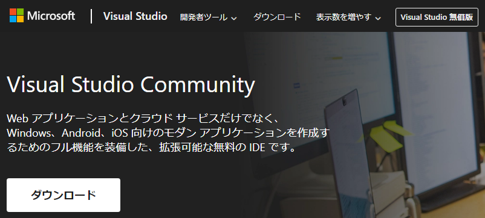
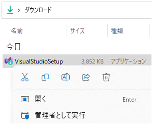
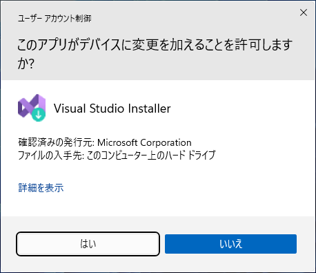
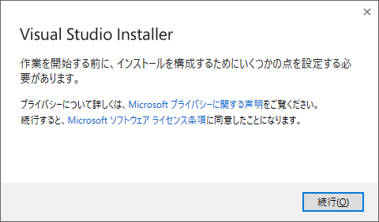
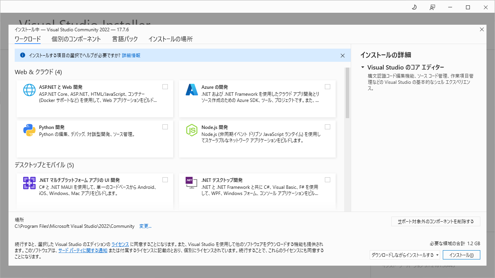
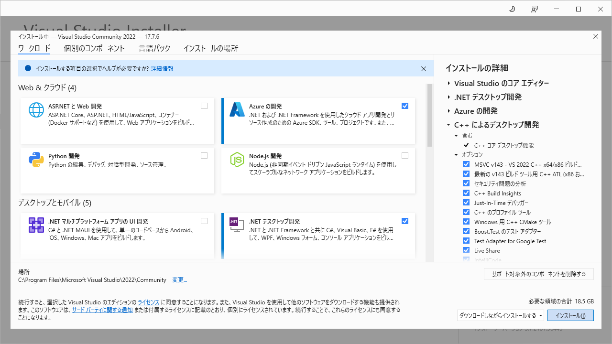
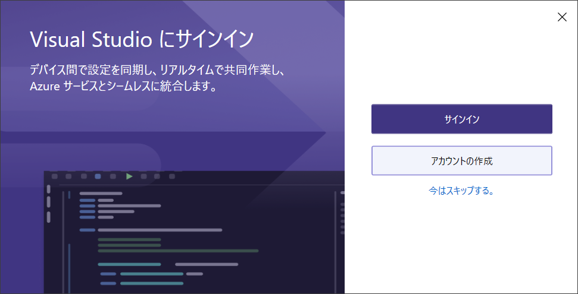
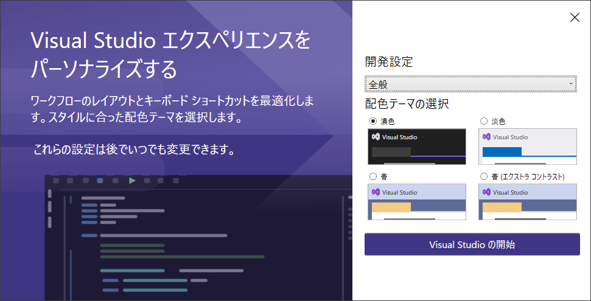
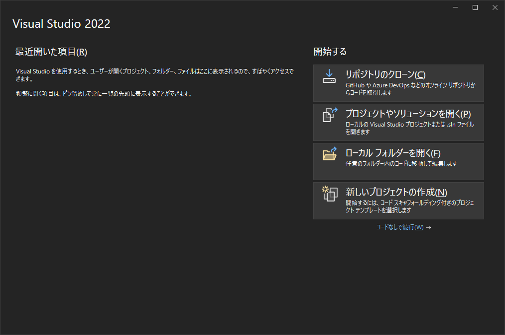

# 統合開発環境 Visual Studio Community 2022  のインストール
tag: Visual Studio Community 2022  初心者向け 新人教育 新人応援 Windows11

Visual Studio Community はマイクロソフトが提供している Windows 向けのソフトウェアの統合開発環境（IDE）です。個人開発者、学生、オープンソースプロジェクトの開発者は無償で利用できます。この記事では 18 歳の大学生向けに Visual Studio Community 2022 のインストール手順を紹介します。

## Visual Studio Community 2022 を使う目的
Visual Studio Community を使う主な目的を3つ挙げます。

### プログラミングの生産性向上
Visual Studio Community 2022 は Professional と同じ機能を持ち、コード生成、デバッグ、テストなど開発者の生産性向上を支援する多くのツールが含まれています。

### Webとクラウドの開発
Visual Studio Community は ASP.NET や Azure など、マイクロソフトの 最新 Web 技術やクラウドサービスとの統合をサポートしています。

### 複数のプログラム言語に対応
Visual Studio Community はマイクロソフトの　C#, VB.NET, C++, F# 言語をはじめ、JavaScript や Node.js, Python, Unity など多くのプログラミング言語に対応しています。

## Visual Studio Community の利用条件
Visual Studio Community は特定の条件下で無償で使用できます。具体的な条件を以下に示します。

### 小規模の法人や組織
PC 250 台未満かつ年間収入 100 万米ドル未満の組織で、5名まで使うことができます。

### 教室での学習と学術的な研究
クラスルーム教育や研究目的で Visual Studio Community Edition を使用できます。

### オープンソースプロジェクト
オープンソースプロジェクトの活動で Visual Studio Community を使うことができます。

### 個人の開発
個人的なソフトウェア開発で Visual Studio Community を使うことができます。

## Visual Studio Community 2022 のシステム要件

[Visual Studio 2022 の推奨スペック](https://learn.microsoft.com/ja-jp/visualstudio/releases/2022/system-requirements)は以下の通りです。

- プロセッサ: ARM64 または x64 プロセッサのクアッドコア以上。
- メモリ(RAM): 16GB 以上
- ハードディスクの空き容量: 最小 850 MB、最大 210 GB の空き領域。ソリッド ステート ドライブ (SSD) へのインストールを推奨。
- オペレーティングシステム: Windows 10, 11
- グラフィックス: 1920 ｘ 1080 以上のディスプレイ

ここでは Visual Studio Community 2022 を Windows 11 にインストールする手順を説明します。

## Visual Studio Community 2022  のインストール手順

Visual Studio Community の公式ウェブサイトにアクセスし、「ダウンロード」ボタンをクリックします。

[https://visualstudio.microsoft.com/ja/vs/community/](https://visualstudio.microsoft.com/ja/vs/community/)

インストーラをダウンロードしたら、ファイルをダブルクリックし、インストーラを起動します。

ユーザーアカウント制御が表示されたら、「はい」をクリックします。

インストーラの画面が表示されたら、「続行」をクリックします。

インストールするコンポーネントの選択画面が表示されたら、必要な機能を選択します。一般には、「Azure の開発」、「.NET デスクトップ開発」などがよく使われます。

機能を選択したら、「インストール」をクリックします。

インストールが終わったらサインイン画面が表示されます。「今はスキップする」をクリックします。

開発設定画面が表示されたら、「Visual Studio の開始」をクリックします。

プロジェクトの開始画面が表示されたら、インストール作業の終了です。

