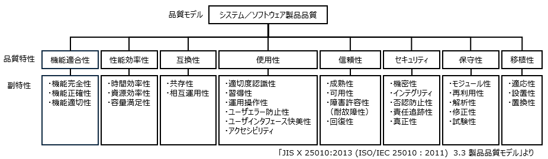
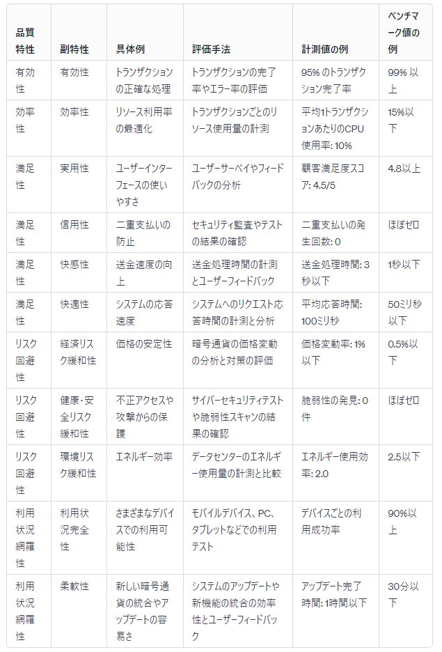

# ISO 25000 のソフトウェアの品質特性とテスト項目の例

[ソフトウェアテストの小ネタのカレンダー | Advent Calendar 2023 - Qiita](https://qiita.com/advent-calendar/2023/software-testing-koneta)の３日目の記事です。

こんにちは。
ソフトウェアを評価しようとしたときに、どういう視点で評価すればよいのかよくわからない、という経験はないでしょうか。

ソフトウェア評価の視点として、1.　**ホワイトボックステスト、ブラックボックステスト**というプログラマ視点の評価、2. **単体テスト、結合テスト、システムテスト**というプログラムの関数に基づく評価、3. **機能要件と非機能要件**という要求書に基づく評価、4. **当たり前品質と魅力的品質**というサービス視点の評価、などいくつかの定番の観点があります。

近年の視点として、5. **ISO 25000 のソフトウェアの品質特性とその副特性**に基づく評価があります。

ISO 25000 は国際規格なので、海外メンバーとソフトウェア開発する際に導入しやすい観点です。ただ ISO 25000 はそれまでの知見を包含する内容で、複数の文書で構成され、説明する視点も多岐にわたるため、最初は読むのに時間がかかります。

この記事では3年目のITエンジニア向けに ISO 25000 の概要を紹介します。

## 【用語解説】ISO について

ISO は国際標準化機構（International Organization for Standardization）の略称です。ISO は世界中で共通の規格を策定し、製品やサービスの品質を向上させるための標準を提供しています。

## ISO 25000 の概要

ISO 25000 は、システム製品とソフトウェア製品の品質に焦点を当てた国際標準です。従来のソフトウェア評価は単体のソフトウェアを主な対象としていました。ISO 25000 は複数のソフトウェアが連係して動作するシステムも対象としている点が新しいです。その分、内容が多岐に渡るため ISO 25000, 25001, 25010, 250011 といった複数の規格書に分冊されています。全ての規格書をまとめて SQuaRE （スクウェア）シリーズと呼びます。日本では JIS 工業規格の「[JIS X 25000 システム及びソフトウェア製品の品質要求及び評価](https://webdesk.jsa.or.jp/books/W11M0070/index)」シリーズとして翻訳されています。

SQuaRE （スクウェア）シリーズの規格番号と表題は以下の通りです。

|分類|ISO 規格番号|JIS 規格番号|表題|
|---|---|---|---|
|品質管理|ISO 25000|JIS X 25000|ＳＱｕａＲＥの指針|
|品質管理|ISO 25001|JIS X 25001|計画及び管理|
|品質モデル|ISO 25010|JIS X 25010|システム及びソフトウェア品質モデル|
|品質モデル|ISO 25011|JIS 未発行|サービス品質モデル|
|品質モデル|ISO 25012|JIS X 25012|データ品質モデル|
|品質測定|ISO 25020|JIS X 25020|品質測定の枠組み|
|品質測定|ISO 25021|JIS X 25021|品質測定量要素|
|品質測定|ISO 25022|JIS X 25022|利用時品質の測定|
|品質測定|ISO 25023|JIS X 25023|システム及びソフトウェア製品の品質の測定|
|品質測定|ISO 25024|JIS X 25024|データ品質の測定|
|品質要求|ISO 25030|JIS X 25030|品質要求の枠組み|
|品質評価|ISO 25040|JIS X 25040|評価プロセス|
|品質評価|ISO 25041|JIS X 25041|開発者，取得者及び独立した評価者のための評価手引|
|拡張|ISO 25051|JIS X 25051|既製ソフトウェア製品に対する品質要求事項及び試験に対する指示|
|拡張|ISO 25062|JIS X 25062|使用性の試験報告書のための工業共通様式|

## ISO25000 品質特性

ISO25000では、ソフトウェアの品質を測るために **利用者から見た利用時の品質**と**開発者から見た製品の品質**に分類し、12 個の主要な品質特性とそれらを細分化した 42 個の副特性を定義しています。各特性について説明します。

## 利用時の品質特性

システム／ソフトウェア利用時の品質特性と副特性を図示します。

各特性の意味は以下の通りです。

|品質特性と副特性|説明|
|---|---|
|有効性|設定された目標や要件をどれだけ効果的に達成できるか。|
|効率性|リソースをどれだけ効率的に利用できるか。|
|満足性|ユーザーがどれだけ満足しているか。|
|&emsp;実用性|ユーザーにとって実用的であり、役立つか。|
|&emsp;信用性|ユーザーに信頼感を与え、期待通りに動作できるか。|
|&emsp;快感性|ユーザーに楽しさや満足感をもたらすか。|
|&emsp;快適性|ユーザーに快適な体験をもたらすか。|
|リスク回避性|ソフトウェアが予測可能で、潜在的なリスクを最小限に抑えるか。|
|&emsp;経済リスク緩和性|ソフトウェアの利用がビジネスや経済においてリスクを軽減するか。|
|&emsp;健康・安全リスク緩和性|ソフトウェアが使用することで生じる健康や安全に関するリスクを軽減するか。|
|&emsp;環境リスク緩和性|ソフトウェアが環境に対して与えるリスクを軽減するか。|
|利用状況網羅性|異なる状況や環境でどれだけ対応できるか。|
|&emsp;利用状況完全性|異なる状況や文脈でどれだけ適応できるか。|
|&emsp;柔軟性|柔軟に拡張や変更ができるか。|

## 製品の品質特性

システム／ソフトウェア製品の８個の品質特性とそれぞれの副特性を図示します。

各特性の意味は以下の通りです。

|品質特性と副特性|説明|
|---|---|
|機能適合性|提供する機能がユーザーのニーズや期待にどれだけ適しているか。|
|&emsp;機能完全性|必要な機能を十分に提供しているか。|
|&emsp;機能正確性|提供する機能が期待通りに正確に動作するか。|
|&emsp;機能適切性|利用者のニーズに適しているか。|
|性能効率性|リソースの使用を最適化し、高い性能を維持できるか。|
|&emsp;時間効率性|実行する機能が所定の時間内にどれだけ速く実行できるか。|
|&emsp;資源効率性|システムリソース（CPU、メモリ）を効果的に利用しているか。|
|&emsp;容量満足性|処理できるデータやユーザーの数に対する容量を評価。|
|互換性|他のシステムやプラットフォームとどれだけ連携できるか。|
|&emsp;共存性|他のソフトウェアと共存し、干渉なく使用できるか。|
|&emsp;相互運用性|他のシステムやプラットフォームと効果的に連携できるか。|
|使用性|ユーザーにとってどれだけ使いやすいか。|
|&emsp;適切度認識性|利用者の期待に適切に応え、理解しやすいか。|
|&emsp;習得性|初めて使うユーザーがどれだけ早く理解して使いこなせるか。|
|&emsp;運用操作性|正確な操作を提供し、ユーザーが簡単に操作できるか。|
|&emsp;ユーザエラー防止性|ユーザーの誤操作を防ぎ、誤って行った場合でも影響を最小限に抑えるか。|
|&emsp;ユーザインタフェース快美性|ユーザーインターフェースが美的で魅力的か。|
|&emsp;アクセシビリティ|身体障害者を含む全ての人が利用しやすいか。|
|信頼性|安定して動作し、障害やエラーが発生しづらいこと。|
|&emsp;成熟性|どれだけ安定しており、問題なく動作するか。|
|&emsp;可用性|必要な時に利用可能であるか。|
|&emsp;障害許容性（耐故障性）|障害やエラーに対してどれだけ耐性があるか。|
|&emsp;回復性|障害から迅速に回復できるか。|
|セキュリティ|データや利用者の情報を保護し、権限のないアクセスから守ること。|
|&emsp;機密性|データや情報をどれだけ機密に保護できるか。|
|&emsp;インテグリティ|データや情報を正確に保ち、改ざんを防げるか。|
|&emsp;否認防止性|ユーザーが行ったアクションや取引を否認できないように保護するか。|
|&emsp;責任追跡性|誰が何を行ったかをトレースできるか。|
|&emsp;真正性|ソフトウェアが本物で信頼性があり、冒用を防げるか。|
|保守性|変更や修正を容易に受け入れ、保守作業がスムーズに行えること。|
|&emsp;モジュール性|構成要素が独立しており、変更や修正が容易か。|
|&emsp;再利用性|他のシステムで再利用できるか。|
|&emsp;解析性|障害の監視やログ取得が容易か。|
|&emsp;修正性|変更や修正が容易か。|
|&emsp;試験性|試験が容易に行えるか。|
|移植性|異なる環境やプラットフォームで簡単に移植できること。|
|&emsp;適応性|異なる環境や要件に適応できるか。|
|&emsp;設置性|インストールが容易か。|
|&emsp;置換性|新しいバージョンに簡単に置き換えられるか。|

## 評価手法と実践

ISO　25000を実践する際は、対象の製品について品質特性に基づいた具体的なテスト項目を作成します。ここでは ChatGPT を使ったテストケースの作成方法を紹介します。

## まとめ

この記事では 1. ISO 25000 の規格の概要 2. ISO25000 の品質特性、3. 暗号通貨の決済システムを例にして具体的なテスト項目、の３点を紹介しました。駆け足で説明したため、かなり省略した内容となってます。不明点などありましたらコメントください。

## 参考文献

SEC journal Vol.10 No.5 Jan. 2015
システム・ソフトウェア品質標準 SQuaRE シリーズの歴史と概要
[https://www.ipa.go.jp/archive/files/000065855.pdf](https://www.ipa.go.jp/archive/files/000065855.pdf)
