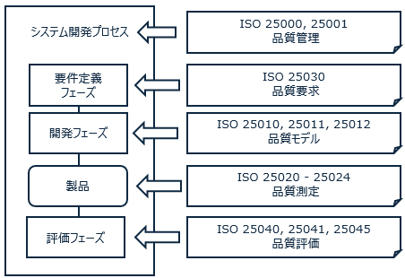
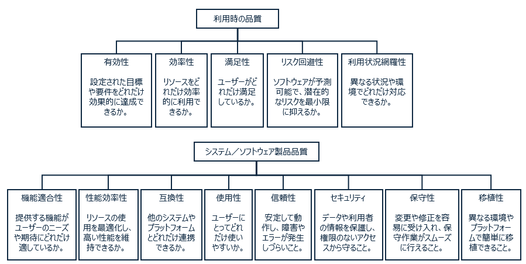
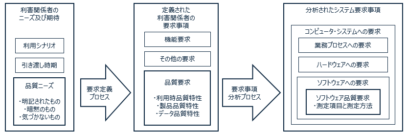
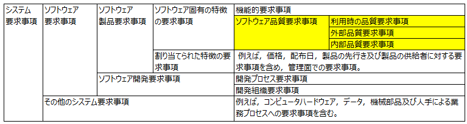
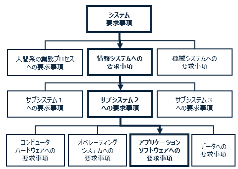
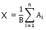
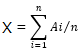
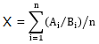
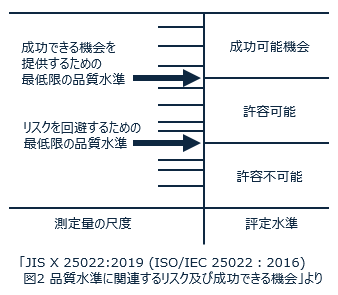
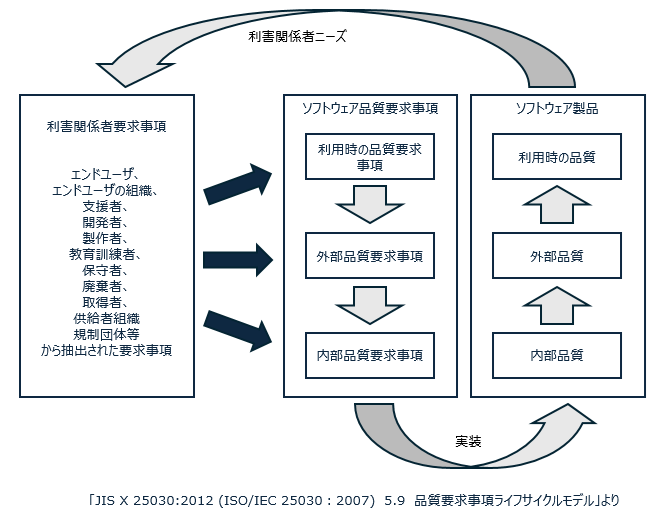

この記事は [ソフトウェアテストの小ネタのカレンダー | Advent Calendar 2023](https://qiita.com/advent-calendar/2023/software-testing-koneta) の 10 日目の記事です。[ISO25000 の品質特性](https://qiita.com/mmake/items/ca97c616af0762a5164d) の続きの内容になります。

## 前回のおさらい

ISO 25000 は**システムとソフトウェアの品質**に焦点を当てた国際標準です。内容が多岐に渡るため ISO 25000, 25010, 25020, 25030... と複数の文書に分かれています。まとめて **SQuaRE （スクウェア）シリーズ**と呼びます。日本では [JIS X 25000 シリーズ](https://webdesk.jsa.or.jp/books/W11M0090/index/?bunsyo_id=JIS+X+25000%3A2017)として規格化されています。

ISO 25010 ではソフトウェアの品質を**利用時の品質**と**製品の品質**に分け、さらに 13 個の**品質特性**に分類しています。[前回](https://qiita.com/mmake/items/ca97c616af0762a5164d)は ChatGPT を使って品質特性に基づく具体的な評価項目の例を紹介しました。

ISO 25000 は国際規格のため様々な国のメンバーが参加するソフトウェア開発プロジェクトに導入しやすいと思います。この記事では５年目以降のプログラマ、QA エンジニア向けに **ISO 25030** の概要を紹介します。

## ISO 25030 品質要求の枠組み

システムの品質がどれだけ良いか、という基準は、そのソフトウェアの利用者や利用目的によって異なります。

|システムの例|重要な利用時品質|重要な製品品質|
|---|---|---|
|医療システム|リスク回避性|信頼性|
|自動車自動運転システム|リスク回避性|セキュリティ|
|Eコマース|満足性|使用性|

システムの品質特性を明確化するために、利害関係者のニーズや期待を品質要求として明確にするプロセスが重要です。

# 1. 要求定義プロセス

要求定義プロセスでは、利害関係者のニーズや期待から、機能要求・品質要求・その他の要求を識別します。利害関係者には、エンドユーザ、意思決定者、関連する規制団体などが含まれます。品質要求は単独で理解することが難しいため、他の要求事項と合わせて仕様化します。

### ポイント
立場が異なる利害関係者は矛盾したニーズをもつことがあります。例えば、意思決定者の要求事項を満たすように決定し、幾つかのエンドユーザの要求事項を採択しないことがあります。結果として、利害関係者の中に、そのソフトウェア製品に満足しない人がいることがあります。考慮しないニーズについてはその論理的根拠を文書化することが望ましいです。

利害関係者の要求事項は、過去の利用経験に基づいて識別されます。完全に新規で類似したシステムが存在しないシステムの場合、利害関係者の真のニーズを識別することは、より困難になる可能性があります。

# 2. 要求事項の分析プロセス

要求分析プロセスでは要求主導の視点を製品の技術的な視点へ変換します。システムの構成要素を定義し、ソフトウェアとの境界及びインタフェースを明確にします。実装の制約により、解決が不可避な制限がある場合、文書化することが望ましいです。

## 品質測定量の選定

ソフトウェアへの品質要求に基づいて品質測定量を選定します。

## 利用時品質の測定量の例
[ISO 25022](https://webdesk.jsa.or.jp/books/W11M0090/index/?bunsyo_id=JIS+X+25022%3A2019) で紹介されている利用時品質の主な測定量を以下に挙げます。
[前回紹介したように](https://qiita.com/mmake/items/ca97c616af0762a5164d)個別の製品に適した品質測定量を使うこともできます。

### 有効性
#### 支援なしで達成した作業の目的の割合
{X=1−ΣAi | X≧0} 
Ai＝作業出力における欠落した目的又は間違った目的の割合の値（最大値＝1） 
#### 作業中に利用者が引き起こしたエラーの数
X＝A 
A＝作業中に利用者が引き起こしたエラーの数 
#### 利用者がエラーを引き起こした作業の割合
X＝A/B 
A＝エラーが内在する作業の数 
B＝作業の総数 
#### エラーを引き起こした利用者の割合
X＝A/B 
A＝エラーを引き起こした利用者の数 
B＝作業を実行した利用者の総数 
### 効率性
#### 作業を成功裏に完了するために要した時間
X＝T 
T＝作業時間 
#### 利用者が生産的な活動を行っている時間の割合
X＝Ta/Tb 
Ta＝生産時間＝作業を完了するのに要した時間−手助け又は支援を得るために要した時間−エラーからの回復に要した時間−無駄な検索に要した時間 
Tb＝タスク時間 
#### 利用者が行った、作業を達成するために必要ではない行動の割合
X＝A/B 
A＝作業の達成に実際には必要のない行動の数 
B＝利用者が行った行動の数 
#### 連続使用後の人間の効率の低下
X＝1−A/B 
A＝現在の人間の効率  
B＝初期の人間の効率 
### 満足性
#### 利用者の全体的な満足性
X＝ΣAi 
Ai＝質問に対する回答 
#### 不満をもつ利用者の割合
X＝A/B 
A＝不満をもつ利用者の数 
B＝システムを使用している利用者の数 
#### 利用者がシステムを信用する程度
X＝A 
A＝信用性の質問票からの心理測定尺度の値 
#### 同種のシステムの平均と比較して利用者が喜びを得る程度
X＝A 
A＝快感性に関する質問票からの心理測定尺度の値 
#### 同種のシステムの平均と比較して利用者が快適である程度
X＝A 
A＝快適性に関する質問票からの心理測定尺度の値 
### リスク回避性
#### 投資収益率
X＝(A−B)/B 
A＝得られた追加利益 
B＝投資額 
#### 期待する投資収益率を達成するためにかかる時間
X＝T 
T＝ROIを達成するための時間 
#### 目標と比較したIT投資（例えば、バランススコアカードの使用）の利益の測定量
X＝Aa/At 
Aa＝IT投資の利益の測定量（実績） 
At＝IT投資の利益の測定量（目標） 
#### 顧客への意図したサービス水準の達成度
X＝A/B 
A＝実際のサービス水準 
B＝意図したサービス水準 
#### 各顧客からの収益
X＝A 
A＝顧客からの収益 
#### 製品を利用することによって起きた健康の問題を報告する製品の利用者数の割合
X＝A/B 
A＝健康の問題を報告する製品の利用者数 
B＝製品の利用者総数 
#### システムの利用によって影響される人に対する危険状況の事象
X＝Aa/At 
Aa＝環境影響（実際の環境影響） 
At＝環境影響（目標の環境影響） 
### 利用状況網羅性
#### 許容できる使用性及びリスクで製品又はシステムを使用できる、意図された利用状況の割合
X＝A/B 
A＝許容できる使用性及びリスクを伴う状況の数 
B＝要求された異なる利用状況の総数 
#### 修正がないか又は単純な修正だけで追加された利用状況（異なる種類の利用者、作業及び環境）で製品が利用できる程度
X＝A/B 
A＝許容可能な利用時品質で製品が利用できる，追加された利用状況の数 
B＝製品が使われる，追加された利用状況の総数 
#### 追加された利用者の要求事項に合致させるために製品を容易に修正できる程度
 
Ai＝i番目の要求事項に対する（JIS X 25023で明示されている）修正性 
B＝利用者が明示した新たな要求事項の総数 
#### 製品が特定の知識、スキル（技能）又は経験のない人々が利用できる程度
X＝A/B 
A＝特定の知識，スキル（技能）又は経験のない，追加された，製品を使用できる利用者のグループの数 
B＝特定の知識，スキル（技能）又は経験のない，潜在的に製品を利用する可能性のある利用者のグループの総数 

## 製品品質の測定量の例
[ISO 25023](https://webdesk.jsa.or.jp/books/W11M0090/index/?bunsyo_id=JIS+X+25022%3A2019) で紹介されている製品品質の主な測定量を以下に挙げます。
[前回紹介したように](https://qiita.com/mmake/items/ca97c616af0762a5164d)個別の製品に適した品質測定量を使うこともできます。

### 機能適合性
#### 明示された機能のうちどのくらいの比率で実装されているか
X＝1−A/B 
A＝実装されていない機能の数 
B＝明示された機能の数 
#### 正しい結果を提供する機能はどのくらいの比率か
X＝1−A/B 
A＝正しい結果が得られない機能の数 
B＝考慮された機能の数 
#### 利用者が要求する機能のうち特定の使用目的を達成するために適切な成果物を提供する機能はどのくらいの比率か
X＝1−A/B 
A＝特定の使用目的を達成するために要求される機能の中で，実装されていない機能又は正しい結果が得られない機能の数 
B＝特定の使用目的を達成するために要求される機能の数 
### 性能効率性
#### システムが利用者の作業又はシステムのタスクへの応答を返すまでにどのくらいの平均時間を要するか
 
Ai＝i番目の測定時において，システムが特定の利用者の作業又はシステムのタスクに応答を返すのに要する時間 
n＝測定された応答の回数 
#### 運用操作時間に比較して指定されたタスクの集合の実行に使用されるプロセッサ時間はどのくらいか
 
Ai＝i番目の観測中に，指定されたタスクの集合の実行に実際に使用されたプロセッサ時間 
Bi＝i番目の観測中に，タスクを実行するために要する運用操作時間 
n＝観測回数 
### 互換性
#### 明示されたソフトウェア製品が品質特性又は機能に不利な影響なくこのソフトウェア製品と環境を共有できる比率はどのくらいか
X＝A/B 
A＝この製品が共存できる，他の明示されたソフトウェア製品の数 
B＝運用環境においてこの製品と共存すると明示された他のソフトウェア製品の数 
#### 明示されたデータ様式は他のソフトウェア又はシステムとどのくらいの比率で交換できるか
X＝A/B 
A＝他のソフトウェア又はシステムと交換できるデータ様式の数 
B＝交換できると明示されたデータ様式の数 
#### 明示された外部インタフェース（他のソフトウェア及びシステムとのインタフェース）がどのくらいの比率で機能するか
X＝A/B 
A＝機能する外部インタフェースの数 
B＝明示された外部インタフェースの数 
### 使用性
#### 製品説明書又は利用者用文書で記述されている使用シナリオはどのくらいの比率か
X＝A/B 
A＝製品説明書又は利用者用文書に記述されている使用シナリオの数 
B＝製品の使用シナリオの数 
#### 利用者用文書において利用者が機能を適用できるようにするために十分詳細に説明されている機能はどのくらいの比率か
X＝A/B 
A＝利用者文書及び／又はヘルプファシリティにおいて要求どおりに記述されている機能の数 
B＝文書化が必須な実装機能の数 
#### その作業内及び類似した作業の全域の両方で一貫している振る舞い及び外観を対話型操作作業はどのくらいの比率でもっているか
X＝A/B 
A＝一貫性なく実行された特定の対話型作業の数 
B＝一貫性が必要な特定の対話型作業の数 
#### システムの機能不全を引き起さないように防護されている利用者の動作及び入力はどのくらいの比率か
X＝A/B 
A＝いかなるシステム機能不全をも引き起こさないように防護されている利用者の動作及び入力の数 
B＝いかなるシステム機能不全をも引き起こさないような防護が可能な利用者の動作及び入力の数 
#### システムが検出された利用者の入力エラーに対する推奨された正しい値を識別可能な原因とともにどの程度提供するか
X＝A/B 
A＝システムが推奨修正値を提供する入力エラーの数 
B＝検出された入力エラーの数 
### 信頼性
#### 検出された信頼性に関係のある障害のうち修正された障害はどのくらいの比率か
X＝A/B 
A＝設計，コーディング又はテスト段階で修正された信頼性に関係のある障害の数 
B＝設計，コーディング又はテスト段階で検出された信頼性に関係のある障害の数 
#### システム又はソフトウェアを運用操作している間の平均故障間隔時間はどのくらいか
X＝A/B 
A＝運用操作時間 
B＝システム又はソフトウェアで実際に発生した故障 
#### 計画されたシステム運用操作時間のうち実際にシステムの運用操作が可能である時間はどのくらいの比率か
X＝A/B 
A＝実際に提供されたシステム運用操作時間 
B＝運用操作計画で明示されたシステム運用操作時間 
#### 危機的で重大な故障を避けるために制御されている障害のパターンはどのくらいの比率か
X＝A/B 
A＝回避された危機的で重大な故障の発生数（テストケース数の単位で算出した数） 
B＝テスト中に実行された（ほぼ故障の原因となる）障害のパターンのテストケースの数 
#### ソフトウェア又はシステムが故障から回復するまでに要する時間の長さは平均でどれくらいか
 
Ai＝i番目の故障でダウンしたソフトウェア又はシステムを回復し運用操作が再開するまでに要する総時間 
n＝故障数 
### セキュリティ
#### 認可されていないアクセスを防止している機密データ項目はどのくらいの比率か
X＝1−A/B 
A＝認可なしにアクセスできる機密データ項目の数 
B＝アクセス制御が要求される機密データ項目の数 
#### 認可されていないアクセスによるデータの損傷又は修正をどれくらい防止できるか
X＝1−A/B 
A＝認可されていないアクセスによって実際に損傷されたデータ項目数 
B＝データ損傷又は修正を避ける必要のあるデータ項目数 
#### システム又はデータへの利用者のアクセスに関して監査証跡がどれくらい完全に行われているか
X＝A/B 
A＝全てのログ中に記録されたアクセス数 
B＝実際にテストされた，システム又はデータへのアクセス数 
#### システムが主体の同一性をどれくらいよく証明して真正性を認識できるか
X＝A/B 
A＝提供された真正性認証メカニズム数（例えば，利用者ID若しくはパスワード，又はICカード） 
B＝明示された真正性認証メカニズム数 
#### 再利用できるシステム内の資産の数はどれくらい多いか
X＝A/B 
A＝再利用可能となるように設計され，実装された資産数 
B＝システム内の資産数 
#### システムの運用操作を追跡できるようにするために運用操作をシステムが記録できるログはどれくらい多いか
X＝A/B 
A＝システム内で実際に記録されたログ数 
B＝運用操作中に監査証跡が要求されるログ数 
#### 予期した修正時間と実際とを比較してどれくらい効率的に修正されるか
 
Ai＝特定の種別の修正iを実行するために要した総仕事時間 
Bi＝特定の種別の修正iを実行するために要すると予期した時間 
n＝測定された修正数 
#### 正確に実装されている修正はどのくらいの比率か
X＝1−(A/B) 
A＝実装後に定められた期間中に，インシデント又は故障を引き起こす修正の数 
B＝実装された修正の数 
### 移植性
#### ソフトウェア又はシステムは異なるハードウェア環境に適応できる能力が十分にあるか
X＝1−A/B 
A＝テスト中，完了しなかった機能数，又は要求事項を十分に満たさない結果数 
B＝異なるハードウェア環境でテストされた機能数 
#### ソフトウェア又はシステムは異なるシステムソフトウェア環境に適応できる能力が十分にあるか
X＝1−A/B 
A＝テスト中，完了しなかった機能数，又は要求事項を十分に満たさない結果数 
B＝異なるシステムソフトウェア環境でテストされた機能数 
#### 置き換えられた製品の利用者機能のうち追加の学習又は代替策を用いることなく実行できる機能はどのくらいの比率か
X＝A/B 
A＝追加の学習又は代替策を用いることなく実行できる利用者機能数 
B＝置き換えられたソフトウェア製品に存在していた利用者機能数 

## 目標の水準について
品質の目標値には、**成功可能**と**許容可能**の２つの水準があります。
新規のシステムの場合、開発が遅れて許容可能の水準を満たすのが難しい場合があります。その場合は要求定義プロセスに戻ってリリース可能な品質を改めて検討します。

## 品質要求の反復利用について
もし、ソフトウェアのある版を次の新しい版の基礎として利用する場合、ソフトウェア要求事項は反復型開発プロセスの一部として使えます。一般に、機能要求が進化する場合も品質要求は固定されていることが多く、再利用しやすいです。

# 3. 品質評価プロセス

品質の測定方法が明確になったら、評価を実施する品質評価プロセスに移ります。詳細は [ISO 25040 の説明記事](https://qiita.com/mmake/items/1c4a14dc885a44ce6f38)で紹介します。

# まとめ
この記事ではソフトウェア品質目標を決めるプロセスについて、ISO 25030, 25022, 25023 の内容を紹介しました。

プログラマとQAエンジニア、または、意思決定者とQAエンジニアが会話するきっかけになれば幸いです。

ご覧いただきありがとうございました。
