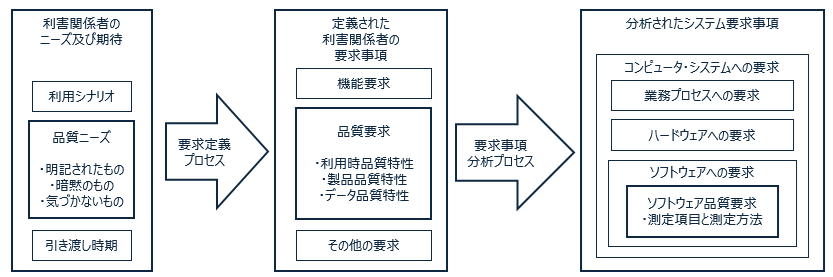

## ISO 25030 品質要求プロセス

この記事は [ソフトウェアテストの小ネタのカレンダー | Advent Calendar 2023](https://qiita.com/advent-calendar/2023/software-testing-koneta) の 10 日目の記事です。[ISO25000 の品質特性](https://qiita.com/mmake/items/ca97c616af0762a5164d) の続きの内容になります。

## 前回のおさらい

ISO 25000 はシステムとソフトウェアの品質に焦点を当てた国際標準です。内容が多岐に渡るため ISO 25000, 25010, 25020, 25030... と複数の文書に分かれています。まとめて SQuaRE （スクウェア）シリーズと呼びます。日本語版は [JIS X 25000 シリーズ](https://webdesk.jsa.or.jp/books/W11M0090/index/?bunsyo_id=JIS+X+25000%3A2017)で翻訳されています。

ISO 25010 ではソフトウェアの品質を、利用時の品質特性と製品の品質特性の２種類に分類しています。前回は、ChatGPT を使って品質特性に基づく実際の評価項目の例を紹介しました。

ここでは、５年目以降のプログラマ、QA エンジニア向けに ISO 25030 の概要を紹介します。

## ISO 25030 品質要求の紹介

システムの品質がどれだけ良いか、という基準は、そのソフトウェアの利用者や利用目的によって異なります。

|システムの例|利用時品質|製品品質|
|---|---|---|
|医療システム|リスク回避性|機能適合性|
|自動車自動運転システム|リスク回避性|セキュリティ|
|Eコマース|満足性|使用性|

ISO 25030 によると、そのシステムの品質特性を明確化する前に、利害関係者のニーズや期待を明確にすることが重要です。

### 要求定義プロセス

要求定義プロセスでは、利害関係者のニーズや期待から、機能要求・管理要求・品質要求事項を識別します。
利害関係者には、エンドユーザ、意思決定者、関連する規制団体などが含まれます。
品質要求事項は単独で理解することが難しいため、他の要求事項と合わせて仕様化します。

立場が異なる利害関係者は矛盾したニーズをもつことがあります。考慮しないニーズについてはその論理的根拠を文書化することが望ましいです。例えば、意思決定者の要求事項を満たすように決定し、幾つかのエンドユーザの要求事項を採択しないことがあります。結果として、利害関係者の中に、そのソフトウェア製品に満足しない人がいることがあります。

利害関係者の要求事項は、過去の利用経験に基づいて識別されます。完全に新規で類似したシステムが存在しないシステムの場合、利害関係者の真のニーズを識別することは、より困難になる可能性があります。

### 要求分析プロセス

要求分析プロセスでは要求主導の視点を製品の技術的な視点へ変換します。システムの構成要素を定義し、ソフトウェアとの境界及びインタフェースを明確にします。実装の制約により、解決が不可避な制限がある場合、文書化することが望ましいです。

そして品質要求について、品質測定量と目標値そして測定方法を選定します。典型的なソフトウェア品質の品質項目は ISO 2502n で説明されています。使用した品質測定量は一覧表を作成し，異なるプロジェクトでも同じ基準を適用することが望ましいです。

|ISO 規格|JIS 規格|
|---|---|
|[ISO/IEC 25020](https://webdesk.jsa.or.jp/books/W11M0090/index/?bunsyo_id=ISO%2FIEC+25020%3A2019)|[JIS X 25020 品質測定の枠組み](https://webdesk.jsa.or.jp/books/W11M0090/index/?bunsyo_id=JIS+X+25020%3A2021)|
|[ISO/IEC 25021](https://webdesk.jsa.or.jp/books/W11M0090/?bunsyo_id=ISO/IEC%2025021:2012)|[JIS X 25021 品質測定量要素](https://webdesk.jsa.or.jp/books/W11M0090/index/?bunsyo_id=JIS+X+25021%3A2014)|
|[ISO/IEC 25022](https://webdesk.jsa.or.jp/books/W11M0090/index/?bunsyo_id=ISO%2FIEC+25022%3A2016)|[JIS X 25022 利用時品質の測定](https://webdesk.jsa.or.jp/books/W11M0090/index/?bunsyo_id=JIS+X+25022%3A2019)|
|[ISO/IEC 25023](https://webdesk.jsa.or.jp/books/W11M0090/index/?bunsyo_id=ISO%2FIEC+25023%3A2016)|[JIS X 25023 システム及びソフトウェア製品の品質の測定](https://webdesk.jsa.or.jp/books/W11M0090/index/?bunsyo_id=JIS+X+25023%3A2018)|

### 品質評価プロセス

品質特性の重要度と測定方法が明確になったら、次に評価を実施する品質評価プロセスに移ります。この詳細は ISO 25040 の説明記事で紹介します。

## まとめ
この記事ではソフトウェア品質を測定するために必要となる、要求定義のプロセスについて、
とてもマイナーな ISO 25030 の内容を紹介しました。
プログラマとQAエンジニア、または、意思決定者とQAエンジニアが会話するきっかけになれば幸いです。

ご覧いただきありがとうございました。