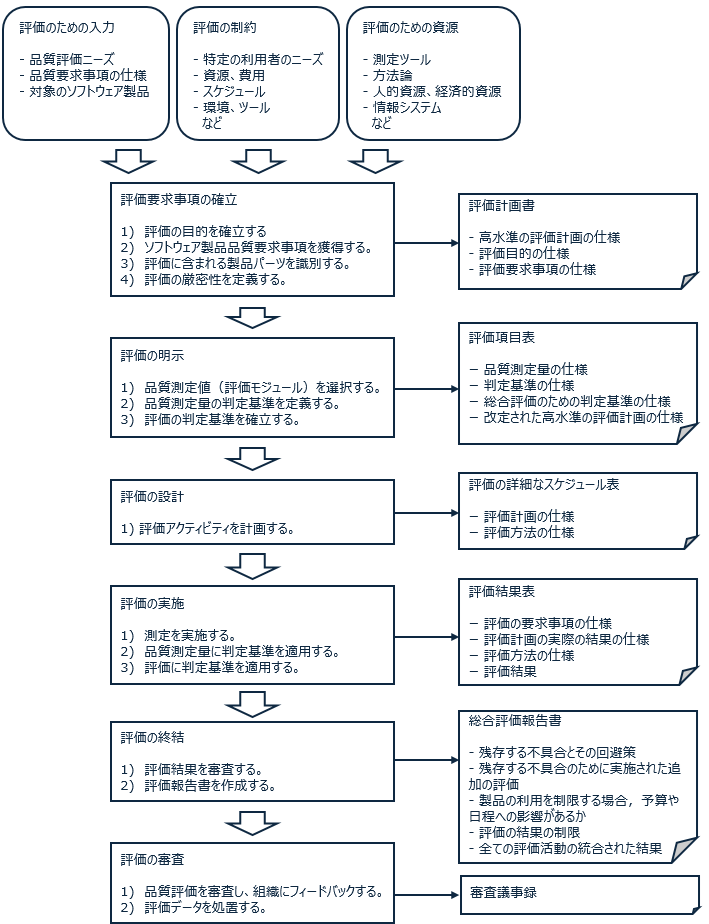

# ISO 25040 評価プロセスの紹介
ISO QA 品質 品質保証

この記事は [ISO25030 品質要求](https://qiita.com/mmake/items/ca97c616af0762a5164d) の続きの記事になります。

## 前回までのおさらい

ISO 25000 はシステムとソフトウェアの品質に焦点を当てた国際標準です。内容が多岐に渡るため ISO 25000, 25010, 25020, 25030... と複数の文書に分かれています。まとめて SQuaRE （スクウェア）シリーズと呼びます。日本では JIS X 25000 シリーズとして規格化されています。

ISO 25010 ではソフトウェアの品質を、利用時の品質モデルと製品の品質モデルに分け、さらに 13 個の品質特性に分類しています。

[前々回](https://qiita.com/mmake/items/ca97c616af0762a5164d)は ChatGPT を使って品質特性に基づく具体的な評価項目の例を紹介しました。

[前回](https://qiita.com/mmake/items/57900605a6d9f2cec3bc)は ISO 25030 の、利害関係者の品質要求をソフトウェア製品の品質モデルへ変換するプロセスを紹介しました。

ここでは、２年目以降のプログラマ、QA エンジニア向けに ISO 25040 の概要を紹介します。

## ISO 25040 評価プロセス

ISO 25040 は，評価プロセスの具体的な内容、各作業のインプットとアウトプットを規定しています。

評価全体のプロセスを以下に図示します。図は簡略化のため作業間の反復活動を省略していることに注意してください。

## ポイント

- 評価プロセスにおいて、意思決定者者、開発者，独立した評価者は異なる役割をもちます。
  - 意思決定者：意思決定者は、利用時の品質要求事項及びソフトウェア品質要求事項を定め、要求事項を明示します。
  - 開発者：開発者は、開発したソフトウェア製品の品質を確実にするために、ソフトウェア中間製品又は最終製品を評価することができます。
  - 独立した評価者：ソフトウェア製品の品質を確実にするために、ソフトウェア中間製品又は最終製品を評価することができます。複数の関係者が評価結果を理解し、容認し、信用する必要がある場合、ソフトウェア製品評価の実施のための要求事項及び推奨事項を提供します。 
  - 評価者及び意思決定者は，評価結果の共同審査を実施しなければならない。

- 品質評価を実施するために評価者の組織に適切なツール及び技法を含んだインフラストラクチャを持つ必要があります。

- 評価に携わる要員は必要なスキル及び教育訓練の実績を保持する必要があります。 

- 評価プロセスの実施では、次の柔軟性をもつことが非常に重要です。
  - ソフトウェアに必須の信頼度を確立する実用的な手段を提供する。 
  - 不必要な作業又は付加価値の付かない作業を回避する。

## 評価水準について

ISO 25040 では、安全性，経済，セキュリティ，環境の品質特性の水準を以下のように提案しています。

### 安全性側面に対する評価水準

|評価水準|重大性|
|---|---|
|水準A|多くの人の死亡|
|水準B|人命への危険な存在|
|水準C|資産への損害，人への損傷の危険な兆候|
|水準D|資産への小さな損害，人へのリスクなし|

### 経済的側面に対する評価水準

|評価水準|重大性|
|---|---|
|水準A|財務破綻（企業が存続しない。）|
|水準B|大きな経済面の損失（企業が存続の危機にさらされる。）|
|水準C|かなりの経済面の損失（企業が影響を受ける。）|
|水準D|無視できる経済面の損失|

### セキュリティ側面に対する評価水準

|評価水準|重大性|
|---|---|
|水準A|戦略的なデータ及びサービスの防御|
|水準B|影響が重大なデータ及びサービスの防御|
|水準C|エラーリスクに対する防御|
|水準D|識別された特定のリスクがない|

### 環境関連側面に対する評価水準
		
|評価水準|重大性|
|---|---|
|水準A|回復不可能な環境被害|
|水準B|回復可能な環境被害|
|水準C|局所の被害|
|水準D|環境リスクがない|

## 評価技法について

ISO 25040 では、品質特性の評価技法として以下の項目を挙げています。各技法は、要求水準の低い方から高い方に並んでいます。

- 機能性
  - 機能試験又はブラックボックス試験
  - チェックリストで示された開発文書の検査
  - 試験網羅性基準による単体試験
- 信頼性
  - 特定のプログラム言語機能の利用の検証
  - ソフトウェア設計及びコードの耐故障構造の分析
  - 信頼度成長モデル
- 使用性
  - ユーザーインタフェース及び文書の検査 
  - インタフェース標準（規格）への適合の検証
  - 実際の利用者による試用実験の実施
- 効率性
  - 時間測定の実施
  - ベンチマーク試験
  - アルゴリズムの複雑さを決めるための設計の分析
- 保守性
  - チェックリストで示された開発文書の検査
  - コードレビュー及びプログラム規則の検証
  - 開発文書の要素間の追跡可能性の分析
- 移植性
  - ソフトウェア設置手順の分析
  - プログラム規則の検証
  - ソフトウェア設計の分析

## まとめ

この記事ではソフトウェア品質の測定作業のプロセスについて、ISO 25040 の内容を紹介しました。
プログラマとQAエンジニア、または、意思決定者とQAエンジニアが会話するきっかけになれば幸いです。
ご覧いただきありがとうございました。