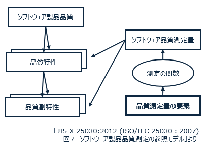

# ISO 25021 品質測定量要素の紹介

## 利用時の品質を表す測定量
### 割込みの数 
システムが外部からの割り込みにどれだけ対応する必要があるかを示す数を指します。
測定方法：システムが外部からの割り込みに対応した回数を数える。
単位：件（数）
### 運用操作の数 
システムが実際に運用される際に行う操作や手順の数を指します。
測定方法：システムが実際に運用される際に行う操作や手順の数を数える。
単位：件（数）
### （手順の）ステップの数 
特定の作業やプロセスを実行するために必要な手順やステップの数を指します。
測定方法：特定の作業やプロセスを実行するための手順やステップの数を数える。
単位：個（数）
### ユースケースの数 
システムの振る舞いを説明するためのユースケースの数を指します。
測定方法：システムの振る舞いを説明するためのユースケースの数を数える。
単位：件（数）
### 致命的なエラーの数 
システムがクラッシュや重大なエラーにより停止する回数を指します。
測定方法：システムがクラッシュや重大なエラーにより停止した回数を数える。
単位：件（数）
###  利用者問題の数 
ユーザビリティの問題、理解しにくい機能、不明瞭なエラーメッセージなどが含まれます。
測定方法：ユーザーテストや利用者フィードバックを収集し、利用者が報告した問題の数を数える。
単位：件（数）
### アクセシビリティを配慮した機能の数 
視覚的な制約を持つユーザー、聴覚的な制約を持つユーザー、モビリティの制約を持つユーザーなどがシステムを使用しやすいように構築された機能の数を指します。例えば、音声読み上げ機能、大文字表示、色の対比などが該当します。
測定方法：アクセシビリティの要件を定義し、その要件を満たす機能の数を数える。各機能がアクセシビリティの観点からどれだけ利用しやすいかを評価する。
単位：個（数）

## ソフトウェアの外部品質を表す測定量
### 製品の機能規模 
製品が提供する機能や機能セットの総量を指します。
測定方法：機能点（Function Point）や機能ポイントなどの尺度を使用して、ソフトウェアの機能規模を測定する。
単位：機能点（Function Point）や機能ポイントなどが使われることがあります。
### 故障の件数 
システムやソフトウェアの機能が正しく動作しない回数を指します。
測定方法：システムの機能が正しく動作しなかった回数を記録する。
単位：件（数）
### 作業工数（時間を単位とした） 
プロジェクトやタスクの実施にかかる総作業時間を指します。
測定方法：プロジェクトメンバーが作業に費やす総時間を計測する。作業ログやタイムトラッキングツールが利用されることがあります。
単位：時間（時間単位）
### 所要期間 
プロジェクトやタスクの完了にかかる時間を指します。
測定方法：プロジェクトが始まって終わるまでの期間を計測する。
単位：時間（時間単位）
### システム故障の件数 
システムが予期せず停止または誤動作する回数を指します。
測定方法：システムが予期せず停止した回数や誤動作が発生した回数を記録する。
単位：件（数）
### 障害の数 
システムやアプリケーションが利用者にとって利用しにくい状況や問題の数を指します。
測定方法：システムが利用者にとって使いづらい状況や問題が発生した回数を記録する。
単位：件（数）
### メッセージの数 
システムがユーザーや他のシステムとのコミュニケーションで発するメッセージの数を指します。
測定方法：システムがユーザーや他のシステムとのコミュニケーションで発するメッセージの数を数える。
単位：件（数）
### エラーメッセージの数 
システムが発生させるエラーや問題に関するメッセージの数を指します。
測定方法：システムが発生させるエラーや問題に関するメッセージの数を数える。
単位：件（数）
### メモリの規模 
システムが必要とするメモリの量や規模を指します。
測定方法：システムが必要とするメモリの総サイズを計測する。
単位：バイト、キロバイト、メガバイト、ギガバイトなど（メモリのサイズによる）

## ソフトウェアの内部品質を表す測定量
### データ項目の数 
システム内で使用されるデータ項目や変数の数を指します。
測定方法：システムで使用されるデータ項目や変数の総数を数える。
単位：個（数）
### データベースの規模 
データベースに格納されるデータの量や規模を指します。
測定方法：データベース内のデータの総サイズを計測する。
単位：バイト、キロバイト、メガバイト、ギガバイトなど（データのサイズによる）
### タスク複雑性 
特定のタスクを実行するのに要する複雑性を示す指標です。
測定方法：タスクの実施に要する手順や判断の複雑性を主観的に評価する。
単位：無単位（主観的な指標）
### テストケースの数 
ソフトウェアやシステムをテストするためのテストケースの数を指します。
測定方法：ソフトウェアやシステムをテストするためのテストケースの数を数える。
単位：件（数）
### エラーの数 
システムやソフトウェアの実行中に発生したエラーの数を指します。
測定方法：システムやソフトウェアの実行中に発生したエラーの数を数える。
単位：件（数）

## データの品質を表す測定量
### レコードの数 
データベース内のレコード（行）の数を指します。
測定方法：データベース内のレコードの総数を数える。
単位：件（数）
