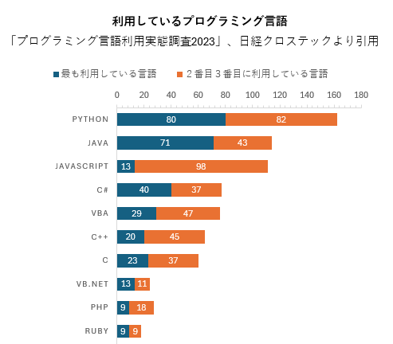
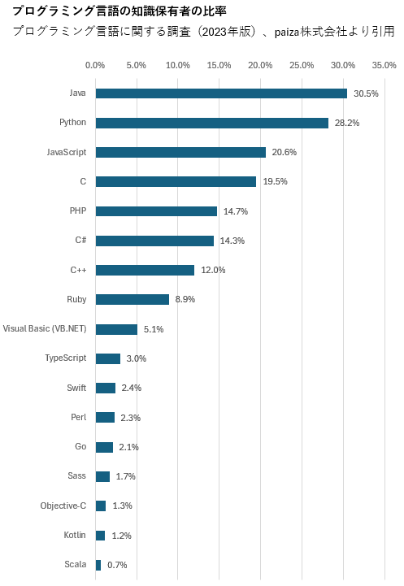

近年、[高校生のなりたい職業TOP3に「システムエンジニア・プログラマー」が入り](https://webtan.impress.co.jp/n/2023/01/10/44057)、システムエンジニア・プログラマーが注目されています。

注目度に伴って様々な会社が「[高収入が見込めるプログラム言語](https://codezine.jp/article/detail/18809)」や「[人気のあるプログラミング言語](https://news.mynavi.jp/techplus/article/programinglanguageoftheworld-49/)」などのランキングを発表しています。これらの情報は初級者がプログラミング言語を選択する際に参考になります。

一方、ビジネスの世界では「データドリブン経営」がもてはやされています。しかし「仕事の現場で使われているプログラミング言語」の統計データはほとんど見つかりません。ここでは３つの公開データを紹介します。

# IPA のソフトウェア開発分析データ集

１番目のデータは独立行政法人 情報処理推進機構 (IPA) が公開している 「[ソフトウェア開発 分析データ集 2022](https://www.ipa.go.jp/digital/chousa/metrics/hjuojm000000c6it-att/000102171.pdf)」です。金融・公共系のシステム開発を請け負うITベンダー35社の開発プロジェクトのデータです。

## 使われているプログラミング言語の件数
1位が Java、2位が COBOL となっています。金融・公共系の受託開発プロジェクトのデータが中心のため、少々偏っている印象があります。

数値データ

|順位|プログラミング言語|件数|
|---|---|---|
|1|Java|626|
|2|COBOL|240|
|3|Visual Basic.NET|137|
|4|C#|112|
|5|C|83|
|6|VB|58|
|7|C++|50|
|8|PL/SQL|30|
|9|JavaScript|28|
|10|PHP|11|
|11|Shell スクリプト|8|
|12|Pro*C|7|
|13|Perl|5|
|13|HTML|5|
|13|Delphi|5|
|16|PL/I|4|
|17|ABAP|3|
|18|XML|2|
|18|Python|2|
|20|アセンブラ|1|
|20|Ruby|1|
|22|その他|58|

データ提供企業

|企業名1|企業名2|
|---|---|
|(株)インテック|(株) DTS|
|SCSK (株)|東芝情報システム(株)|
|(株) SBC|(株)東邦システムサイエンス|
|NEC ソリューションイノベータ(株)|ニッセイ情報テクノロジー(株)|
|NTT ソフトウェア(株)|日本電気(株)|
|(株) NTT データ|日本電子計算(株)|
|(株) NTT データビジネスシステムズ|日本ユニシス(株)|
|(株) OKI ソフトウェア|(株)野村総合研究所|
|沖電気工業(株)|パナソニック(株)|
|キヤノン IT ソリューションズ(株)|日立 INS ソフトウェア(株)|
|クボタシステム開発(株)|(株)日立製作所|
|(株)構造計画研究所|(株)日立ソリューションズ|
|(株)ジャステック|富士通(株)|
|新日鉄住金ソリューションズ(株)|(株)プリマジェスト|
|住友電工情報システム(株)|三菱電機インフォメーションシステムズ(株)|
|(株)ソルクシーズ|リコーIT ソリューションズ(株)|
|大同生命保険(株)|(株)両備システムズ|
|TIS (株)||

# 日経クロステックの読者アンケート

２番目のデータはビジネス誌の日経クロステックが実施している「[プログラミング言語利用実態調査2023](https://xtech.nikkei.com/atcl/nxt/column/18/02670/112900001/)」のアンケート結果です。読者358人の回答になります。

## 普段使っているプログラミング言語

最も利用している言語はPython、2／3番目に使う言語は JavaScript となっています。実際の企業の開発現場では複数のプログラム言語を使っていることが想像できます。

数値データ

|順位|言語|最も使っている|２、３番目|
|---|---|---|---|
|1|Python|80|82|162|
|2|Java|71|43|114|
|3|JavaScript|13|98|111|
|4|C#|40|37|77|
|5|VBA|29|47|76|
|6|C++|20|45|65|
|7|C|23|37|60|
|8|VB.NET|13|11|24|
|9|PHP|9|18|27|
|10|Ruby|9|9|18|

# paiza のプログラミング言語に関する調査

3番目のデータはプログラマ向けの転職・就職・学習サービスを提供する paiza 株式会社が実施している[プログラミング言語に関する調査(2023年版)」](https://paiza.hatenablog.com/entry/2023/12/14/215835)です。

## プログラミング言語の知識保有者の割合
1位のプログラミング言語はJavaで、保有者の比率は 32.4% です。ITエンジニアの過半数が理解できる標準的なプログラム言語はない、という事がわかります。

数値データ

|順位|プログラミング言語|知識保有者の比率|
|---|---|---|
|1|Java|30.5%|
|2|Python|28.2%|
|3|JavaScript|20.6%|
|4|C|19.5%|
|5|PHP|14.7%|
|6|C#|14.3%|
|7|C++|12.0%|
|8|Ruby|8.9%|
|9|Visual Basic (VB.NET)|5.1%|
|10|TypeScript|3.0%|
|11|Swift|2.4%|
|12|Perl|2.3%|
|13|Go|2.1%|
|14|Sass|1.7%|
|15|Objective-C|1.3%|
|16|Kotlin|1.2%|
|17|Scala|0.7%|

## 感想
ニュースやメディアでは一くくりに IT業界、ITエンジニアといわれます。実際は開発の現場によってプログラミング言語が異なる事がわかりました。
旧約聖書の伝説で「人類が天に達するほどの高い塔をバビロンに建てようとしたのを神が怒り、それまで一つであった人間の言葉を混乱させて互いに通じないようにした」という話があります。

非IT業界から見るとプログラマはみな同じように見えるかもしれません。実際は分野ごとに様々な言語が使われており、多文化・異文化の世界であることが、データから見えてきます。