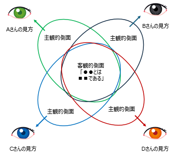

魅力的品質と当たり前品質
商品企画　品質改善

1984年、品質管理学者である狩野先生によって狩野モデルが提唱されました。このモデルは製品やサービスの品質要素がユーザーに対してどのように受け入れられるかを分類するために使われます。海外でも Kano model として広く認知されています。この記事では 16 歳の高校生向けに狩野モデルを紹介します。

## 品質の語源
2000年前の古代ギリシャの哲学者アリストテレスは品質について「数量（quantity）」と「質（quality）」の二つの側面で考えました。

### 数量（Quantity）とは

数量（Quantity）は物事が占める空間や数に関連する特性を指します。具体的には、物体の大きさや個数、数学的な関係に焦点を当てています。人間の存在に無関係な**客観的物理的性質**を指します。

### 質（quality）とは

質（quality）   は物事が持つ性質や性格、そのものを他のものと区別する特徴などが含まれます。例えば、物体の色、形状、素材などが質の一部となります。「客観的実在の結果として、考え、感じ、かつ
分別するものに関連しているもの」という**主観的側面**を指します。

## 狩野モデルの品質要素

それまでの品質論は品質と満足感の関係を一元的と認識していました。客観的性質と主観的側面のどちらが重要か、定性的な議論が中心でした。

狩野モデルは、充足状況と満足感について二元的な認識を提案します。
狩野モデルでは、主に３つの要素で品質特性を評価します。

### 魅力的品質 （Attractive Quality）
それが充足されれぽ満足を与えるが、不充足であってもしかたないと受けとられる品質要素。

### 一元的品質（One−Dimensional Quality）
それが充足されれぽ満足、不充足であれば不満を引起こす品質要素。

### 当り前品質 （Must Be Quality）
それが充足されれば当り前と受けとられるが，不充足であれぽ不満を引起こす品質要素。

３つの要素をグラフで表すと以下の関係になります。

補足的な要素として以下の２つの品質要素があります。

### 無関心品質（lndifferent Quality）
充足でも不充足でも，満足も与えず不満も引起こさない品質要素。

### 逆品質（Reverse Quality）
充足されているのに不満を引起こしたり，不充足であるのに満足を与えたりする品質要素。

## 品質要素の調べ方
商品の機能がどの品質要素に該当するか、対象者にアンケートを実施する事で調査できます。

### 質聞紙の設問様式（例）
#### 不充足の場合
もし、あなたのテレビの画像の状態が、悪かったならば（たとえば二重にうつるなど）、あなたはどう感じますか
- 1 気に入る
- 2 当然である
- 3 何とも感じなt丶
- 4 しかたない
- 5 気に入らない
- 6 その他
#### 充足の場合
もし、あなたのテレビの画像の状態がよかったならば（たとえば二重にうっらないなど）、あなたはどう感じますか
- 1 気に入る
- 2 当然である
- 3 何とも感じない
- 4 しかたない
- 5 気に入らない
- 6 その他

### 調査結果の集計
アンケートの回答を下記のように分類し、最も回答数の多い分類を選ぶことで、品質要素を判断できます。

- 一（一元的評価）： 充足で満足、不充足で不満と感ずる要素
- 魅（魅力的品質）：充足で満足、不充足で｛当然・なんとも感じない・しかたない｝と感ずる要素
- 当（当たり前品質）：充足で｛当然・なんとも感じない・しかたない｝、不充足で不満と感ずる要素
- 無（無関心品質）： 充足でも不充足でも満足も不満も感じない要素
- 逆（逆品質）： 充足されているのに不満を感じたり，不充足なのに満足を感じたりする要素
- 疑（懐疑的回答）：一般的な評価としては考えにくい回答。設問を理解してもらえたがどうか疑問のある回答で、設問のわかりにくさ、表現のまずさあるいは回答者の品質要素に対する理解の低さなどが原因として考えられる

## 狩野モデルにおける優先順位

限られた時間で顧客満足度を最大化させるために、取り組むべき優先順位は次の通りです。

- 1 当たり前品質：やって当然
- 2 一元的品質：なければ不満、あれば嬉しい
- 3 魅力的品質：あったら嬉しいが、なくても困らない
- 4 逆品質：満たせば満たすほど逆効果
- 5 無関心品質：いくら満たしても意味なし

## まとめ

本記事では以下の事を説明しました。

- 品質には量（客観的性質）と質（主観的側面）の2種類がある。量と質のどちらが重要かは2000年前から議論されており、結論が出てない。
- 狩野モデルでは品質を魅力的品質と当たり前品質に分類する。
- 利用者の満足感を高める場合、魅力的品質より当たり前品質の方が重要。
