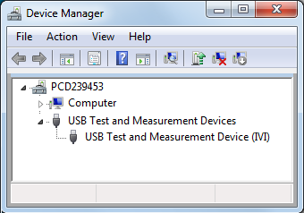
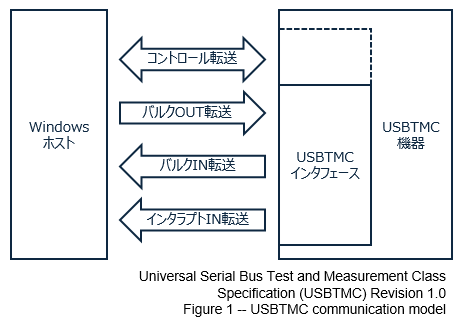
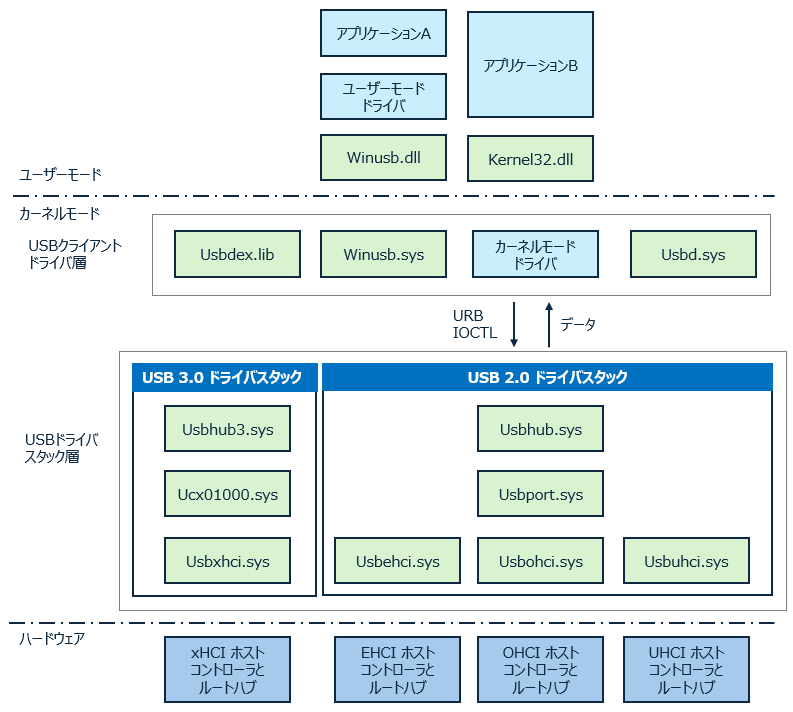
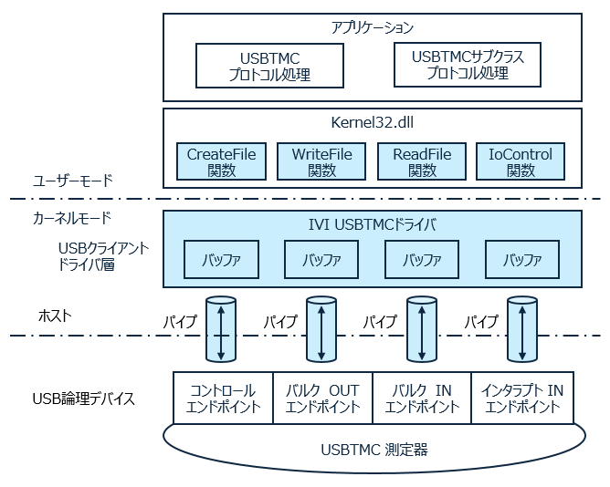
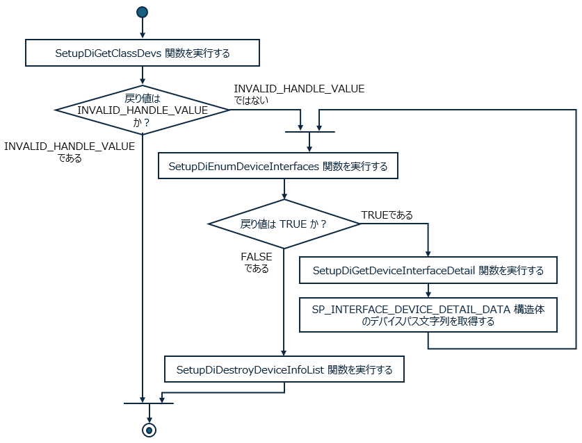

# IVI USBTMC デバイスドライバ の関数仕様
USB オシロスコープ IVI

IVI USBTMC（アイビー　ユーエスビーティーエムシー） ドライバは IVI 協会が提供している Windows 用のデバイスドライバです。
USBTMC は計測機器や信号発生器を制御するための USB 通信仕様です。

この記事では Windows のデバイスドライバの開発者を対象に IVI USBTMC ドライバの仕様を説明します。
デバイスドライバを作成する際の参考になれば幸いです。



## 関連文献
本記事が参照する資料を以下に挙げます。

- USB 2.0 仕様(https://www.usb.org/document-library/usb-20-specification)
- USBTMC 仕様(https://www.usb.org/document-library/test-measurement-class-specification)
- IVI USBTMC 仕様(https://www.ivifoundation.org/specifications/default.html#ivi-protocol-specifications)
- Windows の USB ホスト側ドライバ(https://learn.microsoft.com/ja-jp/windows-hardware/drivers/usbcon/usb-3-0-driver-stack-architecture)

## IVI 協会の概要
IVI 協会(Interchangeable Virtual Instruments Foundation ) は計測器メーカ、システム・インテグレータおよびユーザ企業で構成される団体です。IVI 協会はは計測器の互換性と相互接続性の向上のために様々な業界標準を定義しています。

- 筐体やコネクタの仕様
- ネットワーク通信プロトコルの仕様
- オシロスコープや信号発生器の通信コマンドの仕様
- Windows の COM や .NET のライブラリの仕様
- USBドライバ仕様
- ファイルフォーマット仕様

IVI USBTMC は Windows のデバイスドライバの仕様です。

## USBTMC の概要
USBTMC（USB Test and Measurement Class）は、計測機器や試験機器で使われている GPIB 通信を USB 通信で置き換えるための通信クラスです。機器とPCの間でコマンドとデータをやり取りするためプロトコルを提供します。

### USBTMC デバイスのエンドポイント
全ての USB 機器はエンドポイントを介してデータの送受信を行います。USBTMCデバイスは通常、以下のエンドポイントを使用します



#### コントロール転送エンドポイント (エンドポイント 0)
デバイスの初期化、構成等の USB デバイス共通のやり取りが行われます。さらにデバイスクリアやリモート切り替えといった USBTMC クラス固有のやり取りが行われます。

#### バルク IN 転送エンドポイント
計測機器からホストに対して測定データなどがこのエンドポイントを通じて送信されます。

#### バルク OUT 転送エンドポイント
ホストが計測機器に対してコマンドなどを送信するために使用されます。

#### インタラプト IN 転送エンドポイント
計測機器からホストに対してステータスを通知するために使用されます。

### USBTMC のクラス、サブクラス、プロトコル
USBデバイスはハードウェアの機能や通信の種類に基づいてクラス、サブクラス、およびプロトコルの識別番号を持っています。USBTMC のクラス・コード、サブクラス・コード、およびプロトコル・コードは以下の通りです。

#### クラス・コード
USBTMCのクラス・コードは 0xFE です。これはテストおよび計測機器クラスを示します。

#### サブクラス・コード
USBTMCのサブクラス・コードは 0x03 です。これは、USB Test and Measurement Class サブクラスを表します。

#### プロトコル・コード
USBTMCのプロトコル・コードは 0x00 または 0x01 です。0x00 は、プロトコルが規定されていないことを示します。0x01 は USBTMC-USB488 であることを表します。

## Windows の USB スタックの概要
Windows 用 USB ホストドライバのアーキテクチャを以下に図示します。 この図は、USB 2.0 と USB 3.0 用の USB ドライバスタックを示しています。 



Windows のデバイスドライバは、カーネルモードドライバとユーザーモードドライバの2つのカテゴリに分類されます。

### カーネルモードドライバ

カーネルモードドライバは Windows オペレーティングシステムの内部の特権的な領域で動作するドライバです。直接ハードウェアにアクセスでき、高い性能が期待されます。主にハードウェア制御や低レベルなシステムタスクを担当します。

### ユーザーモードドライバ

ユーザーモードドライバは制限された権限で動作するドライバで、一般的にはハードウェアへの直接アクセスは制限されます。代わりに、Windows APIを通じてOSサービスにアクセスし、安全性が高まります。主に特定のアプリケーション向けのデバイス制御や操作を担当します。

# IVI USBTMC デバイスドライバ の概要
IVI USBTMC デバイスドライバは Windows 用のデバイスドライバです。
USBTMC デバイスドライバは特定の変更や処理を行わず、データや制御コマンドををそのまま次のレイヤに渡します。
上位のアプリケーションは任意の内容のコントロール転送、バルク IN 転送、バルク OUT 転送、インタラプト IN 転送を実行できます。

<!--
デバイスドライバの仕様をこのように定義する動機は、以下のとおりです。
- カーネルドライバに実装すべき機能を最小限に抑えます。
- USBTMC プロトコルと USBTMC サブクラス プロトコルをユーザー空間に実装できるようにすることで、デバッグが容易になり、システムがクラッシュする可能性が低くなります。
-->



# IVI USBTMC ドライバの仕様
USBTMC デバイスドライバの各関数の具体的な振る舞いについて説明します。

## CreateFile 関数
CreateFile 関数は各 USBTMC インターフェイス エンドポイントへの転送パイプを開きます。

### 構文
```C++
HANDLE CreateFileA(
    LPCSTR                lpFileName,
    DWORD                 dwDesiredAccess,
    DWORD                 dwShareMode,
    LPSECURITY_ATTRIBUTES lpSecurityAttributes,
    DWORD                 dwCreationDisposition,
    DWORD                 dwFlagsAndAttributes,
    HANDLE                hTemplateFile
);
```

### パラメータ
|引数の型|引数の名前|説明|
|---|---|---|
|LPCSTR|lpFileName|開くデバイスの名前|
|DWORD|dwDesiredAccess|デバイスへの要求されたアクセス|
|DWORD|dwShareMode|デバイスの要求された共有モード|
|LPSECURITY_ATTRIBUTES|lpSecurityAttributes|2 つの独立した関連データメンバを含む SECURITY_ATTRIBUTES 構造体へのポインタ|
|DWORD|dwCreationDisposition|存在するか存在しないデバイスに対して実行するアクション|
|DWORD|dwFlagsAndAttributes|ファt5イルまたはデバイスの属性とフラグ|
|HANDLE|hTemplateFile|GENERIC_READアクセス権を持つテンプレートファイルへの有効なハンドル|

### 解説
カーネル ドライバは、ユーザが CreateFile 関数 を FILE_FLAG_OVERLAPPED 付きで呼び出すか呼び出すかを認識しません。 
CreateFile 関数を複数回呼び出すと、デバイスへの複数のハンドルをいつでも取得できます。

### CreateFile 関数を呼び出す際のファイル名について

ユーザレベルのクライアント USBTMC コードでは、特定のファイル名を検索しないでください。 
USBTMC リソースを見つける正しい方法は、USBTMC 用に予約されたクラス GUID を使用することです。

Windows では、CreateFile 関数に渡すことができるカーネル ファイル名を照会するために必要なルーチンが定義されています。

使用可能なすべての USBTMC カーネル ファイル名を検索するためのアルゴリズムは、
最初に SetupDiGetClassDevs を呼び出すことです。
これは、残りの呼び出しで使用されるハンドルを返します。
ループでは、 SetupDiEnumDeviceInterfaces と SetupDiGetDeviceInterfaceDetail を呼び出します。 
SP_INTERFACE_DEVICE_DETAIL_DATA構造体は、CreateFile 関数に渡すカーネルファイル名を提供します。
最後に、関数 SetupDiDestroyDeviceInfoList を使用してクラス ハンドルを解放します。




## WriteFile 関数

指定したデバイスにデータを書き込みます。

### 構文
```C++
BOOL WriteFile(
    HANDLE       hFile,
    LPCVOID      lpBuffer,
    DWORD        nNumberOfBytesToWrite,
    LPDWORD      lpNumberOfBytesWritten,
    LPOVERLAPPED lpOverlapped
);
```

### パラメータ
|引数の型|引数の名前|説明|
|---|---|---|
|HANDLE|hFile|デバイスへのハンドル|
|LPCVOID|lpBuffer|デバイスに書き込まれるデータを含むバッファへのポインタ|
|DWORD|nNumberOfBytesToWrite|デバイスに書き込まれるバイト数|
|LPDWORD|lpNumberOfBytesWritten|書き込まれたバイト数を受け取る変数へのポインタ|
|LPOVERLAPPED|lpOverlapped|hFile パラメータが FILE_FLAG_OVERLAPPED で開かれた場合は、OVERLAPPED 構造体へのポインターが必要です。それ以外の場合は、このパラメータを NULL にすることができます。|
### 解説

渡されたバッファ内のデータは、ファイル ハンドルに関連付けられているバルクOUT転送パイプに変更されずに送信されます。

WriteFile 関数の実装では、内部の最大転送サイズを超えるデータ バッファの転送をサポートします。 
たとえば、内部 USB バッファが 8KB で、ユーザ バッファが 30KB の場合、
WriteFile 関数の実装では、バッファをループし (この場合は 4 回)、その都度ユーザ バッファから一部を送信することで、ユーザ バッファ全体を転送します。
WriteFile()の実装は、エラーが発生した場合にのみ、転送カウント全体よりも少ない数を送信する可能性があります。

ユーザが FILE_FLAG_OVERLAPPED で CreateFile 関数を呼び出したかどうかに関係なく、WriteFile 関数の USBTMC カーネル実装は、要求を非同期的に実装できます。つまりSTATUS_PENDINGを返すことができます。 
これはすべての転送サイズの要件ではなく、USBTMCカーネル実装が小さな転送を同期的に実行するために有効です。

ユーザが FILE_FLAG_OVERLAPPED を使用して CreateFile 関数を呼び出さなかった場合、オペレーティング システムによって、USBTMC カーネル ドライバが IRP を完了としてマークするまで、WriteFile 関数の呼び出しがブロックされます。

## ReadFile 関数
指定したデバイスからデータを読み取ります。

### 構文
```C++
BOOL ReadFile(
    HANDLE       hFile,
    LPVOID       lpBuffer,
    DWORD        nNumberOfBytesToRead,
    LPDWORD      lpNumberOfBytesRead,
    LPOVERLAPPED lpOverlapped
);
```

### パラメータ
|引数の型|引数の名前|説明|
|---|---|---|
|HANDLE|hFile|デバイスへのハンドル|
|LPVOID|lpBuffer|デバイスから読み取られたデータを受信するバッファへのポインタ|
|DWORD|nNumberOfBytesToRead|読み取る最大バイト数|
|LPDWORD|lpNumberOfBytesRead|読み取られたバイト数を受け取る変数へのポインタ|
|LPOVERLAPPED|lpOverlapped|hFile パラメータが FILE_FLAG_OVERLAPPED で開かれた場合は、OVERLAPPED 構造体へのポインターが必要です。それ以外の場合は NULL にすることができます|

### 解説
受信したデータは指定されたバッファに格納され、変更されずに返されます。

ReadFile 関数は、最大長以外のパケットを受信した場合、または要求された量のデータを受信した場合に返さなければなりません。

ReadFile 関数の実装では、内部の最大転送サイズを超えるデータ バッファの転送をサポートします。
たとえば、内部 USB バッファが 8 KB で、ユーザ バッファが 30 KB の場合、ReadFile 関数の実装では、バッファをループし (この場合は 4 回)、毎回ユーザ・バッファの一部を読み取ることによって、ユーザ・バッファ全体を転送します。

ReadFile()の実装は、エラーが発生した場合、または短いパケットを受信した場合にのみ、転送カウント全体よりも少ない値を読み取ることができます。

ユーザが FILE_FLAG_OVERLAPPED を使用して CreateFile 関数を呼び出したかどうかに関係なく、ReadFile 関数の USBTMC カーネル実装は、要求を非同期的に実装できます。つまりSTATUS_PENDINGを返すことができる必要があります。 
これはすべての転送サイズの要件ではなく、USBTMCカーネル実装が小さな転送を同期的に実行するために有効です。
ユーザが FILE_FLAG_OVERLAPPED を使用して CreateFile 関数を呼び出さなかった場合、USBTMC カーネル ドライバーが IRP を完了としてマークするまで、オペレーティング システムによって ReadFile 関数の呼び出しがブロックされます。

## DeviceIoControl 関数

コントロール コードを指定したデバイス ドライバーに直接送信し、対応するデバイスが対応する操作を実行します。

### 構文
``` C++
BOOL DeviceIoControl(
    HANDLE       hDevice,
    DWORD        dwIoControlCode,
    LPVOID       lpInBuffer,
    DWORD        nInBufferSize,
    LPVOID       lpOutBuffer,
    DWORD        nOutBufferSize,
    LPDWORD      lpBytesReturned,
    LPOVERLAPPED lpOverlapped
);
```

### パラメータ
|引数の型|引数の名前|説明|
|---|---|---|
|HANDLE|hDevice|CreateFile を呼び出すことにで得られるデバイスハンドル|
|DWORD|dwControlCode|USBTMC IOCTL 制御コード|
|LPVOID|lpInBuffer|入力データバッファ|
|DWORD|nInBufferSize|入力データ・バッファのサイズ|
|DWORD|lpOutBuffer|出力データバッファ|
|DWORD|nOutBufferSize|出力データ・バッファのサイズ|
|LPDWORD|lpBytesReturned|受信したバイト数を受け取る変数へのポインタ|
|LPOVERLAPPED|lpOverlapped|OVERLAPPED 構造体への省略可能なポインタ|

### USBTMC IOCTL 制御コード
USBTMC ドライバーは次の IOCTL 制御コードをサポートします。

|IOCTL マクロ名|数値|説明|
|---|---|---|
|IOCTL_USBTMC_GETINFO|0x8000_2000|USBTMC ドライバに関する情報を取得します。|
|IOCTL_USBTMC_CANCEL_IO|0x8000_2004|呼び出し元が指定したパイプ上のすべての IRP を取り消します。|
|IOCTL_USBTMC_WAIT_INTERRUPT|0x8000_2008|インタラプト IN パイプにデータが到着するのを待ちます。オーバーラップしている場合、インタラプト IN 転送の受信時にオーバーラップイベントが設定されます。|
|IOCTL_USBTMC_RESET_PIPE|0x8000_201C|パイプの Halt 状態をクリアします。|
|IOCTL_USBTMC_SEND_REQUEST|0x8000_2080|コントロールパイプに任意の要求を送信します。|
|IOCTL_USBTMC_GET_LAST_ERROR|0x8000_2088|下位レベルの USB ドライバから返された最新のエラーを取得します。|

### IOCTL_USBTMC_GETINFO

USBTMC ドライバに関する情報を返します。

呼び出し元は関数の lpOutBuffer パラメータとしてUSBTMC_DRV_INFO構造体のアドレスを指定します。カーネル モード ドライバは、構造体に値を代入します。

#### USBTMC_DRV_INFO のデータ構造

```C++
typedef struct {
  DWORD major; // ドライバのメジャーリビジョン
  DWORD minor; // ドライバのマイナーリビジョン
  DWORD build; // 内部ビルド番号
  WCHAR manufacturer[64]; // UNICODE の製造者文字列
} USBTMC_DRV_INFO, *PUSBTMC_DRV_INFO;
```

### パラメータ
|引数名|説明|
|---|---|
|hDevice|CreateFile を呼び出すことにで得られるデバイスハンドル|
|dwControlCode|IOCTL_USBTMC_GETINFO|
|lpInBuffer|NULL|
|nInBufferSize|0|
|lpOutBuffer|出力データバッファ|
|nOutBufferSize|出力データ・バッファのサイズ|
|lpBytesReturned|受信したバイト数を受け取る変数へのポインタ|
|lpOverlapped|OVERLAPPED 構造体への省略可能なポインタ|

### 例
```C++ Example
USBTMC_DRV_INFO drvrInfo;
DWORD           cbRet;
OVERLAPPED      overlapped;
BOOL            bRet;

memset(&overlapped, 0, sizeof(OVERLAPPED));
overlapped.hEvent = CreateEvent(NULL, FALSE, FALSE, NULL);
bRet = DeviceIoControl(DeviceHandle,
                       (DWORD) IOCTL_USBTMC_GETINFO,
                       NULL,
                       0,
                       &drvInfo, 
                       sizeof(USBTMC_DRV_INFO), 
                       &cbRet,
                       &overlapped);
if( bRet == TRUE )
    WaitForSingleObject(overlapped.hEvent, INFINITE);

CloseHandle(overlapped.hEvent);
```

### IOCTL_USBTMC_CANCEL_IO

この IOCTL は、指定されたデバイス ハンドルに関連付けられている指定された USB 転送パイプでの動作を取り消します。

呼び出し元は、関数の lpInBuffer パラメータとしてUSBTMC_PIPE_TYPE型の値の 1 つを指定します。
この値は、どの転送パイプ (インタラプト IN、バルク IN、バルク OUT) で操作を実行するかを示します。

ドライバは、要求を実行するために function = URB_FUNCTION_ABORT_PIPE を使用して URB を作成します。

#### USBTMC_PIPE_TYPE のデータ構造

USBTMC_PIPE_TYPE データ型は、I/O 制御コードが IOCTL_USBTMC_CANCEL_IO または IOCTL_USBTMC_RESET_PIPE の場合、 DeviceIoControl 関数への入力として使用されます。
割り込みパイプ、バルク IN パイプ、およびバルク OUT パイプは、DeviceIoControl に提供される各デバイス ハンドルに関連付けられます。
指定された USBTMC_PIPE_TYPE値は、これらのパイプのどれで操作を実行するかを示します。

```C++
typedef enum {
    USBTMC_INTERRUPT_IN_PIPE = 1,
    USBTMC_READ_DATA_PIPE = 2,
    USBTMC_WRITE_DATA_PIPE = 3,
    USBTMC_ALL_PIPES = 4
} USBTMC_PIPE_TYPE;
```

### パラメータ
|引数名|説明|
|---|---|
|hDevice|CreateFile を呼び出すことにで得られるデバイスハンドル|
|dwControlCode|IOCTL_USBTMC_CANCEL_IO|
|lpInBuffer|USBTMC_PIPE_TYPE型の値を含む場所へのポインタ|
|nInBufferSize|USBTMC_PIPE_TYPE 構造体のサイズ|
|lpOutBuffer|NULL|
|nOutBufferSize|0|
|lpBytesReturned|0|
|lpOverlapped|OVERLAPPED 構造体への省略可能なポインタ|

### 例
```C++ Example
BOOL bState = FALSE;
DWORD cbRet = 0;
OVERLAPPED overlapped;

memset(&overlapped, 0, sizeof(OVERLAPPED));
overlapped.hEvent =
    CreateEvent(NULL, // セキュリティ属性へのポインタ
                FALSE, // 自動リセットなし
                FALSE, // 非シグナル状態
                NULL); // イベントオブジェクト名へのポインタ
bState = DeviceIoControl(hdlDevice,
                         (DWORD) IOCTL_USBTMC_CANCEL_IO,
                         (LPVOID)&pipeType,
                         sizeof(USBTMC_PIPE_TYPE),
                         NULL,
                         0,
                         &cbRet, &overlapped);
```

### IOCTL_USBTMC_WAIT_INTERRUPT

USB 割り込みパイプに到着したデータを返します。

### パラメータ
|引数名|説明|
|---|---|
|hDevice|CreateFile を呼び出すことにで得られるデバイスハンドル|
|dwControlCode|IOCTL_USBTMC_WAIT_INTERRUPT|
|lpInBuffer|NULL|
|nInBufferSize|0|
|lpOutBuffer|デバイスが割り込みパイプで送信できる最大のパケットを受信するのに十分な大きさのバッファへのポインタ。複数のパケットを受信するのに十分な大きさである可能性があります|
|nOutBufferSize|出力データ・バッファのサイズ|
|lpBytesReturned|受信したバイト数を受け取る変数へのポインタ|
|lpOverlapped|OVERLAPPED 構造体への省略可能なポインタ|

### 解説

どのアプリケーション プロセスまたはスレッドでも、IOCTL_USBTMC_ WAIT_INTERRUPT を使用して DeviceIoControl 関数を発行できます。
USBTMC カーネル ドライバは、割り込み IN DATA を複数のプロセスに分散します。

### 例
```C++ Example
DWORD dwError;
BOOL bRet;
BYTE InterruptData[64];
OVERLAPPED overlappedIntIn;

memset(&overlappedIntIn, 0, sizeof(overlappedIntIn));
overlappedIntIn.hEvent = CreateEvent( NULL, TRUE, FALSE, NULL );

bRet = DeviceIoControl( hHandle,
                        IOCTL_USBTMC_WAIT_INTERRUPT, NULL,
                        0,
                        &InterruptData,
                        sizeof(InterruptData),
                        &dwError,
                        &overlappedIntIn );
if ( bRet != 0 ) {
    printf("DeviceIoControl err\n");
}

WaitForSingleObject(overlappedIn.hEvent,INFINITE);
```

### IOCTL_USBTMC_RESET_PIPE

指定したデバイス ハンドルに関連付けられている指定した USB 転送パイプをリセットします。これにより、パイプの Halt 状態がクリアされます。
呼び出し元は関数の lpInBuffer パラメータとしてUSBTMC_PIPE_TYPE型の値の 1 つを指定します。
この値は、どの転送パイプ (割り込み、バルク IN、バルク OUT) で操作を実行するかを示します。

### パラメータ
|引数名|説明|
|---|---|
|hDevice|CreateFile を呼び出すことにで得られるデバイスハンドル|
|dwControlCode|IOCTL_USBTMC_RESET_PIPE|
|lpInBuffer|NULL|
|nInBufferSize|0|
|lpOutBuffer|USBTMC_PIPE_TYPE型の値を含む場所へのポインタ|
|nOutBufferSize|出力データ・バッファのサイズ|
|lpBytesReturned|受信したバイト数を受け取る変数へのポインタ|
|lpOverlapped|OVERLAPPED 構造体への省略可能なポインタ|

### 例
```C++ Example
DWORD dwError;
BOOL bRet;
BYTE InterruptData[64];
OVERLAPPED overlappedIntIn;

memset(&overlappedIntIn, 0, sizeof(overlappedIntIn));
overlappedIntIn.hEvent = CreateEvent( NULL, TRUE, FALSE, NULL );

bRet = DeviceIoControl( hHandle,
                        IOCTL_USBTMC_WAIT_INTERRUPT,
                        NULL,
                        0,
                        &InterruptData,
                        sizeof(InterruptData),
                        &dwError,
                        &overlappedIntIn );
if ( bRet != 0 ) {
    printf("DeviceIoControl err\n");
}

WaitForSingleObject(overlappedIn.hEvent,INFINITE);
```

###	IOCTL_USBTMC_SEND_REQUEST

制御パイプを使用して、ベンダ定義またはクラス固有の要求を USB デバイスに送信し、必要に応じて追加のデータを送受信します。

### パラメータ
|引数名|説明|
|---|---|
|hDevice|CreateFile を呼び出すことにで得られるデバイスハンドル|
|dwControlCode|IOCTL_USBTMC_SEND_REQUEST|
|lpInBuffer|USBTMC_IO_BLOCK 構造体へのポインタ|
|nInBufferSize|USBTMC_IO_BLOCKのサイズ|
|lpOutBuffer|USBTMC_IO_BLOCK構造体の PbyData メンバによって識別される同じバッファへのポインタ、またはデータ転送が要求されていない場合は NULL|
|nOutBufferSize|出力バッファのサイズ、またはデータ転送が要求されていない場合は 0。|
|lpBytesReturned|受信したバイト数を受け取る変数へのポインタ|
|lpOverlapped|OVERLAPPED 構造体への省略可能なポインタ|

### 解説

呼び出し元は関数の lpInBuffer パラメータとしてUSBTMC_IO_BLOCK構造体のアドレスを指定します。
この入出力制御コードで指定される要求のタイプは、送受信される可能性のある情報のタイプとサイズと同様に、デバイス固有およびベンダー定義です。

USBTMC ドライバは、すべてのベンダ固有の要求をサポートする必要があります。 
クラス固有の要求の場合、Windows オペレーティング システムが特定の要求を実装する場合、USBTMC カーネルの実装はその要求をサポートする必要があります。

#### USBTMC_IO_BLOCK のデータ構造

USBTMC_IO_BLOCK構造体は、指定された I/O 制御コードがIOCTL_USBTMC_SEND_REQUESTときに DeviceIoControl のパラメータとして使用されます。
構造体メンバーに含まれる値は、USB デバイス要求 (ユニバーサル シリアル バス仕様で説明) を作成するために使用されます。

```C++
typedef struct {
    unsigned char bmRequestType; // セットアップデータの bmRequestType として使用
    unsigned char bRequest; // セットアップデータの bRequest として使用
    unsigned short wValue; // セットアップデータの wValue として使用
    unsigned short wIndex; // セットアップデータの wIndex として使用
    unsigned short wLength; // セットアップデータの wLength として使用
    OUT PUCHAR	  pbyData; // 長さが wLength のデータ バッファへのポインタ
    UCHAR	      fTransferDirectionIn; // デバイスからホストへの転送の場合は TRUE。ホストからデバイスへの転送の場合は FALSE
} USBTMC_IO_BLOCK, *PUSBTMC_IO_BLOCK;
```

次の表は、入力引数の指定方法を示しています。

||読み取り操作|書き込み操作|データ転送なし|
|---|---|---|---|
|lpInBuffer|USBTMC_IO_BLOCK ポインタ|USBTMC_IO_BLOCK ポインタ|USBTMC_IO_BLOCK ポインタ|
|lpOutBuffer|読み取るデータを受け取るバッファへのポインタ|書き込まれるデータを含むバッファへのポインター|NULL|
|lpOutBufferSize|バッファのサイズ|バッファのサイズ|ゼロ|
|USBTMC_IO_BLOCK の pbyData|lpOutBuffer と同じポインタ|lpOutBuffer と同じポインタ|NULL|
|USBTMC_IO_BLOCK の wLength|lpOutBufferSize と同じ値|lpOutBufferSize と同じ値|ゼロ|
|USBTMC_IO_BLOCK の fTransferDirectionIn|真|偽|偽|

### 解説
このデータ構造を使用する場合、以下の規則が適用されます。
- pbyData は lpOutBuffer と一致する必要があります。一致しない場合、その後の動作は保証されません。
- bmRequestType または bRequest パラメータが未定義のクラス要求の場合など、Windows オペレーティング システムで特定の要求の実装が定義されていない場合、USBTMC カーネル実装はエラー STATUS_INVALID_PARAMETERを返す必要があります。
- fTransferDirectionIn は、書き込み (データ転送方向 = OUT) 操作の場合は 0 に、読み取り (データ転送方向 = IN) 操作の場合は 1 である必要があります。bmRequestType の direction と一致する必要があります。一致しない場合、その後の動作は 保証されません。

### IOCTL_USBTMC_GET_LAST_ERROR

下位レベルの USB ドライバから返された最後のエラー コードを取得します。
呼び出し元は関数の lpOutBuffer パラメータとしてUSBD_STATUS値のアドレスを指定します。
カーネル モード ドライバは、USBD から受信した最後のエラー コードで値を入力します。
USBTMC カーネル ドライバで USBD エラーが発生したことがない場合、この出力値は 0 である必要があります。
USBTMC カーネル ドライバは、USBD エラー以外のエラー コードを返すときに、この値を変更しないでください。
最後のエラーを照会しても、USBTMC カーネルはキャッシュされたエラー コード値をリセットしません。

### パラメータ
|引数名|説明|
|---|---|
|hDevice|CreateFile を呼び出すことにで得られるデバイスハンドル|
|dwControlCode|IOCTL_USBTMC_GET_LAST_ERROR|
|lpInBuffer|NULL|
|nInBufferSize|0|
|lpOutBuffer|出力データバッファ。USBD_STATUSへのポインタ|
|nOutBufferSize|出力データ・バッファのサイズ。sizeof(USBD_STATUS) である必要があります。|
|lpBytesReturned|受信したバイト数を受け取る変数へのポインタ|
|lpOverlapped|OVERLAPPED 構造体への省略可能なポインタ|

## CloseHandle 関数

開いているオブジェクトハンドルを閉じます。

### 構文
``` C++
BOOL CloseHandle(
    HANDLE hObject
);
```

### パラメータ
|引数の型|引数の名前|説明|
|---|---|---|
|HANDLE|hObject|開いているオブジェクトに対する有効なハンドル|

# USBTMC デバイス向けの INF ファイル
INF ファイルは、USBTMC デバイスに関連付けられているカーネル ドライバを決定します。

### USBTMC デバイスのクラス名と ClassGUID 

既存の Windows デバイス セットアップ クラスは、USBTMC デバイスには適用されません。
USBTMC INF ファイルでは、USBTMC デバイスの新しいデバイス セットアップ クラスを定義できます。
USBTMC デバイスに適した Class フィールドと ClassGUID フィールドを次に示します。

### 構文
```
[Version]
...
Class=%USBTMC_CLASS%
ClassGUID=%USBTMC_GUID%
...
[Strings]
USBTMC_CLASS="USBTestAndMeasurementDevice"
USBTMC_GUID="{A9FDBB24-128A-11d5-9961-00108335E361}"
```

### INF ClassInstall32 セクション

USBTMC デバイスの INF ファイルには、クラスの説明とクラス アイコンをレジストリに追加するための [ClassInstall] セクションが含まれている場合があります。 
これを実現するための INF ファイルの内容の例を次に示します。

### 構文
```
[ClassInstall32]
AddReg=UsbTmcAddReg
...
[UsbTmcAddReg]
HKR,,,%UsbTmcDevClassName% HKR,,Icon,,-20
...
[Strings]
UsbTmcDevClassName=”USB Test and Measurement Devices”
```

上記の例では、アイコン番号 -20 を使用しています。
これは、USBデバイス用のWindowsデバイスマネージャの標準アイコンです。
Windows 98 から存在しており、現在のすべての Windows WDM オペレーティング システムで動作します。
ベンダは、Windows リソースを提供している限り、別のアイコンを使用できます。

### INF DDInstall.Interfaces セクション

USBTMC デバイスの INF ファイルには、レジストリに DeviceClasses\{InterfaceClassGUID} を追加するための [DDInstall.Interfaces] セクションが含まれている場合があります。
{InterfaceClassGUID} は、上記の ClassGUID と同じです。
ここでの DDInstall という用語の使用は、ベンダの INF ファイル内のインストール セクション名のプレースホルダです。

### 構文
```
[install-section-name.Interfaces]
AddInterface=%USBTMC_GUID%
```

### 製品固有の INF ファイル

どのベンダーも、USBTMC デバイス用の製品固有の INF ファイルを提供する場合があります。
このような INF ファイルの一部の例を以下に示します。

### 構文
```
[Models]
device-description = install-section-name, USB\Vid_XX&Pid_YY
device-description = install-section-name, USB\Vid_XX&Pid_ZZ
```

### 解説
- XX はデバイス記述子の idVendor です。
- YY は、製品 #1 のデバイス記述子の idProduct です。
- ZZ は、製品 #2 のデバイス記述子の idProduct です。

製品固有の INF ファイルをインストールするソフトウェアでは、INF ファイルに必要なすべてのファイルもインストールする必要があります。

### Class, SubClass, Protocol 固有の INF ファイル

どのベンダも、同じ bInterfaceClass、bInterfaceSubClass、bInterfaceProtocol を持つ一連の USBTMC デバイスに汎用の INF ファイルを提供できます。
このメカニズムは、ベンダが USBTMC デバイス用のオペレーティング システム ベンダ提供の INF ファイルをオーバーライドする方法を提供します。
このような INF ファイルの一部の例を以下に示します。

### 構文
```
[Models]
device-description = install-section-name, USB\Class_XX&SubClass_YY&Prot_ZZ
```

### 解説
- XX は、インターフェイス記述子の bInterfaceClass です。
- YY は、インターフェイス記述子の bInterfaceSubClass です。
- ZZ は、インターフェイス記述子の bInterfaceProtocol です。

クラス、サブクラス、およびプロトコル固有の INF ファイルをインストールするソフトウェアでは、INF ファイルに必要なすべての必要なファイルもインストールする必要があります。

### Class, SubClass 固有の INF ファイルと Class 固有の INF ファイル

オペレーティング システム ベンダのみが、同じ bInterfaceClass と bInterfaceSubClass を持つ一連の USBTMC デバイスに汎用の INF ファイルを提供できます。
このような INF ファイルの一部の例を以下に示します。

### 構文
```
[Models]
device-description = install-section-name, USB\Class_XX&SubClass_YY
```

### 解説
- XX は、インターフェイス記述子の bInterfaceClass です。
- YY は、インターフェイス記述子の bInterfaceSubClass です。

### INF ファイル構文の使用許可

|INF ファイルの構文|OSベンダ（マイクロソフト）|VISA I/O ライブラリベンダ|測定器ベンダ|
|---|---|---|---|
|Class_##&Subclass_##|Yes|禁止|禁止|
|Class_##&Subclass_##&Prot_##|禁止|可能|禁止|
|Vid_##|禁止|禁止|可能|
|Vid_##&Pid_##|禁止|禁止|可能|
