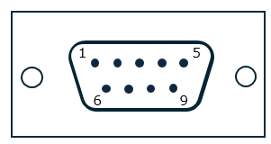
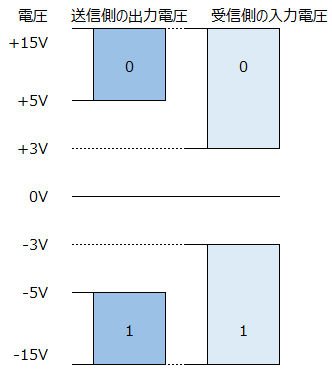
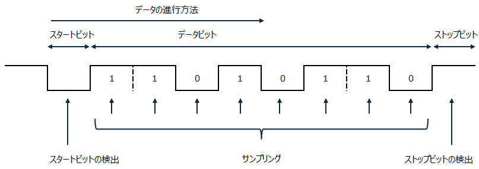
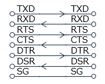
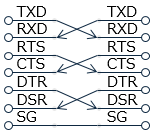

# RS-232C の仕様の紹介
tag:シリアル通信 エンベッドシステムスペシャリスト

RS-232C（あーるえす　にーさんにーしー）は、シリアル通信のための電気的なインターフェース規格です。この規格はコンピュータや周辺機器、通信機器などの間でデータを転送するために広く使用されています。この記事では18歳の新入社員向けに RS-232C の概要を紹介します。

## RS-232C の特徴
RS-232C は米国電子工業会（Electronic Industries Association、EIA）が定義した標準規格(EIA-232) です。RS-232C はデータを1ビットずつ順番に送受信するシリアル通信を基にしています。

## RS-232Cの信号端子
RS-232接続は通常、9ピンまたは25ピンのコネクタを使用します。9ピンの信号端子を以下に示します。

各端子の機能は以下の通りです。モデムなど通信回線に接続するための機器を DCE(Data Circuit terminating Equipment）、コンビュータなどのデータ通信用の機器を DTE(Data Terminal Equipment）と呼びます。

|番号|端子|名称|機能|信号方向|
|---|---|---|---|---|
|1|DCD|Data channel Carrier Detect|回線にキャリア音を検出したことを知らせる|モデム→端末|
|2|RxD|Rx Data|DTE ヘの受信データ|モデム→端末|
|3|TxD|Tx Data|DTE からの送信データ|端末→モデム|
|4|DTR|Data Terminal Ready|DTE が通信可能状設であることを知らせる|端末→モデム|
|5|SG|Signal Ground|信号用グランド|なし|
|6|DSR|Data Set Ready|DCE が稼働状態であることを知らせる|モデム→端末|
|7|RTS|Request To Send|DTE ヘの受信許可／不許可を知らせる|端末→モデム|
|8|CTS|Clear To Send|DCE への送信許可／不許町を知らせる|モデム→端末|
|9|RI|Ring Indicator|着呼したことを知らせる|モデム→端末|
|Case|FG|Frame Ground|アース|なし|

## 電圧レベル
RS-232C は正と負の電圧を使用して論理値を表現します。通常、正の電圧（+12V から +15V）は論理"0"を、負の電圧（-12V から -15V）は論理"1"を表します。

## シリアル通信
RS-232C はクロック信号をもたず，データの先頭に示すスタートビットを基準にして受信側で同期をとる方式のため調歩同期型（UniversalAsynchronous Receiver Transmitter:UART）シリアルインタフェースとも呼ばれます

調歩同期型の通信においてデータビットに先立って送信されるビットをスタートビット、データの終端を示すビットをストップビットと呼びます。

以下に、スタートビット数が１ビット、データビット数が８ビット、ストップビット数が１ビットの信号の例を示します。

## ストレートケーブルとクロスケーブル
RS-232C は一対一のポイントツーポイント接続に使用されます。すなわち、一方の機器が他方にデータを送信し、相手がそれを受信する形態です。

コンピュータとモデムのように,データ端末装置とデータ回線終端装置を接続する場合は,それぞれの線が直接両端のコネクタに接続されているストレートケーブルを利用します。データ端末装置間を接続するときは信号線が交差しているクロスケーブルを利用します。

ストレートケーブルの結線図

クロスケーブルの結線図

## ハードウェアフロー制御
RS-232C 通信では、データの転送を制御するためにハンドシェーキングが使用されることがあります。これは通信の開始や停止を制御するための特別な信号のやり取りを指します。

### RTS (Request to Send) と CTS (Clear to Send)
データの送信側は、データ送信の準備ができていることを示すためにRTS信号をアクティブにします。データの受信側は、データを受信する準備ができている場合、CTS信号をアクティブにし、送信側に対してデータの送信を許可します。この手順により、送信側はCTS信号を確認してからデータを送信することで、データの衝突や混乱を防ぎます。

### DTR (Data Terminal Ready) と DSR (Data Set Ready)
通信装置がデータを処理する準備ができていることを示すために、送信側はDTR信号をアクティブにします。受信側は、自身の準備ができていることを示すためにDSR信号をアクティブにします。
これにより、通信装置同士がお互いにデータの処理が可能かどうかを確認できます。

## UART の関連規格
RS-232C を高速化したRS-422は，FA (Factory Automation）分野などで利用されています。
様々な UART 規格の転送速度とケーブル長を以下に示します。

|規格名称|最大速度|伝送距離|
|---|---|---|
|RS-232|20 kbps|15 m|
|RS-423|300 kbps|600 m|
|RS-422|10 Mbps|1.2 km|
|RS-485|10 Mbps|1.2 km|

## まとめ
この記事では以下の内容を説明しました。
- RS-232C の信号端子
- シリアル通信の例
- ハードウェアフロー制御