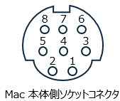
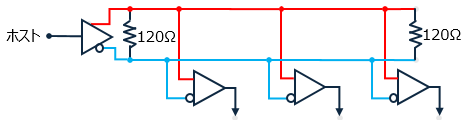
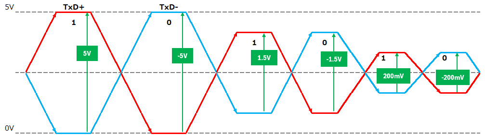
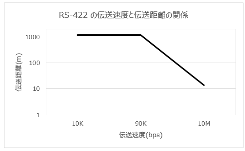
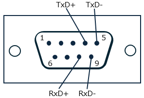
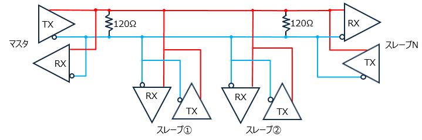

# RS-422、RS-485 の紹介
RS-422 と RS-485 は RS-232C を拡張したシリアル通信の規格です。長距離通信や信頼性の高い通信が求められる工場の制御システム等で利用されています。この記事では 18 歳の新入社員向けに RS-422、RS-485 の概要を紹介します。

# RS-422 と RS-485 の概要
RS-422 と RS-485 は RS-232 を拡張したシリアル・インターフェースです。差動伝送によって長距離 （1.2km）の使用に対応しています。さらに複数の機器の接続にも対応しています。

|規格名称|最大速度|伝送距離|接続台数|
|---|---|---|---|
|RS-232|20 kbps|15 m|1:1|
|RS-422|10 Mbps|1.2 km|1:10|
|RS-485|10 Mbps|1.2 km|32:32|

# RS-422 の紹介
## RS-422 の信号端子
RS-422 は電気的なインターフェース規格であり、機械的な配線の規定がありません。ここでは Apple Macintosh シリーズで採用されたミニ DIN 8 Pin シリアルポートの端子を紹介します。

|番号|端子|名称|機能|
|---|---|---|---|
|1|DTR/HSKo|Handshake out|ハンドシェーク用の信号|
|2|CTS/HSKi|Handshake in/external clock|ハンドシェーク用の信号または外部クロック|
|3|TxD-|Transmit data -|データ送信－用の信号線|
|4|SG|Signal ground|信号用グランド|
|5|RxD-|Receive data -|データ受信－用の信号線|
|6|TxD+|Transmit data +|データ送信＋用の信号線|
|7|GPi|General purpose input|汎用の入力信号|
|8|RxD+|Receive data +|データ受信＋用の信号線|
|-|SHELL|Frame ground|アース|

## RS-422 の結線例
RS-422 は複数の受信機に対して同時に信号を送信できるマルチポイント通信が可能です。これは、1対多の接続が可能であることを意味します。

## RS-422 の電圧レベル
RS-422 と RS-485 は信号を伝送する際に差動信号を使用します。これは 2 本の信号線を使ってデータの1ビットを表現します。片方の信号線に対する電圧変化と反対側の信号線に対する同じ大きさの反対方向の電圧変化の組み合わせで信号を表現します。この差動信号はノイズに対する抵抗力が高く、データの安定性が向上します。

## 伝送距離
RS-422は差動信号の利点により、数メートルから　1.2 キロメートルまでの通信が可能です。距離に応じて 10 キロビットから最大 10 メガビットの伝送速度をサポートしています。

# RS-485 の紹介
## RS-485 の信号端子
RS-485 は電気的なインターフェース規格であり、機械的な配線の規定がありません。ここでは産業用制御システムでよく使われる D-sub 9 Pin の端子を紹介します。

|番号|端子|名称|
|---|---|---|
|1|SG|Signal Ground|
|2|RTS+|Request to Send+|
|3|RTS-|Request to Send-|
|4|TxD+|Transmit Data+|
|5|TxD-|Transmit Data|
|6|CTS|Clear to Send-|
|7|CTS+|Clear to Send+|
|8|RxD+|Receive Data+|
|9|RxD-|Receive Data-|

## RS-485 の結線例
RS-485 は複数の送信機と受信機を1つのバス上に接続できるため、ネットワーク内で複数のデバイスと通信できる多対多の通信をサポートします。これはRS-422が主に1対多の通信を想定していたのとは異なる点です。送信と受信が同一信号線で行われる２線式マルチドロップの配線例を以下に図示します。２線式は最小限の配線で制御システムを構築できるため低速データ通信のための共通UARTとしてしばしば用いられます。

## プロトコルについて
RS-422 や RS-485 は通信の手順やデータの解釈に関する上位層のプロトコルを規定していません。一般によく使われるプロトコルを以下に挙げます。

### Modbus
Modbusは、RS-485を含む様々な通信メディアで広く使用されている産業用通信プロトコルの一つです。シンプルで容易に実装でき、制御システムやセンサーネットワークなどで利用されます。

### Profibus
Profibusは、工業用自動化分野で使用される通信プロトコルで、RS-485や他のメディアで動作します。Profibus DP（Decentralized Peripherals）は、RS-485を使用したデバイスレベルの通信をサポートしています。

### BACnet
BACnet（Building Automation and Control Networks）は、ビルディングオートメーション分野で使用される通信プロトコルで、RS-485など様々な物理メディアで利用されます。ビルディングオートメーションやHVAC（Heating, Ventilation, and Air Conditioning）などのシステムで広く使用されています。

### DMX512
DMX512は、舞台照明や音響機器などのエンターテイメント分野で一般的に使用されるプロトコルです。RS-485を物理層として採用し、光や音の制御などに使用されます。

## まとめ
この記事では以下の内容を説明しました。
- RS-422 の信号端子
- RS-422 の電圧レベル
- RS-422 の伝送距離
- RS-485 の信号端子
- RS-485 の２線式マルチドロップ

