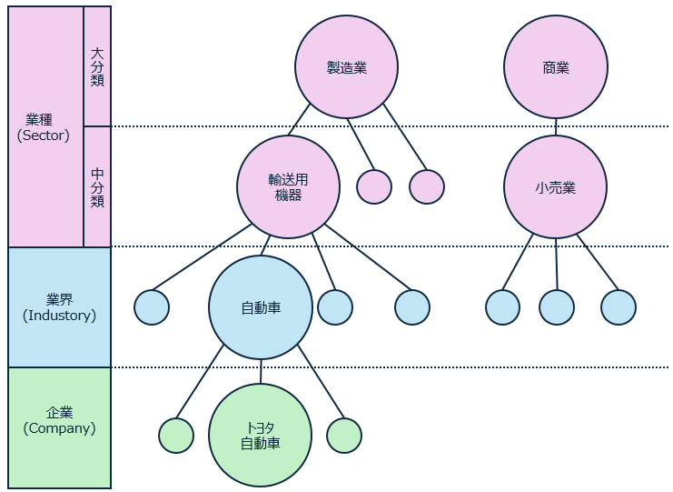
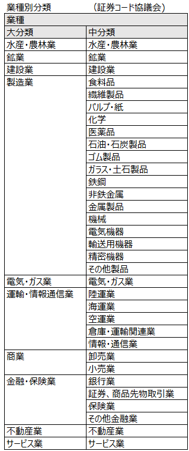
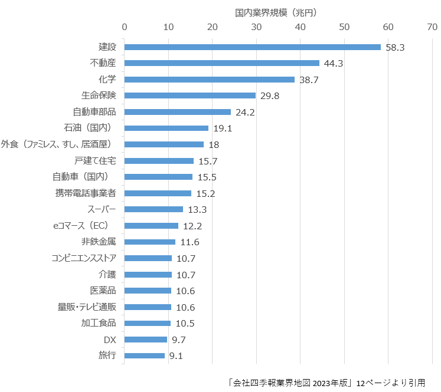

# 業界分類の基本
tag: マーケティング　新人教育

業種や業界の分類は自社の事業の理解、分析、そして効果的な意思決定のために重要です。
この記事では 18 歳の新入社員向けに業種や業界の分類例を紹介します。

## 「業種」と「業界」の違い
業種（英：Sector）は大まかな産業分野や部門を指します。例えば、エネルギーセクター、金融セクター、情報技術セクターなどがあります。

業界（英：Industry）はより具体的で、特定の商品やサービスを提供する企業や事業体のグループを指します。例えば、金融業種における業界には銀行業界、証券業界、保険業界などが含まれます。

## 業種や業界を分類する目的
### 市場理解と分析
業種や業界の分類は市場を理解し分析するための出発点です。特定の業界内での競争、市場の規模、成長の可能性、および主要なプレーヤーなどを理解することは、戦略的な意思決定に不可欠です。

### 競争分析
企業は自らが位置する業界や競合他社を理解する必要があります。これにより、競争戦略の構築や製品・サービスの差別化が可能になります。

### ビジネス計画の策定
企業がビジネス計画を策定する際には、自社の位置する業界の動向や市場状況を踏まえて戦略を立てる必要があります。業界の分類は、ビジネス戦略の基盤を提供します。
これらの要因から、業界や業種の分類はビジネスや経済活動において不可欠なツールとなっています。

## 業種の分類例
業種は、総務省統計局が定めている日本標準産業分類にも準拠しているの証券コード協議会の分類が一般的です。分類方法としては 10 の大分類の下に 33 の中分類があります。通常「業種」といった場合は、建設業、食料品、電気機器など、この中分類を指します。一覧表を以下に示します。

## 業界の分類例
業界の分類は会社四季報と日本経済新聞の両社が毎年発行している「業界地図」の分類が一般的です。年毎に多少変動がありますが、160 から 190 の業界を紹介しています。「会社四季報業界地図 2024」で紹介されている主な業界を以下に挙げます。

### 1. 自動車・機械
- 自動車
- 自動車部品
- ２輪車
- トラック
- タイヤ
- 中古車
- カー用品
- 産業機械
- 航空機
- 造船
- 重電
- 建設機械
- 工作機械
- ロボット
### 2. エレクトロニクス機器
- 半導体
- 電子部品
- リチウムイオン電池・固体電池
- 半導体製造装置
- 半導体材料
- 白物・生活家電
- スマートフォン
- パソコン・タブレット 
- テレビ
- デジタルカメラ
- 複合機・プリンター
- 医療機器・用品
- エアコン
### 3. 情報通信・インターネット
- eコマース（EC）
- 携帝電話事業者
- システム開発
- ネットサービス・アプリ
- クラウド
- ソフトウェア
- インターネット回線
### 4. 資源・エネルギー・素材
- 石油・資源（世界）
- 石油（国内）
- 電力・ガス
- 鉄鋼
- 非鉄金属
- セメント
- 化学
- 紙・パルプ
- 繊維
- 塗料
- ガラス
### 5. 金融・法人サービス
- メガパンク
- 地方銀行
- グローバル金融
- 流通系・ネット銀行
- 証券
- クレジットカード・信販
- 消費者向け金融
- 生命保険
- 損害保険
- リース
- 隠号資産・ブロックチェーン
- 監査法人
- 弁護士事務所
- 人材サービス
### 6. 食品・農業
- 農業
- 酒類
- 飲料・乳業
- 食材
- 食肉
- 漁業・水産
- 加工食品
- たばこ
### 7. 生活用品・嗜好品・薬
- 医薬品
- トイレタリー（日用品）
- 化粧品
- 靴・眼鏡・鞄
- 時計・宝飾品
- ラグジュアリーブランド
- 文房具・事務用品
- 玩具
### 8. 娯楽・エンタメ・メディア
- レジャー・テーマパーク
- 旅行
- ホテル
- 映画・アニメ
- 音楽
- 出版・書店
- 放送局
- 新聞社
- 動画配信サービス
- 広告
- グローバルメディア
- 芸能プロダクション
- スポーツ・フィットネス
### 9. 建設・不動産
- 建設
- 不動産
- 戸建て住宅
- マンション
- 住宅設備
- マンション管理
- 不動産仲介
- プラント・エンジニアリング
### 10. 運輸・物流
- 空運
- 海運
- 陸運
- 鉄道（JR）
- 鉄道（私鉄）
- 倉庫・物流施設
### 11. 流通・外食
- 百貨店・ショッピングセンター
- コンビニエンスストア
- スーパー
- 総合商社
- 専門商社
- 通販・テレビ通販
- 家具・インテリア
- ホームセンター
- ドラッグストア
- アパレル
- 家電量販店
- 外食（ファミレス、すし、居酒屋）
- カフェ
- 外食（ファストフード、麺類）
- 中食・宅配
### 12. 生活・公共サービス
- 教育・学習塾
- 介護
- 育児・保育
- 警備
- 葬儀
- ウェディング
- 防衛

### それぞれの業界の大きさ
「会社四季報業界地図 2023」より、国内業界規模ランキングの上位 20 を以下に挙げます。

## まとめ
この記事では以下の内容を説明しました。
- 業種とは何か
- 業界とは何か
- 業界の分類例

ビジネスを検討する際の参考になれば幸いです。